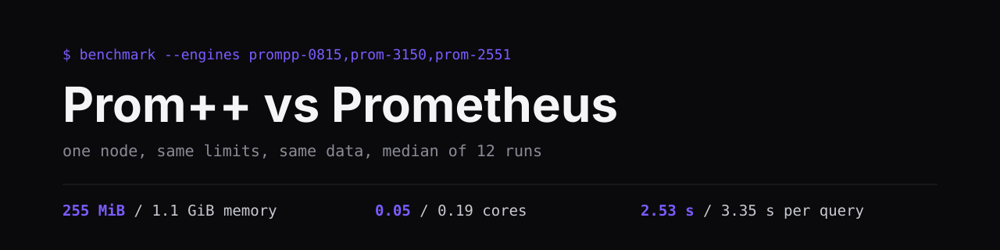

[English](README.md) · **Русский**



[](https://github.com/xdearboy/prompp-vs-prometheus/actions/workflows/ci.yml)

Сравнение Deckhouse Prom++ 0.8.15 с Prometheus 3.15.0 и 2.55.1. Движки запускаются по
одному, одним экземпляром, на одном узле, с одинаковыми лимитами (2 ядра, 6 GiB),
одинаковыми настройками Go и одними и теми же искусственными данными.

## Результаты

500 000 активных серий, 27,4 млн точек на движок, 38 запросов PromQL. Числа это медиана
12 полных прогонов: один каждые четыре часа в течение двух суток. Самый быстрый и самый
медленный прогон отличаются меньше чем на 8 %, кроме рабочего набора у Prom++ (12 %).
Подробности в [AGGREGATE.ru.md](runs/series-20261006/AGGREGATE.ru.md).


| при 500k серий | Prom++ 0.8.15 | Prometheus 3.15.0 | Prometheus 2.55.1 |
|---|---|---|---|
| память процесса (RSS) | **255 MiB** | 1,11 GiB | 1,09 GiB |
| рабочий набор cgroup | **176 MiB** | 1,06 GiB | 1,03 GiB |
| процессор при записи | **0,05 ядра** | 0,19 | 0,23 |
| каталог данных | 281 MiB | 303 MiB | 303 MiB |

Время запросов: геометрическое среднее медиан по всем запросам.

| параллельных запросов | Prom++ 0.8.15 | Prometheus 3.15.0 | Prometheus 2.55.1 |
|---|---|---|---|
| 1 | **298 мс** | 348 мс | 345 мс |
| 4 | **682 мс** | 828 мс | 839 мс |
| 16 | **2,53 с** | 3,35 с | 3,46 с |

Главное отличие в памяти. Запросы быстрее на 15-25 %, по диску почти поровну. 33 из 38
запросов дают побайтно одинаковый ответ у всех трёх движков. Остальные пять это запросы
с `rate` и `_over_time` по диапазону. Prom++ 0.8.15 считает интервал открытым слева, как
Prometheus 3.x, а 2.55.1 учитывает точку, лежащую ровно на левой границе окна.


Графики взяты из первого прогона серии, его полный отчёт:
[REPORT.ru.md](runs/series-20261006/20261006T210616Z/REPORT.ru.md). Перед тем как ссылаться на
эти цифры, прочитайте [методику](METHODOLOGY.ru.md): один узел, короткие ступени и
искусственные данные это настоящие ограничения.

## Движки

| имя | образ | заметки |
|---|---|---|
| `prompp-0815` | `mirror.gcr.io/prompp/prompp:0.8.15` | head и WAL на C++, диапазоны как в 3.x |
| `prom-3150` | `quay.io/prometheus/prometheus:v3.15.0` | свежий оригинальный Prometheus |
| `prom-2551` | `quay.io/prometheus/prometheus:v2.55.1` | интервал закрыт с обеих сторон |

Head это та часть TSDB, которая хранится в памяти: туда попадают свежие данные, пока их не
сбросят на диск блоком. Именно от неё зависит расход памяти при записи.

У всех трёх одни и те же флаги, а настройки Go задаются через окружение:
`GOMEMLIMIT=5529MiB` (90 % от лимита 6 GiB) и `GOMAXPROCS=2`. Без этого сравнение было бы
нечестным: в Prom++ 0.8.15 и Prometheus 2.55.1 автоматическая подстройка
(`auto-gomemlimit`, `auto-gomaxprocs`) включается только отдельными экспериментальными
флагами, а Prometheus 3.x включает её сам. Отчёт показывает значения, которые движок
сообщает в `/api/v1/status/runtimeinfo`, то есть настройки проверяются, а не
предполагаются. Список движков лежит в `internal/engines`, тест следит, чтобы манифесты
с ним совпадали.

## Что где лежит

```text
tools/          подмодуль github.com/xdearboy/prom-loadgen: loadgen, querybench,
                collector, генератор серий, клиент remote write, схема результатов
cmd/meta        сведения о прогоне
cmd/report      отчёт в markdown и svg по одному прогону
cmd/aggregate   медиана и разброс по многим прогонам
internal/       список движков, построение отчётов и графиков
deploy/         манифесты kustomize, runner.yaml для запуска серии в кластере
scripts/        harness, run, series, runner, teardown, preflight, node-overlay
runs/           опубликованные результаты
  series-20261006/   двенадцать прогонов и их сводка; у первого прогона сохранены сырые
                     замеры ресурсов, у остальных только итоги
```

Клонировать нужно с `git clone --recurse-submodules`, либо потом выполнить
`git submodule update --init`.

## Что понадобится

- `kubectl` с kustomize v5 и контекст кластера, в который можно писать
- Go 1.24 или новее
- узел, к которому можно привязать замеры
- свободное место на этом узле под `emptyDir` на 30 GiB

Собирать образы не нужно: утилиты собираются под linux/amd64 и копируются в нагрузочный
под командой `kubectl cp`.

## Запуск

```sh
export BENCH_NODE=<узел>

RUN_ID=$(date -u +%Y%m%dT%H%M%SZ) scripts/node-overlay.sh
scripts/harness.sh
RUN_ID="$RUN_ID" scripts/run.sh
scripts/teardown.sh --yes
```

`node-overlay.sh` собирает набор правок, который привязывает каждый движок к
`$BENCH_NODE`. Лежит он в `overlays/local/`, а эта папка в `.gitignore`, поэтому имя
настоящего узла в репозиторий не попадает. В закоммиченных манифестах стоит заглушка
`bench-node-placeholder`, и `scripts/preflight.sh` завершится с ошибкой, если она
останется в собранном манифесте.

### Повторные прогоны

По одному прогону о разбросе ничего не скажешь. `scripts/series.sh` запускает прогон
каждые `PERIOD_HOURS` часов (по умолчанию 4) всего `RUNS` раз (по умолчанию 12) и
записывает медиану, минимум и максимум по всем завершённым прогонам в
`results/AGGREGATE.md`. Прогон идёт около 2,5 часа, поэтому период должен быть больше.

`scripts/runner.sh` запускает всю серию из небольшого пода внутри кластера, так что
компьютер, с которого всё начали, можно выключить:

```sh
export BENCH_NODE=<узел>
scripts/harness.sh
scripts/runner.sh
kubectl -n prompp-bench exec bench-runner -- tail /work/series.log
kubectl cp prompp-bench/bench-runner:/work/results ./results
```

### Переменные

| переменная | по умолчанию | назначение |
|---|---|---|
| `BENCH_NODE` | обязательна | узел для движков и нагрузочного пода |
| `BENCH_NAMESPACE` | `prompp-bench` | пространство имён |
| `ENGINES` | все три | имена движков через пробел |
| `RAMP` | `50000:300,200000:480,500000:600` | ступени вида `серий:секунд` |
| `SEED` | `20261005` | seed для генерации серий |
| `INTERVAL` | `15s` | интервал между точками |
| `CONCURRENCIES` | `1 4 16` | сколько одинаковых запросов идёт параллельно |
| `SUITES` | `heavy` | наборы запросов, `heavy` включает `core` |
| `PER_QUERY` | `10s` | время на один запрос при каждой параллельности |
| `MIN_RUNS` | `5` | минимум замеров на запрос, даже если время вышло |
| `WARMUP` | `1` | пробных запросов перед замером |
| `EPOCH_MS` | `1767225600000` | время первой точки |

## Что остаётся после прогона

```text
results/<run-id>/
  run.json                                   узел, движки, версия нагрузочного кода
  <engine>/ingest.json                       скорость записи, время запросов, статистика head
  <engine>/samples.ingest.jsonl              замеры ресурсов во время записи
  <engine>/samples.query-<suite>-c<n>.jsonl  замеры ресурсов на каждом запуске запросов
  <engine>/query-<suite>-c<n>.json
  <engine>/dump-<suite>.json                 sha256 результата каждого запроса
  <engine>/disk.jsonl                        каталог данных, WAL и блоки по времени
  REPORT.md, charts/*.svg                    создаются автоматически
```

`run.sh` останавливается, если нужного отчёту файла нет или он пустой после копирования
из пода. Имя узла он везде заменяет на `bench-node`, так что каталог прогона можно
публиковать как есть.

## Что сравнивает отчёт

Память и процессор на одну серию, скорость записи, время каждого запроса при каждой
параллельности и совпадение результатов. Каждый запрос меряется отдельно: один пробный
запрос, потом потоки повторяют его, пока не выйдет отведённое время. В таблицах p50, p99
и число замеров, в итогах геометрические средние, чтобы несколько запросов, которые идут
секундами, не заглушали остальные. Проверка совпадения нужна, чтобы не сравнивать
движок, который тихо потерял данные: все получают один и тот же набор, а результат
каждого запроса хешируется.

Правила честного сравнения и то, что может исказить результат, описаны в
[методике](METHODOLOGY.ru.md).
