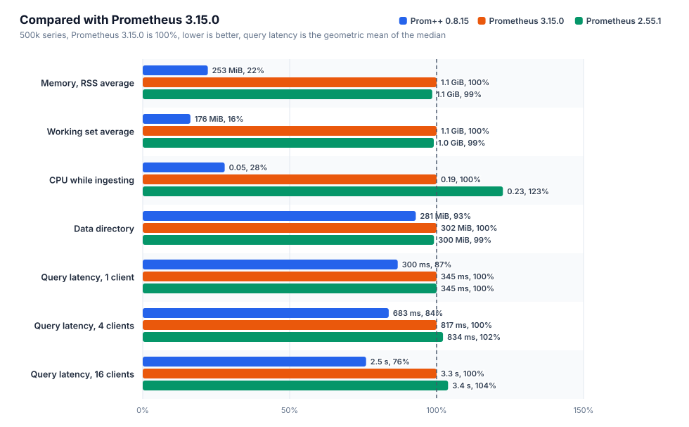
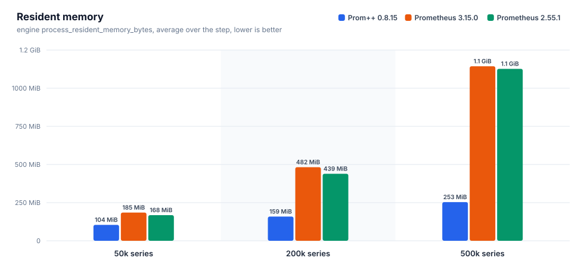
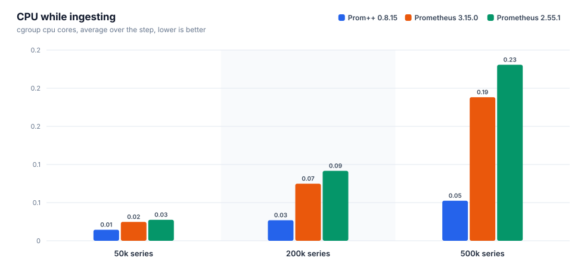
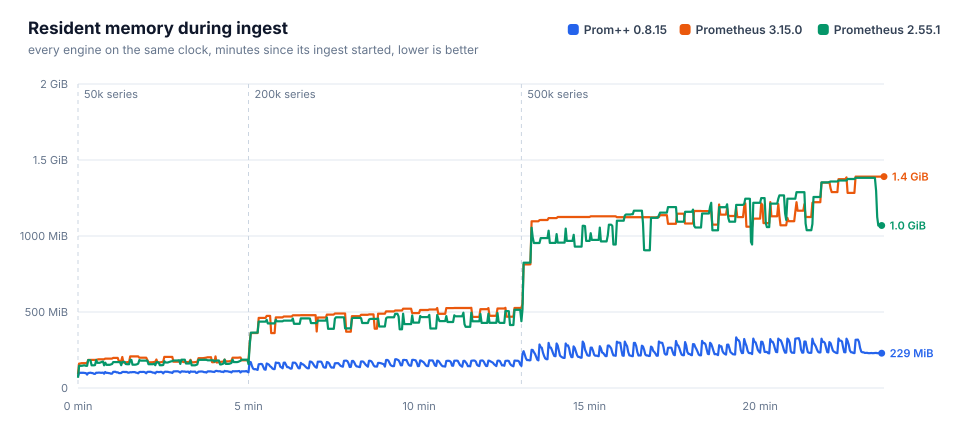
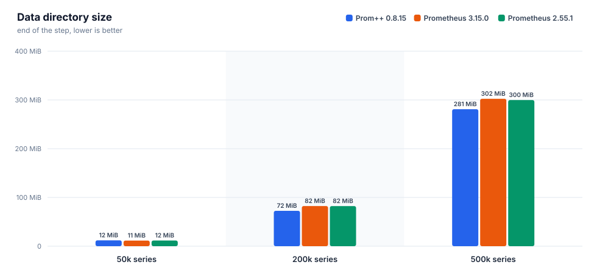
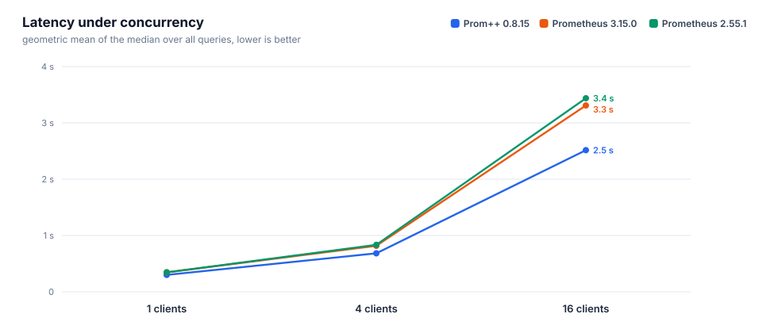
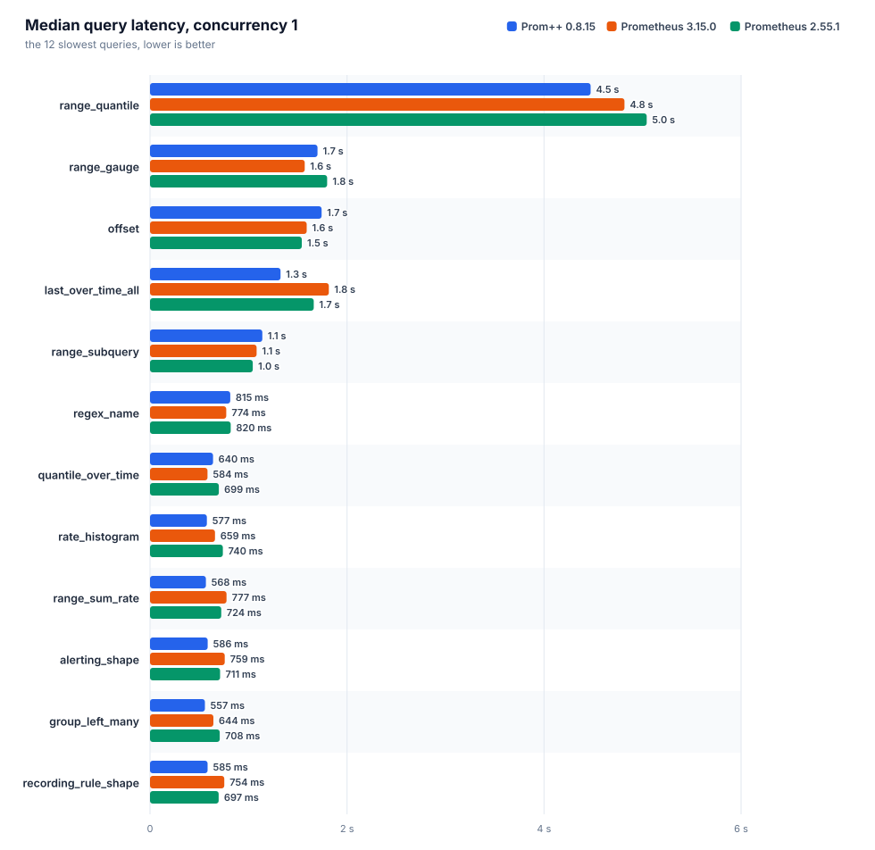
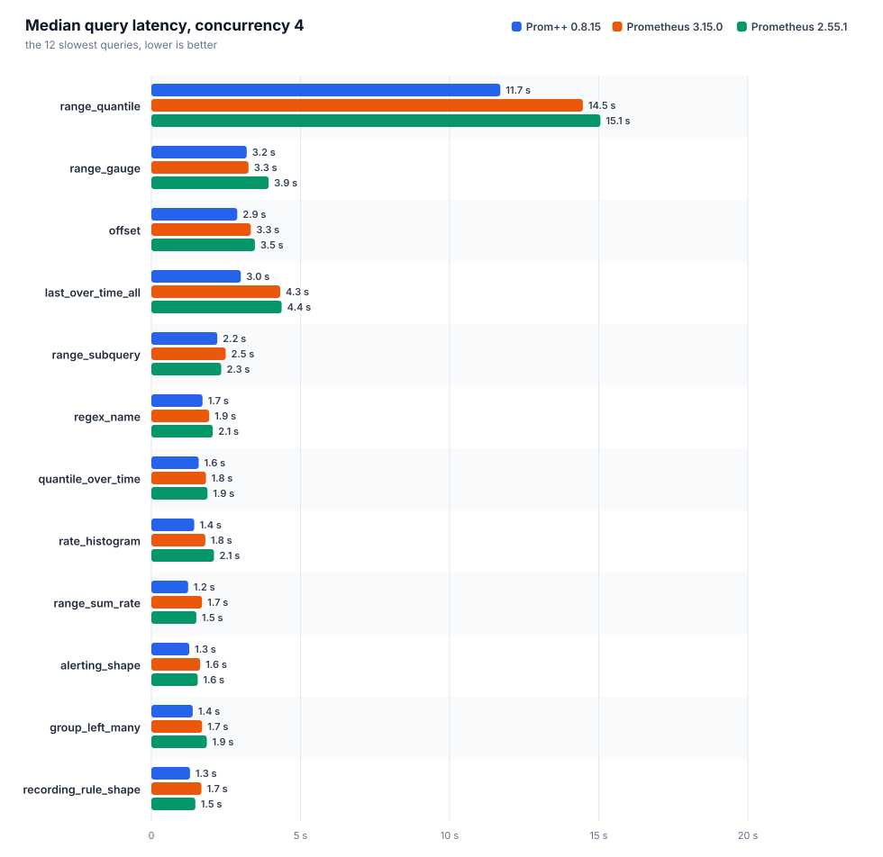
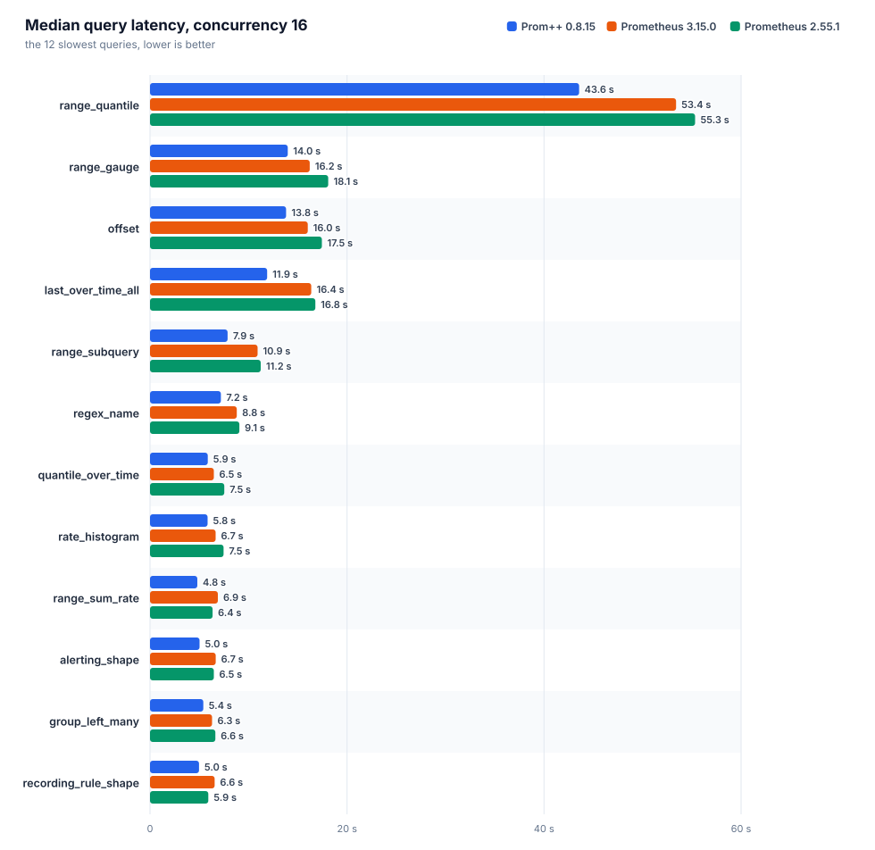

[English](REPORT.md) · **Русский**

# Prom++ против Prometheus

Создано из исходных файлов этой папки. Каждое число ниже взято из файла прогона, вручную ничего не вписано.

Номер прогона: `20261006T210616Z`

## Окружение

| параметр | значение |
|---|---|
| узел | bench-node |
| процессор | AMD EPYC 7713 64-Core Processor |
| ядер | 8 |
| память | 15.6 GiB |
| ядро | 6.8.0-142-generic |
| ОС | Ubuntu 24.04.4 LTS |
| архитектура | amd64 |
| файловая система данных | свободно 151.6 GiB из 177.1 GiB |
| container_runtime | containerd://2.3.4-k3s1.36 |
| instance_type | k3s |
| kubelet_version | v1.36.4+k3s1 |
| operating_system | linux |
| нагрузочный код | harness/b3000ef-7f49340 |

## Движки

Заданные настройки взяты из манифестов, наблюдаемые из runtimeinfo и списка флагов самого движка во время прогона.

| движок | образ | лимит процессора | лимит памяти | окружение | GOMEMLIMIT (факт) | GOMAXPROCS (факт) | сжатие WAL | аргументы | заметки |
|---|---|---|---|---|---|---|---|---|---|
| `prompp-0815` | `mirror.gcr.io/prompp/prompp:0.8.15` | 2.00 cores | 6.0 GiB | `GOMEMLIMIT=5529MiB GOMAXPROCS=2` | 5.4 GiB | 2 | true | `--config.file=... --storage.tsdb.path=... --web.enable-remote-write-receiver --web.enable-lifecycle` | C++ head and WAL |
| `prom-3150` | `quay.io/prometheus/prometheus:v3.15.0` | 2.00 cores | 6.0 GiB | `GOMEMLIMIT=5529MiB GOMAXPROCS=2` | 5.4 GiB | 2 | true | `--config.file=... --storage.tsdb.path=... --web.enable-remote-write-receiver --web.enable-lifecycle` | upstream latest |
| `prom-2551` | `quay.io/prometheus/prometheus:v2.55.1` | 2.00 cores | 6.0 GiB | `GOMEMLIMIT=5529MiB GOMAXPROCS=2` | 5.4 GiB | 2 | true | `--config.file=... --storage.tsdb.path=... --web.enable-remote-write-receiver --web.enable-lifecycle` | closed range selectors, the semantics before 3.0 |

## Запись и память головного блока











### prom-2551

Интервал 15 с, пачка 5000 серий, потоков 4, отправлено точек 27400000, из них потеряно 0.

| активных серий | точек/с | серий в головном блоке | чанков | RSS ср. | RSS p95 | RSS макс. | рабочий набор макс. | ядер ср. | ядер макс. | каталог данных | WAL | RSS/серия | диск/серия |
|---|---|---|---|---|---|---|---|---|---|---|---|---|---|
| 50000 | 3333 | 50000 | 50000 | 168.0 MiB | 186.0 MiB | 187.0 MiB | 133.4 MiB | 0.03 | 0.35 | 11.6 MiB | 11.6 MiB | 3.2 KiB | 242 B |
| 200000 | 13333 | 200000 | 200000 | 438.9 MiB | 493.3 MiB | 514.4 MiB | 438.3 MiB | 0.09 | 1.42 | 82.3 MiB | 82.3 MiB | 2.2 KiB | 431 B |
| 500000 | 33333 | 500000 | 500000 | 1.1 GiB | 1.3 GiB | 1.4 GiB | 1.3 GiB | 0.23 | 3.46 | 299.7 MiB | 299.7 MiB | 2.8 KiB | 628 B |

| активных серий | прошло / план | запрос записи p50 | p99 | 2xx | 4xx | 5xx | ошибки клиента |
|---|---|---|---|---|---|---|---|
| 50000 | 300 s / 300 s | 54 ms | 143 ms | 200 | 0 | 0 | 0 |
| 200000 | 480 s / 480 s | 29 ms | 194 ms | 1280 | 0 | 0 | 0 |
| 500000 | 600 s / 600 s | 29 ms | 255 ms | 4000 | 0 | 0 | 0 |

### prom-3150

Интервал 15 с, пачка 5000 серий, потоков 4, отправлено точек 27400000, из них потеряно 0.

| активных серий | точек/с | серий в головном блоке | чанков | RSS ср. | RSS p95 | RSS макс. | рабочий набор макс. | ядер ср. | ядер макс. | каталог данных | WAL | RSS/серия | диск/серия |
|---|---|---|---|---|---|---|---|---|---|---|---|---|---|
| 50000 | 3333 | 50000 | 50000 | 184.6 MiB | 208.1 MiB | 208.1 MiB | 150.5 MiB | 0.02 | 0.39 | 11.4 MiB | 11.4 MiB | 3.8 KiB | 239 B |
| 200000 | 13333 | 200000 | 200000 | 482.3 MiB | 526.4 MiB | 527.8 MiB | 471.5 MiB | 0.07 | 1.14 | 82.4 MiB | 82.4 MiB | 2.7 KiB | 431 B |
| 500000 | 33333 | 500000 | 500000 | 1.1 GiB | 1.3 GiB | 1.4 GiB | 1.3 GiB | 0.19 | 2.81 | 302.4 MiB | 302.4 MiB | 2.8 KiB | 634 B |

| активных серий | прошло / план | запрос записи p50 | p99 | 2xx | 4xx | 5xx | ошибки клиента |
|---|---|---|---|---|---|---|---|
| 50000 | 300 s / 300 s | 42 ms | 115 ms | 200 | 0 | 0 | 0 |
| 200000 | 480 s / 480 s | 34 ms | 127 ms | 1280 | 0 | 0 | 0 |
| 500000 | 600 s / 600 s | 31 ms | 179 ms | 4000 | 0 | 0 | 0 |

### prompp-0815

Интервал 15 с, пачка 5000 серий, потоков 4, отправлено точек 27400000, из них потеряно 0.

| активных серий | точек/с | серий в головном блоке | чанков | RSS ср. | RSS p95 | RSS макс. | рабочий набор макс. | ядер ср. | ядер макс. | каталог данных | WAL | RSS/серия | диск/серия |
|---|---|---|---|---|---|---|---|---|---|---|---|---|---|
| 50000 | 3333 | 50000 | 50000 | 104.4 MiB | 110.7 MiB | 112.5 MiB | 48.1 MiB | 0.01 | 0.17 | 12.0 MiB | 4.0 KiB | 2.1 KiB | 252 B |
| 200000 | 13333 | 200000 | 200000 | 158.7 MiB | 182.4 MiB | 189.2 MiB | 116.7 MiB | 0.03 | 0.47 | 72.5 MiB | 4.0 KiB | 760 B | 380 B |
| 500000 | 33333 | 500000 | 500000 | 253.3 MiB | 318.0 MiB | 332.6 MiB | 264.3 MiB | 0.05 | 0.70 | 280.9 MiB | 4.0 KiB | 493 B | 589 B |

| активных серий | прошло / план | запрос записи p50 | p99 | 2xx | 4xx | 5xx | ошибки клиента |
|---|---|---|---|---|---|---|---|
| 50000 | 300 s / 300 s | 12 ms | 67 ms | 200 | 0 | 0 | 0 |
| 200000 | 480 s / 480 s | 11 ms | 73 ms | 1280 | 0 | 0 | 0 |
| 500000 | 600 s / 600 s | 12 ms | 58 ms | 4000 | 0 | 0 | 0 |

### Сравнение

Для всех столбцов с памятью и процессором меньше значит лучше. RSS — это `process_resident_memory_bytes` самого движка, рабочий набор — значение cgroup, по которому kubelet выселяет поды и срабатывает OOM.

| активных серий | движок | RSS ср. | байт на серию | рабочий набор макс. | ядер ср. | каталог данных | точек/с |
|---|---|---|---|---|---|---|---|
| 50000 | `prom-2551` | 168.0 MiB | 3.2 KiB | 133.4 MiB | 0.03 | 11.6 MiB | 3333 |
| 50000 | `prom-3150` | 184.6 MiB | 3.8 KiB | 150.5 MiB | 0.02 | 11.4 MiB | 3333 |
| 50000 | `prompp-0815` | 104.4 MiB | 2.1 KiB | 48.1 MiB | 0.01 | 12.0 MiB | 3333 |
| 200000 | `prom-2551` | 438.9 MiB | 2.2 KiB | 438.3 MiB | 0.09 | 82.3 MiB | 13333 |
| 200000 | `prom-3150` | 482.3 MiB | 2.7 KiB | 471.5 MiB | 0.07 | 82.4 MiB | 13333 |
| 200000 | `prompp-0815` | 158.7 MiB | 760 B | 116.7 MiB | 0.03 | 72.5 MiB | 13333 |
| 500000 | `prom-2551` | 1.1 GiB | 2.8 KiB | 1.3 GiB | 0.23 | 299.7 MiB | 33333 |
| 500000 | `prom-3150` | 1.1 GiB | 2.8 KiB | 1.3 GiB | 0.19 | 302.4 MiB | 33333 |
| 500000 | `prompp-0815` | 253.3 MiB | 493 B | 264.3 MiB | 0.05 | 280.9 MiB | 33333 |

На самой большой ступени меньше всего памяти на серию нужно `prompp-0815`: 493 B of resident memory per active series, the lowest of the compared engines.

## Время запросов

Каждый запрос идёт отдельно: один пробный запрос без учёта, затем заданное число потоков повторяет его, пока не истечёт отведённое время и не наберётся минимальное число запросов. `n` — число учтённых запросов. При малом `n` значение p99 близко к максимуму, поэтому сравнивать лучше медиану. Геометрическое среднее учитывает все запросы поровну, поэтому несколько запросов, которые идут секундами, не заглушают остальные.



### Параллельность 1



| движок | набор | запросов | замеров | ошибок | p50 (геом.) | p99 (геом.) | p50 самого медленного | ядер ср. | рабочий набор макс. |
|---|---|---|---|---|---|---|---|---|---|
| `prom-2551` | heavy | 38 | 11342 | 0 | 345 ms | 577 ms | `range_quantile` 5.04 s | 1.24 | 1.8 GiB |
| `prom-3150` | heavy | 38 | 14539 | 0 | 345 ms | 519 ms | `range_quantile` 4.82 s | 1.14 | 1.7 GiB |
| `prompp-0815` | heavy | 38 | 10688 | 0 | 300 ms | 345 ms | `range_quantile` 4.47 s | 1.34 | 645.3 MiB |

| query | type | `prom-2551` p50 / p99 (n) | `prom-3150` p50 / p99 (n) | `prompp-0815` p50 / p99 (n) | fastest p50 |
|---|---|---|---|---|---|
| `absent` | instant | 0.4 ms / 11 ms (9829) | 0.4 ms / 8.7 ms (12985) | 0.8 ms / 2.9 ms (8789) | `prom-3150` |
| `alerting_shape` | range | 711 ms / 998 ms (14) | 759 ms / 955 ms (13) | 586 ms / 620 ms (18) | `prompp-0815` |
| `avg_over_pods` | instant | 215 ms / 382 ms (43) | 222 ms / 356 ms (44) | 139 ms / 148 ms (73) | `prompp-0815` |
| `avg_over_time` | instant | 381 ms / 668 ms (25) | 382 ms / 511 ms (26) | 383 ms / 406 ms (27) | `prom-2551` |
| `binary_scalar` | instant | 413 ms / 640 ms (23) | 431 ms / 584 ms (23) | 271 ms / 307 ms (37) | `prompp-0815` |
| `bottomk` | instant | 202 ms / 342 ms (46) | 210 ms / 374 ms (45) | 145 ms / 163 ms (69) | `prompp-0815` |
| `clamp` | instant | 353 ms / 552 ms (27) | 337 ms / 489 ms (28) | 395 ms / 417 ms (27) | `prom-3150` |
| `count_by_job` | instant | 214 ms / 357 ms (44) | 217 ms / 354 ms (44) | 144 ms / 168 ms (70) | `prompp-0815` |
| `count_values` | instant | 358 ms / 506 ms (26) | 330 ms / 498 ms (28) | 320 ms / 350 ms (32) | `prompp-0815` |
| `double_subquery` | range | 501 ms / 699 ms (20) | 520 ms / 667 ms (20) | 421 ms / 463 ms (24) | `prompp-0815` |
| `group_left_many` | instant | 708 ms / 917 ms (14) | 644 ms / 785 ms (16) | 557 ms / 603 ms (18) | `prompp-0815` |
| `increase` | instant | 369 ms / 651 ms (25) | 373 ms / 549 ms (26) | 358 ms / 385 ms (28) | `prompp-0815` |
| `irate` | instant | 264 ms / 489 ms (35) | 258 ms / 350 ms (38) | 262 ms / 300 ms (39) | `prom-3150` |
| `join` | instant | 417 ms / 666 ms (23) | 416 ms / 601 ms (23) | 261 ms / 320 ms (39) | `prompp-0815` |
| `label_replace` | instant | 321 ms / 561 ms (29) | 314 ms / 453 ms (30) | 324 ms / 350 ms (31) | `prom-3150` |
| `last_over_time_all` | instant | 1.66 s / 2.03 s (6) | 1.82 s / 1.85 s (6) | 1.32 s / 1.41 s (8) | `prompp-0815` |
| `matchers_numeric` | instant | 273 ms / 421 ms (34) | 279 ms / 395 ms (34) | 258 ms / 282 ms (39) | `prompp-0815` |
| `max_over_time` | instant | 385 ms / 616 ms (25) | 400 ms / 503 ms (25) | 382 ms / 413 ms (27) | `prompp-0815` |
| `nested_aggregate` | instant | 200 ms / 327 ms (46) | 207 ms / 337 ms (47) | 141 ms / 184 ms (70) | `prompp-0815` |
| `offset` | range | 1.54 s / 2.05 s (7) | 1.59 s / 2.02 s (7) | 1.74 s / 1.89 s (6) | `prom-2551` |
| `or_fallback` | instant | 325 ms / 567 ms (28) | 338 ms / 442 ms (28) | 351 ms / 388 ms (29) | `prom-2551` |
| `quantile_over_time` | instant | 699 ms / 908 ms (15) | 584 ms / 842 ms (16) | 640 ms / 660 ms (16) | `prom-3150` |
| `range_gauge` | range | 1.80 s / 2.15 s (6) | 1.57 s / 1.84 s (7) | 1.70 s / 1.94 s (6) | `prom-3150` |
| `range_quantile` | range | 5.04 s / 5.19 s (5) | 4.82 s / 5.00 s (5) | 4.47 s / 4.64 s (5) | `prompp-0815` |
| `range_subquery` | range | 1.04 s / 1.37 s (9) | 1.08 s / 1.25 s (10) | 1.14 s / 1.18 s (10) | `prom-2551` |
| `range_sum_rate` | range | 724 ms / 999 ms (14) | 777 ms / 935 ms (13) | 568 ms / 631 ms (18) | `prompp-0815` |
| `rate` | instant | 299 ms / 506 ms (32) | 299 ms / 430 ms (32) | 296 ms / 318 ms (34) | `prompp-0815` |
| `rate_histogram` | instant | 740 ms / 962 ms (14) | 659 ms / 791 ms (15) | 577 ms / 619 ms (18) | `prompp-0815` |
| `recording_rule_shape` | range | 697 ms / 919 ms (14) | 754 ms / 884 ms (14) | 585 ms / 650 ms (17) | `prompp-0815` |
| `regex_name` | instant | 820 ms / 1.14 s (12) | 774 ms / 1.07 s (13) | 815 ms / 924 ms (12) | `prom-3150` |
| `selector` | instant | 288 ms / 496 ms (32) | 288 ms / 446 ms (33) | 306 ms / 328 ms (33) | `prom-2551` |
| `selector_labels` | instant | 15 ms / 41 ms (579) | 15 ms / 33 ms (603) | 15 ms / 22 ms (639) | `prom-3150` |
| `sort_desc` | instant | 210 ms / 387 ms (44) | 216 ms / 362 ms (45) | 139 ms / 168 ms (72) | `prompp-0815` |
| `stddev` | instant | 212 ms / 371 ms (45) | 224 ms / 358 ms (44) | 132 ms / 162 ms (76) | `prompp-0815` |
| `sum` | instant | 203 ms / 363 ms (47) | 205 ms / 342 ms (47) | 136 ms / 164 ms (74) | `prompp-0815` |
| `sum_by_namespace` | instant | 220 ms / 432 ms (43) | 215 ms / 335 ms (45) | 146 ms / 164 ms (69) | `prompp-0815` |
| `topk` | instant | 204 ms / 337 ms (46) | 212 ms / 392 ms (44) | 146 ms / 173 ms (69) | `prompp-0815` |
| `vector_matching` | instant | 580 ms / 863 ms (16) | 605 ms / 728 ms (17) | 522 ms / 557 ms (20) | `prompp-0815` |

### Параллельность 4



| движок | набор | запросов | замеров | ошибок | p50 (геом.) | p99 (геом.) | p50 самого медленного | ядер ср. | рабочий набор макс. |
|---|---|---|---|---|---|---|---|---|---|
| `prom-2551` | heavy | 38 | 15455 | 0 | 834 ms | 1.50 s | `range_quantile` 15.06 s | 1.91 | 3.1 GiB |
| `prom-3150` | heavy | 38 | 20869 | 0 | 817 ms | 1.33 s | `range_quantile` 14.47 s | 1.88 | 2.9 GiB |
| `prompp-0815` | heavy | 38 | 15887 | 0 | 683 ms | 937 ms | `range_quantile` 11.70 s | 1.92 | 1.3 GiB |

| query | type | `prom-2551` p50 / p99 (n) | `prom-3150` p50 / p99 (n) | `prompp-0815` p50 / p99 (n) | fastest p50 |
|---|---|---|---|---|---|
| `absent` | instant | 0.7 ms / 29 ms (12937) | 0.7 ms / 20 ms (18214) | 2.9 ms / 9.2 ms (12665) | `prom-2551` |
| `alerting_shape` | range | 1.55 s / 2.51 s (24) | 1.64 s / 2.05 s (24) | 1.27 s / 1.50 s (32) | `prompp-0815` |
| `avg_over_pods` | instant | 516 ms / 1.01 s (69) | 493 ms / 904 ms (75) | 340 ms / 497 ms (116) | `prompp-0815` |
| `avg_over_time` | instant | 862 ms / 1.55 s (43) | 864 ms / 1.31 s (43) | 784 ms / 922 ms (53) | `prompp-0815` |
| `binary_scalar` | instant | 1.11 s / 1.56 s (37) | 975 ms / 1.43 s (40) | 667 ms / 881 ms (61) | `prompp-0815` |
| `bottomk` | instant | 530 ms / 1.16 s (68) | 523 ms / 885 ms (74) | 364 ms / 503 ms (110) | `prompp-0815` |
| `clamp` | instant | 1.04 s / 1.43 s (40) | 899 ms / 1.29 s (46) | 769 ms / 915 ms (53) | `prompp-0815` |
| `count_by_job` | instant | 515 ms / 1.04 s (68) | 512 ms / 843 ms (74) | 349 ms / 512 ms (114) | `prompp-0815` |
| `count_values` | instant | 1.04 s / 1.39 s (42) | 872 ms / 1.28 s (46) | 792 ms / 1.07 s (53) | `prompp-0815` |
| `double_subquery` | range | 1.16 s / 2.00 s (32) | 1.12 s / 1.76 s (32) | 945 ms / 1.19 s (44) | `prompp-0815` |
| `group_left_many` | instant | 1.86 s / 2.31 s (23) | 1.70 s / 2.29 s (24) | 1.39 s / 1.73 s (32) | `prompp-0815` |
| `increase` | instant | 831 ms / 1.35 s (47) | 855 ms / 1.40 s (45) | 766 ms / 953 ms (54) | `prompp-0815` |
| `irate` | instant | 632 ms / 1.04 s (61) | 581 ms / 1.09 s (62) | 540 ms / 758 ms (76) | `prompp-0815` |
| `join` | instant | 1.16 s / 1.73 s (35) | 999 ms / 1.41 s (40) | 671 ms / 866 ms (63) | `prompp-0815` |
| `label_replace` | instant | 736 ms / 1.26 s (50) | 720 ms / 1.05 s (54) | 621 ms / 907 ms (66) | `prompp-0815` |
| `last_over_time_all` | instant | 4.37 s / 4.97 s (12) | 4.32 s / 5.06 s (12) | 3.00 s / 3.70 s (16) | `prompp-0815` |
| `matchers_numeric` | instant | 732 ms / 1.22 s (53) | 711 ms / 1.07 s (58) | 598 ms / 779 ms (69) | `prompp-0815` |
| `max_over_time` | instant | 861 ms / 1.57 s (43) | 906 ms / 1.35 s (43) | 785 ms / 935 ms (53) | `prompp-0815` |
| `nested_aggregate` | instant | 473 ms / 922 ms (76) | 507 ms / 906 ms (74) | 373 ms / 593 ms (107) | `prompp-0815` |
| `offset` | range | 3.47 s / 4.82 s (12) | 3.34 s / 4.20 s (13) | 2.88 s / 4.21 s (16) | `prompp-0815` |
| `or_fallback` | instant | 799 ms / 1.40 s (48) | 809 ms / 1.29 s (48) | 701 ms / 957 ms (59) | `prompp-0815` |
| `quantile_over_time` | instant | 1.88 s / 2.37 s (22) | 1.83 s / 2.02 s (24) | 1.59 s / 2.15 s (27) | `prompp-0815` |
| `range_gauge` | range | 3.94 s / 5.46 s (12) | 3.26 s / 4.75 s (12) | 3.20 s / 4.28 s (12) | `prompp-0815` |
| `range_quantile` | range | 15.06 s / 15.36 s (5) | 14.47 s / 14.55 s (5) | 11.70 s / 11.81 s (5) | `prompp-0815` |
| `range_subquery` | range | 2.34 s / 3.17 s (19) | 2.49 s / 3.49 s (16) | 2.21 s / 2.65 s (20) | `prompp-0815` |
| `range_sum_rate` | range | 1.51 s / 2.46 s (26) | 1.70 s / 2.12 s (24) | 1.23 s / 1.73 s (33) | `prompp-0815` |
| `rate` | instant | 692 ms / 1.26 s (53) | 722 ms / 1.08 s (55) | 616 ms / 777 ms (67) | `prompp-0815` |
| `rate_histogram` | instant | 2.10 s / 2.49 s (20) | 1.81 s / 2.18 s (24) | 1.44 s / 1.74 s (30) | `prompp-0815` |
| `recording_rule_shape` | range | 1.48 s / 2.40 s (24) | 1.68 s / 2.10 s (24) | 1.30 s / 1.44 s (32) | `prompp-0815` |
| `regex_name` | instant | 2.06 s / 3.57 s (20) | 1.94 s / 2.54 s (22) | 1.72 s / 2.18 s (25) | `prompp-0815` |
| `selector` | instant | 693 ms / 1.24 s (53) | 670 ms / 1.12 s (56) | 599 ms / 802 ms (70) | `prompp-0815` |
| `selector_labels` | instant | 33 ms / 126 ms (985) | 33 ms / 101 ms (1065) | 36 ms / 86 ms (1045) | `prom-2551` |
| `sort_desc` | instant | 499 ms / 1.17 s (74) | 490 ms / 865 ms (78) | 335 ms / 498 ms (121) | `prompp-0815` |
| `stddev` | instant | 466 ms / 839 ms (77) | 473 ms / 901 ms (76) | 334 ms / 485 ms (120) | `prompp-0815` |
| `sum` | instant | 470 ms / 995 ms (79) | 487 ms / 863 ms (77) | 349 ms / 552 ms (113) | `prompp-0815` |
| `sum_by_namespace` | instant | 481 ms / 1.05 s (72) | 513 ms / 896 ms (72) | 356 ms / 536 ms (111) | `prompp-0815` |
| `topk` | instant | 508 ms / 1.03 s (70) | 543 ms / 1.01 s (70) | 379 ms / 543 ms (108) | `prompp-0815` |
| `vector_matching` | instant | 1.77 s / 2.22 s (24) | 1.51 s / 1.88 s (28) | 1.17 s / 1.40 s (36) | `prompp-0815` |

### Параллельность 16



| движок | набор | запросов | замеров | ошибок | p50 (геом.) | p99 (геом.) | p50 самого медленного | ядер ср. | рабочий набор макс. |
|---|---|---|---|---|---|---|---|---|---|
| `prom-2551` | heavy | 38 | 20745 | 0 | 3.44 s | 4.89 s | `range_quantile` 55.33 s | 1.93 | 5.4 GiB |
| `prom-3150` | heavy | 38 | 23110 | 0 | 3.31 s | 4.56 s | `range_quantile` 53.40 s | 1.93 | 5.4 GiB |
| `prompp-0815` | heavy | 38 | 18415 | 0 | 2.51 s | 3.46 s | `range_quantile` 43.56 s | 1.92 | 3.7 GiB |

| query | type | `prom-2551` p50 / p99 (n) | `prom-3150` p50 / p99 (n) | `prompp-0815` p50 / p99 (n) | fastest p50 |
|---|---|---|---|---|---|
| `absent` | instant | 2.6 ms / 113 ms (17941) | 3.1 ms / 60 ms (20174) | 9.7 ms / 34 ms (14601) | `prom-2551` |
| `alerting_shape` | range | 6.48 s / 7.56 s (32) | 6.67 s / 7.12 s (32) | 5.03 s / 6.00 s (34) | `prompp-0815` |
| `avg_over_pods` | instant | 2.20 s / 3.13 s (81) | 2.08 s / 2.99 s (84) | 1.26 s / 1.99 s (132) | `prompp-0815` |
| `avg_over_time` | instant | 3.84 s / 4.76 s (48) | 3.38 s / 4.54 s (50) | 2.85 s / 3.48 s (64) | `prompp-0815` |
| `binary_scalar` | instant | 4.28 s / 5.51 s (47) | 4.06 s / 4.88 s (48) | 2.30 s / 3.02 s (78) | `prompp-0815` |
| `bottomk` | instant | 2.14 s / 3.04 s (83) | 2.03 s / 3.26 s (84) | 1.38 s / 2.19 s (122) | `prompp-0815` |
| `clamp` | instant | 3.88 s / 4.68 s (48) | 3.59 s / 4.15 s (52) | 2.77 s / 3.68 s (65) | `prompp-0815` |
| `count_by_job` | instant | 1.92 s / 3.04 s (90) | 2.04 s / 2.61 s (85) | 1.23 s / 1.89 s (135) | `prompp-0815` |
| `count_values` | instant | 3.90 s / 4.69 s (48) | 3.48 s / 4.34 s (51) | 2.88 s / 4.31 s (62) | `prompp-0815` |
| `double_subquery` | range | 4.79 s / 5.90 s (39) | 4.77 s / 5.66 s (40) | 3.53 s / 4.23 s (48) | `prompp-0815` |
| `group_left_many` | instant | 6.64 s / 7.62 s (32) | 6.30 s / 7.63 s (32) | 5.41 s / 6.39 s (32) | `prompp-0815` |
| `increase` | instant | 3.59 s / 4.34 s (48) | 3.46 s / 4.63 s (51) | 2.78 s / 3.49 s (64) | `prompp-0815` |
| `irate` | instant | 2.64 s / 3.41 s (68) | 2.36 s / 3.19 s (75) | 1.89 s / 3.14 s (91) | `prompp-0815` |
| `join` | instant | 4.09 s / 5.51 s (46) | 3.78 s / 4.77 s (49) | 2.25 s / 3.23 s (75) | `prompp-0815` |
| `label_replace` | instant | 3.08 s / 4.03 s (60) | 2.85 s / 3.99 s (62) | 2.28 s / 3.02 s (79) | `prompp-0815` |
| `last_over_time_all` | instant | 16.78 s / 17.73 s (16) | 16.37 s / 16.84 s (16) | 11.89 s / 12.51 s (16) | `prompp-0815` |
| `matchers_numeric` | instant | 3.06 s / 3.73 s (58) | 2.74 s / 3.53 s (67) | 2.01 s / 3.07 s (83) | `prompp-0815` |
| `max_over_time` | instant | 3.72 s / 4.66 s (48) | 3.73 s / 4.76 s (48) | 2.93 s / 3.54 s (63) | `prompp-0815` |
| `nested_aggregate` | instant | 2.26 s / 3.50 s (79) | 2.15 s / 3.00 s (80) | 1.29 s / 2.14 s (129) | `prompp-0815` |
| `offset` | range | 17.45 s / 17.84 s (16) | 16.01 s / 16.34 s (16) | 13.82 s / 14.04 s (16) | `prompp-0815` |
| `or_fallback` | instant | 3.35 s / 4.17 s (55) | 3.36 s / 3.92 s (59) | 2.24 s / 3.32 s (76) | `prompp-0815` |
| `quantile_over_time` | instant | 7.54 s / 9.06 s (32) | 6.48 s / 7.77 s (32) | 5.86 s / 7.59 s (32) | `prompp-0815` |
| `range_gauge` | range | 18.09 s / 18.36 s (16) | 16.21 s / 16.71 s (16) | 13.99 s / 14.19 s (16) | `prompp-0815` |
| `range_quantile` | range | 55.33 s / 55.55 s (16) | 53.40 s / 53.66 s (16) | 43.56 s / 44.10 s (16) | `prompp-0815` |
| `range_subquery` | range | 11.24 s / 11.68 s (19) | 10.93 s / 11.71 s (19) | 7.88 s / 9.01 s (32) | `prompp-0815` |
| `range_sum_rate` | range | 6.36 s / 7.65 s (32) | 6.89 s / 8.02 s (32) | 4.80 s / 5.54 s (46) | `prompp-0815` |
| `rate` | instant | 3.09 s / 3.76 s (60) | 2.80 s / 3.95 s (64) | 2.25 s / 3.15 s (79) | `prompp-0815` |
| `rate_histogram` | instant | 7.47 s / 9.00 s (32) | 6.66 s / 7.49 s (32) | 5.85 s / 6.73 s (32) | `prompp-0815` |
| `recording_rule_shape` | range | 5.92 s / 7.09 s (32) | 6.56 s / 8.04 s (32) | 4.98 s / 5.63 s (38) | `prompp-0815` |
| `regex_name` | instant | 9.07 s / 10.68 s (24) | 8.81 s / 10.48 s (25) | 7.19 s / 8.64 s (32) | `prompp-0815` |
| `selector` | instant | 2.85 s / 4.65 s (61) | 2.67 s / 3.87 s (65) | 2.17 s / 3.21 s (80) | `prompp-0815` |
| `selector_labels` | instant | 136 ms / 519 ms (994) | 133 ms / 465 ms (1071) | 127 ms / 314 ms (1211) | `prompp-0815` |
| `sort_desc` | instant | 2.21 s / 2.95 s (78) | 2.23 s / 3.10 s (78) | 1.17 s / 1.80 s (144) | `prompp-0815` |
| `stddev` | instant | 2.17 s / 3.13 s (82) | 2.04 s / 2.64 s (85) | 1.17 s / 1.80 s (143) | `prompp-0815` |
| `sum` | instant | 1.78 s / 2.90 s (92) | 1.85 s / 2.68 s (94) | 1.19 s / 1.81 s (143) | `prompp-0815` |
| `sum_by_namespace` | instant | 2.20 s / 3.24 s (78) | 2.13 s / 2.71 s (82) | 1.23 s / 1.82 s (135) | `prompp-0815` |
| `topk` | instant | 2.16 s / 2.95 s (82) | 2.12 s / 3.20 s (80) | 1.30 s / 1.87 s (128) | `prompp-0815` |
| `vector_matching` | instant | 6.29 s / 6.97 s (32) | 5.86 s / 6.86 s (32) | 4.61 s / 5.59 s (43) | `prompp-0815` |

## Совпадение результатов

Все движки получили одни и те же точки, а каждый запрос вычисляется в один и тот же закреплённый момент, так что отличающийся результат указывает на смысловое различие между движками или на потерянные данные. В каждой ячейке sha256 результата, приведённого к единому виду.

Строка с различием значит, что движки по-разному отвечают на одни и те же данные в один и тот же момент. Все такие запросы — `rate` или `_over_time` по диапазону. В Prometheus 3.0 диапазон стал открытым слева: точка ровно на левой границе окна больше не входит в расчёт. PromQL-движок Prom++ 0.8.15 её уже отбрасывает (`promql/engine.go`, `floats[drop].T <= mint`), а 2.55.1 нет (`< mint`). Искусственные точки лежат ровно на границе окна, поэтому 2.55.1 видит на одну точку больше.

| запрос | `prom-2551` | `prom-3150` | `prompp-0815` | совпадает |
|---|---|---|---|---|
| `absent` | ca3d163bab05 (1 series) | ca3d163bab05 (1 series) | ca3d163bab05 (1 series) | да |
| `alerting_shape` | 433e69a3597b (100 series) | e10ba8156cd2 (100 series) | e10ba8156cd2 (100 series) | нет |
| `avg_over_pods` | 4f6b6c188f7f (100 series) | 4f6b6c188f7f (100 series) | 4f6b6c188f7f (100 series) | да |
| `avg_over_time` | f1f392b0c78d (62500 series) | f1f392b0c78d (62500 series) | f1f392b0c78d (62500 series) | да |
| `binary_scalar` | ca3d163bab05 (1 series) | ca3d163bab05 (1 series) | ca3d163bab05 (1 series) | да |
| `bottomk` | 75dc8cd99593 (5 series) | 75dc8cd99593 (5 series) | 75dc8cd99593 (5 series) | да |
| `clamp` | f1f392b0c78d (62500 series) | f1f392b0c78d (62500 series) | f1f392b0c78d (62500 series) | да |
| `count_by_job` | 07c02c1348ea (1 series) | 07c02c1348ea (1 series) | 07c02c1348ea (1 series) | да |
| `count_values` | e792d90cc0a2 (62500 series) | e792d90cc0a2 (62500 series) | e792d90cc0a2 (62500 series) | да |
| `double_subquery` | 83f99d686699 (100 series) | 55416fa4082f (100 series) | 55416fa4082f (100 series) | нет |
| `group_left_many` | f1f392b0c78d (62500 series) | f1f392b0c78d (62500 series) | f1f392b0c78d (62500 series) | да |
| `increase` | 559e24dc9a48 (62500 series) | 559e24dc9a48 (62500 series) | 559e24dc9a48 (62500 series) | да |
| `irate` | 559e24dc9a48 (62500 series) | 559e24dc9a48 (62500 series) | 559e24dc9a48 (62500 series) | да |
| `join` | 4f6b6c188f7f (100 series) | 4f6b6c188f7f (100 series) | 4f6b6c188f7f (100 series) | да |
| `label_replace` | d3ae67deabaa (62500 series) | d3ae67deabaa (62500 series) | d3ae67deabaa (62500 series) | да |
| `last_over_time_all` | ca3d163bab05 (1 series) | ca3d163bab05 (1 series) | ca3d163bab05 (1 series) | да |
| `matchers_numeric` | bf8394774b5f (38487 series) | bf8394774b5f (38487 series) | bf8394774b5f (38487 series) | да |
| `max_over_time` | f1f392b0c78d (62500 series) | f1f392b0c78d (62500 series) | f1f392b0c78d (62500 series) | да |
| `nested_aggregate` | ca3d163bab05 (1 series) | ca3d163bab05 (1 series) | ca3d163bab05 (1 series) | да |
| `offset` | d5542cb672bf (62500 series) | d5542cb672bf (62500 series) | d5542cb672bf (62500 series) | да |
| `or_fallback` | a712401a23e5 (62500 series) | a712401a23e5 (62500 series) | a712401a23e5 (62500 series) | да |
| `quantile_over_time` | f1f392b0c78d (62500 series) | f1f392b0c78d (62500 series) | f1f392b0c78d (62500 series) | да |
| `range_gauge` | d5542cb672bf (62500 series) | d5542cb672bf (62500 series) | d5542cb672bf (62500 series) | да |
| `range_quantile` | 8e52194734df (62500 series) | 4f0d1e3a91e8 (62500 series) | 4f0d1e3a91e8 (62500 series) | нет |
| `range_subquery` | 82623d225556 (62500 series) | 82623d225556 (62500 series) | 82623d225556 (62500 series) | да |
| `range_sum_rate` | 8dcd40399f41 (100 series) | d73a595a3678 (100 series) | d73a595a3678 (100 series) | нет |
| `rate` | 559e24dc9a48 (62500 series) | 559e24dc9a48 (62500 series) | 559e24dc9a48 (62500 series) | да |
| `rate_histogram` | 559e24dc9a48 (62500 series) | 559e24dc9a48 (62500 series) | 559e24dc9a48 (62500 series) | да |
| `recording_rule_shape` | eb8b58afb326 (1 series) | 8476e35ab60f (1 series) | 8476e35ab60f (1 series) | нет |
| `regex_name` | fd6cd5bf0d07 (187500 series) | fd6cd5bf0d07 (187500 series) | fd6cd5bf0d07 (187500 series) | да |
| `selector` | a712401a23e5 (62500 series) | a712401a23e5 (62500 series) | a712401a23e5 (62500 series) | да |
| `selector_labels` | b5f636cb8557 (3125 series) | b5f636cb8557 (3125 series) | b5f636cb8557 (3125 series) | да |
| `sort_desc` | 4f6b6c188f7f (100 series) | 4f6b6c188f7f (100 series) | 4f6b6c188f7f (100 series) | да |
| `stddev` | 4f6b6c188f7f (100 series) | 4f6b6c188f7f (100 series) | 4f6b6c188f7f (100 series) | да |
| `sum` | ca3d163bab05 (1 series) | ca3d163bab05 (1 series) | ca3d163bab05 (1 series) | да |
| `sum_by_namespace` | 4f6b6c188f7f (100 series) | 4f6b6c188f7f (100 series) | 4f6b6c188f7f (100 series) | да |
| `topk` | 77b447784c27 (20 series) | 77b447784c27 (20 series) | 77b447784c27 (20 series) | да |
| `vector_matching` | f1f392b0c78d (62500 series) | f1f392b0c78d (62500 series) | f1f392b0c78d (62500 series) | да |

Совпадают 33 запросов, различаются 5.

## Как воспроизвести

```sh
export BENCH_NODE=<узел>
RUN_ID=20261006T210616Z scripts/node-overlay.sh
scripts/harness.sh
RUN_ID=20261006T210616Z scripts/run.sh
go run ./cmd/report -root results -run 20261006T210616Z
scripts/teardown.sh --yes
```

Правила честного сравнения и то, что может исказить результат, описаны в METHODOLOGY.ru.md.
