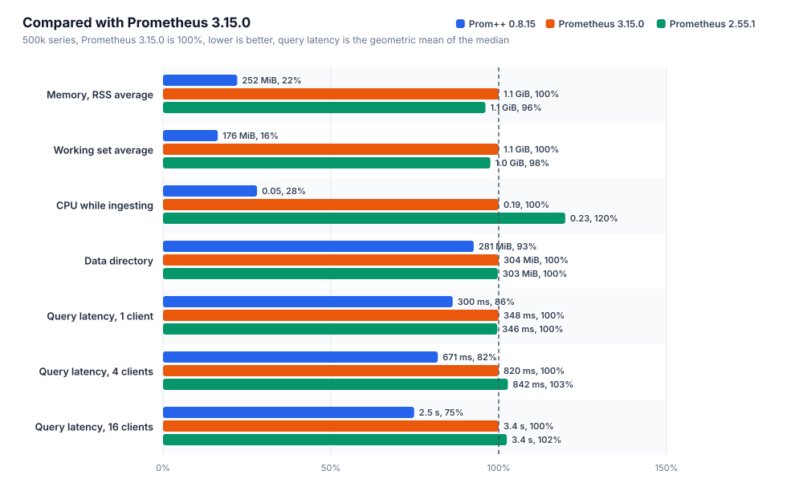
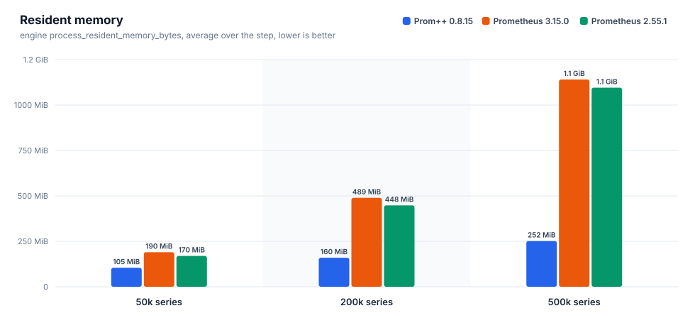
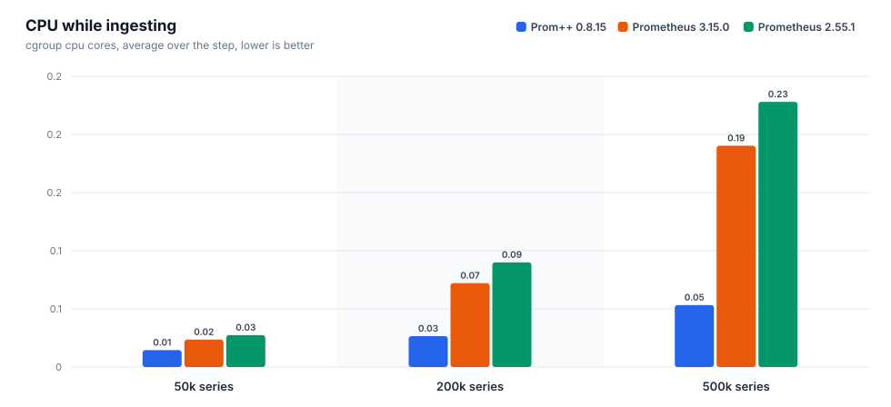
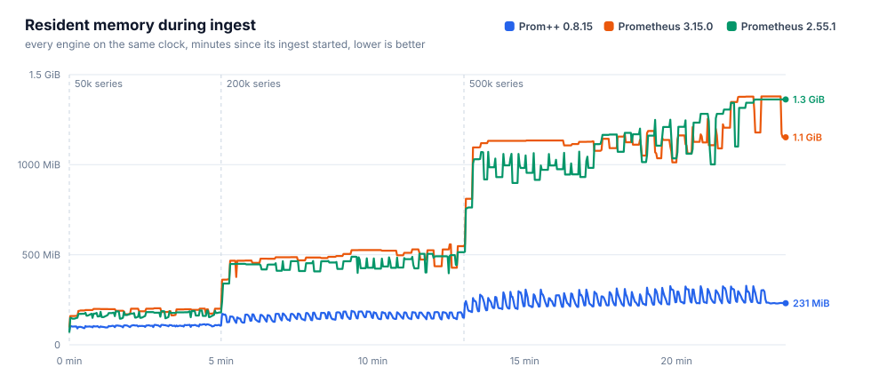
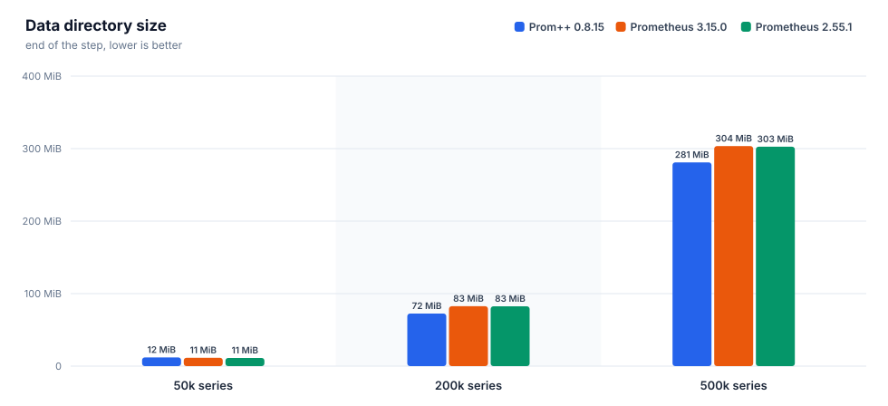
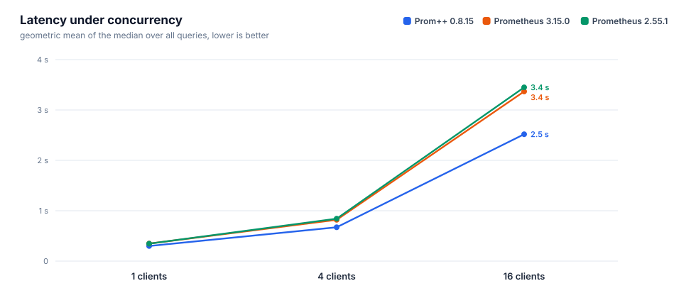
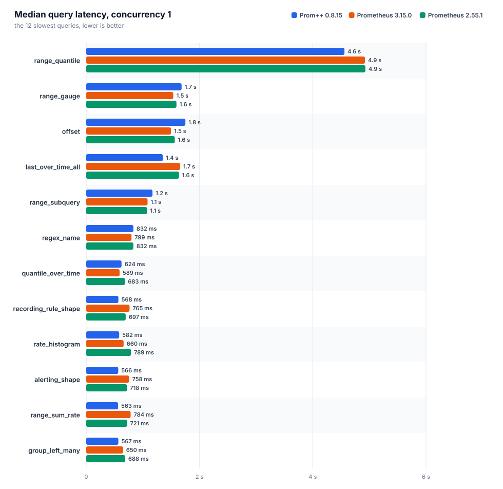
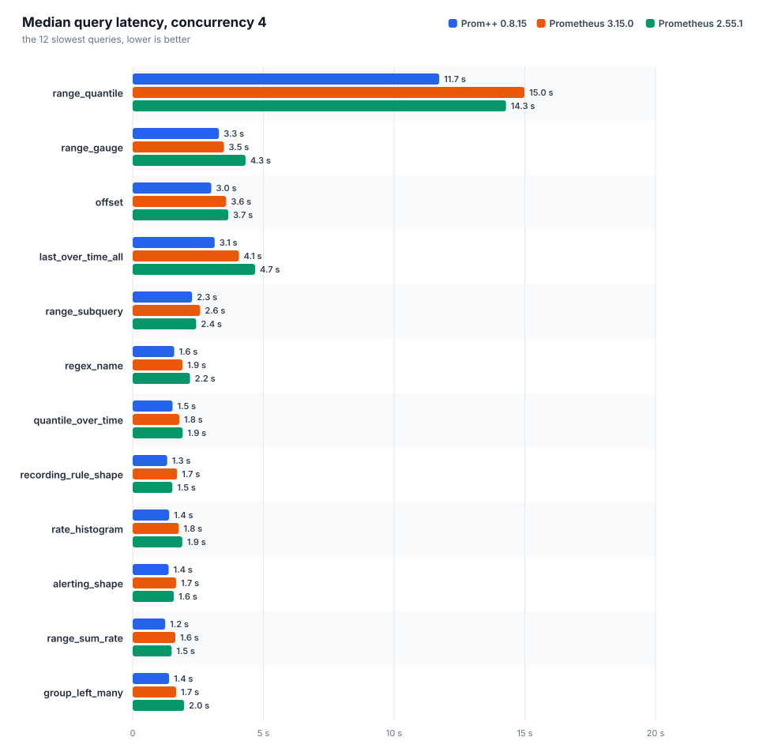
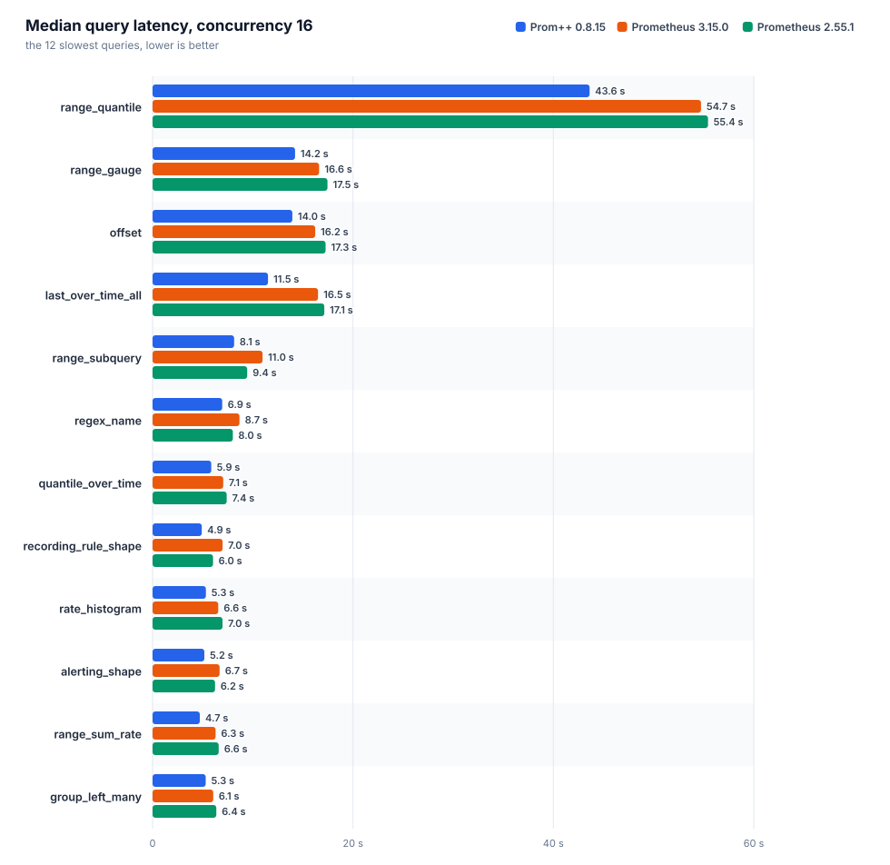

# Prom++ versus Prometheus

Generated from the raw artifacts in this directory. Every number below comes from a file in the run directory, nothing is typed in by hand.

Run id: `20261007T010616Z`

## Environment

| item | value |
|---|---|
| node | bench-node |
| cpu | AMD EPYC 7713 64-Core Processor |
| cores | 8 |
| memory | 15.6 GiB |
| kernel | 6.8.0-142-generic |
| os | Ubuntu 24.04.4 LTS |
| arch | amd64 |
| data filesystem | 151.6 GiB free of 177.1 GiB |
| container_runtime | containerd://2.3.4-k3s1.36 |
| instance_type | k3s |
| kubelet_version | v1.36.4+k3s1 |
| operating_system | linux |
| harness | harness/b3000ef-7f49340 |

## Engines

Declared settings come from the manifests, observed ones from the engine's own runtimeinfo and flags endpoints during the run.

| engine | image | cpu limit | memory limit | env | observed GOMEMLIMIT | observed GOMAXPROCS | WAL compression | args | notes |
|---|---|---|---|---|---|---|---|---|---|
| `prompp-0815` | `mirror.gcr.io/prompp/prompp:0.8.15` | 2.00 cores | 6.0 GiB | `GOMEMLIMIT=5529MiB GOMAXPROCS=2` | 5.4 GiB | 2 | true | `--config.file=... --storage.tsdb.path=... --web.enable-remote-write-receiver --web.enable-lifecycle` | C++ head and WAL |
| `prom-3150` | `quay.io/prometheus/prometheus:v3.15.0` | 2.00 cores | 6.0 GiB | `GOMEMLIMIT=5529MiB GOMAXPROCS=2` | 5.4 GiB | 2 | true | `--config.file=... --storage.tsdb.path=... --web.enable-remote-write-receiver --web.enable-lifecycle` | upstream latest |
| `prom-2551` | `quay.io/prometheus/prometheus:v2.55.1` | 2.00 cores | 6.0 GiB | `GOMEMLIMIT=5529MiB GOMAXPROCS=2` | 5.4 GiB | 2 | true | `--config.file=... --storage.tsdb.path=... --web.enable-remote-write-receiver --web.enable-lifecycle` | closed range selectors, the semantics before 3.0 |

## Ingest and head memory











### prom-2551

Interval 15s, batch 5000 series, 4 workers, 27400000 samples sent, 0 failed.

| active series | samples/s | head series | head chunks | RSS avg | RSS p95 | RSS max | working set max | cpu cores avg | cpu cores max | data dir | WAL | rss/series | disk/series |
|---|---|---|---|---|---|---|---|---|---|---|---|---|---|
| 50000 | 3333 | 50000 | 50000 | 169.8 MiB | 187.7 MiB | 190.3 MiB | 138.0 MiB | 0.03 | 0.26 | 11.3 MiB | 11.3 MiB | 3.7 KiB | 236 B |
| 200000 | 13333 | 200000 | 200000 | 447.9 MiB | 505.0 MiB | 514.2 MiB | 464.1 MiB | 0.09 | 1.59 | 82.5 MiB | 82.5 MiB | 2.6 KiB | 432 B |
| 500000 | 33333 | 500000 | 500000 | 1.1 GiB | 1.3 GiB | 1.3 GiB | 1.3 GiB | 0.23 | 3.49 | 302.6 MiB | 302.6 MiB | 2.8 KiB | 634 B |

| active series | elapsed / planned | write request p50 | p99 | 2xx | 4xx | 5xx | client errors |
|---|---|---|---|---|---|---|---|
| 50000 | 300 s / 300 s | 53 ms | 115 ms | 200 | 0 | 0 | 0 |
| 200000 | 480 s / 480 s | 31 ms | 183 ms | 1280 | 0 | 0 | 0 |
| 500000 | 600 s / 600 s | 28 ms | 249 ms | 4000 | 0 | 0 | 0 |

### prom-3150

Interval 15s, batch 5000 series, 4 workers, 27400000 samples sent, 0 failed.

| active series | samples/s | head series | head chunks | RSS avg | RSS p95 | RSS max | working set max | cpu cores avg | cpu cores max | data dir | WAL | rss/series | disk/series |
|---|---|---|---|---|---|---|---|---|---|---|---|---|---|
| 50000 | 3333 | 50000 | 50000 | 190.2 MiB | 200.8 MiB | 202.8 MiB | 151.2 MiB | 0.02 | 0.33 | 11.5 MiB | 11.5 MiB | 4.1 KiB | 241 B |
| 200000 | 13333 | 200000 | 200000 | 489.4 MiB | 530.0 MiB | 557.4 MiB | 493.3 MiB | 0.07 | 1.02 | 82.7 MiB | 82.6 MiB | 2.8 KiB | 433 B |
| 500000 | 33333 | 500000 | 500000 | 1.1 GiB | 1.3 GiB | 1.3 GiB | 1.3 GiB | 0.19 | 2.90 | 303.5 MiB | 303.5 MiB | 2.8 KiB | 636 B |

| active series | elapsed / planned | write request p50 | p99 | 2xx | 4xx | 5xx | client errors |
|---|---|---|---|---|---|---|---|
| 50000 | 300 s / 300 s | 42 ms | 98 ms | 200 | 0 | 0 | 0 |
| 200000 | 480 s / 480 s | 35 ms | 122 ms | 1280 | 0 | 0 | 0 |
| 500000 | 600 s / 600 s | 32 ms | 175 ms | 4000 | 0 | 0 | 0 |

### prompp-0815

Interval 15s, batch 5000 series, 4 workers, 27400000 samples sent, 0 failed.

| active series | samples/s | head series | head chunks | RSS avg | RSS p95 | RSS max | working set max | cpu cores avg | cpu cores max | data dir | WAL | rss/series | disk/series |
|---|---|---|---|---|---|---|---|---|---|---|---|---|---|
| 50000 | 3333 | 50000 | 50000 | 104.8 MiB | 111.6 MiB | 114.1 MiB | 50.8 MiB | 0.01 | 0.19 | 12.0 MiB | 4.0 KiB | 2.2 KiB | 252 B |
| 200000 | 13333 | 200000 | 200000 | 159.6 MiB | 183.6 MiB | 188.7 MiB | 120.6 MiB | 0.03 | 0.44 | 72.5 MiB | 4.0 KiB | 785 B | 380 B |
| 500000 | 33333 | 500000 | 500000 | 252.1 MiB | 309.7 MiB | 327.5 MiB | 244.1 MiB | 0.05 | 0.92 | 280.9 MiB | 4.0 KiB | 491 B | 589 B |

| active series | elapsed / planned | write request p50 | p99 | 2xx | 4xx | 5xx | client errors |
|---|---|---|---|---|---|---|---|
| 50000 | 300 s / 300 s | 12 ms | 87 ms | 200 | 0 | 0 | 0 |
| 200000 | 480 s / 480 s | 11 ms | 67 ms | 1280 | 0 | 0 | 0 |
| 500000 | 600 s / 600 s | 12 ms | 64 ms | 4000 | 0 | 0 | 0 |

### Comparison

Lower is better for every memory and cpu column. RSS is the engine's own process_resident_memory_bytes, working set is the cgroup figure the kubelet evicts and OOM kills on.

| active series | engine | RSS avg | bytes/series | working set max | cpu cores avg | data dir | samples/s |
|---|---|---|---|---|---|---|---|
| 50000 | `prom-2551` | 169.8 MiB | 3.7 KiB | 138.0 MiB | 0.03 | 11.3 MiB | 3333 |
| 50000 | `prom-3150` | 190.2 MiB | 4.1 KiB | 151.2 MiB | 0.02 | 11.5 MiB | 3333 |
| 50000 | `prompp-0815` | 104.8 MiB | 2.2 KiB | 50.8 MiB | 0.01 | 12.0 MiB | 3333 |
| 200000 | `prom-2551` | 447.9 MiB | 2.6 KiB | 464.1 MiB | 0.09 | 82.5 MiB | 13333 |
| 200000 | `prom-3150` | 489.4 MiB | 2.8 KiB | 493.3 MiB | 0.07 | 82.7 MiB | 13333 |
| 200000 | `prompp-0815` | 159.6 MiB | 785 B | 120.6 MiB | 0.03 | 72.5 MiB | 13333 |
| 500000 | `prom-2551` | 1.1 GiB | 2.8 KiB | 1.3 GiB | 0.23 | 302.6 MiB | 33333 |
| 500000 | `prom-3150` | 1.1 GiB | 2.8 KiB | 1.3 GiB | 0.19 | 303.5 MiB | 33333 |
| 500000 | `prompp-0815` | 252.1 MiB | 491 B | 244.1 MiB | 0.05 | 280.9 MiB | 33333 |

At the largest step, `prompp-0815` needs the least resident memory per series: 491 B of resident memory per active series, the lowest of the compared engines.

## Query latency

Each query runs on its own: one unmeasured warmup request, then the given number of workers repeat it until the time budget is spent and a minimum number of requests finished. `n` is the number of measured requests. With a small `n` the p99 is close to the maximum, so the median is the figure to compare. The geometric mean weighs every query equally, so a few multi second range queries do not drown the rest.



### Concurrency 1



| engine | suite | queries | requests | errors | geomean p50 | geomean p99 | slowest query p50 | cpu cores avg | working set max |
|---|---|---|---|---|---|---|---|---|---|
| `prom-2551` | heavy | 38 | 10239 | 0 | 346 ms | 569 ms | `range_quantile` 4.93 s | 1.21 | 1.7 GiB |
| `prom-3150` | heavy | 38 | 15062 | 0 | 348 ms | 523 ms | `range_quantile` 4.92 s | 1.13 | 1.6 GiB |
| `prompp-0815` | heavy | 38 | 10574 | 0 | 300 ms | 345 ms | `range_quantile` 4.56 s | 1.35 | 634.8 MiB |

| query | type | `prom-2551` p50 / p99 (n) | `prom-3150` p50 / p99 (n) | `prompp-0815` p50 / p99 (n) | fastest p50 |
|---|---|---|---|---|---|
| `absent` | instant | 0.4 ms / 11 ms (8764) | 0.4 ms / 8.3 ms (13535) | 0.9 ms / 2.9 ms (8649) | `prom-3150` |
| `alerting_shape` | range | 718 ms / 1.03 s (14) | 758 ms / 961 ms (13) | 566 ms / 681 ms (17) | `prompp-0815` |
| `avg_over_pods` | instant | 216 ms / 385 ms (44) | 220 ms / 355 ms (44) | 137 ms / 160 ms (73) | `prompp-0815` |
| `avg_over_time` | instant | 374 ms / 621 ms (25) | 386 ms / 542 ms (25) | 385 ms / 405 ms (27) | `prom-2551` |
| `binary_scalar` | instant | 421 ms / 597 ms (23) | 423 ms / 554 ms (23) | 260 ms / 295 ms (39) | `prompp-0815` |
| `bottomk` | instant | 205 ms / 368 ms (46) | 215 ms / 341 ms (45) | 144 ms / 166 ms (70) | `prompp-0815` |
| `clamp` | instant | 335 ms / 553 ms (27) | 341 ms / 455 ms (28) | 400 ms / 437 ms (26) | `prom-2551` |
| `count_by_job` | instant | 214 ms / 381 ms (44) | 222 ms / 370 ms (43) | 138 ms / 151 ms (73) | `prompp-0815` |
| `count_values` | instant | 348 ms / 565 ms (26) | 339 ms / 505 ms (28) | 324 ms / 363 ms (31) | `prompp-0815` |
| `double_subquery` | range | 505 ms / 665 ms (20) | 531 ms / 726 ms (19) | 408 ms / 448 ms (25) | `prompp-0815` |
| `group_left_many` | instant | 688 ms / 875 ms (15) | 650 ms / 777 ms (16) | 567 ms / 614 ms (18) | `prompp-0815` |
| `increase` | instant | 360 ms / 623 ms (26) | 373 ms / 497 ms (26) | 358 ms / 380 ms (28) | `prompp-0815` |
| `irate` | instant | 265 ms / 437 ms (36) | 258 ms / 362 ms (38) | 270 ms / 297 ms (38) | `prom-3150` |
| `join` | instant | 412 ms / 664 ms (23) | 413 ms / 573 ms (23) | 261 ms / 283 ms (39) | `prompp-0815` |
| `label_replace` | instant | 319 ms / 537 ms (30) | 316 ms / 441 ms (31) | 327 ms / 360 ms (31) | `prom-3150` |
| `last_over_time_all` | instant | 1.64 s / 1.99 s (6) | 1.66 s / 1.97 s (6) | 1.35 s / 1.43 s (8) | `prompp-0815` |
| `matchers_numeric` | instant | 281 ms / 483 ms (33) | 283 ms / 392 ms (34) | 252 ms / 289 ms (40) | `prompp-0815` |
| `max_over_time` | instant | 389 ms / 545 ms (25) | 402 ms / 553 ms (24) | 396 ms / 442 ms (26) | `prom-2551` |
| `nested_aggregate` | instant | 206 ms / 377 ms (45) | 212 ms / 350 ms (45) | 147 ms / 165 ms (68) | `prompp-0815` |
| `offset` | range | 1.56 s / 2.14 s (6) | 1.50 s / 1.69 s (7) | 1.75 s / 1.92 s (7) | `prom-3150` |
| `or_fallback` | instant | 328 ms / 539 ms (28) | 339 ms / 494 ms (28) | 361 ms / 390 ms (28) | `prom-2551` |
| `quantile_over_time` | instant | 683 ms / 921 ms (15) | 589 ms / 873 ms (16) | 624 ms / 657 ms (17) | `prom-3150` |
| `range_gauge` | range | 1.59 s / 2.25 s (6) | 1.54 s / 1.86 s (7) | 1.68 s / 2.09 s (6) | `prom-3150` |
| `range_quantile` | range | 4.93 s / 5.23 s (5) | 4.92 s / 5.27 s (5) | 4.56 s / 4.70 s (5) | `prompp-0815` |
| `range_subquery` | range | 1.07 s / 1.16 s (10) | 1.08 s / 1.25 s (10) | 1.17 s / 1.23 s (9) | `prom-2551` |
| `range_sum_rate` | range | 721 ms / 972 ms (14) | 784 ms / 929 ms (13) | 563 ms / 604 ms (18) | `prompp-0815` |
| `rate` | instant | 304 ms / 447 ms (31) | 301 ms / 489 ms (32) | 303 ms / 321 ms (33) | `prom-3150` |
| `rate_histogram` | instant | 789 ms / 952 ms (13) | 660 ms / 804 ms (15) | 582 ms / 617 ms (18) | `prompp-0815` |
| `recording_rule_shape` | range | 697 ms / 980 ms (14) | 765 ms / 922 ms (13) | 568 ms / 613 ms (18) | `prompp-0815` |
| `regex_name` | instant | 832 ms / 1.25 s (12) | 799 ms / 1.06 s (13) | 832 ms / 919 ms (12) | `prom-3150` |
| `selector` | instant | 301 ms / 497 ms (31) | 294 ms / 445 ms (32) | 316 ms / 342 ms (32) | `prom-3150` |
| `selector_labels` | instant | 17 ms / 37 ms (544) | 16 ms / 33 ms (589) | 15 ms / 21 ms (667) | `prompp-0815` |
| `sort_desc` | instant | 217 ms / 394 ms (43) | 225 ms / 341 ms (43) | 138 ms / 175 ms (72) | `prompp-0815` |
| `stddev` | instant | 211 ms / 360 ms (44) | 224 ms / 364 ms (43) | 135 ms / 145 ms (74) | `prompp-0815` |
| `sum` | instant | 205 ms / 335 ms (46) | 212 ms / 379 ms (45) | 138 ms / 173 ms (72) | `prompp-0815` |
| `sum_by_namespace` | instant | 216 ms / 308 ms (44) | 223 ms / 350 ms (44) | 145 ms / 169 ms (69) | `prompp-0815` |
| `topk` | instant | 204 ms / 371 ms (45) | 216 ms / 381 ms (45) | 142 ms / 159 ms (71) | `prompp-0815` |
| `vector_matching` | instant | 584 ms / 806 ms (16) | 620 ms / 753 ms (16) | 509 ms / 598 ms (20) | `prompp-0815` |

### Concurrency 4



| engine | suite | queries | requests | errors | geomean p50 | geomean p99 | slowest query p50 | cpu cores avg | working set max |
|---|---|---|---|---|---|---|---|---|---|
| `prom-2551` | heavy | 38 | 15567 | 0 | 842 ms | 1.51 s | `range_quantile` 14.28 s | 1.94 | 2.9 GiB |
| `prom-3150` | heavy | 38 | 20344 | 0 | 820 ms | 1.30 s | `range_quantile` 14.99 s | 1.92 | 3.0 GiB |
| `prompp-0815` | heavy | 38 | 18089 | 0 | 671 ms | 917 ms | `range_quantile` 11.73 s | 1.91 | 1.4 GiB |

| query | type | `prom-2551` p50 / p99 (n) | `prom-3150` p50 / p99 (n) | `prompp-0815` p50 / p99 (n) | fastest p50 |
|---|---|---|---|---|---|
| `absent` | instant | 0.7 ms / 27 ms (13112) | 0.7 ms / 21 ms (17736) | 2.4 ms / 8.5 ms (14754) | `prom-2551` |
| `alerting_shape` | range | 1.58 s / 2.53 s (24) | 1.66 s / 2.24 s (25) | 1.37 s / 1.54 s (32) | `prompp-0815` |
| `avg_over_pods` | instant | 493 ms / 1.05 s (69) | 517 ms / 902 ms (74) | 323 ms / 496 ms (123) | `prompp-0815` |
| `avg_over_time` | instant | 883 ms / 1.58 s (42) | 925 ms / 1.38 s (41) | 786 ms / 966 ms (53) | `prompp-0815` |
| `binary_scalar` | instant | 999 ms / 1.52 s (40) | 1.09 s / 1.48 s (37) | 654 ms / 1.00 s (62) | `prompp-0815` |
| `bottomk` | instant | 563 ms / 1.06 s (67) | 478 ms / 799 ms (78) | 348 ms / 515 ms (114) | `prompp-0815` |
| `clamp` | instant | 1.03 s / 1.38 s (41) | 887 ms / 1.17 s (46) | 739 ms / 960 ms (54) | `prompp-0815` |
| `count_by_job` | instant | 502 ms / 1.09 s (70) | 515 ms / 822 ms (75) | 333 ms / 471 ms (119) | `prompp-0815` |
| `count_values` | instant | 1.06 s / 1.39 s (40) | 902 ms / 1.15 s (46) | 772 ms / 993 ms (53) | `prompp-0815` |
| `double_subquery` | range | 1.12 s / 1.98 s (32) | 1.17 s / 1.72 s (34) | 913 ms / 1.07 s (45) | `prompp-0815` |
| `group_left_many` | instant | 1.97 s / 2.29 s (23) | 1.66 s / 1.99 s (26) | 1.39 s / 1.59 s (32) | `prompp-0815` |
| `increase` | instant | 848 ms / 1.49 s (45) | 851 ms / 1.31 s (44) | 729 ms / 929 ms (56) | `prompp-0815` |
| `irate` | instant | 635 ms / 1.30 s (57) | 592 ms / 949 ms (63) | 522 ms / 729 ms (77) | `prompp-0815` |
| `join` | instant | 1.10 s / 1.63 s (37) | 977 ms / 1.36 s (40) | 634 ms / 838 ms (64) | `prompp-0815` |
| `label_replace` | instant | 731 ms / 1.28 s (51) | 753 ms / 1.07 s (53) | 619 ms / 776 ms (66) | `prompp-0815` |
| `last_over_time_all` | instant | 4.68 s / 5.33 s (11) | 4.07 s / 4.62 s (12) | 3.14 s / 3.49 s (16) | `prompp-0815` |
| `matchers_numeric` | instant | 701 ms / 1.19 s (55) | 675 ms / 1.15 s (56) | 571 ms / 789 ms (71) | `prompp-0815` |
| `max_over_time` | instant | 868 ms / 1.42 s (43) | 894 ms / 1.32 s (44) | 788 ms / 1.01 s (52) | `prompp-0815` |
| `nested_aggregate` | instant | 459 ms / 939 ms (76) | 496 ms / 919 ms (74) | 373 ms / 527 ms (109) | `prompp-0815` |
| `offset` | range | 3.66 s / 5.01 s (12) | 3.58 s / 4.26 s (12) | 3.01 s / 3.63 s (16) | `prompp-0815` |
| `or_fallback` | instant | 849 ms / 1.45 s (46) | 773 ms / 1.37 s (48) | 724 ms / 960 ms (56) | `prompp-0815` |
| `quantile_over_time` | instant | 1.91 s / 2.51 s (22) | 1.78 s / 2.04 s (24) | 1.53 s / 2.04 s (28) | `prompp-0815` |
| `range_gauge` | range | 4.32 s / 5.02 s (12) | 3.49 s / 4.58 s (12) | 3.30 s / 4.18 s (12) | `prompp-0815` |
| `range_quantile` | range | 14.28 s / 14.82 s (5) | 14.99 s / 15.05 s (5) | 11.73 s / 11.81 s (5) | `prompp-0815` |
| `range_subquery` | range | 2.43 s / 3.20 s (18) | 2.58 s / 2.97 s (16) | 2.27 s / 2.66 s (20) | `prompp-0815` |
| `range_sum_rate` | range | 1.49 s / 2.55 s (26) | 1.63 s / 2.40 s (24) | 1.24 s / 1.39 s (34) | `prompp-0815` |
| `rate` | instant | 737 ms / 1.25 s (53) | 682 ms / 1.01 s (55) | 583 ms / 879 ms (66) | `prompp-0815` |
| `rate_histogram` | instant | 1.90 s / 2.10 s (24) | 1.76 s / 2.16 s (24) | 1.39 s / 1.65 s (31) | `prompp-0815` |
| `recording_rule_shape` | range | 1.52 s / 2.47 s (24) | 1.70 s / 2.08 s (24) | 1.32 s / 1.62 s (32) | `prompp-0815` |
| `regex_name` | instant | 2.19 s / 3.55 s (20) | 1.91 s / 2.42 s (23) | 1.59 s / 2.19 s (26) | `prompp-0815` |
| `selector` | instant | 701 ms / 1.29 s (52) | 655 ms / 1.12 s (56) | 578 ms / 849 ms (70) | `prompp-0815` |
| `selector_labels` | instant | 34 ms / 149 ms (930) | 35 ms / 99 ms (1016) | 34 ms / 77 ms (1118) | `prompp-0815` |
| `sort_desc` | instant | 495 ms / 974 ms (74) | 485 ms / 907 ms (77) | 345 ms / 467 ms (119) | `prompp-0815` |
| `stddev` | instant | 509 ms / 959 ms (71) | 501 ms / 800 ms (76) | 329 ms / 501 ms (123) | `prompp-0815` |
| `sum` | instant | 463 ms / 1.15 s (77) | 488 ms / 896 ms (76) | 327 ms / 523 ms (121) | `prompp-0815` |
| `sum_by_namespace` | instant | 522 ms / 1.07 s (71) | 521 ms / 994 ms (71) | 359 ms / 519 ms (115) | `prompp-0815` |
| `topk` | instant | 539 ms / 1.11 s (67) | 511 ms / 932 ms (74) | 371 ms / 542 ms (109) | `prompp-0815` |
| `vector_matching` | instant | 1.68 s / 1.81 s (28) | 1.61 s / 1.88 s (27) | 1.21 s / 1.54 s (36) | `prompp-0815` |

### Concurrency 16



| engine | suite | queries | requests | errors | geomean p50 | geomean p99 | slowest query p50 | cpu cores avg | working set max |
|---|---|---|---|---|---|---|---|---|---|
| `prom-2551` | heavy | 38 | 19808 | 0 | 3.45 s | 4.89 s | `range_quantile` 55.43 s | 1.94 | 5.4 GiB |
| `prom-3150` | heavy | 38 | 21719 | 0 | 3.37 s | 4.64 s | `range_quantile` 54.74 s | 1.92 | 5.4 GiB |
| `prompp-0815` | heavy | 38 | 17502 | 0 | 2.52 s | 3.53 s | `range_quantile` 43.62 s | 1.92 | 4.3 GiB |

| query | type | `prom-2551` p50 / p99 (n) | `prom-3150` p50 / p99 (n) | `prompp-0815` p50 / p99 (n) | fastest p50 |
|---|---|---|---|---|---|
| `absent` | instant | 2.6 ms / 115 ms (17037) | 3.2 ms / 69 ms (18847) | 10 ms / 36 ms (13704) | `prom-2551` |
| `alerting_shape` | range | 6.24 s / 7.55 s (32) | 6.69 s / 7.43 s (32) | 5.17 s / 5.88 s (35) | `prompp-0815` |
| `avg_over_pods` | instant | 2.23 s / 2.85 s (81) | 2.15 s / 2.97 s (84) | 1.20 s / 2.09 s (134) | `prompp-0815` |
| `avg_over_time` | instant | 3.72 s / 4.74 s (48) | 3.57 s / 4.79 s (49) | 2.74 s / 3.74 s (64) | `prompp-0815` |
| `binary_scalar` | instant | 4.25 s / 5.12 s (48) | 4.09 s / 5.17 s (48) | 2.33 s / 3.43 s (76) | `prompp-0815` |
| `bottomk` | instant | 2.26 s / 2.95 s (77) | 2.16 s / 2.94 s (83) | 1.31 s / 2.17 s (129) | `prompp-0815` |
| `clamp` | instant | 3.92 s / 4.86 s (49) | 3.48 s / 4.51 s (52) | 2.76 s / 3.87 s (66) | `prompp-0815` |
| `count_by_job` | instant | 2.28 s / 2.94 s (78) | 2.02 s / 2.98 s (87) | 1.25 s / 1.90 s (130) | `prompp-0815` |
| `count_values` | instant | 3.78 s / 5.02 s (48) | 3.60 s / 4.80 s (50) | 2.84 s / 4.12 s (63) | `prompp-0815` |
| `double_subquery` | range | 4.96 s / 5.81 s (40) | 4.85 s / 5.50 s (42) | 3.53 s / 4.59 s (48) | `prompp-0815` |
| `group_left_many` | instant | 6.36 s / 7.52 s (32) | 6.06 s / 6.95 s (32) | 5.30 s / 6.31 s (33) | `prompp-0815` |
| `increase` | instant | 3.63 s / 4.63 s (48) | 3.70 s / 4.19 s (50) | 2.77 s / 3.47 s (64) | `prompp-0815` |
| `irate` | instant | 2.88 s / 3.70 s (64) | 2.56 s / 3.33 s (66) | 1.92 s / 2.79 s (88) | `prompp-0815` |
| `join` | instant | 4.11 s / 4.88 s (48) | 3.94 s / 4.91 s (48) | 2.28 s / 3.72 s (76) | `prompp-0815` |
| `label_replace` | instant | 3.43 s / 4.28 s (51) | 2.97 s / 3.82 s (64) | 2.19 s / 3.00 s (78) | `prompp-0815` |
| `last_over_time_all` | instant | 17.14 s / 18.17 s (16) | 16.51 s / 17.01 s (16) | 11.52 s / 12.18 s (16) | `prompp-0815` |
| `matchers_numeric` | instant | 2.86 s / 4.30 s (61) | 2.82 s / 3.55 s (64) | 2.10 s / 2.96 s (80) | `prompp-0815` |
| `max_over_time` | instant | 3.76 s / 4.66 s (50) | 3.68 s / 4.75 s (48) | 2.91 s / 3.40 s (64) | `prompp-0815` |
| `nested_aggregate` | instant | 2.31 s / 3.25 s (76) | 2.08 s / 2.67 s (82) | 1.32 s / 2.27 s (123) | `prompp-0815` |
| `offset` | range | 17.27 s / 17.66 s (16) | 16.23 s / 16.53 s (16) | 13.95 s / 14.16 s (16) | `prompp-0815` |
| `or_fallback` | instant | 3.28 s / 4.03 s (56) | 3.47 s / 4.26 s (53) | 2.53 s / 3.32 s (71) | `prompp-0815` |
| `quantile_over_time` | instant | 7.40 s / 9.13 s (32) | 7.05 s / 8.26 s (32) | 5.86 s / 7.77 s (32) | `prompp-0815` |
| `range_gauge` | range | 17.45 s / 17.89 s (16) | 16.62 s / 16.93 s (16) | 14.22 s / 14.46 s (16) | `prompp-0815` |
| `range_quantile` | range | 55.43 s / 55.75 s (16) | 54.74 s / 54.86 s (16) | 43.62 s / 44.16 s (16) | `prompp-0815` |
| `range_subquery` | range | 9.44 s / 11.25 s (25) | 10.98 s / 11.21 s (17) | 8.14 s / 9.27 s (32) | `prompp-0815` |
| `range_sum_rate` | range | 6.60 s / 8.43 s (32) | 6.29 s / 8.22 s (32) | 4.71 s / 5.56 s (44) | `prompp-0815` |
| `rate` | instant | 3.12 s / 3.79 s (56) | 2.81 s / 3.90 s (63) | 2.20 s / 2.94 s (80) | `prompp-0815` |
| `rate_histogram` | instant | 6.98 s / 8.36 s (32) | 6.55 s / 8.34 s (32) | 5.32 s / 6.66 s (32) | `prompp-0815` |
| `recording_rule_shape` | range | 6.04 s / 7.74 s (32) | 6.99 s / 7.53 s (32) | 4.91 s / 5.60 s (41) | `prompp-0815` |
| `regex_name` | instant | 8.01 s / 10.77 s (26) | 8.68 s / 10.40 s (26) | 6.95 s / 8.81 s (32) | `prompp-0815` |
| `selector` | instant | 2.97 s / 4.18 s (59) | 2.77 s / 4.06 s (60) | 2.19 s / 2.94 s (81) | `prompp-0815` |
| `selector_labels` | instant | 137 ms / 473 ms (985) | 137 ms / 514 ms (1036) | 123 ms / 311 ms (1224) | `prompp-0815` |
| `sort_desc` | instant | 2.14 s / 2.88 s (82) | 2.01 s / 2.94 s (85) | 1.17 s / 1.88 s (142) | `prompp-0815` |
| `stddev` | instant | 2.15 s / 3.29 s (83) | 2.27 s / 2.84 s (78) | 1.14 s / 1.92 s (144) | `prompp-0815` |
| `sum` | instant | 2.01 s / 3.07 s (87) | 2.07 s / 2.72 s (86) | 1.20 s / 1.89 s (138) | `prompp-0815` |
| `sum_by_namespace` | instant | 2.27 s / 3.15 s (78) | 2.11 s / 2.93 s (82) | 1.29 s / 1.93 s (127) | `prompp-0815` |
| `topk` | instant | 2.29 s / 2.83 s (79) | 2.13 s / 2.95 s (81) | 1.40 s / 2.28 s (121) | `prompp-0815` |
| `vector_matching` | instant | 5.97 s / 8.02 s (32) | 5.77 s / 7.45 s (32) | 4.73 s / 6.35 s (42) | `prompp-0815` |

## Result equality

Every engine received the same samples and every query is evaluated at the same pinned timestamp, so a result that differs points at a semantic difference between engines or at lost data. Each cell is the sha256 of the canonicalised result.

A differing row means the engines disagree on the same data at the same timestamp. All of them are rate or `_over_time` range queries. Prometheus 3.0 made range selectors left-open, a sample exactly on the window start is no longer included, and the Prom++ 0.8.15 PromQL engine already drops it (`promql/engine.go`, `floats[drop].T <= mint`), unlike 2.55.1 (`< mint`). The synthetic samples sit on the window edge, so 2.55.1 sees one extra sample.

| query | `prom-2551` | `prom-3150` | `prompp-0815` | identical |
|---|---|---|---|---|
| `absent` | ca3d163bab05 (1 series) | ca3d163bab05 (1 series) | ca3d163bab05 (1 series) | yes |
| `alerting_shape` | 433e69a3597b (100 series) | e10ba8156cd2 (100 series) | e10ba8156cd2 (100 series) | no |
| `avg_over_pods` | 4f6b6c188f7f (100 series) | 4f6b6c188f7f (100 series) | 4f6b6c188f7f (100 series) | yes |
| `avg_over_time` | f1f392b0c78d (62500 series) | f1f392b0c78d (62500 series) | f1f392b0c78d (62500 series) | yes |
| `binary_scalar` | ca3d163bab05 (1 series) | ca3d163bab05 (1 series) | ca3d163bab05 (1 series) | yes |
| `bottomk` | 75dc8cd99593 (5 series) | 75dc8cd99593 (5 series) | 75dc8cd99593 (5 series) | yes |
| `clamp` | f1f392b0c78d (62500 series) | f1f392b0c78d (62500 series) | f1f392b0c78d (62500 series) | yes |
| `count_by_job` | 07c02c1348ea (1 series) | 07c02c1348ea (1 series) | 07c02c1348ea (1 series) | yes |
| `count_values` | e792d90cc0a2 (62500 series) | e792d90cc0a2 (62500 series) | e792d90cc0a2 (62500 series) | yes |
| `double_subquery` | 83f99d686699 (100 series) | 55416fa4082f (100 series) | 55416fa4082f (100 series) | no |
| `group_left_many` | f1f392b0c78d (62500 series) | f1f392b0c78d (62500 series) | f1f392b0c78d (62500 series) | yes |
| `increase` | 559e24dc9a48 (62500 series) | 559e24dc9a48 (62500 series) | 559e24dc9a48 (62500 series) | yes |
| `irate` | 559e24dc9a48 (62500 series) | 559e24dc9a48 (62500 series) | 559e24dc9a48 (62500 series) | yes |
| `join` | 4f6b6c188f7f (100 series) | 4f6b6c188f7f (100 series) | 4f6b6c188f7f (100 series) | yes |
| `label_replace` | d3ae67deabaa (62500 series) | d3ae67deabaa (62500 series) | d3ae67deabaa (62500 series) | yes |
| `last_over_time_all` | ca3d163bab05 (1 series) | ca3d163bab05 (1 series) | ca3d163bab05 (1 series) | yes |
| `matchers_numeric` | bf8394774b5f (38487 series) | bf8394774b5f (38487 series) | bf8394774b5f (38487 series) | yes |
| `max_over_time` | f1f392b0c78d (62500 series) | f1f392b0c78d (62500 series) | f1f392b0c78d (62500 series) | yes |
| `nested_aggregate` | ca3d163bab05 (1 series) | ca3d163bab05 (1 series) | ca3d163bab05 (1 series) | yes |
| `offset` | d5542cb672bf (62500 series) | d5542cb672bf (62500 series) | d5542cb672bf (62500 series) | yes |
| `or_fallback` | a712401a23e5 (62500 series) | a712401a23e5 (62500 series) | a712401a23e5 (62500 series) | yes |
| `quantile_over_time` | f1f392b0c78d (62500 series) | f1f392b0c78d (62500 series) | f1f392b0c78d (62500 series) | yes |
| `range_gauge` | d5542cb672bf (62500 series) | d5542cb672bf (62500 series) | d5542cb672bf (62500 series) | yes |
| `range_quantile` | 8e52194734df (62500 series) | 4f0d1e3a91e8 (62500 series) | 4f0d1e3a91e8 (62500 series) | no |
| `range_subquery` | 82623d225556 (62500 series) | 82623d225556 (62500 series) | 82623d225556 (62500 series) | yes |
| `range_sum_rate` | 8dcd40399f41 (100 series) | d73a595a3678 (100 series) | d73a595a3678 (100 series) | no |
| `rate` | 559e24dc9a48 (62500 series) | 559e24dc9a48 (62500 series) | 559e24dc9a48 (62500 series) | yes |
| `rate_histogram` | 559e24dc9a48 (62500 series) | 559e24dc9a48 (62500 series) | 559e24dc9a48 (62500 series) | yes |
| `recording_rule_shape` | eb8b58afb326 (1 series) | 8476e35ab60f (1 series) | 8476e35ab60f (1 series) | no |
| `regex_name` | fd6cd5bf0d07 (187500 series) | fd6cd5bf0d07 (187500 series) | fd6cd5bf0d07 (187500 series) | yes |
| `selector` | a712401a23e5 (62500 series) | a712401a23e5 (62500 series) | a712401a23e5 (62500 series) | yes |
| `selector_labels` | b5f636cb8557 (3125 series) | b5f636cb8557 (3125 series) | b5f636cb8557 (3125 series) | yes |
| `sort_desc` | 4f6b6c188f7f (100 series) | 4f6b6c188f7f (100 series) | 4f6b6c188f7f (100 series) | yes |
| `stddev` | 4f6b6c188f7f (100 series) | 4f6b6c188f7f (100 series) | 4f6b6c188f7f (100 series) | yes |
| `sum` | ca3d163bab05 (1 series) | ca3d163bab05 (1 series) | ca3d163bab05 (1 series) | yes |
| `sum_by_namespace` | 4f6b6c188f7f (100 series) | 4f6b6c188f7f (100 series) | 4f6b6c188f7f (100 series) | yes |
| `topk` | 77b447784c27 (20 series) | 77b447784c27 (20 series) | 77b447784c27 (20 series) | yes |
| `vector_matching` | f1f392b0c78d (62500 series) | f1f392b0c78d (62500 series) | f1f392b0c78d (62500 series) | yes |

33 queries identical, 5 differ.

## Reproduce

```sh
export BENCH_NODE=<node>
RUN_ID=20261007T010616Z scripts/node-overlay.sh
scripts/harness.sh
RUN_ID=20261007T010616Z scripts/run.sh
go run ./cmd/report -root results -run 20261007T010616Z
scripts/teardown.sh --yes
```

See METHODOLOGY.md for the fairness rules and the known threats to validity.
