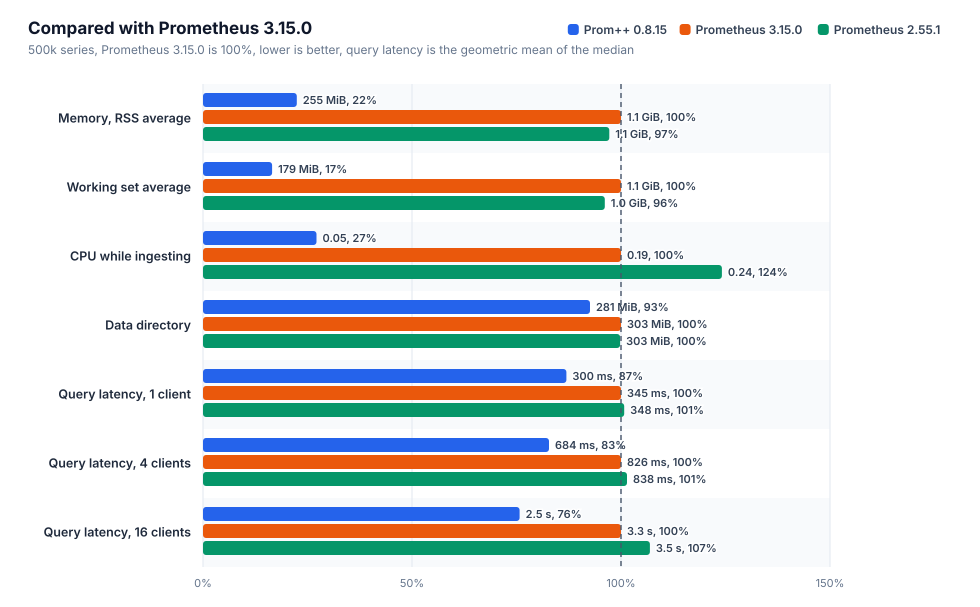
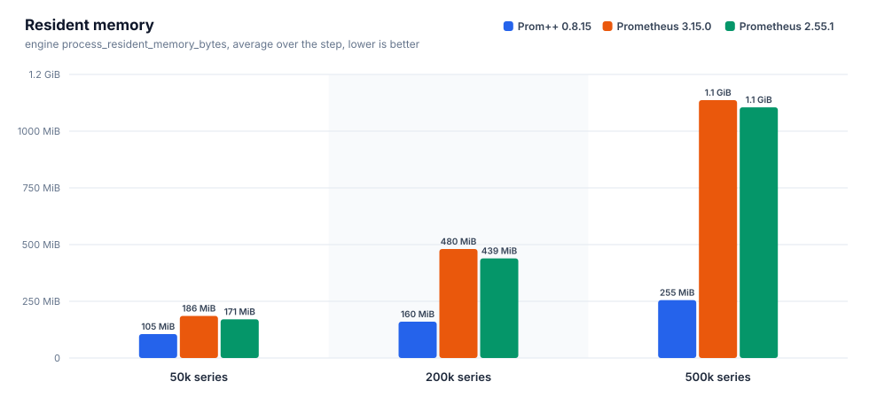
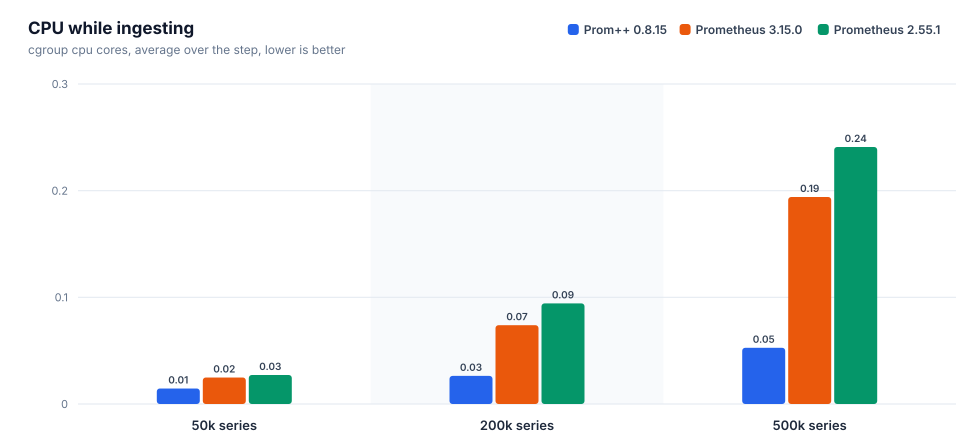
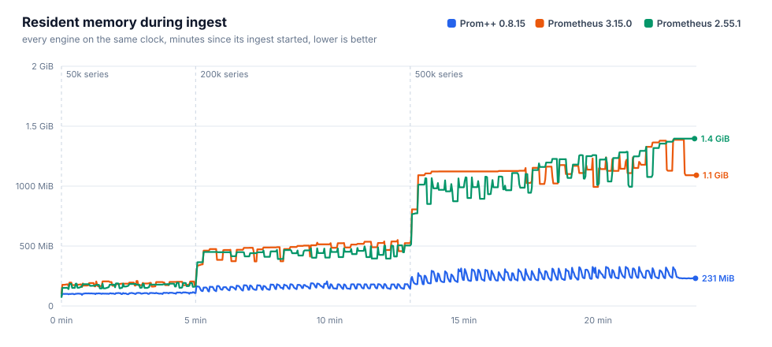
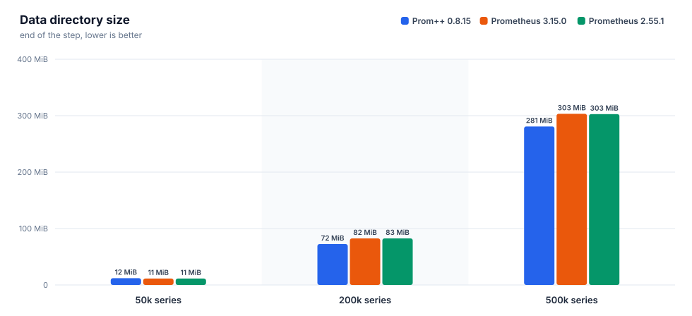
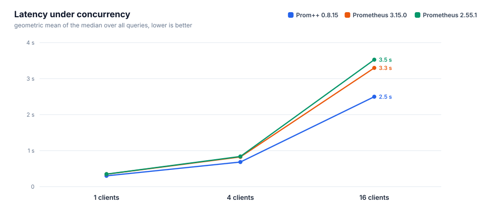
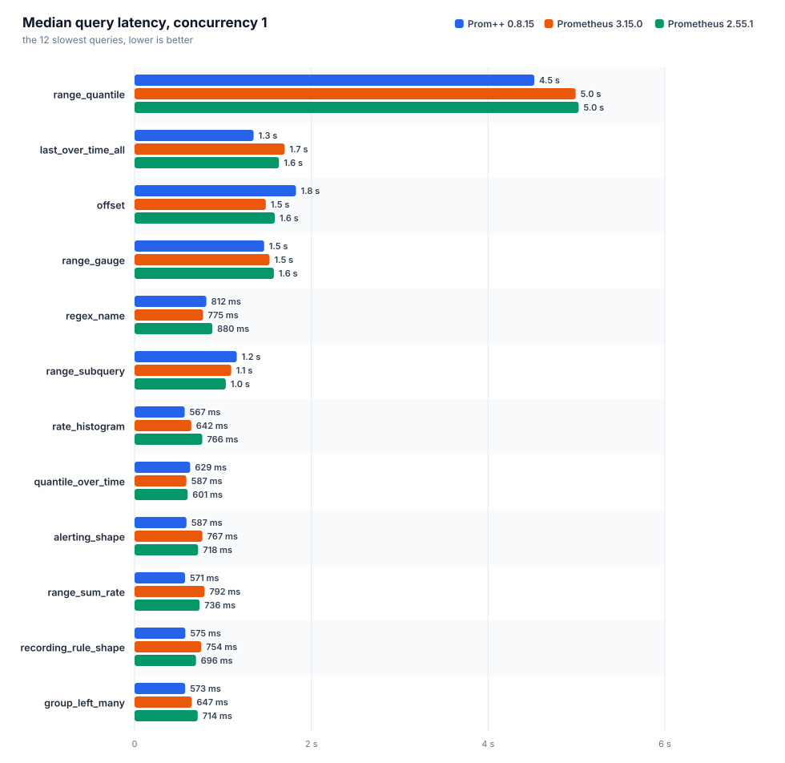
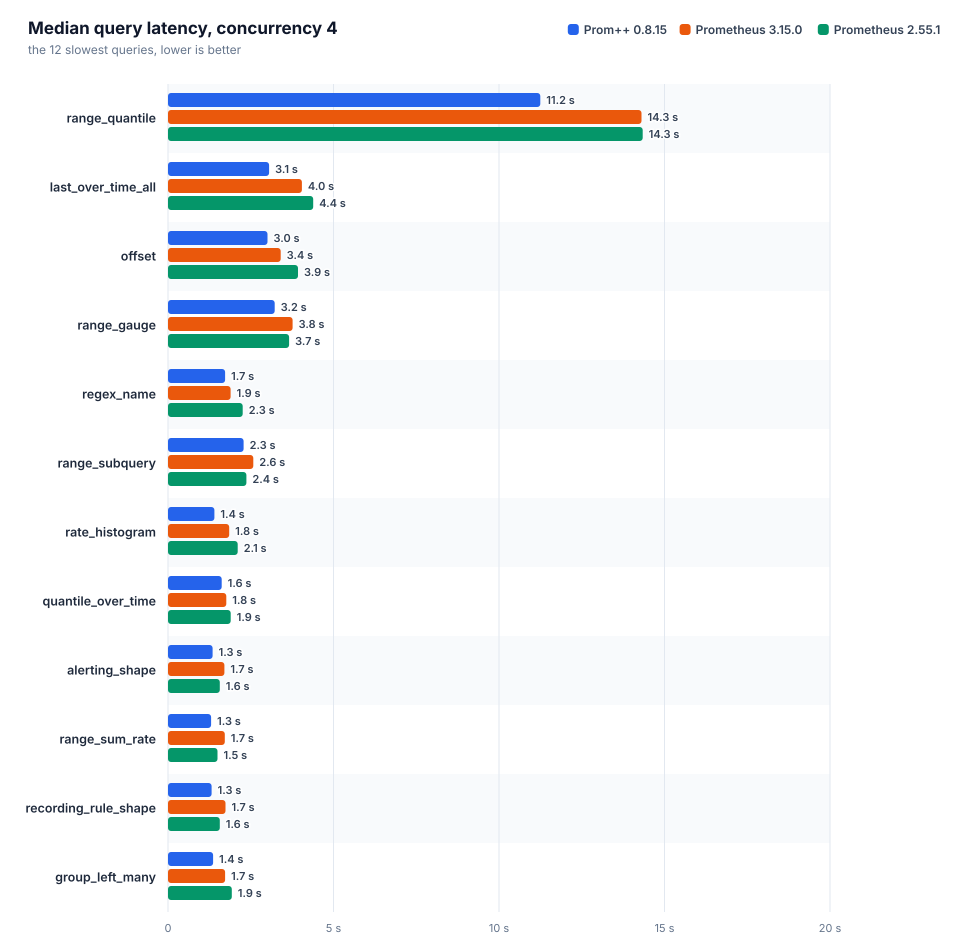
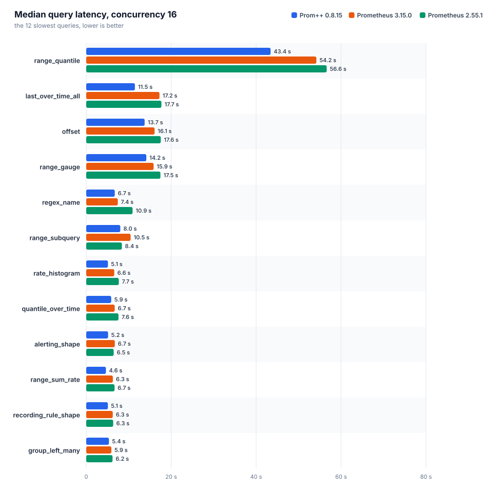

[English](REPORT.md) · **Русский**

# Prom++ против Prometheus

Создано из исходных файлов этой папки. Каждое число ниже взято из файла прогона, вручную ничего не вписано.

Номер прогона: `20261007T050616Z`

## Окружение

| параметр | значение |
|---|---|
| узел | bench-node |
| процессор | AMD EPYC 7713 64-Core Processor |
| ядер | 8 |
| память | 15.6 GiB |
| ядро | 6.8.0-142-generic |
| ОС | Ubuntu 24.04.4 LTS |
| архитектура | amd64 |
| файловая система данных | свободно 151.6 GiB из 177.1 GiB |
| container_runtime | containerd://2.3.4-k3s1.36 |
| instance_type | k3s |
| kubelet_version | v1.36.4+k3s1 |
| operating_system | linux |
| нагрузочный код | harness/b3000ef-7f49340 |

## Движки

Заданные настройки взяты из манифестов, наблюдаемые из runtimeinfo и списка флагов самого движка во время прогона.

| движок | образ | лимит процессора | лимит памяти | окружение | GOMEMLIMIT (факт) | GOMAXPROCS (факт) | сжатие WAL | аргументы | заметки |
|---|---|---|---|---|---|---|---|---|---|
| `prompp-0815` | `mirror.gcr.io/prompp/prompp:0.8.15` | 2.00 cores | 6.0 GiB | `GOMEMLIMIT=5529MiB GOMAXPROCS=2` | 5.4 GiB | 2 | true | `--config.file=... --storage.tsdb.path=... --web.enable-remote-write-receiver --web.enable-lifecycle` | C++ head and WAL |
| `prom-3150` | `quay.io/prometheus/prometheus:v3.15.0` | 2.00 cores | 6.0 GiB | `GOMEMLIMIT=5529MiB GOMAXPROCS=2` | 5.4 GiB | 2 | true | `--config.file=... --storage.tsdb.path=... --web.enable-remote-write-receiver --web.enable-lifecycle` | upstream latest |
| `prom-2551` | `quay.io/prometheus/prometheus:v2.55.1` | 2.00 cores | 6.0 GiB | `GOMEMLIMIT=5529MiB GOMAXPROCS=2` | 5.4 GiB | 2 | true | `--config.file=... --storage.tsdb.path=... --web.enable-remote-write-receiver --web.enable-lifecycle` | closed range selectors, the semantics before 3.0 |

## Запись и память head











### prom-2551

Интервал 15 с, пачка 5000 серий, потоков 4, отправлено точек 27400000, из них потеряно 0.

| активных серий | точек/с | серий в head | чанков | RSS ср. | RSS p95 | RSS макс. | рабочий набор макс. | ядер ср. | ядер макс. | каталог данных | WAL | RSS/серия | диск/серия |
|---|---|---|---|---|---|---|---|---|---|---|---|---|---|
| 50000 | 3333 | 50000 | 50000 | 170.6 MiB | 191.7 MiB | 193.6 MiB | 140.7 MiB | 0.03 | 0.34 | 11.4 MiB | 11.4 MiB | 3.4 KiB | 238 B |
| 200000 | 13333 | 200000 | 200000 | 439.1 MiB | 504.7 MiB | 505.7 MiB | 454.8 MiB | 0.09 | 0.91 | 82.5 MiB | 82.5 MiB | 2.6 KiB | 432 B |
| 500000 | 33333 | 500000 | 500000 | 1.1 GiB | 1.3 GiB | 1.4 GiB | 1.3 GiB | 0.24 | 3.59 | 302.8 MiB | 302.8 MiB | 2.9 KiB | 634 B |

| активных серий | прошло / план | запрос записи p50 | p99 | 2xx | 4xx | 5xx | ошибки клиента |
|---|---|---|---|---|---|---|---|
| 50000 | 300 s / 300 s | 55 ms | 132 ms | 200 | 0 | 0 | 0 |
| 200000 | 480 s / 480 s | 31 ms | 208 ms | 1280 | 0 | 0 | 0 |
| 500000 | 600 s / 600 s | 29 ms | 270 ms | 4000 | 0 | 0 | 0 |

### prom-3150

Интервал 15 с, пачка 5000 серий, потоков 4, отправлено точек 27400000, из них потеряно 0.

| активных серий | точек/с | серий в head | чанков | RSS ср. | RSS p95 | RSS макс. | рабочий набор макс. | ядер ср. | ядер макс. | каталог данных | WAL | RSS/серия | диск/серия |
|---|---|---|---|---|---|---|---|---|---|---|---|---|---|
| 50000 | 3333 | 50000 | 50000 | 185.7 MiB | 205.6 MiB | 208.4 MiB | 149.9 MiB | 0.02 | 0.41 | 11.4 MiB | 11.3 MiB | 3.5 KiB | 238 B |
| 200000 | 13333 | 200000 | 200000 | 480.3 MiB | 536.5 MiB | 550.9 MiB | 482.5 MiB | 0.07 | 1.16 | 82.5 MiB | 82.5 MiB | 2.7 KiB | 432 B |
| 500000 | 33333 | 500000 | 500000 | 1.1 GiB | 1.3 GiB | 1.4 GiB | 1.3 GiB | 0.19 | 2.97 | 303.4 MiB | 303.4 MiB | 2.8 KiB | 636 B |

| активных серий | прошло / план | запрос записи p50 | p99 | 2xx | 4xx | 5xx | ошибки клиента |
|---|---|---|---|---|---|---|---|
| 50000 | 300 s / 300 s | 42 ms | 116 ms | 200 | 0 | 0 | 0 |
| 200000 | 480 s / 480 s | 34 ms | 128 ms | 1280 | 0 | 0 | 0 |
| 500000 | 600 s / 600 s | 31 ms | 182 ms | 4000 | 0 | 0 | 0 |

### prompp-0815

Интервал 15 с, пачка 5000 серий, потоков 4, отправлено точек 27400000, из них потеряно 0.

| активных серий | точек/с | серий в head | чанков | RSS ср. | RSS p95 | RSS макс. | рабочий набор макс. | ядер ср. | ядер макс. | каталог данных | WAL | RSS/серия | диск/серия |
|---|---|---|---|---|---|---|---|---|---|---|---|---|---|
| 50000 | 3333 | 50000 | 50000 | 105.4 MiB | 112.4 MiB | 115.8 MiB | 48.6 MiB | 0.01 | 0.19 | 12.0 MiB | 4.0 KiB | 2.2 KiB | 251 B |
| 200000 | 13333 | 200000 | 200000 | 160.3 MiB | 182.5 MiB | 205.0 MiB | 120.1 MiB | 0.03 | 0.39 | 72.5 MiB | 4.0 KiB | 756 B | 380 B |
| 500000 | 33333 | 500000 | 500000 | 255.0 MiB | 315.1 MiB | 326.4 MiB | 243.5 MiB | 0.05 | 0.82 | 280.9 MiB | 4.0 KiB | 496 B | 589 B |

| активных серий | прошло / план | запрос записи p50 | p99 | 2xx | 4xx | 5xx | ошибки клиента |
|---|---|---|---|---|---|---|---|
| 50000 | 300 s / 300 s | 12 ms | 67 ms | 200 | 0 | 0 | 0 |
| 200000 | 480 s / 480 s | 11 ms | 59 ms | 1280 | 0 | 0 | 0 |
| 500000 | 600 s / 600 s | 11 ms | 70 ms | 4000 | 0 | 0 | 0 |

### Сравнение

Для всех столбцов с памятью и процессором меньше значит лучше. RSS это `process_resident_memory_bytes` самого движка, рабочий набор это значение cgroup, по которому kubelet выселяет поды и срабатывает OOM.

| активных серий | движок | RSS ср. | байт на серию | рабочий набор макс. | ядер ср. | каталог данных | точек/с |
|---|---|---|---|---|---|---|---|
| 50000 | `prom-2551` | 170.6 MiB | 3.4 KiB | 140.7 MiB | 0.03 | 11.4 MiB | 3333 |
| 50000 | `prom-3150` | 185.7 MiB | 3.5 KiB | 149.9 MiB | 0.02 | 11.4 MiB | 3333 |
| 50000 | `prompp-0815` | 105.4 MiB | 2.2 KiB | 48.6 MiB | 0.01 | 12.0 MiB | 3333 |
| 200000 | `prom-2551` | 439.1 MiB | 2.6 KiB | 454.8 MiB | 0.09 | 82.5 MiB | 13333 |
| 200000 | `prom-3150` | 480.3 MiB | 2.7 KiB | 482.5 MiB | 0.07 | 82.5 MiB | 13333 |
| 200000 | `prompp-0815` | 160.3 MiB | 756 B | 120.1 MiB | 0.03 | 72.5 MiB | 13333 |
| 500000 | `prom-2551` | 1.1 GiB | 2.9 KiB | 1.3 GiB | 0.24 | 302.8 MiB | 33333 |
| 500000 | `prom-3150` | 1.1 GiB | 2.8 KiB | 1.3 GiB | 0.19 | 303.4 MiB | 33333 |
| 500000 | `prompp-0815` | 255.0 MiB | 496 B | 243.5 MiB | 0.05 | 280.9 MiB | 33333 |

На самой большой ступени меньше всего памяти на серию нужно `prompp-0815`: 496 B of resident memory per active series, the lowest of the compared engines.

## Время запросов

Каждый запрос идёт отдельно: один пробный запрос без учёта, затем заданное число потоков повторяет его, пока не истечёт отведённое время и не наберётся минимальное число запросов. `n` это число учтённых запросов. При малом `n` значение p99 близко к максимуму, поэтому сравнивать лучше медиану. Геометрическое среднее учитывает все запросы поровну, поэтому несколько запросов, которые идут секундами, не заглушают остальные.



### Параллельность 1



| движок | набор | запросов | замеров | ошибок | p50 (геом.) | p99 (геом.) | p50 самого медленного | ядер ср. | рабочий набор макс. |
|---|---|---|---|---|---|---|---|---|---|
| `prom-2551` | heavy | 38 | 11298 | 0 | 348 ms | 575 ms | `range_quantile` 5.02 s | 1.22 | 1.8 GiB |
| `prom-3150` | heavy | 38 | 14767 | 0 | 345 ms | 524 ms | `range_quantile` 4.99 s | 1.15 | 1.6 GiB |
| `prompp-0815` | heavy | 38 | 10798 | 0 | 300 ms | 349 ms | `range_quantile` 4.52 s | 1.35 | 608.2 MiB |

| query | type | `prom-2551` p50 / p99 (n) | `prom-3150` p50 / p99 (n) | `prompp-0815` p50 / p99 (n) | fastest p50 |
|---|---|---|---|---|---|
| `absent` | instant | 0.4 ms / 11 ms (9842) | 0.4 ms / 8.7 ms (13255) | 0.8 ms / 3.0 ms (8889) | `prom-2551` |
| `alerting_shape` | range | 718 ms / 968 ms (14) | 767 ms / 967 ms (13) | 587 ms / 639 ms (17) | `prompp-0815` |
| `avg_over_pods` | instant | 221 ms / 375 ms (43) | 224 ms / 341 ms (44) | 139 ms / 170 ms (72) | `prompp-0815` |
| `avg_over_time` | instant | 380 ms / 656 ms (25) | 390 ms / 527 ms (25) | 385 ms / 415 ms (26) | `prom-2551` |
| `binary_scalar` | instant | 413 ms / 660 ms (23) | 430 ms / 571 ms (23) | 276 ms / 315 ms (37) | `prompp-0815` |
| `bottomk` | instant | 207 ms / 367 ms (45) | 209 ms / 356 ms (45) | 141 ms / 168 ms (70) | `prompp-0815` |
| `clamp` | instant | 360 ms / 699 ms (25) | 333 ms / 517 ms (27) | 393 ms / 421 ms (26) | `prom-3150` |
| `count_by_job` | instant | 212 ms / 342 ms (45) | 216 ms / 343 ms (45) | 145 ms / 179 ms (70) | `prompp-0815` |
| `count_values` | instant | 345 ms / 519 ms (26) | 343 ms / 478 ms (28) | 317 ms / 347 ms (32) | `prompp-0815` |
| `double_subquery` | range | 513 ms / 750 ms (19) | 522 ms / 684 ms (19) | 429 ms / 464 ms (24) | `prompp-0815` |
| `group_left_many` | instant | 714 ms / 854 ms (15) | 647 ms / 864 ms (15) | 573 ms / 629 ms (18) | `prompp-0815` |
| `increase` | instant | 360 ms / 534 ms (27) | 376 ms / 539 ms (26) | 360 ms / 392 ms (28) | `prom-2551` |
| `irate` | instant | 266 ms / 503 ms (34) | 258 ms / 394 ms (38) | 269 ms / 297 ms (38) | `prom-3150` |
| `join` | instant | 414 ms / 693 ms (22) | 417 ms / 541 ms (23) | 255 ms / 284 ms (39) | `prompp-0815` |
| `label_replace` | instant | 317 ms / 500 ms (30) | 319 ms / 451 ms (30) | 325 ms / 352 ms (32) | `prom-2551` |
| `last_over_time_all` | instant | 1.63 s / 2.02 s (6) | 1.70 s / 1.92 s (6) | 1.35 s / 1.50 s (8) | `prompp-0815` |
| `matchers_numeric` | instant | 289 ms / 507 ms (34) | 276 ms / 475 ms (34) | 265 ms / 292 ms (38) | `prompp-0815` |
| `max_over_time` | instant | 384 ms / 628 ms (25) | 398 ms / 535 ms (25) | 391 ms / 415 ms (26) | `prom-2551` |
| `nested_aggregate` | instant | 208 ms / 352 ms (44) | 213 ms / 346 ms (45) | 140 ms / 163 ms (71) | `prompp-0815` |
| `offset` | range | 1.59 s / 2.12 s (6) | 1.48 s / 1.60 s (7) | 1.83 s / 1.90 s (6) | `prom-3150` |
| `or_fallback` | instant | 324 ms / 551 ms (28) | 337 ms / 443 ms (28) | 355 ms / 389 ms (28) | `prom-2551` |
| `quantile_over_time` | instant | 601 ms / 931 ms (15) | 587 ms / 844 ms (16) | 629 ms / 670 ms (16) | `prom-3150` |
| `range_gauge` | range | 1.58 s / 2.15 s (6) | 1.53 s / 2.00 s (7) | 1.47 s / 1.95 s (7) | `prompp-0815` |
| `range_quantile` | range | 5.02 s / 5.21 s (5) | 4.99 s / 5.09 s (5) | 4.52 s / 4.73 s (5) | `prompp-0815` |
| `range_subquery` | range | 1.03 s / 1.35 s (10) | 1.09 s / 1.25 s (9) | 1.16 s / 1.18 s (9) | `prom-2551` |
| `range_sum_rate` | range | 736 ms / 1.00 s (14) | 792 ms / 915 ms (13) | 571 ms / 613 ms (18) | `prompp-0815` |
| `rate` | instant | 304 ms / 535 ms (31) | 298 ms / 434 ms (32) | 291 ms / 325 ms (34) | `prompp-0815` |
| `rate_histogram` | instant | 766 ms / 889 ms (14) | 642 ms / 866 ms (15) | 567 ms / 612 ms (18) | `prompp-0815` |
| `recording_rule_shape` | range | 696 ms / 904 ms (14) | 754 ms / 960 ms (13) | 575 ms / 640 ms (18) | `prompp-0815` |
| `regex_name` | instant | 880 ms / 1.05 s (12) | 775 ms / 994 ms (12) | 812 ms / 939 ms (12) | `prom-3150` |
| `selector` | instant | 300 ms / 483 ms (31) | 294 ms / 409 ms (33) | 320 ms / 336 ms (32) | `prom-3150` |
| `selector_labels` | instant | 17 ms / 43 ms (530) | 16 ms / 37 ms (568) | 15 ms / 22 ms (663) | `prompp-0815` |
| `sort_desc` | instant | 220 ms / 376 ms (43) | 220 ms / 395 ms (44) | 142 ms / 169 ms (71) | `prompp-0815` |
| `stddev` | instant | 220 ms / 392 ms (43) | 221 ms / 347 ms (44) | 137 ms / 162 ms (73) | `prompp-0815` |
| `sum` | instant | 204 ms / 363 ms (47) | 205 ms / 340 ms (47) | 137 ms / 157 ms (73) | `prompp-0815` |
| `sum_by_namespace` | instant | 218 ms / 321 ms (44) | 216 ms / 353 ms (45) | 147 ms / 188 ms (68) | `prompp-0815` |
| `topk` | instant | 206 ms / 343 ms (45) | 205 ms / 315 ms (47) | 149 ms / 175 ms (67) | `prompp-0815` |
| `vector_matching` | instant | 656 ms / 787 ms (16) | 588 ms / 785 ms (16) | 533 ms / 555 ms (19) | `prompp-0815` |

### Параллельность 4



| движок | набор | запросов | замеров | ошибок | p50 (геом.) | p99 (геом.) | p50 самого медленного | ядер ср. | рабочий набор макс. |
|---|---|---|---|---|---|---|---|---|---|
| `prom-2551` | heavy | 38 | 14830 | 0 | 838 ms | 1.50 s | `range_quantile` 14.34 s | 1.89 | 3.1 GiB |
| `prom-3150` | heavy | 38 | 19575 | 0 | 826 ms | 1.32 s | `range_quantile` 14.30 s | 1.93 | 3.2 GiB |
| `prompp-0815` | heavy | 38 | 17877 | 0 | 684 ms | 937 ms | `range_quantile` 11.25 s | 1.91 | 1.2 GiB |

| query | type | `prom-2551` p50 / p99 (n) | `prom-3150` p50 / p99 (n) | `prompp-0815` p50 / p99 (n) | fastest p50 |
|---|---|---|---|---|---|
| `absent` | instant | 0.7 ms / 31 ms (12329) | 0.7 ms / 23 ms (16929) | 2.4 ms / 8.4 ms (14608) | `prom-2551` |
| `alerting_shape` | range | 1.57 s / 2.58 s (24) | 1.71 s / 2.29 s (24) | 1.35 s / 1.67 s (32) | `prompp-0815` |
| `avg_over_pods` | instant | 550 ms / 982 ms (67) | 486 ms / 868 ms (77) | 343 ms / 508 ms (117) | `prompp-0815` |
| `avg_over_time` | instant | 802 ms / 1.46 s (44) | 894 ms / 1.40 s (44) | 780 ms / 901 ms (53) | `prompp-0815` |
| `binary_scalar` | instant | 1.08 s / 1.68 s (36) | 1.07 s / 1.40 s (40) | 666 ms / 903 ms (62) | `prompp-0815` |
| `bottomk` | instant | 527 ms / 1.13 s (64) | 534 ms / 863 ms (74) | 360 ms / 531 ms (109) | `prompp-0815` |
| `clamp` | instant | 1.06 s / 1.47 s (40) | 917 ms / 1.23 s (45) | 752 ms / 1.01 s (54) | `prompp-0815` |
| `count_by_job` | instant | 497 ms / 1.01 s (72) | 503 ms / 792 ms (78) | 343 ms / 626 ms (114) | `prompp-0815` |
| `count_values` | instant | 959 ms / 1.32 s (43) | 912 ms / 1.19 s (46) | 788 ms / 1.10 s (51) | `prompp-0815` |
| `double_subquery` | range | 1.18 s / 2.09 s (32) | 1.18 s / 1.80 s (33) | 908 ms / 1.16 s (46) | `prompp-0815` |
| `group_left_many` | instant | 1.93 s / 2.14 s (24) | 1.73 s / 1.97 s (24) | 1.36 s / 1.61 s (32) | `prompp-0815` |
| `increase` | instant | 847 ms / 1.48 s (44) | 831 ms / 1.32 s (46) | 760 ms / 1.04 s (53) | `prompp-0815` |
| `irate` | instant | 616 ms / 1.22 s (58) | 602 ms / 975 ms (64) | 541 ms / 775 ms (74) | `prompp-0815` |
| `join` | instant | 1.07 s / 1.58 s (37) | 975 ms / 1.40 s (40) | 675 ms / 860 ms (61) | `prompp-0815` |
| `label_replace` | instant | 756 ms / 1.21 s (51) | 740 ms / 1.17 s (52) | 630 ms / 803 ms (64) | `prompp-0815` |
| `last_over_time_all` | instant | 4.39 s / 5.13 s (11) | 4.04 s / 4.57 s (12) | 3.06 s / 3.61 s (16) | `prompp-0815` |
| `matchers_numeric` | instant | 695 ms / 1.22 s (54) | 702 ms / 1.01 s (58) | 570 ms / 853 ms (71) | `prompp-0815` |
| `max_over_time` | instant | 868 ms / 1.58 s (41) | 942 ms / 1.48 s (41) | 800 ms / 1.00 s (51) | `prompp-0815` |
| `nested_aggregate` | instant | 487 ms / 1.04 s (73) | 508 ms / 850 ms (77) | 366 ms / 559 ms (111) | `prompp-0815` |
| `offset` | range | 3.93 s / 4.92 s (12) | 3.41 s / 4.47 s (12) | 3.01 s / 3.99 s (15) | `prompp-0815` |
| `or_fallback` | instant | 842 ms / 1.46 s (44) | 861 ms / 1.19 s (48) | 709 ms / 914 ms (59) | `prompp-0815` |
| `quantile_over_time` | instant | 1.90 s / 2.21 s (24) | 1.76 s / 2.14 s (24) | 1.62 s / 1.89 s (25) | `prompp-0815` |
| `range_gauge` | range | 3.66 s / 5.08 s (12) | 3.77 s / 4.42 s (12) | 3.23 s / 4.07 s (14) | `prompp-0815` |
| `range_quantile` | range | 14.34 s / 14.40 s (5) | 14.30 s / 14.40 s (5) | 11.25 s / 11.69 s (5) | `prompp-0815` |
| `range_subquery` | range | 2.37 s / 2.99 s (17) | 2.58 s / 2.99 s (16) | 2.28 s / 2.59 s (20) | `prompp-0815` |
| `range_sum_rate` | range | 1.49 s / 2.46 s (25) | 1.72 s / 2.33 s (24) | 1.30 s / 1.48 s (33) | `prompp-0815` |
| `rate` | instant | 692 ms / 1.32 s (52) | 682 ms / 1.12 s (56) | 632 ms / 855 ms (66) | `prompp-0815` |
| `rate_histogram` | instant | 2.10 s / 2.52 s (21) | 1.85 s / 2.10 s (24) | 1.40 s / 1.74 s (29) | `prompp-0815` |
| `recording_rule_shape` | range | 1.57 s / 2.25 s (24) | 1.74 s / 2.36 s (24) | 1.32 s / 1.56 s (32) | `prompp-0815` |
| `regex_name` | instant | 2.26 s / 3.34 s (19) | 1.89 s / 2.54 s (22) | 1.72 s / 2.14 s (26) | `prompp-0815` |
| `selector` | instant | 694 ms / 1.26 s (55) | 678 ms / 1.10 s (57) | 594 ms / 818 ms (71) | `prompp-0815` |
| `selector_labels` | instant | 33 ms / 120 ms (995) | 33 ms / 106 ms (1038) | 34 ms / 77 ms (1104) | `prom-2551` |
| `sort_desc` | instant | 477 ms / 1.04 s (70) | 503 ms / 901 ms (75) | 340 ms / 534 ms (117) | `prompp-0815` |
| `stddev` | instant | 500 ms / 974 ms (73) | 539 ms / 895 ms (73) | 356 ms / 483 ms (114) | `prompp-0815` |
| `sum` | instant | 483 ms / 994 ms (72) | 483 ms / 854 ms (82) | 355 ms / 514 ms (115) | `prompp-0815` |
| `sum_by_namespace` | instant | 489 ms / 1.04 s (74) | 484 ms / 965 ms (76) | 368 ms / 527 ms (111) | `prompp-0815` |
| `topk` | instant | 532 ms / 1.11 s (66) | 486 ms / 933 ms (75) | 378 ms / 519 ms (108) | `prompp-0815` |
| `vector_matching` | instant | 1.76 s / 2.03 s (26) | 1.55 s / 1.93 s (28) | 1.24 s / 1.55 s (34) | `prompp-0815` |

### Параллельность 16



| движок | набор | запросов | замеров | ошибок | p50 (геом.) | p99 (геом.) | p50 самого медленного | ядер ср. | рабочий набор макс. |
|---|---|---|---|---|---|---|---|---|---|
| `prom-2551` | heavy | 38 | 18344 | 0 | 3.52 s | 5.03 s | `range_quantile` 56.61 s | 2.26 | 5.4 GiB |
| `prom-3150` | heavy | 38 | 22263 | 0 | 3.30 s | 4.58 s | `range_quantile` 54.19 s | 1.92 | 5.4 GiB |
| `prompp-0815` | heavy | 38 | 18554 | 0 | 2.50 s | 3.41 s | `range_quantile` 43.40 s | 1.93 | 4.1 GiB |

| query | type | `prom-2551` p50 / p99 (n) | `prom-3150` p50 / p99 (n) | `prompp-0815` p50 / p99 (n) | fastest p50 |
|---|---|---|---|---|---|
| `absent` | instant | 2.7 ms / 135 ms (15675) | 3.0 ms / 66 ms (19345) | 9.5 ms / 34 ms (14736) | `prom-2551` |
| `alerting_shape` | range | 6.47 s / 6.99 s (32) | 6.73 s / 7.54 s (32) | 5.15 s / 5.72 s (35) | `prompp-0815` |
| `avg_over_pods` | instant | 2.39 s / 3.31 s (75) | 2.03 s / 2.94 s (89) | 1.24 s / 1.75 s (137) | `prompp-0815` |
| `avg_over_time` | instant | 3.66 s / 5.13 s (48) | 3.50 s / 4.43 s (49) | 2.86 s / 3.74 s (64) | `prompp-0815` |
| `binary_scalar` | instant | 4.28 s / 5.40 s (46) | 3.98 s / 5.46 s (48) | 2.24 s / 2.88 s (77) | `prompp-0815` |
| `bottomk` | instant | 2.31 s / 2.88 s (80) | 2.14 s / 2.89 s (80) | 1.34 s / 1.97 s (123) | `prompp-0815` |
| `clamp` | instant | 3.88 s / 5.31 s (47) | 3.56 s / 4.19 s (52) | 2.61 s / 3.72 s (66) | `prompp-0815` |
| `count_by_job` | instant | 2.28 s / 3.09 s (81) | 1.89 s / 2.90 s (86) | 1.30 s / 1.94 s (129) | `prompp-0815` |
| `count_values` | instant | 3.74 s / 5.47 s (48) | 3.52 s / 4.73 s (50) | 2.83 s / 3.86 s (63) | `prompp-0815` |
| `double_subquery` | range | 5.10 s / 5.87 s (36) | 4.87 s / 5.63 s (40) | 3.56 s / 4.31 s (48) | `prompp-0815` |
| `group_left_many` | instant | 6.20 s / 7.89 s (32) | 5.92 s / 7.46 s (32) | 5.36 s / 6.27 s (32) | `prompp-0815` |
| `increase` | instant | 3.42 s / 4.25 s (54) | 3.54 s / 4.40 s (51) | 2.74 s / 3.77 s (64) | `prompp-0815` |
| `irate` | instant | 2.70 s / 3.53 s (66) | 2.49 s / 3.28 s (68) | 1.92 s / 2.54 s (91) | `prompp-0815` |
| `join` | instant | 4.18 s / 5.12 s (48) | 3.85 s / 4.71 s (48) | 2.41 s / 3.02 s (74) | `prompp-0815` |
| `label_replace` | instant | 3.20 s / 4.09 s (57) | 3.00 s / 4.26 s (61) | 2.26 s / 3.03 s (80) | `prompp-0815` |
| `last_over_time_all` | instant | 17.70 s / 18.11 s (16) | 17.24 s / 17.83 s (16) | 11.47 s / 12.13 s (16) | `prompp-0815` |
| `matchers_numeric` | instant | 2.98 s / 4.04 s (60) | 2.69 s / 3.78 s (65) | 1.99 s / 3.06 s (81) | `prompp-0815` |
| `max_over_time` | instant | 3.84 s / 5.39 s (48) | 3.67 s / 4.54 s (48) | 2.83 s / 3.47 s (64) | `prompp-0815` |
| `nested_aggregate` | instant | 2.22 s / 3.14 s (81) | 2.14 s / 2.88 s (83) | 1.26 s / 2.05 s (129) | `prompp-0815` |
| `offset` | range | 17.56 s / 17.92 s (16) | 16.10 s / 16.48 s (16) | 13.75 s / 13.86 s (16) | `prompp-0815` |
| `or_fallback` | instant | 3.50 s / 4.40 s (52) | 3.14 s / 4.13 s (59) | 2.47 s / 3.30 s (69) | `prompp-0815` |
| `quantile_over_time` | instant | 7.60 s / 8.59 s (32) | 6.71 s / 8.19 s (32) | 5.88 s / 7.57 s (32) | `prompp-0815` |
| `range_gauge` | range | 17.47 s / 17.96 s (16) | 15.86 s / 16.05 s (16) | 14.16 s / 14.38 s (16) | `prompp-0815` |
| `range_quantile` | range | 56.61 s / 56.93 s (16) | 54.19 s / 54.48 s (16) | 43.40 s / 43.89 s (16) | `prompp-0815` |
| `range_subquery` | range | 8.39 s / 10.44 s (27) | 10.46 s / 10.79 s (18) | 8.03 s / 9.70 s (32) | `prompp-0815` |
| `range_sum_rate` | range | 6.68 s / 7.59 s (32) | 6.27 s / 7.99 s (32) | 4.64 s / 5.50 s (45) | `prompp-0815` |
| `rate` | instant | 3.21 s / 3.96 s (58) | 2.87 s / 3.96 s (62) | 2.17 s / 3.23 s (79) | `prompp-0815` |
| `rate_histogram` | instant | 7.67 s / 9.33 s (32) | 6.60 s / 7.37 s (32) | 5.11 s / 6.84 s (32) | `prompp-0815` |
| `recording_rule_shape` | range | 6.35 s / 9.55 s (32) | 6.25 s / 7.92 s (32) | 5.10 s / 5.76 s (35) | `prompp-0815` |
| `regex_name` | instant | 10.91 s / 11.27 s (18) | 7.43 s / 10.07 s (31) | 6.71 s / 7.92 s (32) | `prompp-0815` |
| `selector` | instant | 3.28 s / 4.27 s (58) | 2.83 s / 3.99 s (64) | 2.04 s / 3.02 s (82) | `prompp-0815` |
| `selector_labels` | instant | 156 ms / 519 ms (895) | 141 ms / 445 ms (1049) | 123 ms / 305 ms (1237) | `prompp-0815` |
| `sort_desc` | instant | 2.38 s / 2.94 s (77) | 2.15 s / 2.84 s (84) | 1.19 s / 1.89 s (143) | `prompp-0815` |
| `stddev` | instant | 2.30 s / 3.35 s (76) | 2.13 s / 2.77 s (87) | 1.21 s / 1.74 s (142) | `prompp-0815` |
| `sum` | instant | 1.79 s / 2.71 s (89) | 1.95 s / 2.73 s (89) | 1.24 s / 1.94 s (136) | `prompp-0815` |
| `sum_by_namespace` | instant | 2.31 s / 3.08 s (80) | 2.07 s / 2.71 s (85) | 1.29 s / 1.85 s (130) | `prompp-0815` |
| `topk` | instant | 2.24 s / 3.71 s (76) | 2.11 s / 2.77 s (84) | 1.29 s / 2.07 s (126) | `prompp-0815` |
| `vector_matching` | instant | 6.12 s / 7.66 s (32) | 5.95 s / 7.48 s (32) | 4.48 s / 5.51 s (45) | `prompp-0815` |

## Совпадение результатов

Все движки получили одни и те же точки, а каждый запрос вычисляется в один и тот же закреплённый момент, так что отличающийся результат указывает на смысловое различие между движками или на потерянные данные. В каждой ячейке sha256 результата, приведённого к единому виду.

Строка с различием значит, что движки по-разному отвечают на одни и те же данные в один и тот же момент. Все такие запросы это `rate` или `_over_time` по диапазону. В Prometheus 3.0 диапазон стал открытым слева: точка ровно на левой границе окна больше не входит в расчёт. PromQL-движок Prom++ 0.8.15 её уже отбрасывает (`promql/engine.go`, `floats[drop].T <= mint`), а 2.55.1 нет (`< mint`). Искусственные точки лежат ровно на границе окна, поэтому 2.55.1 видит на одну точку больше.

| запрос | `prom-2551` | `prom-3150` | `prompp-0815` | совпадает |
|---|---|---|---|---|
| `absent` | ca3d163bab05 (1 series) | ca3d163bab05 (1 series) | ca3d163bab05 (1 series) | да |
| `alerting_shape` | 433e69a3597b (100 series) | e10ba8156cd2 (100 series) | e10ba8156cd2 (100 series) | нет |
| `avg_over_pods` | 4f6b6c188f7f (100 series) | 4f6b6c188f7f (100 series) | 4f6b6c188f7f (100 series) | да |
| `avg_over_time` | f1f392b0c78d (62500 series) | f1f392b0c78d (62500 series) | f1f392b0c78d (62500 series) | да |
| `binary_scalar` | ca3d163bab05 (1 series) | ca3d163bab05 (1 series) | ca3d163bab05 (1 series) | да |
| `bottomk` | 75dc8cd99593 (5 series) | 75dc8cd99593 (5 series) | 75dc8cd99593 (5 series) | да |
| `clamp` | f1f392b0c78d (62500 series) | f1f392b0c78d (62500 series) | f1f392b0c78d (62500 series) | да |
| `count_by_job` | 07c02c1348ea (1 series) | 07c02c1348ea (1 series) | 07c02c1348ea (1 series) | да |
| `count_values` | e792d90cc0a2 (62500 series) | e792d90cc0a2 (62500 series) | e792d90cc0a2 (62500 series) | да |
| `double_subquery` | 83f99d686699 (100 series) | 55416fa4082f (100 series) | 55416fa4082f (100 series) | нет |
| `group_left_many` | f1f392b0c78d (62500 series) | f1f392b0c78d (62500 series) | f1f392b0c78d (62500 series) | да |
| `increase` | 559e24dc9a48 (62500 series) | 559e24dc9a48 (62500 series) | 559e24dc9a48 (62500 series) | да |
| `irate` | 559e24dc9a48 (62500 series) | 559e24dc9a48 (62500 series) | 559e24dc9a48 (62500 series) | да |
| `join` | 4f6b6c188f7f (100 series) | 4f6b6c188f7f (100 series) | 4f6b6c188f7f (100 series) | да |
| `label_replace` | d3ae67deabaa (62500 series) | d3ae67deabaa (62500 series) | d3ae67deabaa (62500 series) | да |
| `last_over_time_all` | ca3d163bab05 (1 series) | ca3d163bab05 (1 series) | ca3d163bab05 (1 series) | да |
| `matchers_numeric` | bf8394774b5f (38487 series) | bf8394774b5f (38487 series) | bf8394774b5f (38487 series) | да |
| `max_over_time` | f1f392b0c78d (62500 series) | f1f392b0c78d (62500 series) | f1f392b0c78d (62500 series) | да |
| `nested_aggregate` | ca3d163bab05 (1 series) | ca3d163bab05 (1 series) | ca3d163bab05 (1 series) | да |
| `offset` | d5542cb672bf (62500 series) | d5542cb672bf (62500 series) | d5542cb672bf (62500 series) | да |
| `or_fallback` | a712401a23e5 (62500 series) | a712401a23e5 (62500 series) | a712401a23e5 (62500 series) | да |
| `quantile_over_time` | f1f392b0c78d (62500 series) | f1f392b0c78d (62500 series) | f1f392b0c78d (62500 series) | да |
| `range_gauge` | d5542cb672bf (62500 series) | d5542cb672bf (62500 series) | d5542cb672bf (62500 series) | да |
| `range_quantile` | 8e52194734df (62500 series) | 4f0d1e3a91e8 (62500 series) | 4f0d1e3a91e8 (62500 series) | нет |
| `range_subquery` | 82623d225556 (62500 series) | 82623d225556 (62500 series) | 82623d225556 (62500 series) | да |
| `range_sum_rate` | 8dcd40399f41 (100 series) | d73a595a3678 (100 series) | d73a595a3678 (100 series) | нет |
| `rate` | 559e24dc9a48 (62500 series) | 559e24dc9a48 (62500 series) | 559e24dc9a48 (62500 series) | да |
| `rate_histogram` | 559e24dc9a48 (62500 series) | 559e24dc9a48 (62500 series) | 559e24dc9a48 (62500 series) | да |
| `recording_rule_shape` | eb8b58afb326 (1 series) | 8476e35ab60f (1 series) | 8476e35ab60f (1 series) | нет |
| `regex_name` | fd6cd5bf0d07 (187500 series) | fd6cd5bf0d07 (187500 series) | fd6cd5bf0d07 (187500 series) | да |
| `selector` | a712401a23e5 (62500 series) | a712401a23e5 (62500 series) | a712401a23e5 (62500 series) | да |
| `selector_labels` | b5f636cb8557 (3125 series) | b5f636cb8557 (3125 series) | b5f636cb8557 (3125 series) | да |
| `sort_desc` | 4f6b6c188f7f (100 series) | 4f6b6c188f7f (100 series) | 4f6b6c188f7f (100 series) | да |
| `stddev` | 4f6b6c188f7f (100 series) | 4f6b6c188f7f (100 series) | 4f6b6c188f7f (100 series) | да |
| `sum` | ca3d163bab05 (1 series) | ca3d163bab05 (1 series) | ca3d163bab05 (1 series) | да |
| `sum_by_namespace` | 4f6b6c188f7f (100 series) | 4f6b6c188f7f (100 series) | 4f6b6c188f7f (100 series) | да |
| `topk` | 77b447784c27 (20 series) | 77b447784c27 (20 series) | 77b447784c27 (20 series) | да |
| `vector_matching` | f1f392b0c78d (62500 series) | f1f392b0c78d (62500 series) | f1f392b0c78d (62500 series) | да |

Совпадают 33 запросов, различаются 5.

## Как воспроизвести

```sh
export BENCH_NODE=<узел>
RUN_ID=20261007T050616Z scripts/node-overlay.sh
scripts/harness.sh
RUN_ID=20261007T050616Z scripts/run.sh
go run ./cmd/report -root results -run 20261007T050616Z
scripts/teardown.sh --yes
```

Правила честного сравнения и то, что может исказить результат, описаны в METHODOLOGY.ru.md.
