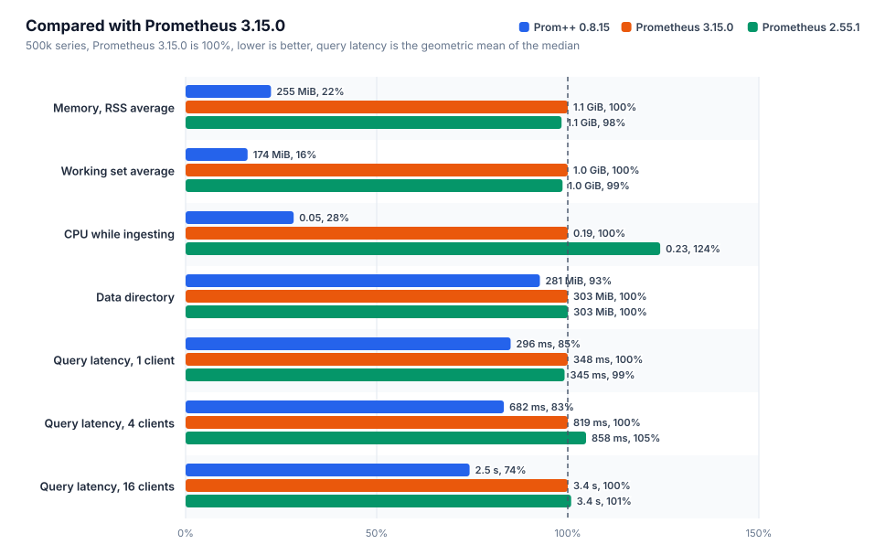
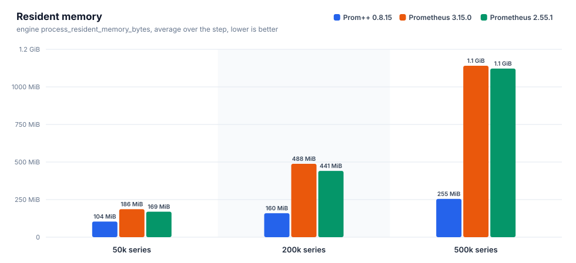
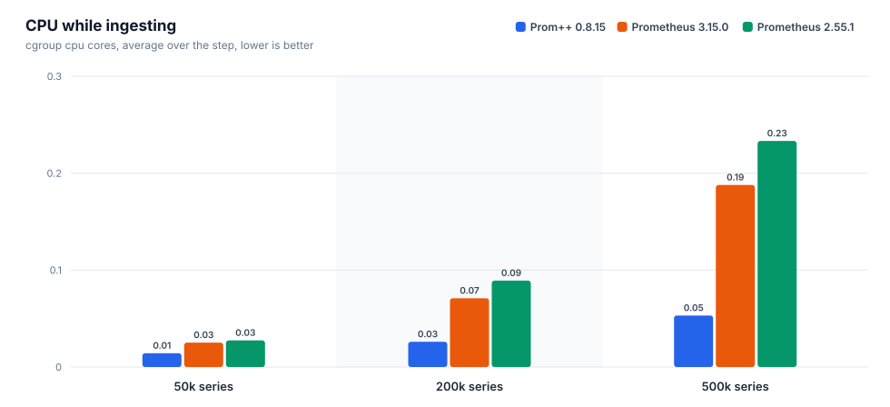
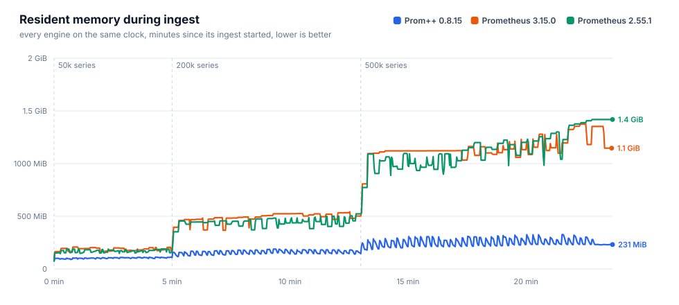
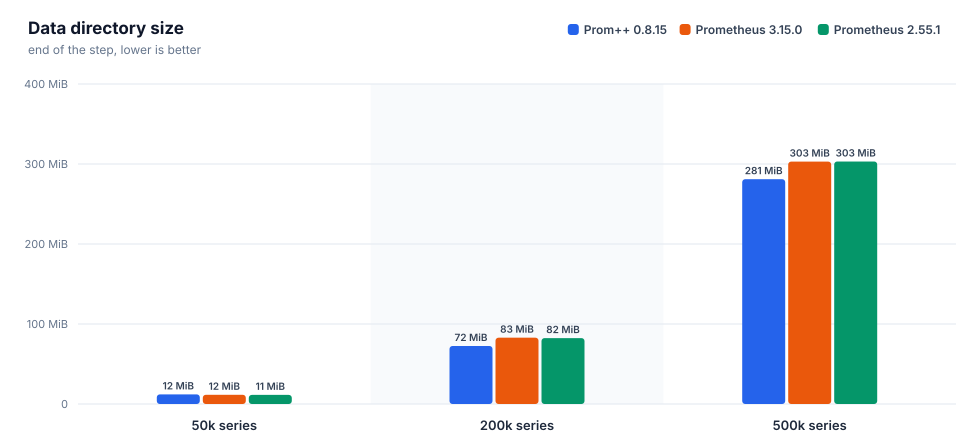
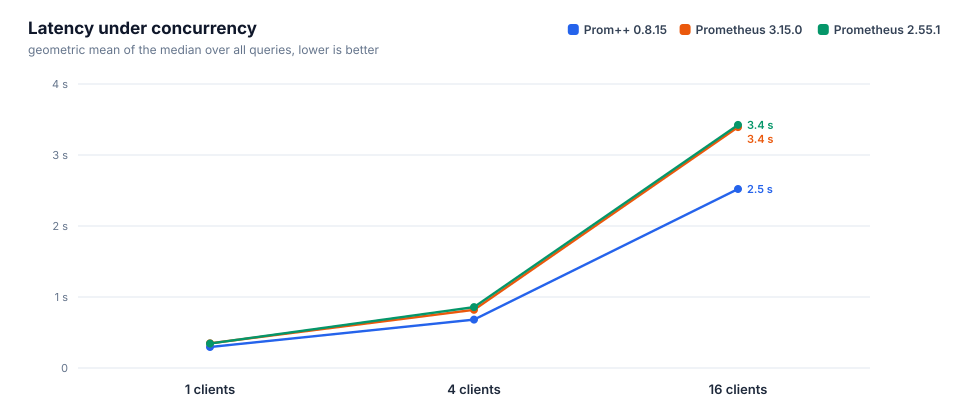
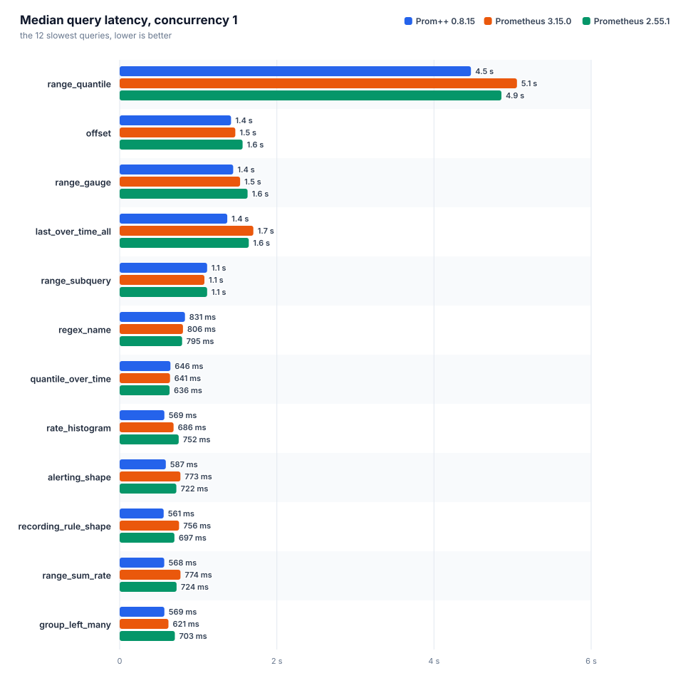
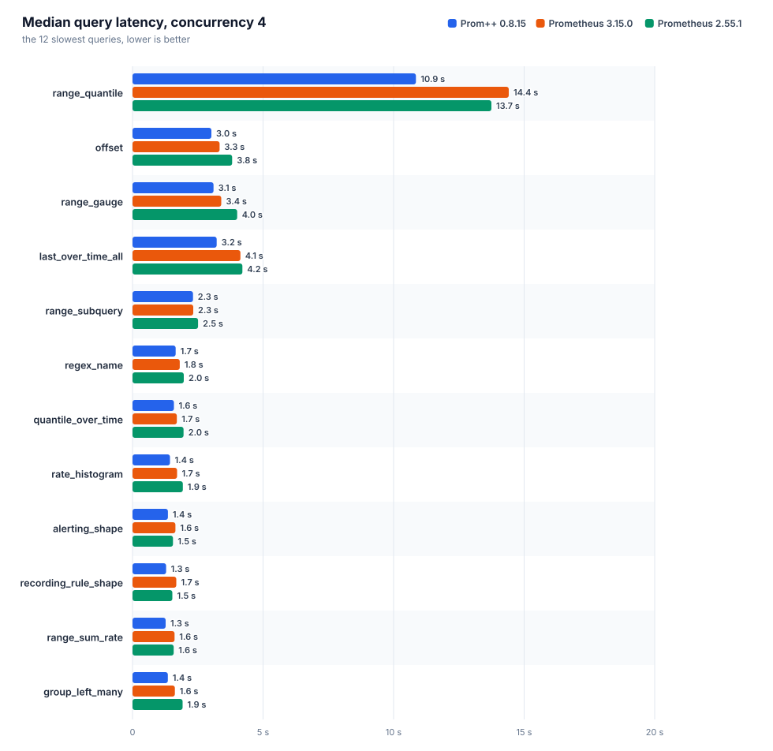
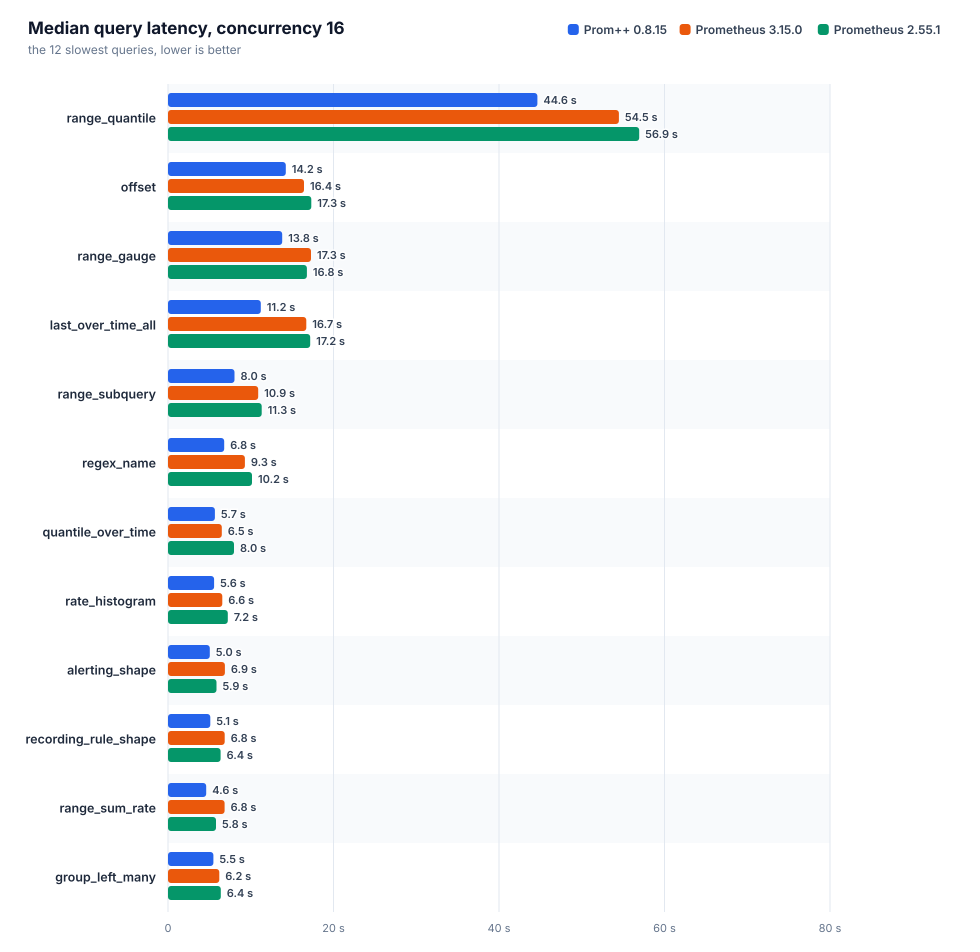

[English](REPORT.md) · **Русский**

# Prom++ против Prometheus

Создано из исходных файлов этой папки. Каждое число ниже взято из файла прогона, вручную ничего не вписано.

Номер прогона: `20261007T090616Z`

## Окружение

| параметр | значение |
|---|---|
| узел | bench-node |
| процессор | AMD EPYC 7713 64-Core Processor |
| ядер | 8 |
| память | 15.6 GiB |
| ядро | 6.8.0-142-generic |
| ОС | Ubuntu 24.04.4 LTS |
| архитектура | amd64 |
| файловая система данных | свободно 151.6 GiB из 177.1 GiB |
| container_runtime | containerd://2.3.4-k3s1.36 |
| instance_type | k3s |
| kubelet_version | v1.36.4+k3s1 |
| operating_system | linux |
| нагрузочный код | harness/b3000ef-7f49340 |

## Движки

Заданные настройки взяты из манифестов, наблюдаемые из runtimeinfo и списка флагов самого движка во время прогона.

| движок | образ | лимит процессора | лимит памяти | окружение | GOMEMLIMIT (факт) | GOMAXPROCS (факт) | сжатие WAL | аргументы | заметки |
|---|---|---|---|---|---|---|---|---|---|
| `prompp-0815` | `mirror.gcr.io/prompp/prompp:0.8.15` | 2.00 cores | 6.0 GiB | `GOMEMLIMIT=5529MiB GOMAXPROCS=2` | 5.4 GiB | 2 | true | `--config.file=... --storage.tsdb.path=... --web.enable-remote-write-receiver --web.enable-lifecycle` | C++ head and WAL |
| `prom-3150` | `quay.io/prometheus/prometheus:v3.15.0` | 2.00 cores | 6.0 GiB | `GOMEMLIMIT=5529MiB GOMAXPROCS=2` | 5.4 GiB | 2 | true | `--config.file=... --storage.tsdb.path=... --web.enable-remote-write-receiver --web.enable-lifecycle` | upstream latest |
| `prom-2551` | `quay.io/prometheus/prometheus:v2.55.1` | 2.00 cores | 6.0 GiB | `GOMEMLIMIT=5529MiB GOMAXPROCS=2` | 5.4 GiB | 2 | true | `--config.file=... --storage.tsdb.path=... --web.enable-remote-write-receiver --web.enable-lifecycle` | closed range selectors, the semantics before 3.0 |

## Запись и память головного блока











### prom-2551

Интервал 15 с, пачка 5000 серий, потоков 4, отправлено точек 27400000, из них потеряно 0.

| активных серий | точек/с | серий в головном блоке | чанков | RSS ср. | RSS p95 | RSS макс. | рабочий набор макс. | ядер ср. | ядер макс. | каталог данных | WAL | RSS/серия | диск/серия |
|---|---|---|---|---|---|---|---|---|---|---|---|---|---|
| 50000 | 3333 | 50000 | 50000 | 169.4 MiB | 188.8 MiB | 189.2 MiB | 136.9 MiB | 0.03 | 0.40 | 11.4 MiB | 11.4 MiB | 3.3 KiB | 239 B |
| 200000 | 13333 | 200000 | 200000 | 441.1 MiB | 500.6 MiB | 523.3 MiB | 450.3 MiB | 0.09 | 1.47 | 82.4 MiB | 82.4 MiB | 2.7 KiB | 431 B |
| 500000 | 33333 | 500000 | 500000 | 1.1 GiB | 1.4 GiB | 1.4 GiB | 1.3 GiB | 0.23 | 3.75 | 303.2 MiB | 303.1 MiB | 2.9 KiB | 635 B |

| активных серий | прошло / план | запрос записи p50 | p99 | 2xx | 4xx | 5xx | ошибки клиента |
|---|---|---|---|---|---|---|---|
| 50000 | 300 s / 300 s | 54 ms | 117 ms | 200 | 0 | 0 | 0 |
| 200000 | 480 s / 480 s | 30 ms | 193 ms | 1280 | 0 | 0 | 0 |
| 500000 | 600 s / 600 s | 28 ms | 262 ms | 4000 | 0 | 0 | 0 |

### prom-3150

Интервал 15 с, пачка 5000 серий, потоков 4, отправлено точек 27400000, из них потеряно 0.

| активных серий | точек/с | серий в головном блоке | чанков | RSS ср. | RSS p95 | RSS макс. | рабочий набор макс. | ядер ср. | ядер макс. | каталог данных | WAL | RSS/серия | диск/серия |
|---|---|---|---|---|---|---|---|---|---|---|---|---|---|
| 50000 | 3333 | 50000 | 50000 | 186.1 MiB | 205.2 MiB | 208.0 MiB | 150.6 MiB | 0.03 | 0.39 | 11.5 MiB | 11.5 MiB | 3.5 KiB | 241 B |
| 200000 | 13333 | 200000 | 200000 | 488.3 MiB | 533.0 MiB | 542.3 MiB | 478.8 MiB | 0.07 | 1.01 | 82.9 MiB | 82.9 MiB | 2.6 KiB | 434 B |
| 500000 | 33333 | 500000 | 500000 | 1.1 GiB | 1.3 GiB | 1.3 GiB | 1.3 GiB | 0.19 | 2.39 | 303.0 MiB | 303.0 MiB | 2.8 KiB | 635 B |

| активных серий | прошло / план | запрос записи p50 | p99 | 2xx | 4xx | 5xx | ошибки клиента |
|---|---|---|---|---|---|---|---|
| 50000 | 300 s / 300 s | 43 ms | 109 ms | 200 | 0 | 0 | 0 |
| 200000 | 480 s / 480 s | 34 ms | 126 ms | 1280 | 0 | 0 | 0 |
| 500000 | 600 s / 600 s | 32 ms | 184 ms | 4000 | 0 | 0 | 0 |

### prompp-0815

Интервал 15 с, пачка 5000 серий, потоков 4, отправлено точек 27400000, из них потеряно 0.

| активных серий | точек/с | серий в головном блоке | чанков | RSS ср. | RSS p95 | RSS макс. | рабочий набор макс. | ядер ср. | ядер макс. | каталог данных | WAL | RSS/серия | диск/серия |
|---|---|---|---|---|---|---|---|---|---|---|---|---|---|
| 50000 | 3333 | 50000 | 50000 | 103.7 MiB | 110.3 MiB | 112.2 MiB | 50.2 MiB | 0.01 | 0.16 | 12.0 MiB | 4.0 KiB | 2.2 KiB | 252 B |
| 200000 | 13333 | 200000 | 200000 | 159.6 MiB | 182.7 MiB | 189.1 MiB | 123.0 MiB | 0.03 | 0.41 | 72.5 MiB | 4.0 KiB | 762 B | 380 B |
| 500000 | 33333 | 500000 | 500000 | 254.7 MiB | 307.8 MiB | 326.7 MiB | 250.6 MiB | 0.05 | 0.89 | 280.9 MiB | 4.0 KiB | 486 B | 589 B |

| активных серий | прошло / план | запрос записи p50 | p99 | 2xx | 4xx | 5xx | ошибки клиента |
|---|---|---|---|---|---|---|---|
| 50000 | 300 s / 300 s | 12 ms | 91 ms | 200 | 0 | 0 | 0 |
| 200000 | 480 s / 480 s | 11 ms | 62 ms | 1280 | 0 | 0 | 0 |
| 500000 | 600 s / 600 s | 12 ms | 66 ms | 4000 | 0 | 0 | 0 |

### Сравнение

Для всех столбцов с памятью и процессором меньше значит лучше. RSS — это `process_resident_memory_bytes` самого движка, рабочий набор — значение cgroup, по которому kubelet выселяет поды и срабатывает OOM.

| активных серий | движок | RSS ср. | байт на серию | рабочий набор макс. | ядер ср. | каталог данных | точек/с |
|---|---|---|---|---|---|---|---|
| 50000 | `prom-2551` | 169.4 MiB | 3.3 KiB | 136.9 MiB | 0.03 | 11.4 MiB | 3333 |
| 50000 | `prom-3150` | 186.1 MiB | 3.5 KiB | 150.6 MiB | 0.03 | 11.5 MiB | 3333 |
| 50000 | `prompp-0815` | 103.7 MiB | 2.2 KiB | 50.2 MiB | 0.01 | 12.0 MiB | 3333 |
| 200000 | `prom-2551` | 441.1 MiB | 2.7 KiB | 450.3 MiB | 0.09 | 82.4 MiB | 13333 |
| 200000 | `prom-3150` | 488.3 MiB | 2.6 KiB | 478.8 MiB | 0.07 | 82.9 MiB | 13333 |
| 200000 | `prompp-0815` | 159.6 MiB | 762 B | 123.0 MiB | 0.03 | 72.5 MiB | 13333 |
| 500000 | `prom-2551` | 1.1 GiB | 2.9 KiB | 1.3 GiB | 0.23 | 303.2 MiB | 33333 |
| 500000 | `prom-3150` | 1.1 GiB | 2.8 KiB | 1.3 GiB | 0.19 | 303.0 MiB | 33333 |
| 500000 | `prompp-0815` | 254.7 MiB | 486 B | 250.6 MiB | 0.05 | 280.9 MiB | 33333 |

На самой большой ступени меньше всего памяти на серию нужно `prompp-0815`: 486 B of resident memory per active series, the lowest of the compared engines.

## Время запросов

Каждый запрос идёт отдельно: один пробный запрос без учёта, затем заданное число потоков повторяет его, пока не истечёт отведённое время и не наберётся минимальное число запросов. `n` — число учтённых запросов. При малом `n` значение p99 близко к максимуму, поэтому сравнивать лучше медиану. Геометрическое среднее учитывает все запросы поровну, поэтому несколько запросов, которые идут секундами, не заглушают остальные.



### Параллельность 1



| движок | набор | запросов | замеров | ошибок | p50 (геом.) | p99 (геом.) | p50 самого медленного | ядер ср. | рабочий набор макс. |
|---|---|---|---|---|---|---|---|---|---|
| `prom-2551` | heavy | 38 | 11129 | 0 | 345 ms | 568 ms | `range_quantile` 4.86 s | 1.22 | 1.7 GiB |
| `prom-3150` | heavy | 38 | 14432 | 0 | 348 ms | 527 ms | `range_quantile` 5.06 s | 1.15 | 1.7 GiB |
| `prompp-0815` | heavy | 38 | 10060 | 0 | 296 ms | 344 ms | `range_quantile` 4.47 s | 1.31 | 685.0 MiB |

| query | type | `prom-2551` p50 / p99 (n) | `prom-3150` p50 / p99 (n) | `prompp-0815` p50 / p99 (n) | fastest p50 |
|---|---|---|---|---|---|
| `absent` | instant | 0.4 ms / 10 ms (9653) | 0.4 ms / 8.6 ms (12909) | 0.8 ms / 3.3 ms (8116) | `prom-2551` |
| `alerting_shape` | range | 722 ms / 972 ms (14) | 773 ms / 905 ms (13) | 587 ms / 639 ms (17) | `prompp-0815` |
| `avg_over_pods` | instant | 212 ms / 377 ms (44) | 219 ms / 339 ms (44) | 135 ms / 153 ms (74) | `prompp-0815` |
| `avg_over_time` | instant | 377 ms / 604 ms (25) | 392 ms / 539 ms (25) | 393 ms / 413 ms (26) | `prom-2551` |
| `binary_scalar` | instant | 419 ms / 672 ms (23) | 425 ms / 542 ms (23) | 264 ms / 300 ms (38) | `prompp-0815` |
| `bottomk` | instant | 203 ms / 343 ms (45) | 210 ms / 354 ms (45) | 143 ms / 159 ms (70) | `prompp-0815` |
| `clamp` | instant | 337 ms / 608 ms (27) | 339 ms / 471 ms (28) | 384 ms / 418 ms (27) | `prom-2551` |
| `count_by_job` | instant | 214 ms / 379 ms (44) | 218 ms / 358 ms (44) | 140 ms / 164 ms (72) | `prompp-0815` |
| `count_values` | instant | 350 ms / 553 ms (26) | 350 ms / 508 ms (27) | 324 ms / 352 ms (31) | `prompp-0815` |
| `double_subquery` | range | 516 ms / 748 ms (19) | 537 ms / 679 ms (19) | 423 ms / 463 ms (24) | `prompp-0815` |
| `group_left_many` | instant | 703 ms / 897 ms (14) | 621 ms / 815 ms (15) | 569 ms / 602 ms (18) | `prompp-0815` |
| `increase` | instant | 359 ms / 582 ms (26) | 375 ms / 526 ms (26) | 357 ms / 382 ms (28) | `prompp-0815` |
| `irate` | instant | 267 ms / 424 ms (35) | 257 ms / 400 ms (38) | 270 ms / 295 ms (37) | `prom-3150` |
| `join` | instant | 419 ms / 548 ms (23) | 419 ms / 577 ms (23) | 263 ms / 284 ms (39) | `prompp-0815` |
| `label_replace` | instant | 317 ms / 545 ms (30) | 314 ms / 454 ms (31) | 315 ms / 337 ms (32) | `prom-3150` |
| `last_over_time_all` | instant | 1.64 s / 1.94 s (6) | 1.70 s / 1.95 s (6) | 1.37 s / 1.46 s (8) | `prompp-0815` |
| `matchers_numeric` | instant | 290 ms / 435 ms (33) | 280 ms / 424 ms (34) | 258 ms / 280 ms (39) | `prompp-0815` |
| `max_over_time` | instant | 384 ms / 556 ms (25) | 405 ms / 552 ms (25) | 385 ms / 419 ms (26) | `prom-2551` |
| `nested_aggregate` | instant | 205 ms / 349 ms (46) | 210 ms / 380 ms (45) | 141 ms / 176 ms (71) | `prompp-0815` |
| `offset` | range | 1.56 s / 2.17 s (6) | 1.47 s / 1.87 s (7) | 1.42 s / 1.68 s (7) | `prompp-0815` |
| `or_fallback` | instant | 324 ms / 564 ms (29) | 344 ms / 505 ms (28) | 358 ms / 398 ms (28) | `prom-2551` |
| `quantile_over_time` | instant | 636 ms / 922 ms (15) | 641 ms / 862 ms (15) | 646 ms / 674 ms (16) | `prom-2551` |
| `range_gauge` | range | 1.63 s / 1.93 s (6) | 1.53 s / 2.00 s (7) | 1.44 s / 1.81 s (7) | `prompp-0815` |
| `range_quantile` | range | 4.86 s / 5.21 s (5) | 5.06 s / 5.07 s (5) | 4.47 s / 4.56 s (5) | `prompp-0815` |
| `range_subquery` | range | 1.11 s / 1.35 s (9) | 1.08 s / 1.19 s (10) | 1.11 s / 1.19 s (10) | `prom-3150` |
| `range_sum_rate` | range | 724 ms / 960 ms (14) | 774 ms / 915 ms (13) | 568 ms / 596 ms (18) | `prompp-0815` |
| `rate` | instant | 308 ms / 518 ms (31) | 303 ms / 472 ms (32) | 306 ms / 329 ms (33) | `prom-3150` |
| `rate_histogram` | instant | 752 ms / 939 ms (13) | 686 ms / 775 ms (15) | 569 ms / 623 ms (18) | `prompp-0815` |
| `recording_rule_shape` | range | 697 ms / 1.01 s (14) | 756 ms / 952 ms (13) | 561 ms / 631 ms (18) | `prompp-0815` |
| `regex_name` | instant | 795 ms / 1.09 s (12) | 806 ms / 979 ms (13) | 831 ms / 916 ms (13) | `prom-2551` |
| `selector` | instant | 291 ms / 462 ms (33) | 292 ms / 438 ms (33) | 313 ms / 345 ms (32) | `prom-2551` |
| `selector_labels` | instant | 17 ms / 36 ms (544) | 16 ms / 34 ms (584) | 15 ms / 20 ms (683) | `prompp-0815` |
| `sort_desc` | instant | 217 ms / 361 ms (44) | 227 ms / 411 ms (42) | 141 ms / 180 ms (71) | `prompp-0815` |
| `stddev` | instant | 219 ms / 401 ms (43) | 222 ms / 367 ms (43) | 138 ms / 164 ms (73) | `prompp-0815` |
| `sum` | instant | 200 ms / 381 ms (47) | 207 ms / 347 ms (46) | 139 ms / 168 ms (73) | `prompp-0815` |
| `sum_by_namespace` | instant | 215 ms / 363 ms (44) | 219 ms / 364 ms (44) | 140 ms / 175 ms (72) | `prompp-0815` |
| `topk` | instant | 201 ms / 371 ms (46) | 212 ms / 351 ms (45) | 141 ms / 162 ms (71) | `prompp-0815` |
| `vector_matching` | instant | 598 ms / 867 ms (16) | 604 ms / 721 ms (17) | 534 ms / 569 ms (19) | `prompp-0815` |

### Параллельность 4



| движок | набор | запросов | замеров | ошибок | p50 (геом.) | p99 (геом.) | p50 самого медленного | ядер ср. | рабочий набор макс. |
|---|---|---|---|---|---|---|---|---|---|
| `prom-2551` | heavy | 38 | 13182 | 0 | 858 ms | 1.50 s | `range_quantile` 13.75 s | 1.92 | 3.0 GiB |
| `prom-3150` | heavy | 38 | 20736 | 0 | 819 ms | 1.32 s | `range_quantile` 14.41 s | 1.91 | 3.0 GiB |
| `prompp-0815` | heavy | 38 | 16564 | 0 | 682 ms | 920 ms | `range_quantile` 10.86 s | 1.91 | 1.3 GiB |

| query | type | `prom-2551` p50 / p99 (n) | `prom-3150` p50 / p99 (n) | `prompp-0815` p50 / p99 (n) | fastest p50 |
|---|---|---|---|---|---|
| `absent` | instant | 0.9 ms / 26 ms (10825) | 0.7 ms / 21 ms (18119) | 2.8 ms / 9.0 ms (13318) | `prom-3150` |
| `alerting_shape` | range | 1.55 s / 2.62 s (24) | 1.64 s / 2.32 s (24) | 1.36 s / 1.57 s (32) | `prompp-0815` |
| `avg_over_pods` | instant | 527 ms / 976 ms (68) | 527 ms / 908 ms (71) | 350 ms / 512 ms (115) | `prompp-0815` |
| `avg_over_time` | instant | 843 ms / 1.43 s (44) | 822 ms / 1.37 s (45) | 786 ms / 988 ms (53) | `prompp-0815` |
| `binary_scalar` | instant | 1.21 s / 1.62 s (35) | 1.10 s / 1.38 s (40) | 720 ms / 885 ms (58) | `prompp-0815` |
| `bottomk` | instant | 539 ms / 995 ms (68) | 512 ms / 880 ms (74) | 354 ms / 533 ms (110) | `prompp-0815` |
| `clamp` | instant | 1.02 s / 1.40 s (40) | 932 ms / 1.32 s (46) | 773 ms / 940 ms (53) | `prompp-0815` |
| `count_by_job` | instant | 519 ms / 950 ms (71) | 501 ms / 940 ms (77) | 357 ms / 563 ms (110) | `prompp-0815` |
| `count_values` | instant | 993 ms / 1.38 s (41) | 867 ms / 1.23 s (46) | 755 ms / 915 ms (55) | `prompp-0815` |
| `double_subquery` | range | 1.11 s / 1.98 s (32) | 1.14 s / 1.59 s (36) | 946 ms / 1.20 s (45) | `prompp-0815` |
| `group_left_many` | instant | 1.92 s / 2.28 s (23) | 1.62 s / 2.04 s (26) | 1.35 s / 1.62 s (32) | `prompp-0815` |
| `increase` | instant | 810 ms / 1.41 s (45) | 822 ms / 1.29 s (46) | 722 ms / 974 ms (56) | `prompp-0815` |
| `irate` | instant | 629 ms / 1.13 s (59) | 603 ms / 992 ms (66) | 547 ms / 763 ms (74) | `prompp-0815` |
| `join` | instant | 1.06 s / 1.58 s (38) | 1.02 s / 1.35 s (40) | 628 ms / 950 ms (63) | `prompp-0815` |
| `label_replace` | instant | 771 ms / 1.25 s (49) | 711 ms / 1.14 s (52) | 625 ms / 849 ms (64) | `prompp-0815` |
| `last_over_time_all` | instant | 4.21 s / 5.24 s (12) | 4.13 s / 4.56 s (12) | 3.22 s / 3.88 s (14) | `prompp-0815` |
| `matchers_numeric` | instant | 747 ms / 1.25 s (53) | 726 ms / 1.13 s (56) | 600 ms / 763 ms (70) | `prompp-0815` |
| `max_over_time` | instant | 865 ms / 1.68 s (44) | 909 ms / 1.30 s (43) | 829 ms / 965 ms (51) | `prompp-0815` |
| `nested_aggregate` | instant | 532 ms / 1.07 s (69) | 536 ms / 908 ms (71) | 390 ms / 546 ms (105) | `prompp-0815` |
| `offset` | range | 3.82 s / 4.97 s (12) | 3.34 s / 4.33 s (12) | 3.02 s / 3.91 s (15) | `prompp-0815` |
| `or_fallback` | instant | 746 ms / 1.49 s (47) | 876 ms / 1.25 s (47) | 699 ms / 861 ms (59) | `prompp-0815` |
| `quantile_over_time` | instant | 1.96 s / 2.14 s (22) | 1.70 s / 2.05 s (24) | 1.59 s / 1.84 s (28) | `prompp-0815` |
| `range_gauge` | range | 4.01 s / 5.03 s (12) | 3.40 s / 4.69 s (12) | 3.10 s / 3.81 s (14) | `prompp-0815` |
| `range_quantile` | range | 13.75 s / 13.80 s (5) | 14.41 s / 14.77 s (5) | 10.86 s / 11.43 s (5) | `prompp-0815` |
| `range_subquery` | range | 2.51 s / 3.32 s (16) | 2.33 s / 3.13 s (16) | 2.32 s / 2.53 s (20) | `prompp-0815` |
| `range_sum_rate` | range | 1.58 s / 2.11 s (26) | 1.61 s / 2.13 s (26) | 1.27 s / 1.45 s (32) | `prompp-0815` |
| `rate` | instant | 709 ms / 1.45 s (52) | 697 ms / 1.10 s (56) | 614 ms / 813 ms (66) | `prompp-0815` |
| `rate_histogram` | instant | 1.93 s / 2.30 s (22) | 1.71 s / 2.00 s (24) | 1.44 s / 1.68 s (29) | `prompp-0815` |
| `recording_rule_shape` | range | 1.52 s / 2.44 s (24) | 1.68 s / 2.27 s (24) | 1.29 s / 1.59 s (32) | `prompp-0815` |
| `regex_name` | instant | 1.96 s / 3.22 s (20) | 1.81 s / 2.40 s (23) | 1.65 s / 2.17 s (26) | `prompp-0815` |
| `selector` | instant | 1.18 s / 1.50 s (35) | 682 ms / 1.22 s (56) | 600 ms / 809 ms (68) | `prompp-0815` |
| `selector_labels` | instant | 35 ms / 124 ms (871) | 34 ms / 100 ms (1023) | 36 ms / 74 ms (1065) | `prom-3150` |
| `sort_desc` | instant | 478 ms / 1.05 s (73) | 477 ms / 845 ms (79) | 345 ms / 534 ms (114) | `prompp-0815` |
| `stddev` | instant | 521 ms / 1.16 s (66) | 564 ms / 944 ms (69) | 327 ms / 508 ms (120) | `prompp-0815` |
| `sum` | instant | 490 ms / 1.08 s (75) | 470 ms / 872 ms (78) | 323 ms / 496 ms (125) | `prompp-0815` |
| `sum_by_namespace` | instant | 498 ms / 971 ms (73) | 529 ms / 888 ms (73) | 340 ms / 472 ms (117) | `prompp-0815` |
| `topk` | instant | 505 ms / 1.11 s (67) | 548 ms / 958 ms (71) | 357 ms / 514 ms (115) | `prompp-0815` |
| `vector_matching` | instant | 1.74 s / 2.06 s (24) | 1.61 s / 1.95 s (28) | 1.21 s / 1.57 s (36) | `prompp-0815` |

### Параллельность 16



| движок | набор | запросов | замеров | ошибок | p50 (геом.) | p99 (геом.) | p50 самого медленного | ядер ср. | рабочий набор макс. |
|---|---|---|---|---|---|---|---|---|---|
| `prom-2551` | heavy | 38 | 20608 | 0 | 3.42 s | 4.91 s | `range_quantile` 56.95 s | 1.94 | 5.4 GiB |
| `prom-3150` | heavy | 38 | 22180 | 0 | 3.39 s | 4.58 s | `range_quantile` 54.48 s | 1.94 | 5.4 GiB |
| `prompp-0815` | heavy | 38 | 19016 | 0 | 2.52 s | 3.42 s | `range_quantile` 44.64 s | 1.93 | 4.0 GiB |

| query | type | `prom-2551` p50 / p99 (n) | `prom-3150` p50 / p99 (n) | `prompp-0815` p50 / p99 (n) | fastest p50 |
|---|---|---|---|---|---|
| `absent` | instant | 2.7 ms / 98 ms (17834) | 3.2 ms / 66 ms (19302) | 9.1 ms / 34 ms (15212) | `prom-2551` |
| `alerting_shape` | range | 5.86 s / 7.24 s (32) | 6.87 s / 7.51 s (32) | 5.05 s / 5.70 s (35) | `prompp-0815` |
| `avg_over_pods` | instant | 2.21 s / 3.05 s (81) | 2.19 s / 2.97 s (81) | 1.26 s / 1.83 s (133) | `prompp-0815` |
| `avg_over_time` | instant | 3.76 s / 5.39 s (48) | 3.60 s / 4.54 s (49) | 2.88 s / 3.53 s (65) | `prompp-0815` |
| `binary_scalar` | instant | 4.13 s / 5.69 s (46) | 4.24 s / 5.06 s (48) | 2.26 s / 3.01 s (78) | `prompp-0815` |
| `bottomk` | instant | 2.23 s / 3.42 s (80) | 2.14 s / 2.98 s (80) | 1.34 s / 2.05 s (121) | `prompp-0815` |
| `clamp` | instant | 3.73 s / 4.73 s (50) | 3.52 s / 4.17 s (53) | 2.72 s / 3.58 s (67) | `prompp-0815` |
| `count_by_job` | instant | 2.07 s / 2.79 s (84) | 2.02 s / 2.63 s (88) | 1.33 s / 2.03 s (129) | `prompp-0815` |
| `count_values` | instant | 3.95 s / 4.74 s (49) | 3.52 s / 4.13 s (52) | 2.91 s / 4.15 s (61) | `prompp-0815` |
| `double_subquery` | range | 4.46 s / 5.67 s (46) | 4.94 s / 5.68 s (37) | 3.48 s / 4.25 s (49) | `prompp-0815` |
| `group_left_many` | instant | 6.39 s / 7.40 s (32) | 6.20 s / 6.89 s (33) | 5.49 s / 6.16 s (32) | `prompp-0815` |
| `increase` | instant | 3.29 s / 3.97 s (54) | 3.53 s / 4.25 s (50) | 2.87 s / 3.65 s (64) | `prompp-0815` |
| `irate` | instant | 2.86 s / 3.43 s (64) | 2.57 s / 3.22 s (69) | 1.93 s / 2.77 s (88) | `prompp-0815` |
| `join` | instant | 4.15 s / 5.51 s (46) | 3.88 s / 4.57 s (49) | 2.29 s / 3.04 s (75) | `prompp-0815` |
| `label_replace` | instant | 3.04 s / 3.89 s (62) | 3.14 s / 4.18 s (56) | 2.28 s / 3.02 s (79) | `prompp-0815` |
| `last_over_time_all` | instant | 17.18 s / 17.71 s (16) | 16.71 s / 17.12 s (16) | 11.21 s / 11.52 s (17) | `prompp-0815` |
| `matchers_numeric` | instant | 2.91 s / 3.99 s (62) | 2.79 s / 3.58 s (64) | 2.07 s / 3.09 s (83) | `prompp-0815` |
| `max_over_time` | instant | 3.78 s / 5.09 s (48) | 3.65 s / 5.04 s (49) | 2.87 s / 3.48 s (64) | `prompp-0815` |
| `nested_aggregate` | instant | 2.18 s / 3.15 s (80) | 2.15 s / 2.86 s (82) | 1.29 s / 2.00 s (129) | `prompp-0815` |
| `offset` | range | 17.32 s / 17.67 s (16) | 16.43 s / 16.54 s (16) | 14.24 s / 14.46 s (16) | `prompp-0815` |
| `or_fallback` | instant | 3.31 s / 4.77 s (55) | 3.45 s / 4.34 s (54) | 2.55 s / 3.20 s (69) | `prompp-0815` |
| `quantile_over_time` | instant | 7.98 s / 8.37 s (32) | 6.50 s / 8.07 s (32) | 5.67 s / 6.91 s (32) | `prompp-0815` |
| `range_gauge` | range | 16.79 s / 17.13 s (16) | 17.28 s / 17.50 s (16) | 13.80 s / 13.97 s (16) | `prompp-0815` |
| `range_quantile` | range | 56.95 s / 57.11 s (16) | 54.48 s / 54.82 s (16) | 44.64 s / 45.03 s (16) | `prompp-0815` |
| `range_subquery` | range | 11.32 s / 11.43 s (16) | 10.90 s / 11.18 s (17) | 8.04 s / 9.30 s (32) | `prompp-0815` |
| `range_sum_rate` | range | 5.80 s / 7.59 s (32) | 6.84 s / 7.32 s (32) | 4.62 s / 5.51 s (46) | `prompp-0815` |
| `rate` | instant | 3.31 s / 3.83 s (55) | 2.88 s / 3.87 s (64) | 2.31 s / 3.02 s (76) | `prompp-0815` |
| `rate_histogram` | instant | 7.22 s / 9.80 s (32) | 6.56 s / 7.66 s (32) | 5.57 s / 6.46 s (32) | `prompp-0815` |
| `recording_rule_shape` | range | 6.35 s / 7.81 s (32) | 6.85 s / 8.13 s (32) | 5.12 s / 5.68 s (35) | `prompp-0815` |
| `regex_name` | instant | 10.15 s / 10.73 s (21) | 9.29 s / 10.67 s (26) | 6.80 s / 8.27 s (32) | `prompp-0815` |
| `selector` | instant | 2.95 s / 4.07 s (61) | 2.77 s / 4.11 s (61) | 2.11 s / 3.03 s (82) | `prompp-0815` |
| `selector_labels` | instant | 140 ms / 538 ms (954) | 141 ms / 415 ms (1043) | 122 ms / 328 ms (1243) | `prompp-0815` |
| `sort_desc` | instant | 2.04 s / 3.44 s (86) | 2.16 s / 2.87 s (82) | 1.22 s / 1.93 s (134) | `prompp-0815` |
| `stddev` | instant | 2.15 s / 2.91 s (85) | 2.09 s / 2.82 s (83) | 1.21 s / 1.78 s (136) | `prompp-0815` |
| `sum` | instant | 1.92 s / 2.95 s (87) | 2.08 s / 2.90 s (86) | 1.16 s / 1.78 s (142) | `prompp-0815` |
| `sum_by_namespace` | instant | 2.17 s / 3.23 s (79) | 2.03 s / 2.96 s (84) | 1.26 s / 1.85 s (130) | `prompp-0815` |
| `topk` | instant | 1.99 s / 3.02 s (87) | 2.15 s / 2.99 s (82) | 1.41 s / 2.11 s (120) | `prompp-0815` |
| `vector_matching` | instant | 6.09 s / 7.70 s (32) | 5.90 s / 7.39 s (32) | 4.47 s / 5.95 s (46) | `prompp-0815` |

## Совпадение результатов

Все движки получили одни и те же точки, а каждый запрос вычисляется в один и тот же закреплённый момент, так что отличающийся результат указывает на смысловое различие между движками или на потерянные данные. В каждой ячейке sha256 результата, приведённого к единому виду.

Строка с различием значит, что движки по-разному отвечают на одни и те же данные в один и тот же момент. Все такие запросы — `rate` или `_over_time` по диапазону. В Prometheus 3.0 диапазон стал открытым слева: точка ровно на левой границе окна больше не входит в расчёт. PromQL-движок Prom++ 0.8.15 её уже отбрасывает (`promql/engine.go`, `floats[drop].T <= mint`), а 2.55.1 нет (`< mint`). Искусственные точки лежат ровно на границе окна, поэтому 2.55.1 видит на одну точку больше.

| запрос | `prom-2551` | `prom-3150` | `prompp-0815` | совпадает |
|---|---|---|---|---|
| `absent` | ca3d163bab05 (1 series) | ca3d163bab05 (1 series) | ca3d163bab05 (1 series) | да |
| `alerting_shape` | 433e69a3597b (100 series) | e10ba8156cd2 (100 series) | e10ba8156cd2 (100 series) | нет |
| `avg_over_pods` | 4f6b6c188f7f (100 series) | 4f6b6c188f7f (100 series) | 4f6b6c188f7f (100 series) | да |
| `avg_over_time` | f1f392b0c78d (62500 series) | f1f392b0c78d (62500 series) | f1f392b0c78d (62500 series) | да |
| `binary_scalar` | ca3d163bab05 (1 series) | ca3d163bab05 (1 series) | ca3d163bab05 (1 series) | да |
| `bottomk` | 75dc8cd99593 (5 series) | 75dc8cd99593 (5 series) | 75dc8cd99593 (5 series) | да |
| `clamp` | f1f392b0c78d (62500 series) | f1f392b0c78d (62500 series) | f1f392b0c78d (62500 series) | да |
| `count_by_job` | 07c02c1348ea (1 series) | 07c02c1348ea (1 series) | 07c02c1348ea (1 series) | да |
| `count_values` | e792d90cc0a2 (62500 series) | e792d90cc0a2 (62500 series) | e792d90cc0a2 (62500 series) | да |
| `double_subquery` | 83f99d686699 (100 series) | 55416fa4082f (100 series) | 55416fa4082f (100 series) | нет |
| `group_left_many` | f1f392b0c78d (62500 series) | f1f392b0c78d (62500 series) | f1f392b0c78d (62500 series) | да |
| `increase` | 559e24dc9a48 (62500 series) | 559e24dc9a48 (62500 series) | 559e24dc9a48 (62500 series) | да |
| `irate` | 559e24dc9a48 (62500 series) | 559e24dc9a48 (62500 series) | 559e24dc9a48 (62500 series) | да |
| `join` | 4f6b6c188f7f (100 series) | 4f6b6c188f7f (100 series) | 4f6b6c188f7f (100 series) | да |
| `label_replace` | d3ae67deabaa (62500 series) | d3ae67deabaa (62500 series) | d3ae67deabaa (62500 series) | да |
| `last_over_time_all` | ca3d163bab05 (1 series) | ca3d163bab05 (1 series) | ca3d163bab05 (1 series) | да |
| `matchers_numeric` | bf8394774b5f (38487 series) | bf8394774b5f (38487 series) | bf8394774b5f (38487 series) | да |
| `max_over_time` | f1f392b0c78d (62500 series) | f1f392b0c78d (62500 series) | f1f392b0c78d (62500 series) | да |
| `nested_aggregate` | ca3d163bab05 (1 series) | ca3d163bab05 (1 series) | ca3d163bab05 (1 series) | да |
| `offset` | d5542cb672bf (62500 series) | d5542cb672bf (62500 series) | d5542cb672bf (62500 series) | да |
| `or_fallback` | a712401a23e5 (62500 series) | a712401a23e5 (62500 series) | a712401a23e5 (62500 series) | да |
| `quantile_over_time` | f1f392b0c78d (62500 series) | f1f392b0c78d (62500 series) | f1f392b0c78d (62500 series) | да |
| `range_gauge` | d5542cb672bf (62500 series) | d5542cb672bf (62500 series) | d5542cb672bf (62500 series) | да |
| `range_quantile` | 8e52194734df (62500 series) | 4f0d1e3a91e8 (62500 series) | 4f0d1e3a91e8 (62500 series) | нет |
| `range_subquery` | 82623d225556 (62500 series) | 82623d225556 (62500 series) | 82623d225556 (62500 series) | да |
| `range_sum_rate` | 8dcd40399f41 (100 series) | d73a595a3678 (100 series) | d73a595a3678 (100 series) | нет |
| `rate` | 559e24dc9a48 (62500 series) | 559e24dc9a48 (62500 series) | 559e24dc9a48 (62500 series) | да |
| `rate_histogram` | 559e24dc9a48 (62500 series) | 559e24dc9a48 (62500 series) | 559e24dc9a48 (62500 series) | да |
| `recording_rule_shape` | eb8b58afb326 (1 series) | 8476e35ab60f (1 series) | 8476e35ab60f (1 series) | нет |
| `regex_name` | fd6cd5bf0d07 (187500 series) | fd6cd5bf0d07 (187500 series) | fd6cd5bf0d07 (187500 series) | да |
| `selector` | a712401a23e5 (62500 series) | a712401a23e5 (62500 series) | a712401a23e5 (62500 series) | да |
| `selector_labels` | b5f636cb8557 (3125 series) | b5f636cb8557 (3125 series) | b5f636cb8557 (3125 series) | да |
| `sort_desc` | 4f6b6c188f7f (100 series) | 4f6b6c188f7f (100 series) | 4f6b6c188f7f (100 series) | да |
| `stddev` | 4f6b6c188f7f (100 series) | 4f6b6c188f7f (100 series) | 4f6b6c188f7f (100 series) | да |
| `sum` | ca3d163bab05 (1 series) | ca3d163bab05 (1 series) | ca3d163bab05 (1 series) | да |
| `sum_by_namespace` | 4f6b6c188f7f (100 series) | 4f6b6c188f7f (100 series) | 4f6b6c188f7f (100 series) | да |
| `topk` | 77b447784c27 (20 series) | 77b447784c27 (20 series) | 77b447784c27 (20 series) | да |
| `vector_matching` | f1f392b0c78d (62500 series) | f1f392b0c78d (62500 series) | f1f392b0c78d (62500 series) | да |

Совпадают 33 запросов, различаются 5.

## Как воспроизвести

```sh
export BENCH_NODE=<узел>
RUN_ID=20261007T090616Z scripts/node-overlay.sh
scripts/harness.sh
RUN_ID=20261007T090616Z scripts/run.sh
go run ./cmd/report -root results -run 20261007T090616Z
scripts/teardown.sh --yes
```

Правила честного сравнения и то, что может исказить результат, описаны в METHODOLOGY.ru.md.
