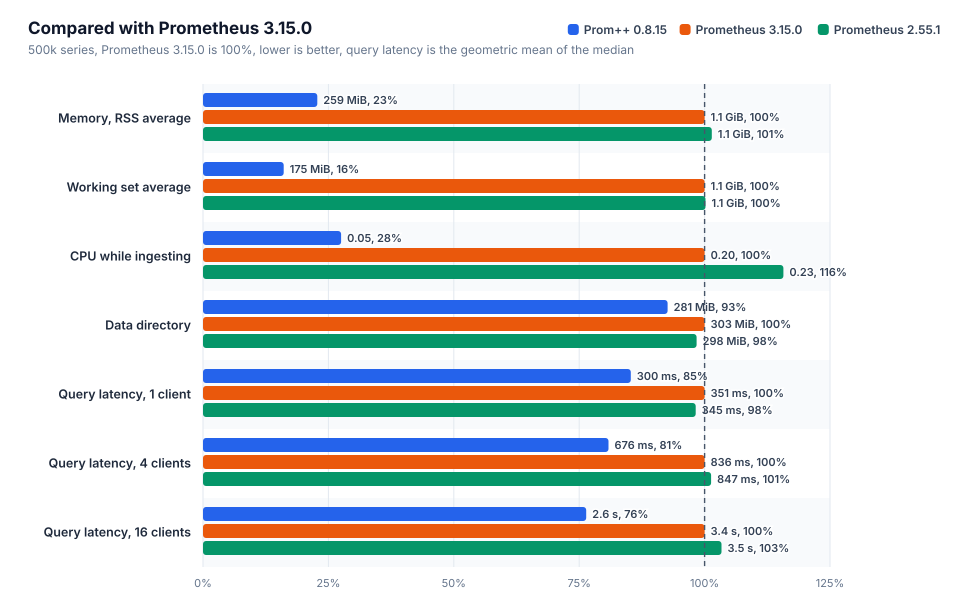
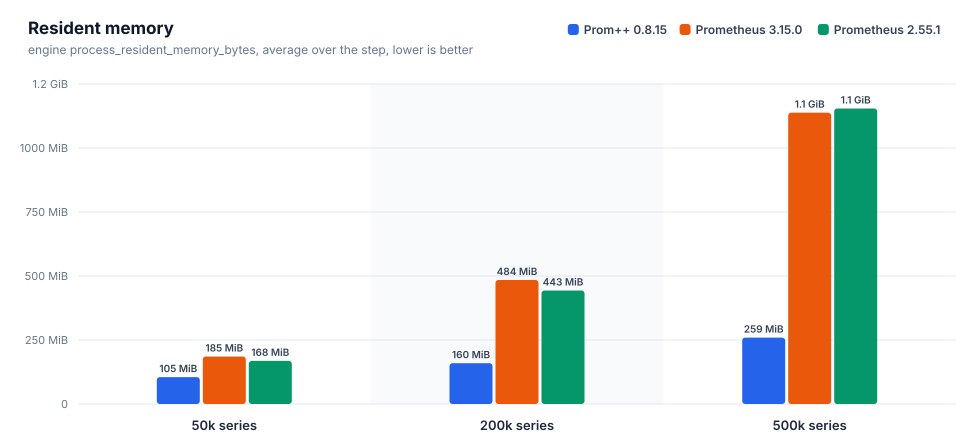
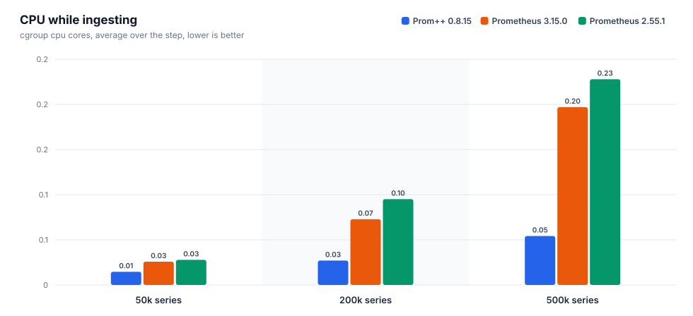
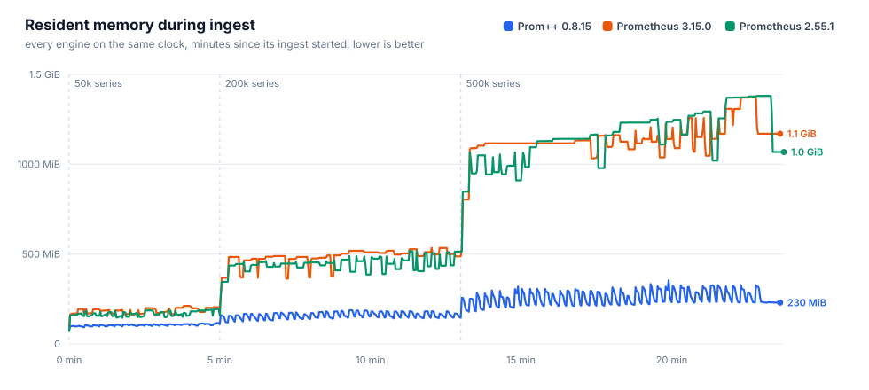
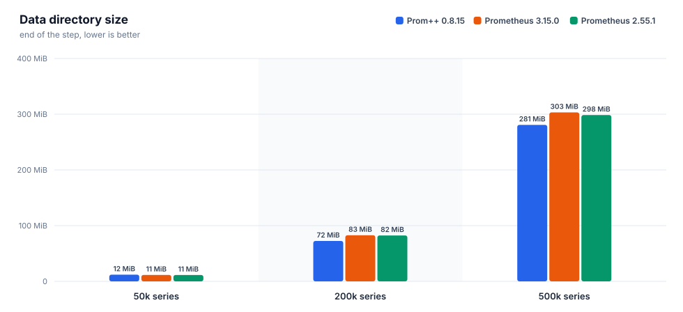
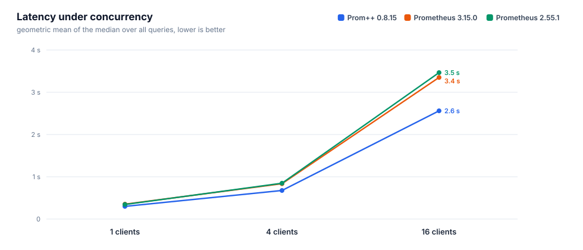
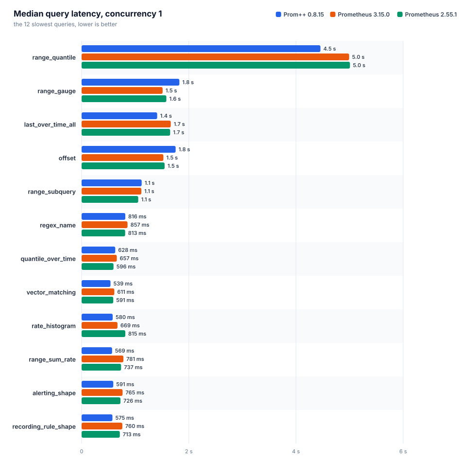
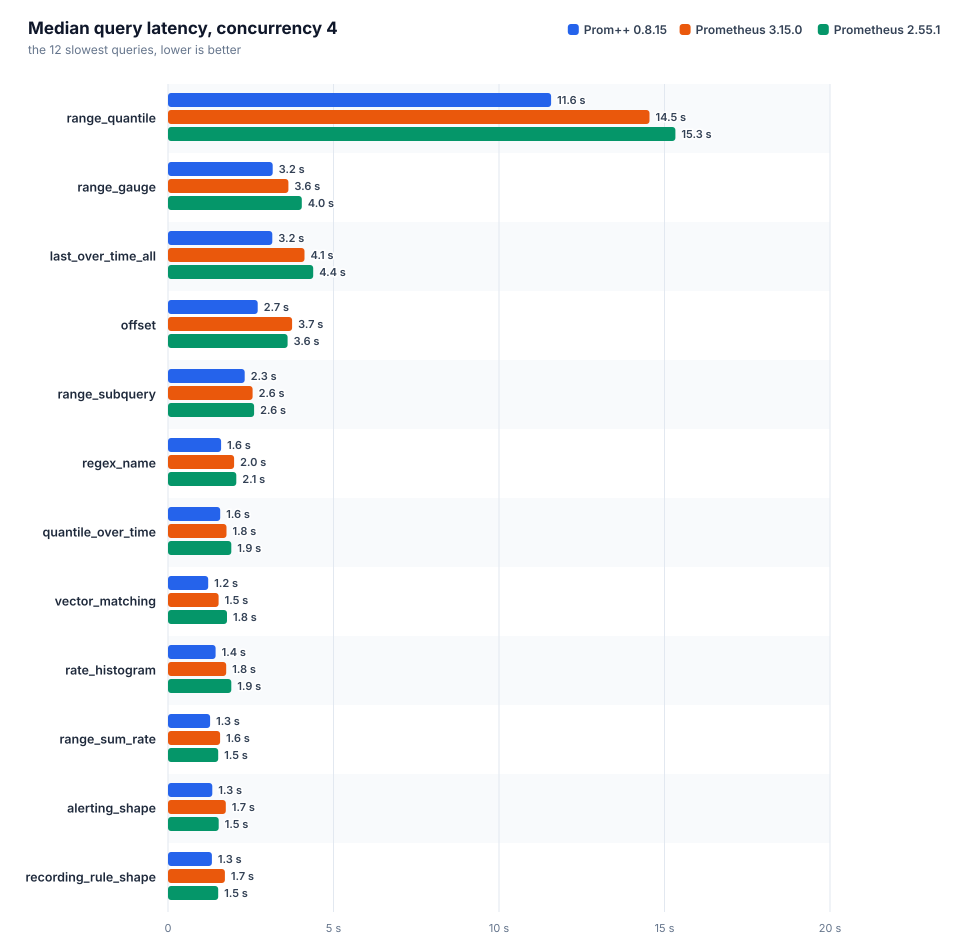
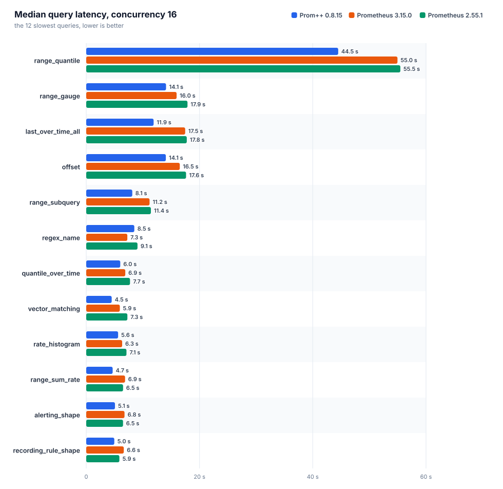

# Prom++ versus Prometheus

Generated from the raw artifacts in this directory. Every number below comes from a file in the run directory, nothing is typed in by hand.

Run id: `20261007T130616Z`

## Environment

| item | value |
|---|---|
| node | bench-node |
| cpu | AMD EPYC 7713 64-Core Processor |
| cores | 8 |
| memory | 15.6 GiB |
| kernel | 6.8.0-142-generic |
| os | Ubuntu 24.04.4 LTS |
| arch | amd64 |
| data filesystem | 151.6 GiB free of 177.1 GiB |
| container_runtime | containerd://2.3.4-k3s1.36 |
| instance_type | k3s |
| kubelet_version | v1.36.4+k3s1 |
| operating_system | linux |
| harness | harness/b3000ef-7f49340 |

## Engines

Declared settings come from the manifests, observed ones from the engine's own runtimeinfo and flags endpoints during the run.

| engine | image | cpu limit | memory limit | env | observed GOMEMLIMIT | observed GOMAXPROCS | WAL compression | args | notes |
|---|---|---|---|---|---|---|---|---|---|
| `prompp-0815` | `mirror.gcr.io/prompp/prompp:0.8.15` | 2.00 cores | 6.0 GiB | `GOMEMLIMIT=5529MiB GOMAXPROCS=2` | 5.4 GiB | 2 | true | `--config.file=... --storage.tsdb.path=... --web.enable-remote-write-receiver --web.enable-lifecycle` | C++ head and WAL |
| `prom-3150` | `quay.io/prometheus/prometheus:v3.15.0` | 2.00 cores | 6.0 GiB | `GOMEMLIMIT=5529MiB GOMAXPROCS=2` | 5.4 GiB | 2 | true | `--config.file=... --storage.tsdb.path=... --web.enable-remote-write-receiver --web.enable-lifecycle` | upstream latest |
| `prom-2551` | `quay.io/prometheus/prometheus:v2.55.1` | 2.00 cores | 6.0 GiB | `GOMEMLIMIT=5529MiB GOMAXPROCS=2` | 5.4 GiB | 2 | true | `--config.file=... --storage.tsdb.path=... --web.enable-remote-write-receiver --web.enable-lifecycle` | closed range selectors, the semantics before 3.0 |

## Ingest and head memory











### prom-2551

Interval 15s, batch 5000 series, 4 workers, 27400000 samples sent, 0 failed.

| active series | samples/s | head series | head chunks | RSS avg | RSS p95 | RSS max | working set max | cpu cores avg | cpu cores max | data dir | WAL | rss/series | disk/series |
|---|---|---|---|---|---|---|---|---|---|---|---|---|---|
| 50000 | 3333 | 50000 | 50000 | 168.5 MiB | 189.9 MiB | 194.3 MiB | 141.6 MiB | 0.03 | 0.33 | 11.4 MiB | 11.4 MiB | 3.2 KiB | 239 B |
| 200000 | 13333 | 200000 | 200000 | 443.2 MiB | 510.1 MiB | 516.9 MiB | 463.5 MiB | 0.10 | 1.05 | 82.3 MiB | 82.3 MiB | 2.6 KiB | 431 B |
| 500000 | 33333 | 500000 | 500000 | 1.1 GiB | 1.3 GiB | 1.3 GiB | 1.3 GiB | 0.23 | 3.60 | 298.5 MiB | 298.5 MiB | 2.8 KiB | 625 B |

| active series | elapsed / planned | write request p50 | p99 | 2xx | 4xx | 5xx | client errors |
|---|---|---|---|---|---|---|---|
| 50000 | 300 s / 300 s | 54 ms | 136 ms | 200 | 0 | 0 | 0 |
| 200000 | 480 s / 480 s | 30 ms | 201 ms | 1280 | 0 | 0 | 0 |
| 500000 | 600 s / 600 s | 30 ms | 258 ms | 4000 | 0 | 0 | 0 |

### prom-3150

Interval 15s, batch 5000 series, 4 workers, 27400000 samples sent, 0 failed.

| active series | samples/s | head series | head chunks | RSS avg | RSS p95 | RSS max | working set max | cpu cores avg | cpu cores max | data dir | WAL | rss/series | disk/series |
|---|---|---|---|---|---|---|---|---|---|---|---|---|---|
| 50000 | 3333 | 50000 | 50000 | 185.5 MiB | 207.5 MiB | 211.8 MiB | 153.7 MiB | 0.03 | 0.37 | 11.5 MiB | 11.5 MiB | 4.2 KiB | 240 B |
| 200000 | 13333 | 200000 | 200000 | 484.5 MiB | 527.1 MiB | 534.9 MiB | 477.9 MiB | 0.07 | 1.02 | 82.7 MiB | 82.7 MiB | 2.5 KiB | 433 B |
| 500000 | 33333 | 500000 | 500000 | 1.1 GiB | 1.3 GiB | 1.3 GiB | 1.3 GiB | 0.20 | 2.94 | 303.3 MiB | 303.3 MiB | 2.4 KiB | 636 B |

| active series | elapsed / planned | write request p50 | p99 | 2xx | 4xx | 5xx | client errors |
|---|---|---|---|---|---|---|---|
| 50000 | 300 s / 300 s | 43 ms | 111 ms | 200 | 0 | 0 | 0 |
| 200000 | 480 s / 480 s | 35 ms | 128 ms | 1280 | 0 | 0 | 0 |
| 500000 | 600 s / 600 s | 32 ms | 191 ms | 4000 | 0 | 0 | 0 |

### prompp-0815

Interval 15s, batch 5000 series, 4 workers, 27400000 samples sent, 0 failed.

| active series | samples/s | head series | head chunks | RSS avg | RSS p95 | RSS max | working set max | cpu cores avg | cpu cores max | data dir | WAL | rss/series | disk/series |
|---|---|---|---|---|---|---|---|---|---|---|---|---|---|
| 50000 | 3333 | 50000 | 50000 | 105.1 MiB | 112.2 MiB | 117.1 MiB | 51.3 MiB | 0.01 | 0.20 | 12.0 MiB | 4.0 KiB | 2.3 KiB | 252 B |
| 200000 | 13333 | 200000 | 200000 | 159.5 MiB | 182.2 MiB | 187.9 MiB | 126.0 MiB | 0.03 | 0.41 | 72.5 MiB | 4.0 KiB | 766 B | 380 B |
| 500000 | 33333 | 500000 | 500000 | 259.2 MiB | 319.4 MiB | 354.3 MiB | 239.3 MiB | 0.05 | 0.88 | 280.9 MiB | 4.0 KiB | 490 B | 589 B |

| active series | elapsed / planned | write request p50 | p99 | 2xx | 4xx | 5xx | client errors |
|---|---|---|---|---|---|---|---|
| 50000 | 300 s / 300 s | 12 ms | 83 ms | 200 | 0 | 0 | 0 |
| 200000 | 480 s / 480 s | 11 ms | 65 ms | 1280 | 0 | 0 | 0 |
| 500000 | 600 s / 600 s | 12 ms | 61 ms | 4000 | 0 | 0 | 0 |

### Comparison

Lower is better for every memory and cpu column. RSS is the engine's own process_resident_memory_bytes, working set is the cgroup figure the kubelet evicts and OOM kills on.

| active series | engine | RSS avg | bytes/series | working set max | cpu cores avg | data dir | samples/s |
|---|---|---|---|---|---|---|---|
| 50000 | `prom-2551` | 168.5 MiB | 3.2 KiB | 141.6 MiB | 0.03 | 11.4 MiB | 3333 |
| 50000 | `prom-3150` | 185.5 MiB | 4.2 KiB | 153.7 MiB | 0.03 | 11.5 MiB | 3333 |
| 50000 | `prompp-0815` | 105.1 MiB | 2.3 KiB | 51.3 MiB | 0.01 | 12.0 MiB | 3333 |
| 200000 | `prom-2551` | 443.2 MiB | 2.6 KiB | 463.5 MiB | 0.10 | 82.3 MiB | 13333 |
| 200000 | `prom-3150` | 484.5 MiB | 2.5 KiB | 477.9 MiB | 0.07 | 82.7 MiB | 13333 |
| 200000 | `prompp-0815` | 159.5 MiB | 766 B | 126.0 MiB | 0.03 | 72.5 MiB | 13333 |
| 500000 | `prom-2551` | 1.1 GiB | 2.8 KiB | 1.3 GiB | 0.23 | 298.5 MiB | 33333 |
| 500000 | `prom-3150` | 1.1 GiB | 2.4 KiB | 1.3 GiB | 0.20 | 303.3 MiB | 33333 |
| 500000 | `prompp-0815` | 259.2 MiB | 490 B | 239.3 MiB | 0.05 | 280.9 MiB | 33333 |

At the largest step, `prompp-0815` needs the least resident memory per series: 490 B of resident memory per active series, the lowest of the compared engines.

## Query latency

Each query runs on its own: one unmeasured warmup request, then the given number of workers repeat it until the time budget is spent and a minimum number of requests finished. `n` is the number of measured requests. With a small `n` the p99 is close to the maximum, so the median is the figure to compare. The geometric mean weighs every query equally, so a few multi second range queries do not drown the rest.



### Concurrency 1



| engine | suite | queries | requests | errors | geomean p50 | geomean p99 | slowest query p50 | cpu cores avg | working set max |
|---|---|---|---|---|---|---|---|---|---|
| `prom-2551` | heavy | 38 | 10265 | 0 | 345 ms | 581 ms | `range_quantile` 5.01 s | 1.19 | 1.6 GiB |
| `prom-3150` | heavy | 38 | 13488 | 0 | 351 ms | 530 ms | `range_quantile` 4.99 s | 1.15 | 1.7 GiB |
| `prompp-0815` | heavy | 38 | 10574 | 0 | 300 ms | 350 ms | `range_quantile` 4.46 s | 1.34 | 516.4 MiB |

| query | type | `prom-2551` p50 / p99 (n) | `prom-3150` p50 / p99 (n) | `prompp-0815` p50 / p99 (n) | fastest p50 |
|---|---|---|---|---|---|
| `absent` | instant | 0.4 ms / 12 ms (8813) | 0.4 ms / 9.6 ms (12023) | 0.7 ms / 3.3 ms (8660) | `prom-3150` |
| `alerting_shape` | range | 726 ms / 1.02 s (14) | 765 ms / 957 ms (13) | 591 ms / 624 ms (17) | `prompp-0815` |
| `avg_over_pods` | instant | 215 ms / 376 ms (44) | 224 ms / 355 ms (44) | 136 ms / 160 ms (73) | `prompp-0815` |
| `avg_over_time` | instant | 375 ms / 667 ms (25) | 388 ms / 515 ms (25) | 382 ms / 415 ms (27) | `prom-2551` |
| `binary_scalar` | instant | 415 ms / 611 ms (23) | 424 ms / 573 ms (23) | 258 ms / 297 ms (38) | `prompp-0815` |
| `bottomk` | instant | 203 ms / 364 ms (45) | 214 ms / 333 ms (45) | 143 ms / 171 ms (70) | `prompp-0815` |
| `clamp` | instant | 352 ms / 560 ms (26) | 333 ms / 490 ms (28) | 375 ms / 409 ms (27) | `prom-3150` |
| `count_by_job` | instant | 215 ms / 381 ms (44) | 220 ms / 342 ms (44) | 146 ms / 158 ms (70) | `prompp-0815` |
| `count_values` | instant | 345 ms / 546 ms (26) | 350 ms / 490 ms (27) | 321 ms / 357 ms (32) | `prompp-0815` |
| `double_subquery` | range | 496 ms / 740 ms (20) | 523 ms / 668 ms (19) | 427 ms / 451 ms (24) | `prompp-0815` |
| `group_left_many` | instant | 665 ms / 888 ms (15) | 648 ms / 777 ms (16) | 561 ms / 607 ms (18) | `prompp-0815` |
| `increase` | instant | 360 ms / 582 ms (27) | 380 ms / 529 ms (25) | 360 ms / 420 ms (28) | `prompp-0815` |
| `irate` | instant | 265 ms / 463 ms (36) | 260 ms / 426 ms (37) | 271 ms / 294 ms (37) | `prom-3150` |
| `join` | instant | 420 ms / 632 ms (23) | 414 ms / 554 ms (23) | 267 ms / 302 ms (38) | `prompp-0815` |
| `label_replace` | instant | 318 ms / 549 ms (30) | 315 ms / 462 ms (31) | 316 ms / 357 ms (32) | `prom-3150` |
| `last_over_time_all` | instant | 1.65 s / 2.03 s (6) | 1.66 s / 1.91 s (6) | 1.41 s / 1.46 s (8) | `prompp-0815` |
| `matchers_numeric` | instant | 273 ms / 487 ms (33) | 278 ms / 462 ms (34) | 261 ms / 289 ms (39) | `prompp-0815` |
| `max_over_time` | instant | 382 ms / 617 ms (25) | 408 ms / 511 ms (24) | 386 ms / 422 ms (26) | `prom-2551` |
| `nested_aggregate` | instant | 205 ms / 352 ms (44) | 209 ms / 333 ms (46) | 142 ms / 166 ms (70) | `prompp-0815` |
| `offset` | range | 1.55 s / 2.24 s (6) | 1.53 s / 1.87 s (7) | 1.75 s / 1.97 s (6) | `prom-3150` |
| `or_fallback` | instant | 327 ms / 619 ms (28) | 337 ms / 511 ms (28) | 369 ms / 399 ms (28) | `prom-2551` |
| `quantile_over_time` | instant | 596 ms / 952 ms (15) | 657 ms / 848 ms (16) | 628 ms / 655 ms (16) | `prom-2551` |
| `range_gauge` | range | 1.58 s / 2.09 s (6) | 1.51 s / 2.03 s (7) | 1.82 s / 1.91 s (6) | `prom-3150` |
| `range_quantile` | range | 5.01 s / 5.37 s (5) | 4.99 s / 5.08 s (5) | 4.46 s / 4.58 s (5) | `prompp-0815` |
| `range_subquery` | range | 1.06 s / 1.14 s (10) | 1.11 s / 1.29 s (9) | 1.12 s / 1.21 s (10) | `prom-2551` |
| `range_sum_rate` | range | 737 ms / 1.08 s (13) | 781 ms / 956 ms (13) | 569 ms / 733 ms (18) | `prompp-0815` |
| `rate` | instant | 304 ms / 538 ms (31) | 302 ms / 414 ms (32) | 298 ms / 320 ms (34) | `prompp-0815` |
| `rate_histogram` | instant | 815 ms / 948 ms (13) | 669 ms / 819 ms (15) | 580 ms / 616 ms (18) | `prompp-0815` |
| `recording_rule_shape` | range | 713 ms / 904 ms (14) | 760 ms / 950 ms (13) | 575 ms / 613 ms (18) | `prompp-0815` |
| `regex_name` | instant | 813 ms / 1.06 s (12) | 857 ms / 912 ms (13) | 816 ms / 892 ms (13) | `prom-2551` |
| `selector` | instant | 293 ms / 491 ms (31) | 296 ms / 483 ms (32) | 317 ms / 344 ms (32) | `prom-2551` |
| `selector_labels` | instant | 18 ms / 36 ms (524) | 18 ms / 38 ms (531) | 15 ms / 20 ms (661) | `prompp-0815` |
| `sort_desc` | instant | 211 ms / 369 ms (44) | 227 ms / 384 ms (42) | 141 ms / 177 ms (71) | `prompp-0815` |
| `stddev` | instant | 216 ms / 384 ms (44) | 225 ms / 382 ms (43) | 137 ms / 184 ms (72) | `prompp-0815` |
| `sum` | instant | 203 ms / 385 ms (46) | 213 ms / 361 ms (46) | 135 ms / 169 ms (74) | `prompp-0815` |
| `sum_by_namespace` | instant | 214 ms / 339 ms (44) | 223 ms / 364 ms (43) | 146 ms / 182 ms (68) | `prompp-0815` |
| `topk` | instant | 207 ms / 402 ms (44) | 214 ms / 356 ms (44) | 141 ms / 174 ms (71) | `prompp-0815` |
| `vector_matching` | instant | 591 ms / 865 ms (16) | 611 ms / 747 ms (16) | 539 ms / 573 ms (19) | `prompp-0815` |

### Concurrency 4



| engine | suite | queries | requests | errors | geomean p50 | geomean p99 | slowest query p50 | cpu cores avg | working set max |
|---|---|---|---|---|---|---|---|---|---|
| `prom-2551` | heavy | 38 | 14678 | 2 | 847 ms | 1.51 s | `range_quantile` 15.33 s | 1.95 | 3.0 GiB |
| `prom-3150` | heavy | 38 | 19077 | 0 | 836 ms | 1.33 s | `range_quantile` 14.55 s | 1.96 | 2.8 GiB |
| `prompp-0815` | heavy | 38 | 18813 | 0 | 676 ms | 912 ms | `range_quantile` 11.58 s | 1.90 | 1.2 GiB |

| query | type | `prom-2551` p50 / p99 (n) | `prom-3150` p50 / p99 (n) | `prompp-0815` p50 / p99 (n) | fastest p50 |
|---|---|---|---|---|---|
| `absent` | instant | 0.7 ms / 34 ms (12241) | 0.8 ms / 21 ms (16490) | 2.3 ms / 8.1 ms (15527) | `prom-2551` |
| `alerting_shape` | range | 1.53 s / 2.41 s (24) | 1.74 s / 2.36 s (24) | 1.34 s / 1.59 s (32) | `prompp-0815` |
| `avg_over_pods` | instant | 520 ms / 1.10 s (68) | 539 ms / 1.01 s (71) | 319 ms / 462 ms (125) | `prompp-0815` |
| `avg_over_time` | instant | 821 ms / 1.49 s (44) | 955 ms / 1.41 s (42) | 776 ms / 1.02 s (52) | `prompp-0815` |
| `binary_scalar` | instant | 1.18 s / 1.71 s (35) | 1.10 s / 1.41 s (40) | 706 ms / 849 ms (58) | `prompp-0815` |
| `bottomk` | instant | 495 ms / 1.13 s (70) | 508 ms / 839 ms (74) | 357 ms / 504 ms (113) | `prompp-0815` |
| `clamp` | instant | 1.05 s / 1.48 s (40) | 914 ms / 1.25 s (46) | 761 ms / 958 ms (53) | `prompp-0815` |
| `count_by_job` | instant | 506 ms / 976 ms (73) | 506 ms / 851 ms (74) | 337 ms / 492 ms (120) | `prompp-0815` |
| `count_values` | instant | 1.09 s / 1.55 s (41) | 880 ms / 1.28 s (45) | 790 ms / 976 ms (52) | `prompp-0815` |
| `double_subquery` | range | 1.09 s / 1.84 s (32) | 1.15 s / 1.56 s (36) | 996 ms / 1.21 s (41) | `prompp-0815` |
| `group_left_many` | instant | 1.82 s / 2.23 s (24) | 1.64 s / 2.00 s (25) | 1.41 s / 1.72 s (31) | `prompp-0815` |
| `increase` | instant | 834 ms / 1.41 s (47) | 835 ms / 1.44 s (44) | 761 ms / 952 ms (53) | `prompp-0815` |
| `irate` | instant | 635 ms / 1.14 s (59) | 656 ms / 1.00 s (60) | 560 ms / 717 ms (74) | `prompp-0815` |
| `join` | instant | 1.08 s / 1.51 s (37) | 1.04 s / 1.40 s (40) | 657 ms / 840 ms (64) | `prompp-0815` |
| `label_replace` | instant | 848 ms / 1.26 s (49) | 787 ms / 1.04 s (51) | 613 ms / 882 ms (66) | `prompp-0815` |
| `last_over_time_all` | instant | 4.39 s / 5.49 s (12) | 4.12 s / 4.37 s (12) | 3.15 s / 3.54 s (16) | `prompp-0815` |
| `matchers_numeric` | instant | 786 ms / 1.22 s (51) | 697 ms / 1.11 s (54) | 577 ms / 769 ms (71) | `prompp-0815` |
| `max_over_time` | instant | 968 ms / 1.44 s (41) | 915 ms / 1.44 s (42) | 800 ms / 998 ms (52) | `prompp-0815` |
| `nested_aggregate` | instant | 475 ms / 997 ms (75) | 488 ms / 845 ms (77) | 365 ms / 539 ms (109) | `prompp-0815` |
| `offset` | range | 3.61 s / 4.98 s (12) | 3.75 s / 4.51 s (12) | 2.71 s / 3.86 s (16) | `prompp-0815` |
| `or_fallback` | instant | 881 ms / 1.49 s (45) | 854 ms / 1.16 s (47) | 700 ms / 872 ms (60) | `prompp-0815` |
| `quantile_over_time` | instant | 1.91 s / 2.21 s (24) | 1.77 s / 2.11 s (24) | 1.58 s / 1.80 s (28) | `prompp-0815` |
| `range_gauge` | range | 4.04 s / 4.97 s (12) | 3.64 s / 4.72 s (12) | 3.16 s / 4.05 s (12) | `prompp-0815` |
| `range_quantile` | range | 15.33 s / 15.51 s (5) | 14.55 s / 14.63 s (5) | 11.58 s / 11.85 s (5) | `prompp-0815` |
| `range_subquery` | range | 2.60 s / 3.33 s (16) | 2.56 s / 3.29 s (16) | 2.32 s / 2.57 s (20) | `prompp-0815` |
| `range_sum_rate` | range | 1.52 s / 2.45 s (27) | 1.58 s / 2.30 s (24) | 1.27 s / 1.39 s (34) | `prompp-0815` |
| `rate` | instant | 720 ms / 1.36 s (52) | 692 ms / 1.14 s (54) | 625 ms / 803 ms (64) | `prompp-0815` |
| `rate_histogram` | instant | 1.91 s / 2.23 s (22) | 1.76 s / 1.98 s (24) | 1.44 s / 1.60 s (29) | `prompp-0815` |
| `recording_rule_shape` | range | 1.52 s / 2.32 s (25) | 1.72 s / 2.29 s (24) | 1.33 s / 1.66 s (32) | `prompp-0815` |
| `regex_name` | instant | 2.06 s / 2.96 s (20) | 2.00 s / 2.53 s (21) | 1.61 s / 2.17 s (25) | `prompp-0815` |
| `selector` | instant | 695 ms / 1.25 s (53) | 674 ms / 1.33 s (56) | 577 ms / 885 ms (69) | `prompp-0815` |
| `selector_labels` | instant | 34 ms / 132 ms (912) | 35 ms / 99 ms (1018) | 35 ms / 77 ms (1092) | `prom-2551` |
| `sort_desc` | instant | 488 ms / 992 ms (73) | 508 ms / 893 ms (75) | 347 ms / 542 ms (112) | `prompp-0815` |
| `stddev` | instant | 510 ms / 1.11 s (68) | 519 ms / 907 ms (70) | 348 ms / 491 ms (118) | `prompp-0815` |
| `sum` | instant | 464 ms / 962 ms (78) | 478 ms / 838 ms (78) | 316 ms / 460 ms (124) | `prompp-0815` |
| `sum_by_namespace` | instant | 484 ms / 1.02 s (74) | 521 ms / 924 ms (72) | 331 ms / 520 ms (117) | `prompp-0815` |
| `topk` | instant | 511 ms / 1.10 s (71) | 546 ms / 895 ms (70) | 362 ms / 530 ms (111) | `prompp-0815` |
| `vector_matching` | instant | 1.78 s / 2.18 s (24) | 1.53 s / 1.89 s (28) | 1.21 s / 1.45 s (36) | `prompp-0815` |

### Concurrency 16



| engine | suite | queries | requests | errors | geomean p50 | geomean p99 | slowest query p50 | cpu cores avg | working set max |
|---|---|---|---|---|---|---|---|---|---|
| `prom-2551` | heavy | 38 | 19566 | 14 | 3.46 s | 5.00 s | `range_quantile` 55.47 s | 1.92 | 5.4 GiB |
| `prom-3150` | heavy | 38 | 22726 | 0 | 3.35 s | 4.62 s | `range_quantile` 54.96 s | 1.92 | 5.4 GiB |
| `prompp-0815` | heavy | 38 | 16904 | 0 | 2.56 s | 3.50 s | `range_quantile` 44.49 s | 1.92 | 4.4 GiB |

| query | type | `prom-2551` p50 / p99 (n) | `prom-3150` p50 / p99 (n) | `prompp-0815` p50 / p99 (n) | fastest p50 |
|---|---|---|---|---|---|
| `absent` | instant | 2.6 ms / 116 ms (16822) | 3.2 ms / 61 ms (19805) | 11 ms / 37 ms (13159) | `prom-2551` |
| `alerting_shape` | range | 6.50 s / 6.97 s (32) | 6.76 s / 7.23 s (32) | 5.07 s / 6.03 s (35) | `prompp-0815` |
| `avg_over_pods` | instant | 2.26 s / 3.04 s (79) | 2.09 s / 2.85 s (84) | 1.27 s / 2.01 s (134) | `prompp-0815` |
| `avg_over_time` | instant | 3.63 s / 4.70 s (48) | 3.50 s / 4.75 s (50) | 2.88 s / 3.57 s (64) | `prompp-0815` |
| `binary_scalar` | instant | 3.69 s / 8.67 s (45) | 4.03 s / 4.74 s (48) | 2.40 s / 3.00 s (75) | `prompp-0815` |
| `bottomk` | instant | 2.22 s / 3.61 s (80) | 2.18 s / 3.02 s (78) | 1.33 s / 2.01 s (125) | `prompp-0815` |
| `clamp` | instant | 4.00 s / 5.07 s (49) | 3.61 s / 5.07 s (50) | 2.66 s / 3.59 s (64) | `prompp-0815` |
| `count_by_job` | instant | 2.15 s / 2.80 s (79) | 2.06 s / 2.82 s (84) | 1.27 s / 2.10 s (131) | `prompp-0815` |
| `count_values` | instant | 3.83 s / 5.04 s (48) | 3.69 s / 4.39 s (48) | 2.93 s / 3.97 s (64) | `prompp-0815` |
| `double_subquery` | range | 5.35 s / 5.76 s (35) | 4.56 s / 5.43 s (47) | 3.58 s / 4.11 s (48) | `prompp-0815` |
| `group_left_many` | instant | 6.27 s / 7.66 s (32) | 5.70 s / 7.31 s (32) | 5.17 s / 6.74 s (32) | `prompp-0815` |
| `increase` | instant | 3.51 s / 4.12 s (52) | 3.60 s / 4.80 s (49) | 2.76 s / 3.58 s (64) | `prompp-0815` |
| `irate` | instant | 2.86 s / 3.60 s (65) | 2.57 s / 3.38 s (68) | 2.07 s / 2.82 s (87) | `prompp-0815` |
| `join` | instant | 4.14 s / 4.67 s (54) | 3.70 s / 5.52 s (51) | 2.37 s / 3.11 s (73) | `prompp-0815` |
| `label_replace` | instant | 3.09 s / 4.13 s (60) | 2.96 s / 3.80 s (62) | 2.24 s / 2.97 s (78) | `prompp-0815` |
| `last_over_time_all` | instant | 17.75 s / 18.12 s (16) | 17.47 s / 18.12 s (16) | 11.90 s / 12.19 s (16) | `prompp-0815` |
| `matchers_numeric` | instant | 2.92 s / 4.08 s (61) | 2.86 s / 3.76 s (64) | 2.15 s / 2.98 s (80) | `prompp-0815` |
| `max_over_time` | instant | 3.99 s / 4.55 s (48) | 3.76 s / 4.57 s (48) | 2.85 s / 3.72 s (63) | `prompp-0815` |
| `nested_aggregate` | instant | 2.11 s / 2.93 s (83) | 2.17 s / 3.03 s (81) | 1.28 s / 1.89 s (126) | `prompp-0815` |
| `offset` | range | 17.63 s / 17.92 s (16) | 16.53 s / 16.76 s (16) | 14.06 s / 14.22 s (16) | `prompp-0815` |
| `or_fallback` | instant | 3.25 s / 4.27 s (54) | 3.45 s / 4.16 s (52) | 2.50 s / 3.06 s (72) | `prompp-0815` |
| `quantile_over_time` | instant | 7.73 s / 9.11 s (32) | 6.90 s / 8.05 s (32) | 6.01 s / 7.06 s (32) | `prompp-0815` |
| `range_gauge` | range | 17.88 s / 18.29 s (16) | 15.96 s / 16.54 s (16) | 14.10 s / 14.33 s (16) | `prompp-0815` |
| `range_quantile` | range | 55.47 s / 55.92 s (16) | 54.96 s / 55.29 s (16) | 44.49 s / 44.90 s (16) | `prompp-0815` |
| `range_subquery` | range | 11.42 s / 11.64 s (17) | 11.18 s / 11.53 s (18) | 8.13 s / 9.53 s (32) | `prompp-0815` |
| `range_sum_rate` | range | 6.51 s / 7.33 s (32) | 6.87 s / 7.80 s (32) | 4.67 s / 5.54 s (46) | `prompp-0815` |
| `rate` | instant | 2.96 s / 4.04 s (62) | 2.95 s / 3.56 s (64) | 2.26 s / 3.43 s (76) | `prompp-0815` |
| `rate_histogram` | instant | 7.11 s / 9.01 s (32) | 6.34 s / 8.00 s (32) | 5.63 s / 7.06 s (32) | `prompp-0815` |
| `recording_rule_shape` | range | 5.85 s / 7.23 s (32) | 6.63 s / 7.79 s (32) | 4.96 s / 5.67 s (38) | `prompp-0815` |
| `regex_name` | instant | 9.06 s / 10.60 s (24) | 7.26 s / 10.60 s (30) | 8.50 s / 12.62 s (27) | `prom-3150` |
| `selector` | instant | 3.01 s / 3.73 s (61) | 2.77 s / 4.20 s (63) | 2.11 s / 3.11 s (82) | `prompp-0815` |
| `selector_labels` | instant | 140 ms / 546 ms (925) | 136 ms / 431 ms (1079) | 129 ms / 308 ms (1191) | `prompp-0815` |
| `sort_desc` | instant | 2.05 s / 2.82 s (83) | 2.20 s / 2.90 s (83) | 1.23 s / 1.82 s (134) | `prompp-0815` |
| `stddev` | instant | 2.10 s / 2.77 s (85) | 2.13 s / 2.76 s (82) | 1.27 s / 1.75 s (134) | `prompp-0815` |
| `sum` | instant | 1.86 s / 2.86 s (89) | 2.10 s / 2.80 s (82) | 1.16 s / 1.83 s (142) | `prompp-0815` |
| `sum_by_namespace` | instant | 2.16 s / 3.65 s (81) | 2.01 s / 2.85 s (85) | 1.21 s / 1.92 s (135) | `prompp-0815` |
| `topk` | instant | 2.34 s / 3.30 s (77) | 2.10 s / 2.97 s (82) | 1.35 s / 2.13 s (122) | `prompp-0815` |
| `vector_matching` | instant | 7.27 s / 12.19 s (30) | 5.94 s / 7.06 s (33) | 4.49 s / 5.93 s (43) | `prompp-0815` |

## Result equality

Every engine received the same samples and every query is evaluated at the same pinned timestamp, so a result that differs points at a semantic difference between engines or at lost data. Each cell is the sha256 of the canonicalised result.

A differing row means the engines disagree on the same data at the same timestamp. All of them are rate or `_over_time` range queries. Prometheus 3.0 made range selectors left-open, a sample exactly on the window start is no longer included, and the Prom++ 0.8.15 PromQL engine already drops it (`promql/engine.go`, `floats[drop].T <= mint`), unlike 2.55.1 (`< mint`). The synthetic samples sit on the window edge, so 2.55.1 sees one extra sample.

| query | `prom-2551` | `prom-3150` | `prompp-0815` | identical |
|---|---|---|---|---|
| `absent` | ca3d163bab05 (1 series) | ca3d163bab05 (1 series) | ca3d163bab05 (1 series) | yes |
| `alerting_shape` | 433e69a3597b (100 series) | e10ba8156cd2 (100 series) | e10ba8156cd2 (100 series) | no |
| `avg_over_pods` | 4f6b6c188f7f (100 series) | 4f6b6c188f7f (100 series) | 4f6b6c188f7f (100 series) | yes |
| `avg_over_time` | f1f392b0c78d (62500 series) | f1f392b0c78d (62500 series) | f1f392b0c78d (62500 series) | yes |
| `binary_scalar` | ca3d163bab05 (1 series) | ca3d163bab05 (1 series) | ca3d163bab05 (1 series) | yes |
| `bottomk` | 75dc8cd99593 (5 series) | 75dc8cd99593 (5 series) | 75dc8cd99593 (5 series) | yes |
| `clamp` | f1f392b0c78d (62500 series) | f1f392b0c78d (62500 series) | f1f392b0c78d (62500 series) | yes |
| `count_by_job` | 07c02c1348ea (1 series) | 07c02c1348ea (1 series) | 07c02c1348ea (1 series) | yes |
| `count_values` | e792d90cc0a2 (62500 series) | e792d90cc0a2 (62500 series) | e792d90cc0a2 (62500 series) | yes |
| `double_subquery` | 83f99d686699 (100 series) | 55416fa4082f (100 series) | 55416fa4082f (100 series) | no |
| `group_left_many` | f1f392b0c78d (62500 series) | f1f392b0c78d (62500 series) | f1f392b0c78d (62500 series) | yes |
| `increase` | 559e24dc9a48 (62500 series) | 559e24dc9a48 (62500 series) | 559e24dc9a48 (62500 series) | yes |
| `irate` | 559e24dc9a48 (62500 series) | 559e24dc9a48 (62500 series) | 559e24dc9a48 (62500 series) | yes |
| `join` | 4f6b6c188f7f (100 series) | 4f6b6c188f7f (100 series) | 4f6b6c188f7f (100 series) | yes |
| `label_replace` | d3ae67deabaa (62500 series) | d3ae67deabaa (62500 series) | d3ae67deabaa (62500 series) | yes |
| `last_over_time_all` | ca3d163bab05 (1 series) | ca3d163bab05 (1 series) | ca3d163bab05 (1 series) | yes |
| `matchers_numeric` | bf8394774b5f (38487 series) | bf8394774b5f (38487 series) | bf8394774b5f (38487 series) | yes |
| `max_over_time` | f1f392b0c78d (62500 series) | f1f392b0c78d (62500 series) | f1f392b0c78d (62500 series) | yes |
| `nested_aggregate` | ca3d163bab05 (1 series) | ca3d163bab05 (1 series) | ca3d163bab05 (1 series) | yes |
| `offset` | d5542cb672bf (62500 series) | d5542cb672bf (62500 series) | d5542cb672bf (62500 series) | yes |
| `or_fallback` | a712401a23e5 (62500 series) | a712401a23e5 (62500 series) | a712401a23e5 (62500 series) | yes |
| `quantile_over_time` | f1f392b0c78d (62500 series) | f1f392b0c78d (62500 series) | f1f392b0c78d (62500 series) | yes |
| `range_gauge` | d5542cb672bf (62500 series) | d5542cb672bf (62500 series) | d5542cb672bf (62500 series) | yes |
| `range_quantile` | 8e52194734df (62500 series) | 4f0d1e3a91e8 (62500 series) | 4f0d1e3a91e8 (62500 series) | no |
| `range_subquery` | 82623d225556 (62500 series) | 82623d225556 (62500 series) | 82623d225556 (62500 series) | yes |
| `range_sum_rate` | 8dcd40399f41 (100 series) | d73a595a3678 (100 series) | d73a595a3678 (100 series) | no |
| `rate` | 559e24dc9a48 (62500 series) | 559e24dc9a48 (62500 series) | 559e24dc9a48 (62500 series) | yes |
| `rate_histogram` | 559e24dc9a48 (62500 series) | 559e24dc9a48 (62500 series) | 559e24dc9a48 (62500 series) | yes |
| `recording_rule_shape` | eb8b58afb326 (1 series) | 8476e35ab60f (1 series) | 8476e35ab60f (1 series) | no |
| `regex_name` | fd6cd5bf0d07 (187500 series) | fd6cd5bf0d07 (187500 series) | fd6cd5bf0d07 (187500 series) | yes |
| `selector` | a712401a23e5 (62500 series) | a712401a23e5 (62500 series) | a712401a23e5 (62500 series) | yes |
| `selector_labels` | b5f636cb8557 (3125 series) | b5f636cb8557 (3125 series) | b5f636cb8557 (3125 series) | yes |
| `sort_desc` | 4f6b6c188f7f (100 series) | 4f6b6c188f7f (100 series) | 4f6b6c188f7f (100 series) | yes |
| `stddev` | 4f6b6c188f7f (100 series) | 4f6b6c188f7f (100 series) | 4f6b6c188f7f (100 series) | yes |
| `sum` | ca3d163bab05 (1 series) | ca3d163bab05 (1 series) | ca3d163bab05 (1 series) | yes |
| `sum_by_namespace` | 4f6b6c188f7f (100 series) | 4f6b6c188f7f (100 series) | 4f6b6c188f7f (100 series) | yes |
| `topk` | 77b447784c27 (20 series) | 77b447784c27 (20 series) | 77b447784c27 (20 series) | yes |
| `vector_matching` | f1f392b0c78d (62500 series) | f1f392b0c78d (62500 series) | f1f392b0c78d (62500 series) | yes |

33 queries identical, 5 differ.

## Reproduce

```sh
export BENCH_NODE=<node>
RUN_ID=20261007T130616Z scripts/node-overlay.sh
scripts/harness.sh
RUN_ID=20261007T130616Z scripts/run.sh
go run ./cmd/report -root results -run 20261007T130616Z
scripts/teardown.sh --yes
```

See METHODOLOGY.md for the fairness rules and the known threats to validity.
