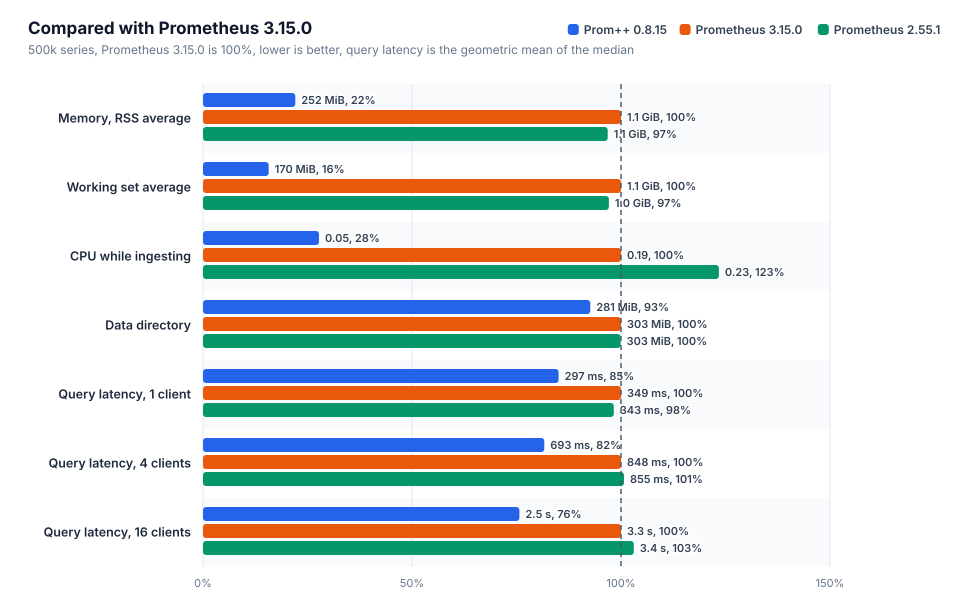
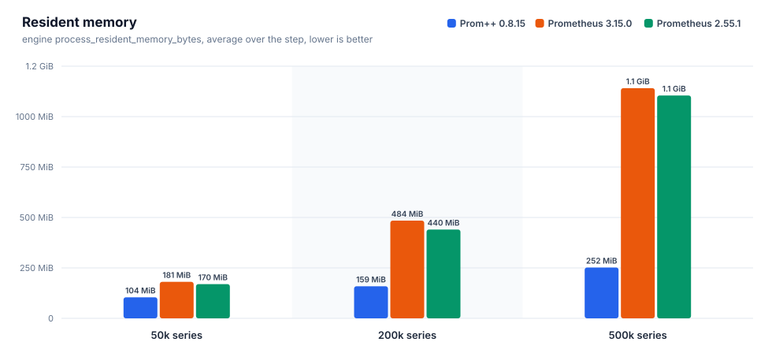
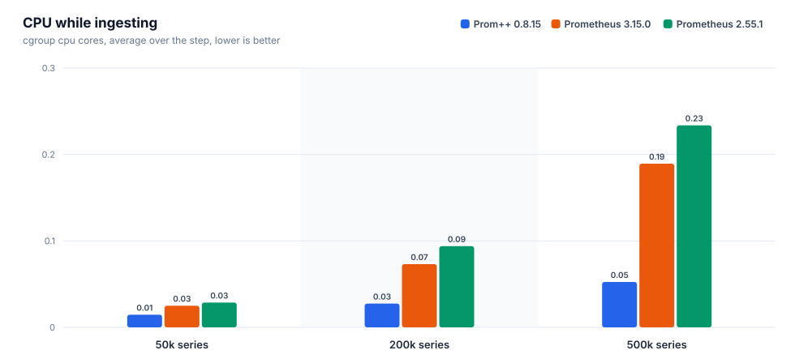
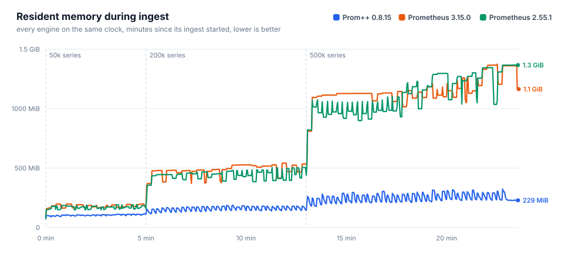
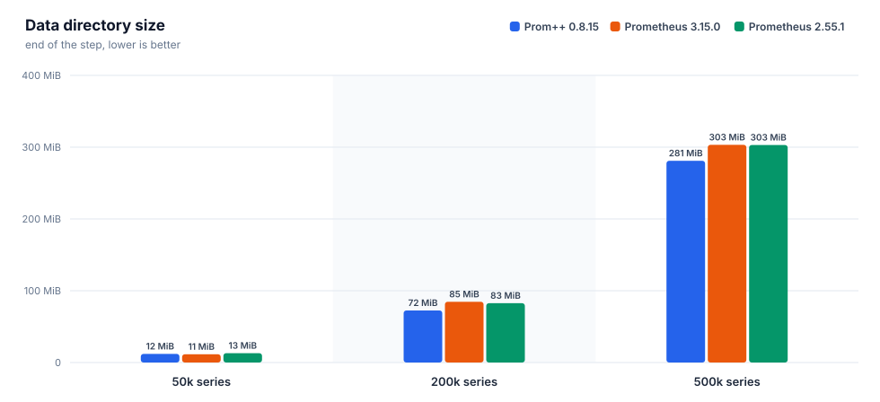
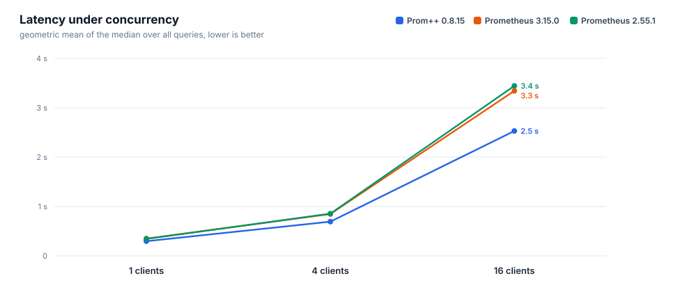
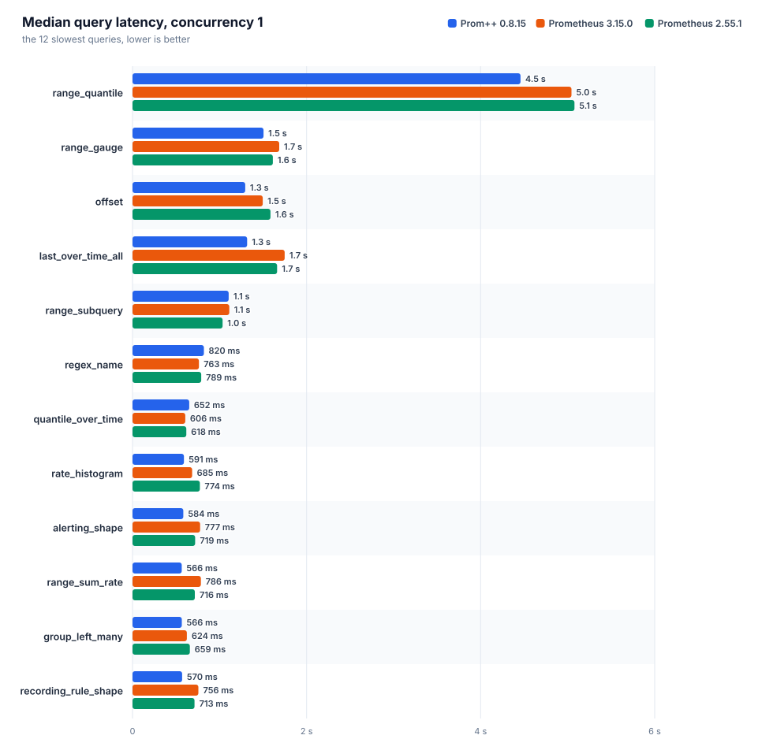
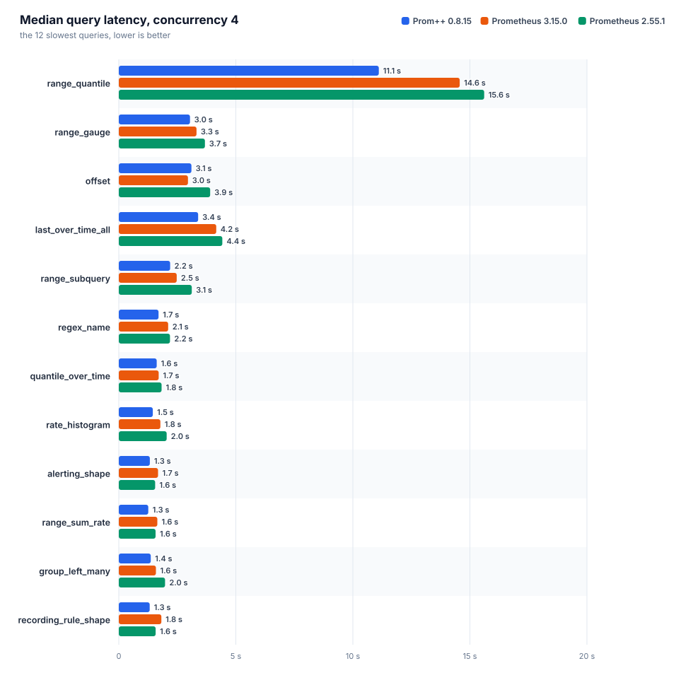
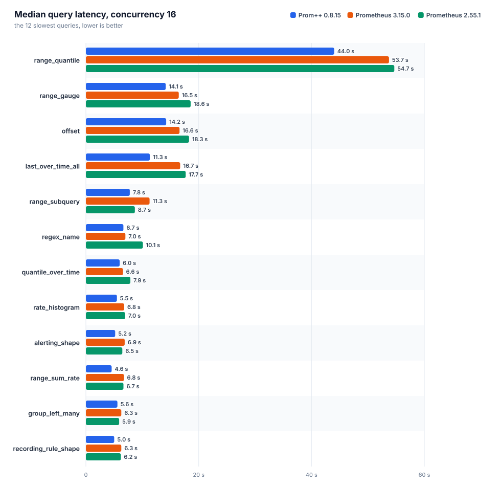

[English](REPORT.md) · **Русский**

# Prom++ против Prometheus

Создано из исходных файлов этой папки. Каждое число ниже взято из файла прогона, вручную ничего не вписано.

Номер прогона: `20261007T170616Z`

## Окружение

| параметр | значение |
|---|---|
| узел | bench-node |
| процессор | AMD EPYC 7713 64-Core Processor |
| ядер | 8 |
| память | 15.6 GiB |
| ядро | 6.8.0-142-generic |
| ОС | Ubuntu 24.04.4 LTS |
| архитектура | amd64 |
| файловая система данных | свободно 151.6 GiB из 177.1 GiB |
| container_runtime | containerd://2.3.4-k3s1.36 |
| instance_type | k3s |
| kubelet_version | v1.36.4+k3s1 |
| operating_system | linux |
| нагрузочный код | harness/b3000ef-7f49340 |

## Движки

Заданные настройки взяты из манифестов, наблюдаемые из runtimeinfo и списка флагов самого движка во время прогона.

| движок | образ | лимит процессора | лимит памяти | окружение | GOMEMLIMIT (факт) | GOMAXPROCS (факт) | сжатие WAL | аргументы | заметки |
|---|---|---|---|---|---|---|---|---|---|
| `prompp-0815` | `mirror.gcr.io/prompp/prompp:0.8.15` | 2.00 cores | 6.0 GiB | `GOMEMLIMIT=5529MiB GOMAXPROCS=2` | 5.4 GiB | 2 | true | `--config.file=... --storage.tsdb.path=... --web.enable-remote-write-receiver --web.enable-lifecycle` | C++ head and WAL |
| `prom-3150` | `quay.io/prometheus/prometheus:v3.15.0` | 2.00 cores | 6.0 GiB | `GOMEMLIMIT=5529MiB GOMAXPROCS=2` | 5.4 GiB | 2 | true | `--config.file=... --storage.tsdb.path=... --web.enable-remote-write-receiver --web.enable-lifecycle` | upstream latest |
| `prom-2551` | `quay.io/prometheus/prometheus:v2.55.1` | 2.00 cores | 6.0 GiB | `GOMEMLIMIT=5529MiB GOMAXPROCS=2` | 5.4 GiB | 2 | true | `--config.file=... --storage.tsdb.path=... --web.enable-remote-write-receiver --web.enable-lifecycle` | closed range selectors, the semantics before 3.0 |

## Запись и память head











### prom-2551

Интервал 15 с, пачка 5000 серий, потоков 4, отправлено точек 27400000, из них потеряно 0.

| активных серий | точек/с | серий в head | чанков | RSS ср. | RSS p95 | RSS макс. | рабочий набор макс. | ядер ср. | ядер макс. | каталог данных | WAL | RSS/серия | диск/серия |
|---|---|---|---|---|---|---|---|---|---|---|---|---|---|
| 50000 | 3333 | 50000 | 50000 | 169.6 MiB | 190.0 MiB | 191.5 MiB | 137.9 MiB | 0.03 | 0.41 | 13.0 MiB | 13.0 MiB | 3.2 KiB | 273 B |
| 200000 | 13333 | 200000 | 200000 | 440.3 MiB | 501.8 MiB | 505.2 MiB | 454.7 MiB | 0.09 | 1.36 | 82.6 MiB | 82.6 MiB | 2.2 KiB | 432 B |
| 500000 | 33333 | 500000 | 500000 | 1.1 GiB | 1.3 GiB | 1.3 GiB | 1.3 GiB | 0.23 | 2.95 | 303.0 MiB | 303.0 MiB | 2.8 KiB | 635 B |

| активных серий | прошло / план | запрос записи p50 | p99 | 2xx | 4xx | 5xx | ошибки клиента |
|---|---|---|---|---|---|---|---|
| 50000 | 300 s / 300 s | 57 ms | 145 ms | 200 | 0 | 0 | 0 |
| 200000 | 480 s / 480 s | 30 ms | 201 ms | 1280 | 0 | 0 | 0 |
| 500000 | 600 s / 600 s | 28 ms | 259 ms | 4000 | 0 | 0 | 0 |

### prom-3150

Интервал 15 с, пачка 5000 серий, потоков 4, отправлено точек 27400000, из них потеряно 0.

| активных серий | точек/с | серий в head | чанков | RSS ср. | RSS p95 | RSS макс. | рабочий набор макс. | ядер ср. | ядер макс. | каталог данных | WAL | RSS/серия | диск/серия |
|---|---|---|---|---|---|---|---|---|---|---|---|---|---|
| 50000 | 3333 | 50000 | 50000 | 180.7 MiB | 197.9 MiB | 198.0 MiB | 139.8 MiB | 0.03 | 0.38 | 11.5 MiB | 11.4 MiB | 3.6 KiB | 240 B |
| 200000 | 13333 | 200000 | 200000 | 484.3 MiB | 533.8 MiB | 541.6 MiB | 485.8 MiB | 0.07 | 1.10 | 84.6 MiB | 84.6 MiB | 2.7 KiB | 443 B |
| 500000 | 33333 | 500000 | 500000 | 1.1 GiB | 1.3 GiB | 1.3 GiB | 1.3 GiB | 0.19 | 2.90 | 303.3 MiB | 303.2 MiB | 2.8 KiB | 635 B |

| активных серий | прошло / план | запрос записи p50 | p99 | 2xx | 4xx | 5xx | ошибки клиента |
|---|---|---|---|---|---|---|---|
| 50000 | 300 s / 300 s | 43 ms | 154 ms | 200 | 0 | 0 | 0 |
| 200000 | 480 s / 480 s | 35 ms | 128 ms | 1280 | 0 | 0 | 0 |
| 500000 | 600 s / 600 s | 31 ms | 183 ms | 4000 | 0 | 0 | 0 |

### prompp-0815

Интервал 15 с, пачка 5000 серий, потоков 4, отправлено точек 27400000, из них потеряно 0.

| активных серий | точек/с | серий в head | чанков | RSS ср. | RSS p95 | RSS макс. | рабочий набор макс. | ядер ср. | ядер макс. | каталог данных | WAL | RSS/серия | диск/серия |
|---|---|---|---|---|---|---|---|---|---|---|---|---|---|
| 50000 | 3333 | 50000 | 50000 | 104.4 MiB | 111.3 MiB | 115.5 MiB | 51.9 MiB | 0.01 | 0.20 | 12.0 MiB | 4.0 KiB | 2.3 KiB | 252 B |
| 200000 | 13333 | 200000 | 200000 | 159.0 MiB | 180.4 MiB | 187.1 MiB | 118.3 MiB | 0.03 | 0.46 | 72.5 MiB | 4.0 KiB | 755 B | 380 B |
| 500000 | 33333 | 500000 | 500000 | 252.0 MiB | 304.2 MiB | 323.6 MiB | 255.3 MiB | 0.05 | 0.84 | 280.9 MiB | 4.0 KiB | 490 B | 589 B |

| активных серий | прошло / план | запрос записи p50 | p99 | 2xx | 4xx | 5xx | ошибки клиента |
|---|---|---|---|---|---|---|---|
| 50000 | 300 s / 300 s | 12 ms | 96 ms | 200 | 0 | 0 | 0 |
| 200000 | 480 s / 480 s | 12 ms | 75 ms | 1280 | 0 | 0 | 0 |
| 500000 | 600 s / 600 s | 12 ms | 59 ms | 4000 | 0 | 0 | 0 |

### Сравнение

Для всех столбцов с памятью и процессором меньше значит лучше. RSS это `process_resident_memory_bytes` самого движка, рабочий набор это значение cgroup, по которому kubelet выселяет поды и срабатывает OOM.

| активных серий | движок | RSS ср. | байт на серию | рабочий набор макс. | ядер ср. | каталог данных | точек/с |
|---|---|---|---|---|---|---|---|
| 50000 | `prom-2551` | 169.6 MiB | 3.2 KiB | 137.9 MiB | 0.03 | 13.0 MiB | 3333 |
| 50000 | `prom-3150` | 180.7 MiB | 3.6 KiB | 139.8 MiB | 0.03 | 11.5 MiB | 3333 |
| 50000 | `prompp-0815` | 104.4 MiB | 2.3 KiB | 51.9 MiB | 0.01 | 12.0 MiB | 3333 |
| 200000 | `prom-2551` | 440.3 MiB | 2.2 KiB | 454.7 MiB | 0.09 | 82.6 MiB | 13333 |
| 200000 | `prom-3150` | 484.3 MiB | 2.7 KiB | 485.8 MiB | 0.07 | 84.6 MiB | 13333 |
| 200000 | `prompp-0815` | 159.0 MiB | 755 B | 118.3 MiB | 0.03 | 72.5 MiB | 13333 |
| 500000 | `prom-2551` | 1.1 GiB | 2.8 KiB | 1.3 GiB | 0.23 | 303.0 MiB | 33333 |
| 500000 | `prom-3150` | 1.1 GiB | 2.8 KiB | 1.3 GiB | 0.19 | 303.3 MiB | 33333 |
| 500000 | `prompp-0815` | 252.0 MiB | 490 B | 255.3 MiB | 0.05 | 280.9 MiB | 33333 |

На самой большой ступени меньше всего памяти на серию нужно `prompp-0815`: 490 B of resident memory per active series, the lowest of the compared engines.

## Время запросов

Каждый запрос идёт отдельно: один пробный запрос без учёта, затем заданное число потоков повторяет его, пока не истечёт отведённое время и не наберётся минимальное число запросов. `n` это число учтённых запросов. При малом `n` значение p99 близко к максимуму, поэтому сравнивать лучше медиану. Геометрическое среднее учитывает все запросы поровну, поэтому несколько запросов, которые идут секундами, не заглушают остальные.



### Параллельность 1



| движок | набор | запросов | замеров | ошибок | p50 (геом.) | p99 (геом.) | p50 самого медленного | ядер ср. | рабочий набор макс. |
|---|---|---|---|---|---|---|---|---|---|
| `prom-2551` | heavy | 38 | 11091 | 0 | 343 ms | 582 ms | `range_quantile` 5.08 s | 1.23 | 1.7 GiB |
| `prom-3150` | heavy | 38 | 14664 | 0 | 349 ms | 529 ms | `range_quantile` 5.04 s | 1.14 | 1.8 GiB |
| `prompp-0815` | heavy | 38 | 10466 | 0 | 297 ms | 350 ms | `range_quantile` 4.46 s | 1.30 | 627.2 MiB |

| query | type | `prom-2551` p50 / p99 (n) | `prom-3150` p50 / p99 (n) | `prompp-0815` p50 / p99 (n) | fastest p50 |
|---|---|---|---|---|---|
| `absent` | instant | 0.4 ms / 11 ms (9600) | 0.4 ms / 8.5 ms (13145) | 0.8 ms / 3.2 ms (8575) | `prom-3150` |
| `alerting_shape` | range | 719 ms / 970 ms (14) | 777 ms / 959 ms (13) | 584 ms / 660 ms (18) | `prompp-0815` |
| `avg_over_pods` | instant | 213 ms / 359 ms (44) | 220 ms / 376 ms (44) | 140 ms / 168 ms (72) | `prompp-0815` |
| `avg_over_time` | instant | 374 ms / 616 ms (25) | 383 ms / 530 ms (26) | 385 ms / 414 ms (27) | `prom-2551` |
| `binary_scalar` | instant | 413 ms / 648 ms (23) | 427 ms / 596 ms (23) | 271 ms / 315 ms (37) | `prompp-0815` |
| `bottomk` | instant | 204 ms / 410 ms (45) | 214 ms / 349 ms (44) | 141 ms / 166 ms (70) | `prompp-0815` |
| `clamp` | instant | 345 ms / 619 ms (26) | 354 ms / 524 ms (27) | 394 ms / 430 ms (26) | `prom-2551` |
| `count_by_job` | instant | 212 ms / 373 ms (44) | 219 ms / 345 ms (45) | 139 ms / 168 ms (72) | `prompp-0815` |
| `count_values` | instant | 347 ms / 551 ms (26) | 341 ms / 491 ms (28) | 326 ms / 384 ms (31) | `prompp-0815` |
| `double_subquery` | range | 511 ms / 740 ms (19) | 523 ms / 745 ms (19) | 429 ms / 462 ms (24) | `prompp-0815` |
| `group_left_many` | instant | 659 ms / 922 ms (14) | 624 ms / 779 ms (16) | 566 ms / 615 ms (18) | `prompp-0815` |
| `increase` | instant | 361 ms / 628 ms (26) | 378 ms / 531 ms (26) | 363 ms / 389 ms (28) | `prom-2551` |
| `irate` | instant | 265 ms / 471 ms (36) | 258 ms / 382 ms (37) | 264 ms / 285 ms (38) | `prom-3150` |
| `join` | instant | 413 ms / 588 ms (23) | 417 ms / 575 ms (24) | 256 ms / 288 ms (39) | `prompp-0815` |
| `label_replace` | instant | 317 ms / 545 ms (29) | 314 ms / 447 ms (31) | 314 ms / 359 ms (32) | `prompp-0815` |
| `last_over_time_all` | instant | 1.66 s / 2.02 s (6) | 1.75 s / 1.94 s (6) | 1.32 s / 1.48 s (8) | `prompp-0815` |
| `matchers_numeric` | instant | 278 ms / 478 ms (33) | 283 ms / 396 ms (34) | 262 ms / 287 ms (39) | `prompp-0815` |
| `max_over_time` | instant | 382 ms / 629 ms (25) | 406 ms / 518 ms (24) | 390 ms / 421 ms (26) | `prom-2551` |
| `nested_aggregate` | instant | 202 ms / 375 ms (46) | 207 ms / 366 ms (46) | 149 ms / 169 ms (68) | `prompp-0815` |
| `offset` | range | 1.58 s / 1.91 s (7) | 1.50 s / 1.88 s (7) | 1.30 s / 1.93 s (7) | `prompp-0815` |
| `or_fallback` | instant | 328 ms / 512 ms (28) | 340 ms / 479 ms (28) | 364 ms / 395 ms (28) | `prom-2551` |
| `quantile_over_time` | instant | 618 ms / 897 ms (15) | 606 ms / 848 ms (15) | 652 ms / 680 ms (16) | `prom-3150` |
| `range_gauge` | range | 1.61 s / 1.85 s (6) | 1.69 s / 1.85 s (7) | 1.51 s / 2.08 s (6) | `prompp-0815` |
| `range_quantile` | range | 5.08 s / 5.32 s (5) | 5.04 s / 5.11 s (5) | 4.46 s / 4.51 s (5) | `prompp-0815` |
| `range_subquery` | range | 1.03 s / 1.30 s (10) | 1.11 s / 1.45 s (9) | 1.10 s / 1.17 s (10) | `prom-2551` |
| `range_sum_rate` | range | 716 ms / 1.04 s (14) | 786 ms / 912 ms (13) | 566 ms / 619 ms (18) | `prompp-0815` |
| `rate` | instant | 303 ms / 547 ms (32) | 306 ms / 417 ms (32) | 305 ms / 331 ms (33) | `prom-2551` |
| `rate_histogram` | instant | 774 ms / 901 ms (14) | 685 ms / 805 ms (15) | 591 ms / 634 ms (17) | `prompp-0815` |
| `recording_rule_shape` | range | 713 ms / 967 ms (14) | 756 ms / 886 ms (14) | 570 ms / 603 ms (18) | `prompp-0815` |
| `regex_name` | instant | 789 ms / 1.13 s (12) | 763 ms / 985 ms (13) | 820 ms / 901 ms (12) | `prom-3150` |
| `selector` | instant | 292 ms / 462 ms (32) | 296 ms / 454 ms (32) | 303 ms / 344 ms (33) | `prom-2551` |
| `selector_labels` | instant | 16 ms / 38 ms (560) | 15 ms / 41 ms (580) | 16 ms / 22 ms (637) | `prom-3150` |
| `sort_desc` | instant | 209 ms / 378 ms (44) | 219 ms / 354 ms (44) | 137 ms / 155 ms (72) | `prompp-0815` |
| `stddev` | instant | 214 ms / 369 ms (44) | 224 ms / 401 ms (42) | 139 ms / 166 ms (73) | `prompp-0815` |
| `sum` | instant | 202 ms / 379 ms (46) | 211 ms / 342 ms (46) | 137 ms / 167 ms (73) | `prompp-0815` |
| `sum_by_namespace` | instant | 215 ms / 567 ms (43) | 221 ms / 366 ms (43) | 142 ms / 175 ms (70) | `prompp-0815` |
| `topk` | instant | 206 ms / 356 ms (45) | 213 ms / 337 ms (45) | 144 ms / 164 ms (70) | `prompp-0815` |
| `vector_matching` | instant | 586 ms / 846 ms (16) | 627 ms / 743 ms (16) | 524 ms / 572 ms (20) | `prompp-0815` |

### Параллельность 4



| движок | набор | запросов | замеров | ошибок | p50 (геом.) | p99 (геом.) | p50 самого медленного | ядер ср. | рабочий набор макс. |
|---|---|---|---|---|---|---|---|---|---|
| `prom-2551` | heavy | 38 | 14002 | 0 | 855 ms | 1.54 s | `range_quantile` 15.61 s | 1.89 | 2.9 GiB |
| `prom-3150` | heavy | 38 | 18023 | 0 | 848 ms | 1.37 s | `range_quantile` 14.57 s | 1.90 | 2.8 GiB |
| `prompp-0815` | heavy | 38 | 15012 | 0 | 693 ms | 931 ms | `range_quantile` 11.11 s | 1.90 | 1.3 GiB |

| query | type | `prom-2551` p50 / p99 (n) | `prom-3150` p50 / p99 (n) | `prompp-0815` p50 / p99 (n) | fastest p50 |
|---|---|---|---|---|---|
| `absent` | instant | 0.8 ms / 34 ms (11550) | 0.9 ms / 21 ms (15463) | 3.2 ms / 8.9 ms (11788) | `prom-2551` |
| `alerting_shape` | range | 1.55 s / 2.54 s (24) | 1.68 s / 2.11 s (24) | 1.33 s / 1.62 s (32) | `prompp-0815` |
| `avg_over_pods` | instant | 494 ms / 1.00 s (72) | 549 ms / 946 ms (69) | 374 ms / 579 ms (108) | `prompp-0815` |
| `avg_over_time` | instant | 818 ms / 1.39 s (45) | 953 ms / 1.39 s (44) | 762 ms / 990 ms (54) | `prompp-0815` |
| `binary_scalar` | instant | 1.19 s / 1.58 s (36) | 1.04 s / 1.45 s (38) | 693 ms / 889 ms (60) | `prompp-0815` |
| `bottomk` | instant | 503 ms / 1.08 s (68) | 578 ms / 976 ms (67) | 373 ms / 538 ms (106) | `prompp-0815` |
| `clamp` | instant | 1.03 s / 1.41 s (40) | 932 ms / 1.26 s (44) | 723 ms / 1.13 s (54) | `prompp-0815` |
| `count_by_job` | instant | 553 ms / 1.09 s (70) | 554 ms / 931 ms (70) | 358 ms / 561 ms (110) | `prompp-0815` |
| `count_values` | instant | 1.07 s / 1.43 s (41) | 1.00 s / 1.26 s (42) | 782 ms / 998 ms (55) | `prompp-0815` |
| `double_subquery` | range | 1.14 s / 2.04 s (32) | 1.18 s / 1.64 s (32) | 961 ms / 1.20 s (44) | `prompp-0815` |
| `group_left_many` | instant | 1.98 s / 2.16 s (22) | 1.59 s / 1.97 s (26) | 1.36 s / 1.67 s (31) | `prompp-0815` |
| `increase` | instant | 853 ms / 1.57 s (45) | 878 ms / 1.34 s (44) | 761 ms / 952 ms (56) | `prompp-0815` |
| `irate` | instant | 631 ms / 1.14 s (59) | 618 ms / 1.03 s (60) | 552 ms / 726 ms (73) | `prompp-0815` |
| `join` | instant | 1.04 s / 1.66 s (38) | 1.04 s / 1.46 s (40) | 651 ms / 853 ms (63) | `prompp-0815` |
| `label_replace` | instant | 765 ms / 1.33 s (49) | 746 ms / 1.22 s (51) | 661 ms / 823 ms (62) | `prompp-0815` |
| `last_over_time_all` | instant | 4.42 s / 5.24 s (10) | 4.16 s / 4.49 s (12) | 3.39 s / 3.89 s (13) | `prompp-0815` |
| `matchers_numeric` | instant | 658 ms / 1.23 s (53) | 725 ms / 1.15 s (56) | 589 ms / 734 ms (71) | `prompp-0815` |
| `max_over_time` | instant | 832 ms / 1.63 s (44) | 890 ms / 1.47 s (42) | 800 ms / 1.03 s (53) | `prompp-0815` |
| `nested_aggregate` | instant | 591 ms / 1.01 s (69) | 521 ms / 941 ms (74) | 387 ms / 624 ms (103) | `prompp-0815` |
| `offset` | range | 3.90 s / 5.04 s (12) | 2.95 s / 5.25 s (14) | 3.10 s / 4.17 s (13) | `prom-3150` |
| `or_fallback` | instant | 770 ms / 1.43 s (47) | 888 ms / 1.32 s (46) | 714 ms / 983 ms (58) | `prompp-0815` |
| `quantile_over_time` | instant | 1.83 s / 2.32 s (24) | 1.70 s / 2.15 s (25) | 1.62 s / 1.88 s (26) | `prompp-0815` |
| `range_gauge` | range | 3.68 s / 5.23 s (12) | 3.32 s / 5.00 s (12) | 3.04 s / 3.99 s (15) | `prompp-0815` |
| `range_quantile` | range | 15.61 s / 15.91 s (5) | 14.57 s / 14.67 s (5) | 11.11 s / 11.35 s (5) | `prompp-0815` |
| `range_subquery` | range | 3.12 s / 4.21 s (16) | 2.47 s / 3.10 s (16) | 2.19 s / 2.54 s (20) | `prompp-0815` |
| `range_sum_rate` | range | 1.57 s / 2.74 s (24) | 1.65 s / 2.32 s (24) | 1.26 s / 1.44 s (32) | `prompp-0815` |
| `rate` | instant | 719 ms / 1.42 s (52) | 724 ms / 1.19 s (54) | 600 ms / 918 ms (67) | `prompp-0815` |
| `rate_histogram` | instant | 2.04 s / 2.57 s (21) | 1.78 s / 2.33 s (24) | 1.45 s / 1.66 s (28) | `prompp-0815` |
| `recording_rule_shape` | range | 1.57 s / 2.46 s (24) | 1.82 s / 2.42 s (24) | 1.32 s / 1.56 s (32) | `prompp-0815` |
| `regex_name` | instant | 2.19 s / 2.84 s (20) | 2.11 s / 2.43 s (20) | 1.70 s / 2.05 s (25) | `prompp-0815` |
| `selector` | instant | 677 ms / 1.23 s (53) | 684 ms / 1.24 s (54) | 593 ms / 765 ms (71) | `prompp-0815` |
| `selector_labels` | instant | 33 ms / 142 ms (941) | 34 ms / 98 ms (1026) | 35 ms / 76 ms (1079) | `prom-2551` |
| `sort_desc` | instant | 515 ms / 974 ms (72) | 517 ms / 849 ms (74) | 363 ms / 510 ms (112) | `prompp-0815` |
| `stddev` | instant | 527 ms / 978 ms (71) | 546 ms / 895 ms (70) | 344 ms / 470 ms (119) | `prompp-0815` |
| `sum` | instant | 480 ms / 943 ms (75) | 516 ms / 1.06 s (73) | 346 ms / 479 ms (117) | `prompp-0815` |
| `sum_by_namespace` | instant | 511 ms / 893 ms (70) | 544 ms / 910 ms (69) | 357 ms / 511 ms (112) | `prompp-0815` |
| `topk` | instant | 480 ms / 1.13 s (72) | 532 ms / 980 ms (69) | 369 ms / 488 ms (110) | `prompp-0815` |
| `vector_matching` | instant | 1.79 s / 2.24 s (24) | 1.63 s / 1.93 s (26) | 1.22 s / 1.44 s (35) | `prompp-0815` |

### Параллельность 16



| движок | набор | запросов | замеров | ошибок | p50 (геом.) | p99 (геом.) | p50 самого медленного | ядер ср. | рабочий набор макс. |
|---|---|---|---|---|---|---|---|---|---|
| `prom-2551` | heavy | 38 | 19203 | 0 | 3.44 s | 4.98 s | `range_quantile` 54.68 s | 1.92 | 5.4 GiB |
| `prom-3150` | heavy | 38 | 22209 | 10 | 3.34 s | 4.63 s | `range_quantile` 53.74 s | 5.52 | 5.4 GiB |
| `prompp-0815` | heavy | 38 | 15658 | 0 | 2.53 s | 3.61 s | `range_quantile` 44.03 s | 1.93 | 4.0 GiB |

| query | type | `prom-2551` p50 / p99 (n) | `prom-3150` p50 / p99 (n) | `prompp-0815` p50 / p99 (n) | fastest p50 |
|---|---|---|---|---|---|
| `absent` | instant | 2.7 ms / 128 ms (16406) | 3.1 ms / 59 ms (19328) | 11 ms / 44 ms (11888) | `prom-2551` |
| `alerting_shape` | range | 6.46 s / 7.48 s (32) | 6.88 s / 7.37 s (32) | 5.20 s / 6.04 s (34) | `prompp-0815` |
| `avg_over_pods` | instant | 2.18 s / 3.15 s (81) | 2.15 s / 2.88 s (81) | 1.17 s / 1.90 s (140) | `prompp-0815` |
| `avg_over_time` | instant | 3.72 s / 4.86 s (48) | 3.54 s / 4.56 s (49) | 2.99 s / 3.63 s (64) | `prompp-0815` |
| `binary_scalar` | instant | 4.06 s / 5.41 s (48) | 4.16 s / 4.48 s (53) | 2.48 s / 3.21 s (70) | `prompp-0815` |
| `bottomk` | instant | 2.33 s / 3.06 s (75) | 2.18 s / 2.56 s (82) | 1.39 s / 2.24 s (120) | `prompp-0815` |
| `clamp` | instant | 3.77 s / 4.86 s (48) | 3.61 s / 4.01 s (48) | 2.67 s / 3.83 s (65) | `prompp-0815` |
| `count_by_job` | instant | 2.25 s / 2.88 s (79) | 2.09 s / 2.74 s (84) | 1.20 s / 2.12 s (137) | `prompp-0815` |
| `count_values` | instant | 4.14 s / 4.75 s (48) | 3.44 s / 4.17 s (51) | 2.96 s / 4.07 s (64) | `prompp-0815` |
| `double_subquery` | range | 4.69 s / 6.80 s (34) | 4.74 s / 5.95 s (39) | 3.61 s / 4.36 s (49) | `prompp-0815` |
| `group_left_many` | instant | 5.90 s / 8.28 s (32) | 6.28 s / 7.80 s (33) | 5.59 s / 7.03 s (32) | `prompp-0815` |
| `increase` | instant | 3.47 s / 4.33 s (50) | 3.46 s / 4.40 s (52) | 2.67 s / 3.91 s (65) | `prompp-0815` |
| `irate` | instant | 2.74 s / 3.58 s (66) | 2.50 s / 3.35 s (69) | 1.89 s / 2.59 s (90) | `prompp-0815` |
| `join` | instant | 4.09 s / 5.29 s (48) | 3.49 s / 7.70 s (50) | 2.24 s / 3.31 s (76) | `prompp-0815` |
| `label_replace` | instant | 3.06 s / 4.37 s (59) | 3.07 s / 4.26 s (61) | 2.30 s / 2.96 s (77) | `prompp-0815` |
| `last_over_time_all` | instant | 17.69 s / 18.79 s (16) | 16.72 s / 17.62 s (16) | 11.34 s / 11.64 s (17) | `prompp-0815` |
| `matchers_numeric` | instant | 2.98 s / 3.96 s (60) | 2.87 s / 3.61 s (64) | 2.13 s / 3.10 s (82) | `prompp-0815` |
| `max_over_time` | instant | 4.03 s / 4.84 s (48) | 3.58 s / 4.85 s (50) | 2.81 s / 3.89 s (63) | `prompp-0815` |
| `nested_aggregate` | instant | 2.12 s / 3.05 s (80) | 2.16 s / 3.27 s (82) | 1.24 s / 2.05 s (129) | `prompp-0815` |
| `offset` | range | 18.29 s / 18.69 s (16) | 16.61 s / 16.88 s (16) | 14.24 s / 14.37 s (16) | `prompp-0815` |
| `or_fallback` | instant | 3.29 s / 4.05 s (56) | 3.32 s / 4.26 s (54) | 2.40 s / 3.45 s (75) | `prompp-0815` |
| `quantile_over_time` | instant | 7.88 s / 9.25 s (32) | 6.58 s / 8.14 s (32) | 5.99 s / 7.90 s (32) | `prompp-0815` |
| `range_gauge` | range | 18.57 s / 18.83 s (16) | 16.47 s / 16.68 s (16) | 14.15 s / 14.28 s (16) | `prompp-0815` |
| `range_quantile` | range | 54.68 s / 54.82 s (16) | 53.74 s / 54.25 s (16) | 44.03 s / 44.44 s (16) | `prompp-0815` |
| `range_subquery` | range | 8.68 s / 10.55 s (31) | 11.29 s / 11.49 s (17) | 7.79 s / 9.25 s (32) | `prompp-0815` |
| `range_sum_rate` | range | 6.66 s / 7.42 s (32) | 6.75 s / 7.30 s (32) | 4.57 s / 5.71 s (44) | `prompp-0815` |
| `rate` | instant | 3.12 s / 4.01 s (59) | 2.88 s / 3.61 s (64) | 2.17 s / 3.23 s (80) | `prompp-0815` |
| `rate_histogram` | instant | 6.96 s / 9.34 s (32) | 6.80 s / 8.21 s (32) | 5.50 s / 6.72 s (32) | `prompp-0815` |
| `recording_rule_shape` | range | 6.20 s / 7.61 s (32) | 6.28 s / 7.70 s (32) | 5.02 s / 5.95 s (36) | `prompp-0815` |
| `regex_name` | instant | 10.11 s / 11.09 s (21) | 7.01 s / 10.29 s (29) | 6.66 s / 8.67 s (32) | `prompp-0815` |
| `selector` | instant | 3.04 s / 4.70 s (57) | 2.86 s / 4.01 s (64) | 2.13 s / 3.01 s (82) | `prompp-0815` |
| `selector_labels` | instant | 136 ms / 498 ms (994) | 140 ms / 487 ms (1028) | 129 ms / 306 ms (1204) | `prompp-0815` |
| `sort_desc` | instant | 2.15 s / 2.97 s (85) | 2.14 s / 2.73 s (83) | 1.21 s / 1.87 s (138) | `prompp-0815` |
| `stddev` | instant | 2.26 s / 2.99 s (80) | 2.11 s / 2.87 s (83) | 1.23 s / 1.92 s (132) | `prompp-0815` |
| `sum` | instant | 1.81 s / 2.97 s (91) | 2.04 s / 2.72 s (84) | 1.22 s / 1.89 s (135) | `prompp-0815` |
| `sum_by_namespace` | instant | 2.23 s / 3.49 s (79) | 2.14 s / 2.91 s (82) | 1.26 s / 2.05 s (133) | `prompp-0815` |
| `topk` | instant | 2.01 s / 3.06 s (84) | 2.17 s / 3.12 s (79) | 1.29 s / 2.16 s (128) | `prompp-0815` |
| `vector_matching` | instant | 5.98 s / 7.14 s (32) | 5.75 s / 7.50 s (32) | 4.78 s / 9.53 s (33) | `prompp-0815` |

## Совпадение результатов

Все движки получили одни и те же точки, а каждый запрос вычисляется в один и тот же закреплённый момент, так что отличающийся результат указывает на смысловое различие между движками или на потерянные данные. В каждой ячейке sha256 результата, приведённого к единому виду.

Строка с различием значит, что движки по-разному отвечают на одни и те же данные в один и тот же момент. Все такие запросы это `rate` или `_over_time` по диапазону. В Prometheus 3.0 диапазон стал открытым слева: точка ровно на левой границе окна больше не входит в расчёт. PromQL-движок Prom++ 0.8.15 её уже отбрасывает (`promql/engine.go`, `floats[drop].T <= mint`), а 2.55.1 нет (`< mint`). Искусственные точки лежат ровно на границе окна, поэтому 2.55.1 видит на одну точку больше.

| запрос | `prom-2551` | `prom-3150` | `prompp-0815` | совпадает |
|---|---|---|---|---|
| `absent` | ca3d163bab05 (1 series) | ca3d163bab05 (1 series) | ca3d163bab05 (1 series) | да |
| `alerting_shape` | 433e69a3597b (100 series) | e10ba8156cd2 (100 series) | e10ba8156cd2 (100 series) | нет |
| `avg_over_pods` | 4f6b6c188f7f (100 series) | 4f6b6c188f7f (100 series) | 4f6b6c188f7f (100 series) | да |
| `avg_over_time` | f1f392b0c78d (62500 series) | f1f392b0c78d (62500 series) | f1f392b0c78d (62500 series) | да |
| `binary_scalar` | ca3d163bab05 (1 series) | ca3d163bab05 (1 series) | ca3d163bab05 (1 series) | да |
| `bottomk` | 75dc8cd99593 (5 series) | 75dc8cd99593 (5 series) | 75dc8cd99593 (5 series) | да |
| `clamp` | f1f392b0c78d (62500 series) | f1f392b0c78d (62500 series) | f1f392b0c78d (62500 series) | да |
| `count_by_job` | 07c02c1348ea (1 series) | 07c02c1348ea (1 series) | 07c02c1348ea (1 series) | да |
| `count_values` | e792d90cc0a2 (62500 series) | e792d90cc0a2 (62500 series) | e792d90cc0a2 (62500 series) | да |
| `double_subquery` | 83f99d686699 (100 series) | 55416fa4082f (100 series) | 55416fa4082f (100 series) | нет |
| `group_left_many` | f1f392b0c78d (62500 series) | f1f392b0c78d (62500 series) | f1f392b0c78d (62500 series) | да |
| `increase` | 559e24dc9a48 (62500 series) | 559e24dc9a48 (62500 series) | 559e24dc9a48 (62500 series) | да |
| `irate` | 559e24dc9a48 (62500 series) | 559e24dc9a48 (62500 series) | 559e24dc9a48 (62500 series) | да |
| `join` | 4f6b6c188f7f (100 series) | 4f6b6c188f7f (100 series) | 4f6b6c188f7f (100 series) | да |
| `label_replace` | d3ae67deabaa (62500 series) | d3ae67deabaa (62500 series) | d3ae67deabaa (62500 series) | да |
| `last_over_time_all` | ca3d163bab05 (1 series) | ca3d163bab05 (1 series) | ca3d163bab05 (1 series) | да |
| `matchers_numeric` | bf8394774b5f (38487 series) | bf8394774b5f (38487 series) | bf8394774b5f (38487 series) | да |
| `max_over_time` | f1f392b0c78d (62500 series) | f1f392b0c78d (62500 series) | f1f392b0c78d (62500 series) | да |
| `nested_aggregate` | ca3d163bab05 (1 series) | ca3d163bab05 (1 series) | ca3d163bab05 (1 series) | да |
| `offset` | d5542cb672bf (62500 series) | d5542cb672bf (62500 series) | d5542cb672bf (62500 series) | да |
| `or_fallback` | a712401a23e5 (62500 series) | a712401a23e5 (62500 series) | a712401a23e5 (62500 series) | да |
| `quantile_over_time` | f1f392b0c78d (62500 series) | f1f392b0c78d (62500 series) | f1f392b0c78d (62500 series) | да |
| `range_gauge` | d5542cb672bf (62500 series) | d5542cb672bf (62500 series) | d5542cb672bf (62500 series) | да |
| `range_quantile` | 8e52194734df (62500 series) | 4f0d1e3a91e8 (62500 series) | 4f0d1e3a91e8 (62500 series) | нет |
| `range_subquery` | 82623d225556 (62500 series) | 82623d225556 (62500 series) | 82623d225556 (62500 series) | да |
| `range_sum_rate` | 8dcd40399f41 (100 series) | d73a595a3678 (100 series) | d73a595a3678 (100 series) | нет |
| `rate` | 559e24dc9a48 (62500 series) | 559e24dc9a48 (62500 series) | 559e24dc9a48 (62500 series) | да |
| `rate_histogram` | 559e24dc9a48 (62500 series) | 559e24dc9a48 (62500 series) | 559e24dc9a48 (62500 series) | да |
| `recording_rule_shape` | eb8b58afb326 (1 series) | 8476e35ab60f (1 series) | 8476e35ab60f (1 series) | нет |
| `regex_name` | fd6cd5bf0d07 (187500 series) | fd6cd5bf0d07 (187500 series) | fd6cd5bf0d07 (187500 series) | да |
| `selector` | a712401a23e5 (62500 series) | a712401a23e5 (62500 series) | a712401a23e5 (62500 series) | да |
| `selector_labels` | b5f636cb8557 (3125 series) | b5f636cb8557 (3125 series) | b5f636cb8557 (3125 series) | да |
| `sort_desc` | 4f6b6c188f7f (100 series) | 4f6b6c188f7f (100 series) | 4f6b6c188f7f (100 series) | да |
| `stddev` | 4f6b6c188f7f (100 series) | 4f6b6c188f7f (100 series) | 4f6b6c188f7f (100 series) | да |
| `sum` | ca3d163bab05 (1 series) | ca3d163bab05 (1 series) | ca3d163bab05 (1 series) | да |
| `sum_by_namespace` | 4f6b6c188f7f (100 series) | 4f6b6c188f7f (100 series) | 4f6b6c188f7f (100 series) | да |
| `topk` | 77b447784c27 (20 series) | 77b447784c27 (20 series) | 77b447784c27 (20 series) | да |
| `vector_matching` | f1f392b0c78d (62500 series) | f1f392b0c78d (62500 series) | f1f392b0c78d (62500 series) | да |

Совпадают 33 запросов, различаются 5.

## Как воспроизвести

```sh
export BENCH_NODE=<узел>
RUN_ID=20261007T170616Z scripts/node-overlay.sh
scripts/harness.sh
RUN_ID=20261007T170616Z scripts/run.sh
go run ./cmd/report -root results -run 20261007T170616Z
scripts/teardown.sh --yes
```

Правила честного сравнения и то, что может исказить результат, описаны в METHODOLOGY.ru.md.
