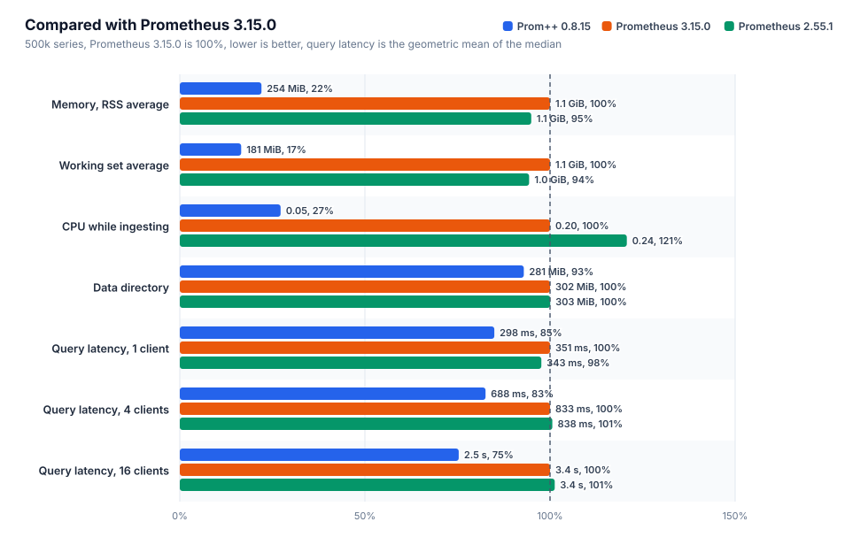
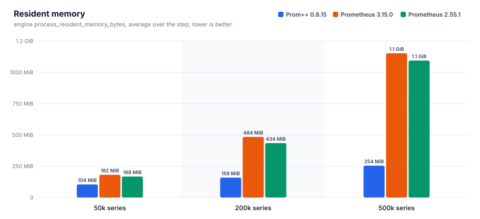
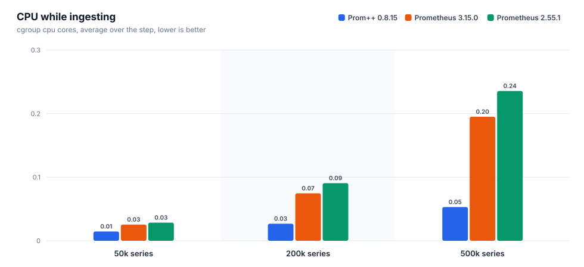
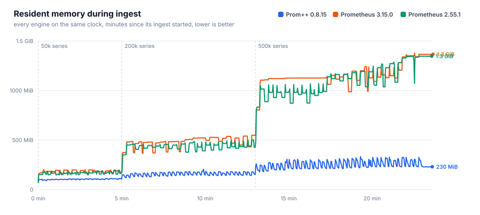
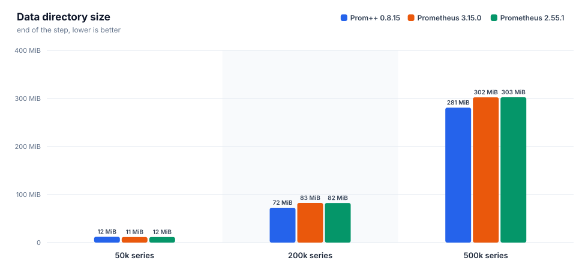
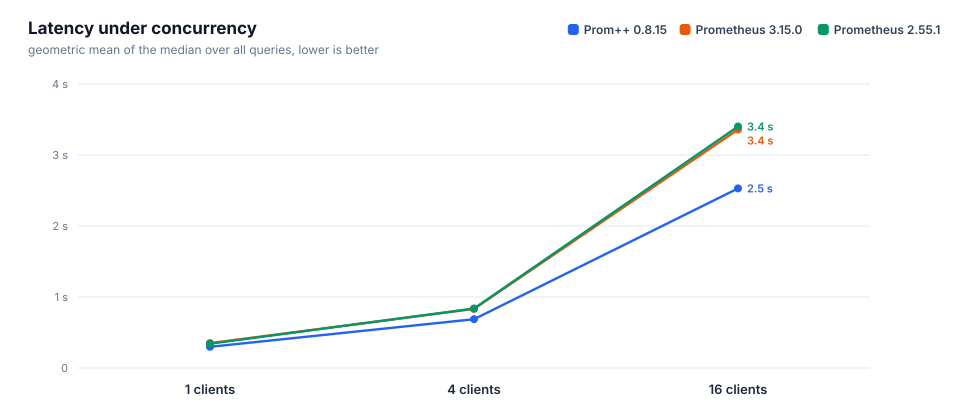
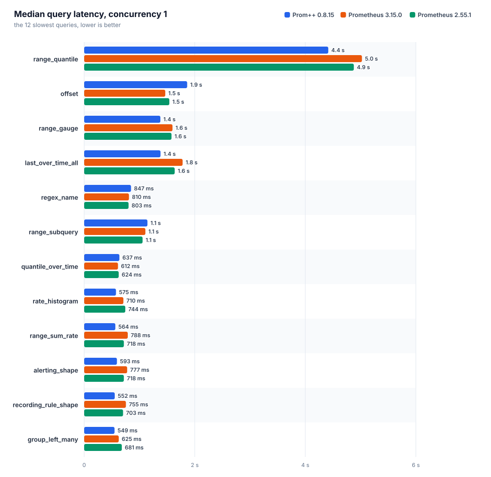
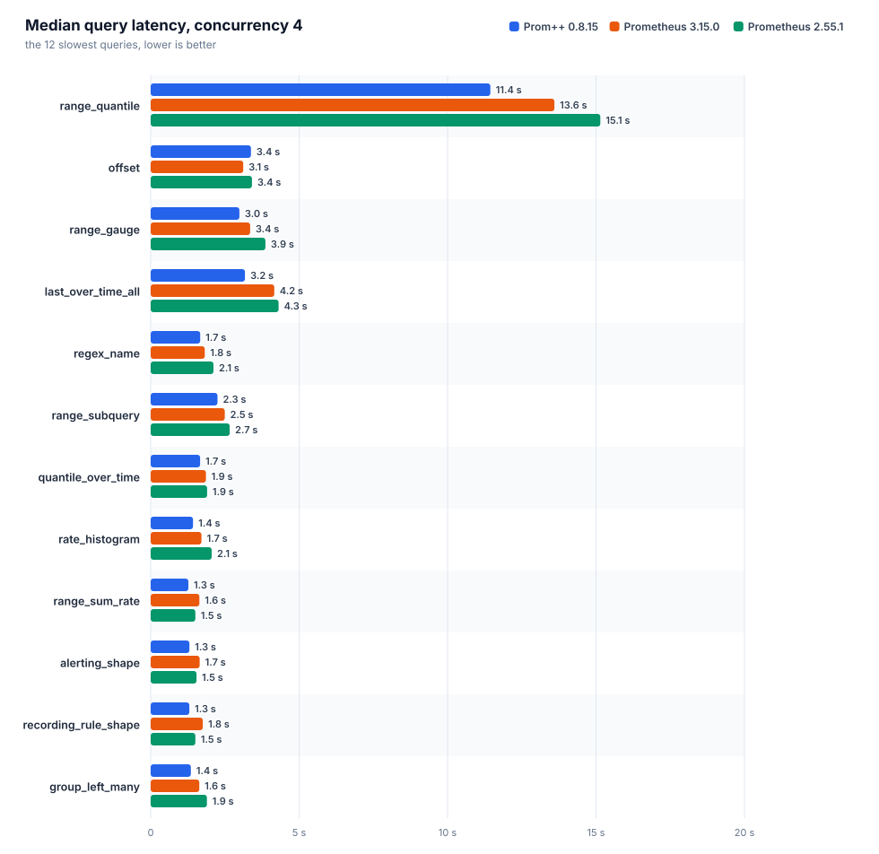
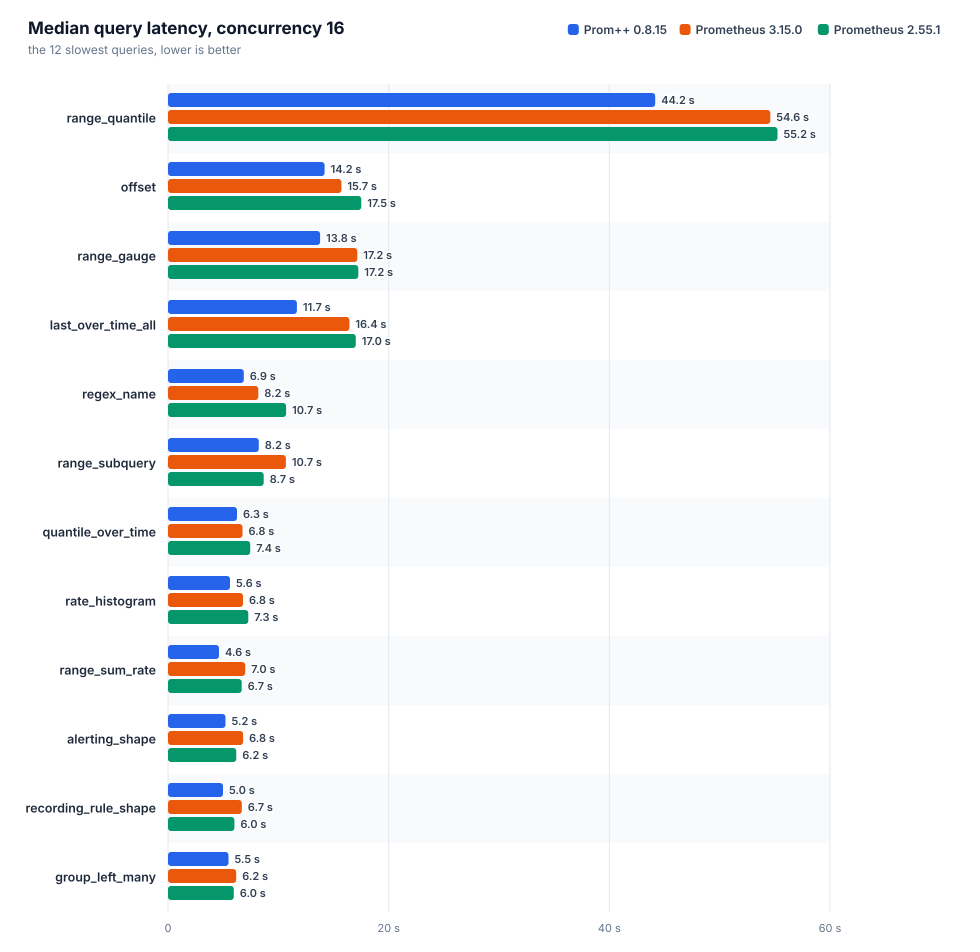

# Prom++ versus Prometheus

Generated from the raw artifacts in this directory. Every number below comes from a file in the run directory, nothing is typed in by hand.

Run id: `20261007T210616Z`

## Environment

| item | value |
|---|---|
| node | bench-node |
| cpu | AMD EPYC 7713 64-Core Processor |
| cores | 8 |
| memory | 15.6 GiB |
| kernel | 6.8.0-142-generic |
| os | Ubuntu 24.04.4 LTS |
| arch | amd64 |
| data filesystem | 151.6 GiB free of 177.1 GiB |
| container_runtime | containerd://2.3.4-k3s1.36 |
| instance_type | k3s |
| kubelet_version | v1.36.4+k3s1 |
| operating_system | linux |
| harness | harness/b3000ef-7f49340 |

## Engines

Declared settings come from the manifests, observed ones from the engine's own runtimeinfo and flags endpoints during the run.

| engine | image | cpu limit | memory limit | env | observed GOMEMLIMIT | observed GOMAXPROCS | WAL compression | args | notes |
|---|---|---|---|---|---|---|---|---|---|
| `prompp-0815` | `mirror.gcr.io/prompp/prompp:0.8.15` | 2.00 cores | 6.0 GiB | `GOMEMLIMIT=5529MiB GOMAXPROCS=2` | 5.4 GiB | 2 | true | `--config.file=... --storage.tsdb.path=... --web.enable-remote-write-receiver --web.enable-lifecycle` | C++ head and WAL |
| `prom-3150` | `quay.io/prometheus/prometheus:v3.15.0` | 2.00 cores | 6.0 GiB | `GOMEMLIMIT=5529MiB GOMAXPROCS=2` | 5.4 GiB | 2 | true | `--config.file=... --storage.tsdb.path=... --web.enable-remote-write-receiver --web.enable-lifecycle` | upstream latest |
| `prom-2551` | `quay.io/prometheus/prometheus:v2.55.1` | 2.00 cores | 6.0 GiB | `GOMEMLIMIT=5529MiB GOMAXPROCS=2` | 5.4 GiB | 2 | true | `--config.file=... --storage.tsdb.path=... --web.enable-remote-write-receiver --web.enable-lifecycle` | closed range selectors, the semantics before 3.0 |

## Ingest and head memory











### prom-2551

Interval 15s, batch 5000 series, 4 workers, 27400000 samples sent, 0 failed.

| active series | samples/s | head series | head chunks | RSS avg | RSS p95 | RSS max | working set max | cpu cores avg | cpu cores max | data dir | WAL | rss/series | disk/series |
|---|---|---|---|---|---|---|---|---|---|---|---|---|---|
| 50000 | 3333 | 50000 | 50000 | 167.5 MiB | 188.9 MiB | 195.8 MiB | 135.7 MiB | 0.03 | 0.29 | 11.5 MiB | 11.5 MiB | 3.4 KiB | 241 B |
| 200000 | 13333 | 200000 | 200000 | 434.4 MiB | 482.6 MiB | 501.3 MiB | 420.4 MiB | 0.09 | 1.44 | 82.4 MiB | 82.4 MiB | 2.2 KiB | 432 B |
| 500000 | 33333 | 500000 | 500000 | 1.1 GiB | 1.3 GiB | 1.3 GiB | 1.3 GiB | 0.24 | 3.81 | 302.5 MiB | 302.5 MiB | 2.8 KiB | 634 B |

| active series | elapsed / planned | write request p50 | p99 | 2xx | 4xx | 5xx | client errors |
|---|---|---|---|---|---|---|---|
| 50000 | 300 s / 300 s | 55 ms | 112 ms | 200 | 0 | 0 | 0 |
| 200000 | 480 s / 480 s | 31 ms | 197 ms | 1280 | 0 | 0 | 0 |
| 500000 | 600 s / 600 s | 29 ms | 249 ms | 4000 | 0 | 0 | 0 |

### prom-3150

Interval 15s, batch 5000 series, 4 workers, 27400000 samples sent, 0 failed.

| active series | samples/s | head series | head chunks | RSS avg | RSS p95 | RSS max | working set max | cpu cores avg | cpu cores max | data dir | WAL | rss/series | disk/series |
|---|---|---|---|---|---|---|---|---|---|---|---|---|---|
| 50000 | 3333 | 50000 | 50000 | 181.7 MiB | 199.2 MiB | 202.9 MiB | 145.6 MiB | 0.03 | 0.39 | 11.5 MiB | 11.5 MiB | 3.6 KiB | 240 B |
| 200000 | 13333 | 200000 | 200000 | 484.1 MiB | 540.1 MiB | 548.5 MiB | 493.2 MiB | 0.07 | 1.10 | 82.5 MiB | 82.5 MiB | 2.8 KiB | 432 B |
| 500000 | 33333 | 500000 | 500000 | 1.1 GiB | 1.3 GiB | 1.3 GiB | 1.3 GiB | 0.20 | 2.87 | 302.4 MiB | 302.3 MiB | 2.8 KiB | 634 B |

| active series | elapsed / planned | write request p50 | p99 | 2xx | 4xx | 5xx | client errors |
|---|---|---|---|---|---|---|---|
| 50000 | 300 s / 300 s | 44 ms | 113 ms | 200 | 0 | 0 | 0 |
| 200000 | 480 s / 480 s | 34 ms | 131 ms | 1280 | 0 | 0 | 0 |
| 500000 | 600 s / 600 s | 32 ms | 178 ms | 4000 | 0 | 0 | 0 |

### prompp-0815

Interval 15s, batch 5000 series, 4 workers, 27400000 samples sent, 0 failed.

| active series | samples/s | head series | head chunks | RSS avg | RSS p95 | RSS max | working set max | cpu cores avg | cpu cores max | data dir | WAL | rss/series | disk/series |
|---|---|---|---|---|---|---|---|---|---|---|---|---|---|
| 50000 | 3333 | 50000 | 50000 | 104.4 MiB | 111.0 MiB | 113.7 MiB | 50.8 MiB | 0.01 | 0.18 | 12.0 MiB | 4.0 KiB | 2.2 KiB | 252 B |
| 200000 | 13333 | 200000 | 200000 | 158.6 MiB | 181.0 MiB | 205.9 MiB | 120.8 MiB | 0.03 | 0.43 | 72.5 MiB | 4.0 KiB | 803 B | 380 B |
| 500000 | 33333 | 500000 | 500000 | 254.3 MiB | 315.3 MiB | 332.6 MiB | 264.2 MiB | 0.05 | 0.83 | 280.9 MiB | 4.0 KiB | 496 B | 589 B |

| active series | elapsed / planned | write request p50 | p99 | 2xx | 4xx | 5xx | client errors |
|---|---|---|---|---|---|---|---|
| 50000 | 300 s / 300 s | 12 ms | 67 ms | 200 | 0 | 0 | 0 |
| 200000 | 480 s / 480 s | 11 ms | 64 ms | 1280 | 0 | 0 | 0 |
| 500000 | 600 s / 600 s | 12 ms | 66 ms | 4000 | 0 | 0 | 0 |

### Comparison

Lower is better for every memory and cpu column. RSS is the engine's own process_resident_memory_bytes, working set is the cgroup figure the kubelet evicts and OOM kills on.

| active series | engine | RSS avg | bytes/series | working set max | cpu cores avg | data dir | samples/s |
|---|---|---|---|---|---|---|---|
| 50000 | `prom-2551` | 167.5 MiB | 3.4 KiB | 135.7 MiB | 0.03 | 11.5 MiB | 3333 |
| 50000 | `prom-3150` | 181.7 MiB | 3.6 KiB | 145.6 MiB | 0.03 | 11.5 MiB | 3333 |
| 50000 | `prompp-0815` | 104.4 MiB | 2.2 KiB | 50.8 MiB | 0.01 | 12.0 MiB | 3333 |
| 200000 | `prom-2551` | 434.4 MiB | 2.2 KiB | 420.4 MiB | 0.09 | 82.4 MiB | 13333 |
| 200000 | `prom-3150` | 484.1 MiB | 2.8 KiB | 493.2 MiB | 0.07 | 82.5 MiB | 13333 |
| 200000 | `prompp-0815` | 158.6 MiB | 803 B | 120.8 MiB | 0.03 | 72.5 MiB | 13333 |
| 500000 | `prom-2551` | 1.1 GiB | 2.8 KiB | 1.3 GiB | 0.24 | 302.5 MiB | 33333 |
| 500000 | `prom-3150` | 1.1 GiB | 2.8 KiB | 1.3 GiB | 0.20 | 302.4 MiB | 33333 |
| 500000 | `prompp-0815` | 254.3 MiB | 496 B | 264.2 MiB | 0.05 | 280.9 MiB | 33333 |

At the largest step, `prompp-0815` needs the least resident memory per series: 496 B of resident memory per active series, the lowest of the compared engines.

## Query latency

Each query runs on its own: one unmeasured warmup request, then the given number of workers repeat it until the time budget is spent and a minimum number of requests finished. `n` is the number of measured requests. With a small `n` the p99 is close to the maximum, so the median is the figure to compare. The geometric mean weighs every query equally, so a few multi second range queries do not drown the rest.



### Concurrency 1



| engine | suite | queries | requests | errors | geomean p50 | geomean p99 | slowest query p50 | cpu cores avg | working set max |
|---|---|---|---|---|---|---|---|---|---|
| `prom-2551` | heavy | 38 | 11506 | 0 | 343 ms | 570 ms | `range_quantile` 4.88 s | 1.19 | 1.8 GiB |
| `prom-3150` | heavy | 38 | 14487 | 0 | 351 ms | 528 ms | `range_quantile` 5.02 s | 1.16 | 1.6 GiB |
| `prompp-0815` | heavy | 38 | 10153 | 0 | 298 ms | 346 ms | `range_quantile` 4.42 s | 1.36 | 628.8 MiB |

| query | type | `prom-2551` p50 / p99 (n) | `prom-3150` p50 / p99 (n) | `prompp-0815` p50 / p99 (n) | fastest p50 |
|---|---|---|---|---|---|
| `absent` | instant | 0.4 ms / 10 ms (10046) | 0.4 ms / 8.7 ms (12997) | 0.8 ms / 3.3 ms (8239) | `prom-2551` |
| `alerting_shape` | range | 718 ms / 955 ms (14) | 777 ms / 939 ms (13) | 593 ms / 675 ms (17) | `prompp-0815` |
| `avg_over_pods` | instant | 213 ms / 309 ms (45) | 221 ms / 329 ms (44) | 138 ms / 162 ms (74) | `prompp-0815` |
| `avg_over_time` | instant | 374 ms / 607 ms (25) | 385 ms / 476 ms (25) | 367 ms / 391 ms (28) | `prompp-0815` |
| `binary_scalar` | instant | 418 ms / 579 ms (23) | 435 ms / 631 ms (23) | 275 ms / 321 ms (37) | `prompp-0815` |
| `bottomk` | instant | 207 ms / 363 ms (45) | 210 ms / 358 ms (46) | 143 ms / 167 ms (70) | `prompp-0815` |
| `clamp` | instant | 336 ms / 553 ms (26) | 356 ms / 469 ms (28) | 383 ms / 420 ms (26) | `prom-2551` |
| `count_by_job` | instant | 208 ms / 388 ms (44) | 224 ms / 370 ms (43) | 141 ms / 158 ms (71) | `prompp-0815` |
| `count_values` | instant | 349 ms / 541 ms (26) | 337 ms / 538 ms (28) | 321 ms / 351 ms (32) | `prompp-0815` |
| `double_subquery` | range | 505 ms / 794 ms (19) | 527 ms / 673 ms (19) | 426 ms / 458 ms (24) | `prompp-0815` |
| `group_left_many` | instant | 681 ms / 888 ms (15) | 625 ms / 768 ms (16) | 549 ms / 618 ms (19) | `prompp-0815` |
| `increase` | instant | 363 ms / 597 ms (26) | 378 ms / 523 ms (26) | 355 ms / 384 ms (29) | `prompp-0815` |
| `irate` | instant | 265 ms / 474 ms (35) | 259 ms / 400 ms (38) | 271 ms / 292 ms (37) | `prom-3150` |
| `join` | instant | 404 ms / 667 ms (23) | 423 ms / 607 ms (23) | 261 ms / 291 ms (39) | `prompp-0815` |
| `label_replace` | instant | 318 ms / 537 ms (30) | 318 ms / 449 ms (30) | 340 ms / 361 ms (31) | `prom-3150` |
| `last_over_time_all` | instant | 1.64 s / 1.99 s (6) | 1.78 s / 1.90 s (6) | 1.38 s / 1.45 s (8) | `prompp-0815` |
| `matchers_numeric` | instant | 280 ms / 547 ms (33) | 285 ms / 437 ms (33) | 265 ms / 330 ms (38) | `prompp-0815` |
| `max_over_time` | instant | 379 ms / 688 ms (25) | 403 ms / 574 ms (24) | 385 ms / 411 ms (27) | `prom-2551` |
| `nested_aggregate` | instant | 202 ms / 378 ms (46) | 216 ms / 399 ms (44) | 142 ms / 170 ms (70) | `prompp-0815` |
| `offset` | range | 1.54 s / 2.01 s (7) | 1.47 s / 1.83 s (7) | 1.86 s / 1.99 s (6) | `prom-3150` |
| `or_fallback` | instant | 327 ms / 552 ms (28) | 338 ms / 491 ms (28) | 360 ms / 413 ms (28) | `prom-2551` |
| `quantile_over_time` | instant | 624 ms / 935 ms (15) | 612 ms / 842 ms (16) | 637 ms / 665 ms (16) | `prom-3150` |
| `range_gauge` | range | 1.58 s / 2.05 s (6) | 1.60 s / 1.86 s (7) | 1.38 s / 1.94 s (8) | `prompp-0815` |
| `range_quantile` | range | 4.88 s / 5.30 s (5) | 5.02 s / 5.15 s (5) | 4.42 s / 4.44 s (5) | `prompp-0815` |
| `range_subquery` | range | 1.06 s / 1.38 s (9) | 1.11 s / 1.29 s (9) | 1.15 s / 1.20 s (9) | `prom-2551` |
| `range_sum_rate` | range | 718 ms / 1.03 s (14) | 788 ms / 979 ms (13) | 564 ms / 622 ms (18) | `prompp-0815` |
| `rate` | instant | 305 ms / 506 ms (31) | 299 ms / 458 ms (33) | 295 ms / 314 ms (34) | `prompp-0815` |
| `rate_histogram` | instant | 744 ms / 918 ms (13) | 710 ms / 831 ms (14) | 575 ms / 617 ms (18) | `prompp-0815` |
| `recording_rule_shape` | range | 703 ms / 930 ms (14) | 755 ms / 894 ms (14) | 552 ms / 626 ms (18) | `prompp-0815` |
| `regex_name` | instant | 803 ms / 1.03 s (12) | 810 ms / 943 ms (13) | 847 ms / 924 ms (13) | `prom-2551` |
| `selector` | instant | 299 ms / 470 ms (31) | 292 ms / 417 ms (33) | 301 ms / 334 ms (34) | `prom-3150` |
| `selector_labels` | instant | 18 ms / 42 ms (526) | 17 ms / 34 ms (552) | 15 ms / 21 ms (648) | `prompp-0815` |
| `sort_desc` | instant | 213 ms / 358 ms (45) | 219 ms / 364 ms (44) | 139 ms / 162 ms (72) | `prompp-0815` |
| `stddev` | instant | 212 ms / 336 ms (44) | 221 ms / 347 ms (44) | 134 ms / 163 ms (74) | `prompp-0815` |
| `sum` | instant | 199 ms / 349 ms (47) | 214 ms / 376 ms (45) | 134 ms / 143 ms (76) | `prompp-0815` |
| `sum_by_namespace` | instant | 210 ms / 394 ms (45) | 226 ms / 352 ms (43) | 142 ms / 170 ms (71) | `prompp-0815` |
| `topk` | instant | 202 ms / 329 ms (46) | 213 ms / 352 ms (45) | 143 ms / 158 ms (70) | `prompp-0815` |
| `vector_matching` | instant | 600 ms / 766 ms (16) | 588 ms / 790 ms (16) | 536 ms / 570 ms (19) | `prompp-0815` |

### Concurrency 4



| engine | suite | queries | requests | errors | geomean p50 | geomean p99 | slowest query p50 | cpu cores avg | working set max |
|---|---|---|---|---|---|---|---|---|---|
| `prom-2551` | heavy | 38 | 16274 | 0 | 838 ms | 1.52 s | `range_quantile` 15.15 s | 1.90 | 2.9 GiB |
| `prom-3150` | heavy | 38 | 18968 | 0 | 833 ms | 1.32 s | `range_quantile` 13.60 s | 1.91 | 2.9 GiB |
| `prompp-0815` | heavy | 38 | 16011 | 0 | 688 ms | 926 ms | `range_quantile` 11.44 s | 1.90 | 1.4 GiB |

| query | type | `prom-2551` p50 / p99 (n) | `prom-3150` p50 / p99 (n) | `prompp-0815` p50 / p99 (n) | fastest p50 |
|---|---|---|---|---|---|
| `absent` | instant | 0.7 ms / 28 ms (13781) | 0.8 ms / 22 ms (16369) | 2.9 ms / 9.2 ms (12840) | `prom-2551` |
| `alerting_shape` | range | 1.54 s / 2.62 s (24) | 1.65 s / 2.17 s (24) | 1.30 s / 1.64 s (32) | `prompp-0815` |
| `avg_over_pods` | instant | 494 ms / 1.05 s (72) | 552 ms / 864 ms (70) | 332 ms / 473 ms (121) | `prompp-0815` |
| `avg_over_time` | instant | 848 ms / 1.59 s (43) | 965 ms / 1.32 s (43) | 771 ms / 998 ms (53) | `prompp-0815` |
| `binary_scalar` | instant | 1.16 s / 1.64 s (36) | 1.06 s / 1.39 s (40) | 694 ms / 869 ms (61) | `prompp-0815` |
| `bottomk` | instant | 474 ms / 1.00 s (73) | 554 ms / 907 ms (70) | 368 ms / 556 ms (111) | `prompp-0815` |
| `clamp` | instant | 1.06 s / 1.42 s (41) | 970 ms / 1.27 s (45) | 758 ms / 982 ms (54) | `prompp-0815` |
| `count_by_job` | instant | 522 ms / 1.01 s (69) | 491 ms / 851 ms (75) | 365 ms / 530 ms (111) | `prompp-0815` |
| `count_values` | instant | 1.03 s / 1.31 s (41) | 939 ms / 1.20 s (45) | 762 ms / 981 ms (54) | `prompp-0815` |
| `double_subquery` | range | 1.10 s / 2.10 s (32) | 1.13 s / 1.62 s (36) | 932 ms / 1.14 s (44) | `prompp-0815` |
| `group_left_many` | instant | 1.89 s / 2.43 s (24) | 1.64 s / 1.93 s (26) | 1.35 s / 1.66 s (31) | `prompp-0815` |
| `increase` | instant | 786 ms / 1.46 s (46) | 837 ms / 1.34 s (44) | 751 ms / 928 ms (55) | `prompp-0815` |
| `irate` | instant | 648 ms / 1.33 s (58) | 600 ms / 1.05 s (61) | 531 ms / 696 ms (77) | `prompp-0815` |
| `join` | instant | 1.05 s / 1.64 s (37) | 1.02 s / 1.35 s (40) | 662 ms / 810 ms (62) | `prompp-0815` |
| `label_replace` | instant | 764 ms / 1.48 s (48) | 737 ms / 1.15 s (53) | 634 ms / 829 ms (65) | `prompp-0815` |
| `last_over_time_all` | instant | 4.31 s / 5.04 s (12) | 4.16 s / 4.66 s (12) | 3.18 s / 4.00 s (13) | `prompp-0815` |
| `matchers_numeric` | instant | 717 ms / 1.21 s (53) | 766 ms / 1.01 s (56) | 565 ms / 774 ms (69) | `prompp-0815` |
| `max_over_time` | instant | 902 ms / 1.58 s (43) | 957 ms / 1.31 s (40) | 800 ms / 1.06 s (51) | `prompp-0815` |
| `nested_aggregate` | instant | 499 ms / 1.17 s (70) | 531 ms / 873 ms (73) | 383 ms / 527 ms (105) | `prompp-0815` |
| `offset` | range | 3.41 s / 5.27 s (12) | 3.12 s / 5.24 s (12) | 3.38 s / 3.99 s (12) | `prom-3150` |
| `or_fallback` | instant | 796 ms / 1.47 s (46) | 868 ms / 1.17 s (47) | 699 ms / 955 ms (58) | `prompp-0815` |
| `quantile_over_time` | instant | 1.90 s / 2.39 s (24) | 1.86 s / 2.28 s (24) | 1.67 s / 1.86 s (25) | `prompp-0815` |
| `range_gauge` | range | 3.86 s / 4.87 s (12) | 3.35 s / 4.57 s (12) | 2.99 s / 4.21 s (14) | `prompp-0815` |
| `range_quantile` | range | 15.15 s / 15.70 s (5) | 13.60 s / 13.87 s (5) | 11.44 s / 11.80 s (5) | `prompp-0815` |
| `range_subquery` | range | 2.66 s / 3.16 s (16) | 2.49 s / 3.04 s (16) | 2.25 s / 2.44 s (20) | `prompp-0815` |
| `range_sum_rate` | range | 1.50 s / 2.53 s (24) | 1.64 s / 2.21 s (24) | 1.27 s / 1.46 s (32) | `prompp-0815` |
| `rate` | instant | 692 ms / 1.39 s (52) | 680 ms / 1.16 s (54) | 618 ms / 852 ms (66) | `prompp-0815` |
| `rate_histogram` | instant | 2.06 s / 2.29 s (22) | 1.71 s / 2.07 s (25) | 1.43 s / 1.75 s (28) | `prompp-0815` |
| `recording_rule_shape` | range | 1.51 s / 2.49 s (24) | 1.76 s / 2.24 s (24) | 1.30 s / 1.49 s (32) | `prompp-0815` |
| `regex_name` | instant | 2.12 s / 2.70 s (20) | 1.82 s / 2.94 s (23) | 1.67 s / 2.11 s (24) | `prompp-0815` |
| `selector` | instant | 766 ms / 1.36 s (52) | 688 ms / 1.26 s (54) | 597 ms / 858 ms (68) | `prompp-0815` |
| `selector_labels` | instant | 33 ms / 124 ms (971) | 35 ms / 93 ms (1034) | 37 ms / 81 ms (1018) | `prom-2551` |
| `sort_desc` | instant | 475 ms / 905 ms (77) | 490 ms / 971 ms (76) | 367 ms / 519 ms (111) | `prompp-0815` |
| `stddev` | instant | 517 ms / 968 ms (70) | 524 ms / 965 ms (72) | 338 ms / 553 ms (116) | `prompp-0815` |
| `sum` | instant | 468 ms / 1.04 s (77) | 508 ms / 843 ms (76) | 339 ms / 470 ms (119) | `prompp-0815` |
| `sum_by_namespace` | instant | 495 ms / 988 ms (74) | 529 ms / 880 ms (72) | 361 ms / 526 ms (111) | `prompp-0815` |
| `topk` | instant | 523 ms / 1.01 s (69) | 545 ms / 955 ms (68) | 361 ms / 537 ms (108) | `prompp-0815` |
| `vector_matching` | instant | 1.79 s / 2.06 s (24) | 1.51 s / 1.69 s (28) | 1.23 s / 1.42 s (35) | `prompp-0815` |

### Concurrency 16



| engine | suite | queries | requests | errors | geomean p50 | geomean p99 | slowest query p50 | cpu cores avg | working set max |
|---|---|---|---|---|---|---|---|---|---|
| `prom-2551` | heavy | 38 | 19332 | 0 | 3.40 s | 4.87 s | `range_quantile` 55.24 s | 1.93 | 5.4 GiB |
| `prom-3150` | heavy | 38 | 22944 | 0 | 3.36 s | 4.62 s | `range_quantile` 54.59 s | 1.95 | 5.4 GiB |
| `prompp-0815` | heavy | 38 | 18530 | 0 | 2.53 s | 3.47 s | `range_quantile` 44.16 s | 1.94 | 4.1 GiB |

| query | type | `prom-2551` p50 / p99 (n) | `prom-3150` p50 / p99 (n) | `prompp-0815` p50 / p99 (n) | fastest p50 |
|---|---|---|---|---|---|
| `absent` | instant | 2.6 ms / 122 ms (16577) | 3.1 ms / 60 ms (20070) | 9.6 ms / 35 ms (14735) | `prom-2551` |
| `alerting_shape` | range | 6.19 s / 7.48 s (32) | 6.81 s / 7.56 s (32) | 5.21 s / 5.84 s (34) | `prompp-0815` |
| `avg_over_pods` | instant | 2.07 s / 2.95 s (83) | 2.15 s / 3.03 s (82) | 1.22 s / 1.85 s (137) | `prompp-0815` |
| `avg_over_time` | instant | 3.52 s / 4.46 s (51) | 3.52 s / 4.78 s (50) | 2.80 s / 3.88 s (63) | `prompp-0815` |
| `binary_scalar` | instant | 4.06 s / 5.91 s (47) | 4.03 s / 5.19 s (48) | 2.41 s / 3.41 s (75) | `prompp-0815` |
| `bottomk` | instant | 2.10 s / 3.32 s (80) | 2.12 s / 2.78 s (83) | 1.37 s / 2.00 s (120) | `prompp-0815` |
| `clamp` | instant | 3.93 s / 4.85 s (48) | 3.50 s / 4.64 s (51) | 2.66 s / 3.45 s (65) | `prompp-0815` |
| `count_by_job` | instant | 2.17 s / 2.80 s (82) | 2.09 s / 2.96 s (85) | 1.23 s / 1.89 s (135) | `prompp-0815` |
| `count_values` | instant | 3.67 s / 5.01 s (48) | 3.46 s / 4.42 s (51) | 2.92 s / 3.85 s (64) | `prompp-0815` |
| `double_subquery` | range | 4.75 s / 5.62 s (42) | 5.03 s / 6.07 s (33) | 3.52 s / 4.03 s (49) | `prompp-0815` |
| `group_left_many` | instant | 5.96 s / 7.37 s (32) | 6.18 s / 7.26 s (32) | 5.49 s / 6.54 s (32) | `prompp-0815` |
| `increase` | instant | 3.65 s / 4.62 s (52) | 3.60 s / 4.24 s (52) | 2.78 s / 4.08 s (63) | `prompp-0815` |
| `irate` | instant | 2.57 s / 3.53 s (66) | 2.56 s / 3.30 s (69) | 1.91 s / 2.94 s (88) | `prompp-0815` |
| `join` | instant | 4.09 s / 4.72 s (48) | 4.01 s / 4.77 s (48) | 2.42 s / 2.92 s (73) | `prompp-0815` |
| `label_replace` | instant | 2.91 s / 4.36 s (63) | 2.88 s / 3.98 s (64) | 2.22 s / 2.96 s (80) | `prompp-0815` |
| `last_over_time_all` | instant | 17.02 s / 17.92 s (16) | 16.44 s / 16.63 s (16) | 11.68 s / 12.15 s (16) | `prompp-0815` |
| `matchers_numeric` | instant | 2.92 s / 3.73 s (60) | 2.73 s / 3.68 s (64) | 2.05 s / 2.92 s (83) | `prompp-0815` |
| `max_over_time` | instant | 3.55 s / 4.29 s (49) | 3.65 s / 4.52 s (48) | 2.89 s / 3.65 s (64) | `prompp-0815` |
| `nested_aggregate` | instant | 2.20 s / 2.96 s (77) | 2.10 s / 2.74 s (82) | 1.25 s / 2.02 s (132) | `prompp-0815` |
| `offset` | range | 17.52 s / 17.90 s (16) | 15.71 s / 15.98 s (16) | 14.20 s / 14.43 s (16) | `prompp-0815` |
| `or_fallback` | instant | 3.28 s / 4.33 s (52) | 3.47 s / 4.48 s (53) | 2.38 s / 3.40 s (72) | `prompp-0815` |
| `quantile_over_time` | instant | 7.45 s / 8.74 s (32) | 6.76 s / 8.40 s (32) | 6.25 s / 7.54 s (32) | `prompp-0815` |
| `range_gauge` | range | 17.25 s / 17.55 s (16) | 17.16 s / 17.39 s (16) | 13.78 s / 14.18 s (16) | `prompp-0815` |
| `range_quantile` | range | 55.24 s / 55.60 s (16) | 54.59 s / 54.84 s (16) | 44.16 s / 44.76 s (16) | `prompp-0815` |
| `range_subquery` | range | 8.67 s / 10.56 s (27) | 10.69 s / 11.70 s (20) | 8.23 s / 9.23 s (32) | `prompp-0815` |
| `range_sum_rate` | range | 6.68 s / 7.90 s (32) | 6.99 s / 7.53 s (32) | 4.62 s / 5.39 s (46) | `prompp-0815` |
| `rate` | instant | 2.93 s / 4.42 s (62) | 2.77 s / 3.65 s (64) | 2.30 s / 3.14 s (78) | `prompp-0815` |
| `rate_histogram` | instant | 7.28 s / 9.29 s (32) | 6.80 s / 8.09 s (32) | 5.62 s / 6.71 s (32) | `prompp-0815` |
| `recording_rule_shape` | range | 6.02 s / 7.51 s (32) | 6.69 s / 8.23 s (32) | 4.98 s / 5.91 s (37) | `prompp-0815` |
| `regex_name` | instant | 10.70 s / 11.12 s (20) | 8.18 s / 10.76 s (27) | 6.87 s / 8.16 s (32) | `prompp-0815` |
| `selector` | instant | 3.10 s / 3.72 s (60) | 2.83 s / 3.82 s (60) | 2.18 s / 3.00 s (80) | `prompp-0815` |
| `selector_labels` | instant | 136 ms / 587 ms (946) | 139 ms / 502 ms (1033) | 124 ms / 319 ms (1214) | `prompp-0815` |
| `sort_desc` | instant | 2.04 s / 2.71 s (84) | 2.12 s / 2.75 s (82) | 1.28 s / 1.85 s (132) | `prompp-0815` |
| `stddev` | instant | 2.20 s / 2.98 s (82) | 2.16 s / 2.77 s (83) | 1.19 s / 1.85 s (138) | `prompp-0815` |
| `sum` | instant | 2.25 s / 2.90 s (78) | 1.90 s / 2.70 s (90) | 1.18 s / 1.95 s (143) | `prompp-0815` |
| `sum_by_namespace` | instant | 2.19 s / 3.02 s (78) | 2.10 s / 3.30 s (83) | 1.24 s / 1.84 s (139) | `prompp-0815` |
| `topk` | instant | 2.20 s / 2.95 s (82) | 2.19 s / 2.87 s (81) | 1.33 s / 2.32 s (125) | `prompp-0815` |
| `vector_matching` | instant | 6.15 s / 8.08 s (32) | 6.07 s / 7.18 s (32) | 4.66 s / 5.91 s (42) | `prompp-0815` |

## Result equality

Every engine received the same samples and every query is evaluated at the same pinned timestamp, so a result that differs points at a semantic difference between engines or at lost data. Each cell is the sha256 of the canonicalised result.

A differing row means the engines disagree on the same data at the same timestamp. All of them are rate or `_over_time` range queries. Prometheus 3.0 made range selectors left-open, a sample exactly on the window start is no longer included, and the Prom++ 0.8.15 PromQL engine already drops it (`promql/engine.go`, `floats[drop].T <= mint`), unlike 2.55.1 (`< mint`). The synthetic samples sit on the window edge, so 2.55.1 sees one extra sample.

| query | `prom-2551` | `prom-3150` | `prompp-0815` | identical |
|---|---|---|---|---|
| `absent` | ca3d163bab05 (1 series) | ca3d163bab05 (1 series) | ca3d163bab05 (1 series) | yes |
| `alerting_shape` | 433e69a3597b (100 series) | e10ba8156cd2 (100 series) | e10ba8156cd2 (100 series) | no |
| `avg_over_pods` | 4f6b6c188f7f (100 series) | 4f6b6c188f7f (100 series) | 4f6b6c188f7f (100 series) | yes |
| `avg_over_time` | f1f392b0c78d (62500 series) | f1f392b0c78d (62500 series) | f1f392b0c78d (62500 series) | yes |
| `binary_scalar` | ca3d163bab05 (1 series) | ca3d163bab05 (1 series) | ca3d163bab05 (1 series) | yes |
| `bottomk` | 75dc8cd99593 (5 series) | 75dc8cd99593 (5 series) | 75dc8cd99593 (5 series) | yes |
| `clamp` | f1f392b0c78d (62500 series) | f1f392b0c78d (62500 series) | f1f392b0c78d (62500 series) | yes |
| `count_by_job` | 07c02c1348ea (1 series) | 07c02c1348ea (1 series) | 07c02c1348ea (1 series) | yes |
| `count_values` | e792d90cc0a2 (62500 series) | e792d90cc0a2 (62500 series) | e792d90cc0a2 (62500 series) | yes |
| `double_subquery` | 83f99d686699 (100 series) | 55416fa4082f (100 series) | 55416fa4082f (100 series) | no |
| `group_left_many` | f1f392b0c78d (62500 series) | f1f392b0c78d (62500 series) | f1f392b0c78d (62500 series) | yes |
| `increase` | 559e24dc9a48 (62500 series) | 559e24dc9a48 (62500 series) | 559e24dc9a48 (62500 series) | yes |
| `irate` | 559e24dc9a48 (62500 series) | 559e24dc9a48 (62500 series) | 559e24dc9a48 (62500 series) | yes |
| `join` | 4f6b6c188f7f (100 series) | 4f6b6c188f7f (100 series) | 4f6b6c188f7f (100 series) | yes |
| `label_replace` | d3ae67deabaa (62500 series) | d3ae67deabaa (62500 series) | d3ae67deabaa (62500 series) | yes |
| `last_over_time_all` | ca3d163bab05 (1 series) | ca3d163bab05 (1 series) | ca3d163bab05 (1 series) | yes |
| `matchers_numeric` | bf8394774b5f (38487 series) | bf8394774b5f (38487 series) | bf8394774b5f (38487 series) | yes |
| `max_over_time` | f1f392b0c78d (62500 series) | f1f392b0c78d (62500 series) | f1f392b0c78d (62500 series) | yes |
| `nested_aggregate` | ca3d163bab05 (1 series) | ca3d163bab05 (1 series) | ca3d163bab05 (1 series) | yes |
| `offset` | d5542cb672bf (62500 series) | d5542cb672bf (62500 series) | d5542cb672bf (62500 series) | yes |
| `or_fallback` | a712401a23e5 (62500 series) | a712401a23e5 (62500 series) | a712401a23e5 (62500 series) | yes |
| `quantile_over_time` | f1f392b0c78d (62500 series) | f1f392b0c78d (62500 series) | f1f392b0c78d (62500 series) | yes |
| `range_gauge` | d5542cb672bf (62500 series) | d5542cb672bf (62500 series) | d5542cb672bf (62500 series) | yes |
| `range_quantile` | 8e52194734df (62500 series) | 4f0d1e3a91e8 (62500 series) | 4f0d1e3a91e8 (62500 series) | no |
| `range_subquery` | 82623d225556 (62500 series) | 82623d225556 (62500 series) | 82623d225556 (62500 series) | yes |
| `range_sum_rate` | 8dcd40399f41 (100 series) | d73a595a3678 (100 series) | d73a595a3678 (100 series) | no |
| `rate` | 559e24dc9a48 (62500 series) | 559e24dc9a48 (62500 series) | 559e24dc9a48 (62500 series) | yes |
| `rate_histogram` | 559e24dc9a48 (62500 series) | 559e24dc9a48 (62500 series) | 559e24dc9a48 (62500 series) | yes |
| `recording_rule_shape` | eb8b58afb326 (1 series) | 8476e35ab60f (1 series) | 8476e35ab60f (1 series) | no |
| `regex_name` | fd6cd5bf0d07 (187500 series) | fd6cd5bf0d07 (187500 series) | fd6cd5bf0d07 (187500 series) | yes |
| `selector` | a712401a23e5 (62500 series) | a712401a23e5 (62500 series) | a712401a23e5 (62500 series) | yes |
| `selector_labels` | b5f636cb8557 (3125 series) | b5f636cb8557 (3125 series) | b5f636cb8557 (3125 series) | yes |
| `sort_desc` | 4f6b6c188f7f (100 series) | 4f6b6c188f7f (100 series) | 4f6b6c188f7f (100 series) | yes |
| `stddev` | 4f6b6c188f7f (100 series) | 4f6b6c188f7f (100 series) | 4f6b6c188f7f (100 series) | yes |
| `sum` | ca3d163bab05 (1 series) | ca3d163bab05 (1 series) | ca3d163bab05 (1 series) | yes |
| `sum_by_namespace` | 4f6b6c188f7f (100 series) | 4f6b6c188f7f (100 series) | 4f6b6c188f7f (100 series) | yes |
| `topk` | 77b447784c27 (20 series) | 77b447784c27 (20 series) | 77b447784c27 (20 series) | yes |
| `vector_matching` | f1f392b0c78d (62500 series) | f1f392b0c78d (62500 series) | f1f392b0c78d (62500 series) | yes |

33 queries identical, 5 differ.

## Reproduce

```sh
export BENCH_NODE=<node>
RUN_ID=20261007T210616Z scripts/node-overlay.sh
scripts/harness.sh
RUN_ID=20261007T210616Z scripts/run.sh
go run ./cmd/report -root results -run 20261007T210616Z
scripts/teardown.sh --yes
```

See METHODOLOGY.md for the fairness rules and the known threats to validity.
