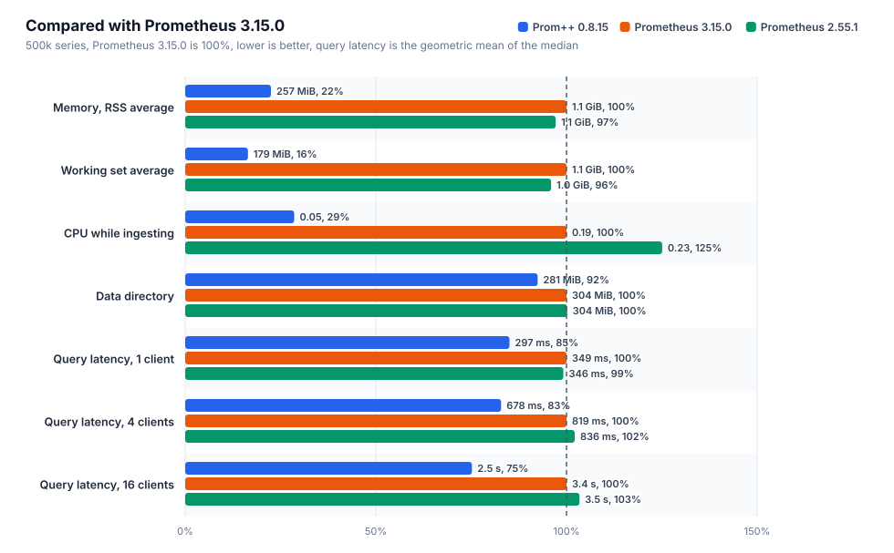
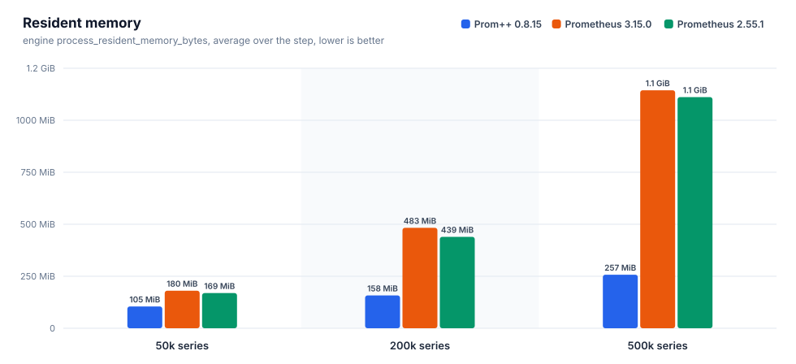
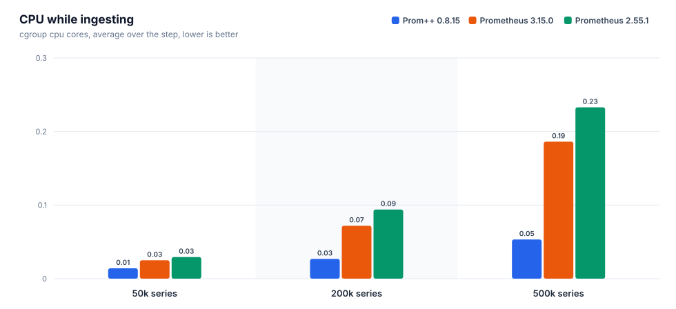
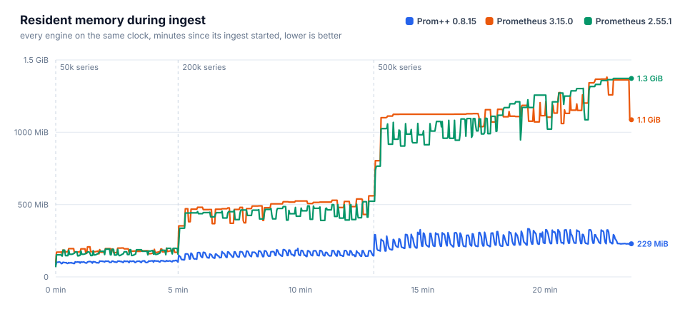
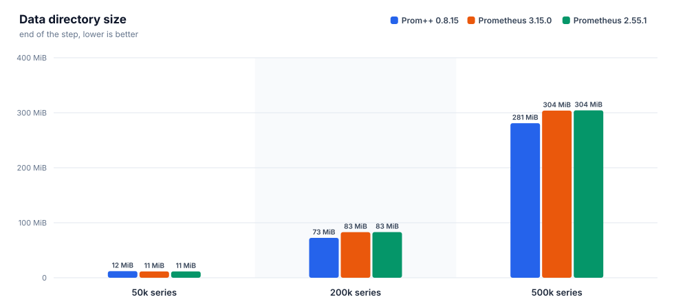
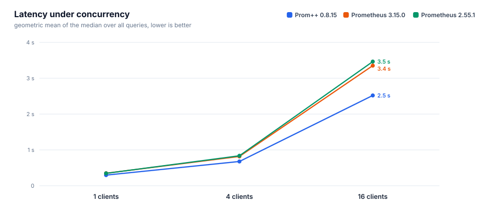
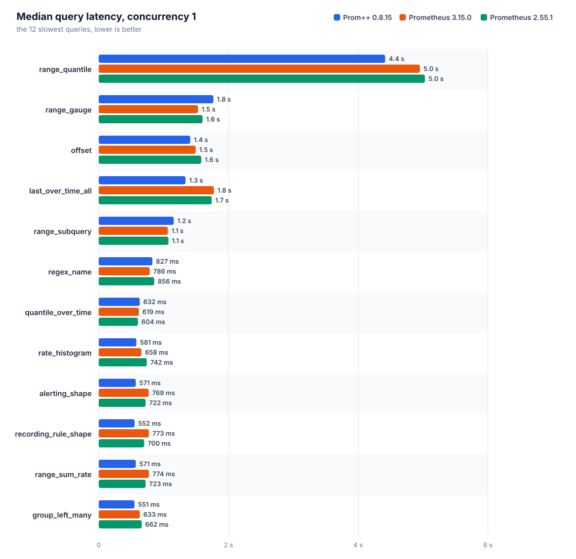
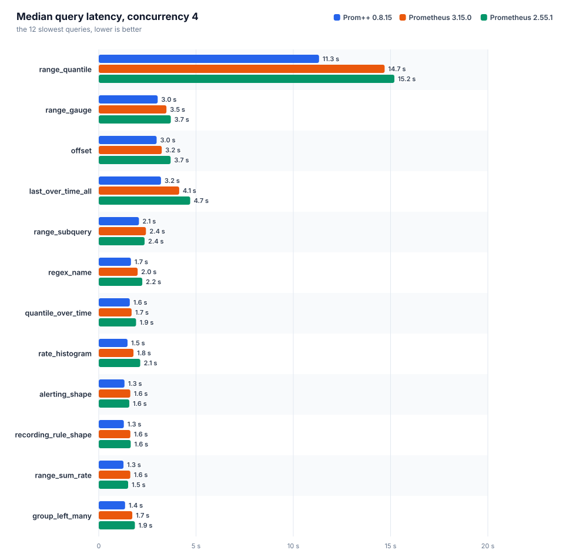
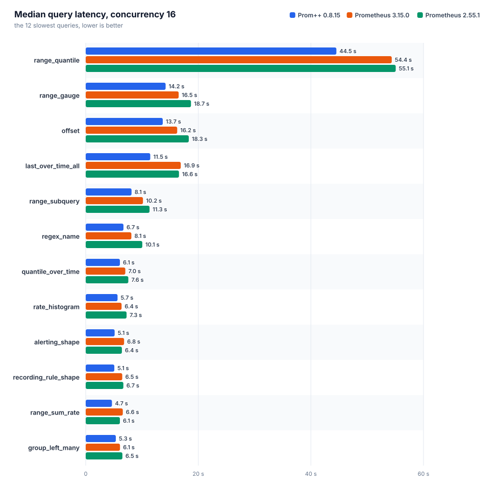

[English](REPORT.md) · **Русский**

# Prom++ против Prometheus

Создано из исходных файлов этой папки. Каждое число ниже взято из файла прогона, вручную ничего не вписано.

Номер прогона: `20261008T010616Z`

## Окружение

| параметр | значение |
|---|---|
| узел | bench-node |
| процессор | AMD EPYC 7713 64-Core Processor |
| ядер | 8 |
| память | 15.6 GiB |
| ядро | 6.8.0-142-generic |
| ОС | Ubuntu 24.04.4 LTS |
| архитектура | amd64 |
| файловая система данных | свободно 151.5 GiB из 177.1 GiB |
| container_runtime | containerd://2.3.4-k3s1.36 |
| instance_type | k3s |
| kubelet_version | v1.36.4+k3s1 |
| operating_system | linux |
| нагрузочный код | harness/b3000ef-7f49340 |

## Движки

Заданные настройки взяты из манифестов, наблюдаемые из runtimeinfo и списка флагов самого движка во время прогона.

| движок | образ | лимит процессора | лимит памяти | окружение | GOMEMLIMIT (факт) | GOMAXPROCS (факт) | сжатие WAL | аргументы | заметки |
|---|---|---|---|---|---|---|---|---|---|
| `prompp-0815` | `mirror.gcr.io/prompp/prompp:0.8.15` | 2.00 cores | 6.0 GiB | `GOMEMLIMIT=5529MiB GOMAXPROCS=2` | 5.4 GiB | 2 | true | `--config.file=... --storage.tsdb.path=... --web.enable-remote-write-receiver --web.enable-lifecycle` | C++ head and WAL |
| `prom-3150` | `quay.io/prometheus/prometheus:v3.15.0` | 2.00 cores | 6.0 GiB | `GOMEMLIMIT=5529MiB GOMAXPROCS=2` | 5.4 GiB | 2 | true | `--config.file=... --storage.tsdb.path=... --web.enable-remote-write-receiver --web.enable-lifecycle` | upstream latest |
| `prom-2551` | `quay.io/prometheus/prometheus:v2.55.1` | 2.00 cores | 6.0 GiB | `GOMEMLIMIT=5529MiB GOMAXPROCS=2` | 5.4 GiB | 2 | true | `--config.file=... --storage.tsdb.path=... --web.enable-remote-write-receiver --web.enable-lifecycle` | closed range selectors, the semantics before 3.0 |

## Запись и память head











### prom-2551

Интервал 15 с, пачка 5000 серий, потоков 4, отправлено точек 27400000, из них потеряно 0.

| активных серий | точек/с | серий в head | чанков | RSS ср. | RSS p95 | RSS макс. | рабочий набор макс. | ядер ср. | ядер макс. | каталог данных | WAL | RSS/серия | диск/серия |
|---|---|---|---|---|---|---|---|---|---|---|---|---|---|
| 50000 | 3333 | 50000 | 50000 | 169.1 MiB | 197.4 MiB | 197.6 MiB | 144.8 MiB | 0.03 | 0.39 | 11.5 MiB | 11.5 MiB | 3.2 KiB | 241 B |
| 200000 | 13333 | 200000 | 200000 | 439.3 MiB | 502.5 MiB | 523.0 MiB | 473.0 MiB | 0.09 | 1.48 | 82.9 MiB | 82.9 MiB | 2.7 KiB | 434 B |
| 500000 | 33333 | 500000 | 500000 | 1.1 GiB | 1.3 GiB | 1.3 GiB | 1.3 GiB | 0.23 | 3.74 | 304.4 MiB | 304.3 MiB | 2.8 KiB | 638 B |

| активных серий | прошло / план | запрос записи p50 | p99 | 2xx | 4xx | 5xx | ошибки клиента |
|---|---|---|---|---|---|---|---|
| 50000 | 300 s / 300 s | 57 ms | 118 ms | 200 | 0 | 0 | 0 |
| 200000 | 480 s / 480 s | 32 ms | 199 ms | 1280 | 0 | 0 | 0 |
| 500000 | 600 s / 600 s | 28 ms | 254 ms | 4000 | 0 | 0 | 0 |

### prom-3150

Интервал 15 с, пачка 5000 серий, потоков 4, отправлено точек 27400000, из них потеряно 0.

| активных серий | точек/с | серий в head | чанков | RSS ср. | RSS p95 | RSS макс. | рабочий набор макс. | ядер ср. | ядер макс. | каталог данных | WAL | RSS/серия | диск/серия |
|---|---|---|---|---|---|---|---|---|---|---|---|---|---|
| 50000 | 3333 | 50000 | 50000 | 180.3 MiB | 199.6 MiB | 207.5 MiB | 150.1 MiB | 0.03 | 0.39 | 11.5 MiB | 11.5 MiB | 3.5 KiB | 241 B |
| 200000 | 13333 | 200000 | 200000 | 482.7 MiB | 538.7 MiB | 560.7 MiB | 505.9 MiB | 0.07 | 1.27 | 82.8 MiB | 82.8 MiB | 2.9 KiB | 434 B |
| 500000 | 33333 | 500000 | 500000 | 1.1 GiB | 1.3 GiB | 1.3 GiB | 1.3 GiB | 0.19 | 2.49 | 303.9 MiB | 303.9 MiB | 2.8 KiB | 637 B |

| активных серий | прошло / план | запрос записи p50 | p99 | 2xx | 4xx | 5xx | ошибки клиента |
|---|---|---|---|---|---|---|---|
| 50000 | 300 s / 300 s | 42 ms | 102 ms | 200 | 0 | 0 | 0 |
| 200000 | 480 s / 480 s | 35 ms | 122 ms | 1280 | 0 | 0 | 0 |
| 500000 | 600 s / 600 s | 31 ms | 180 ms | 4000 | 0 | 0 | 0 |

### prompp-0815

Интервал 15 с, пачка 5000 серий, потоков 4, отправлено точек 27400000, из них потеряно 0.

| активных серий | точек/с | серий в head | чанков | RSS ср. | RSS p95 | RSS макс. | рабочий набор макс. | ядер ср. | ядер макс. | каталог данных | WAL | RSS/серия | диск/серия |
|---|---|---|---|---|---|---|---|---|---|---|---|---|---|
| 50000 | 3333 | 50000 | 50000 | 104.6 MiB | 111.5 MiB | 114.3 MiB | 47.0 MiB | 0.01 | 0.18 | 12.0 MiB | 4.0 KiB | 2.1 KiB | 252 B |
| 200000 | 13333 | 200000 | 200000 | 157.7 MiB | 182.3 MiB | 196.7 MiB | 121.2 MiB | 0.03 | 0.41 | 72.5 MiB | 4.0 KiB | 765 B | 380 B |
| 500000 | 33333 | 500000 | 500000 | 257.4 MiB | 323.8 MiB | 332.4 MiB | 260.1 MiB | 0.05 | 1.20 | 280.9 MiB | 4.0 KiB | 483 B | 589 B |

| активных серий | прошло / план | запрос записи p50 | p99 | 2xx | 4xx | 5xx | ошибки клиента |
|---|---|---|---|---|---|---|---|
| 50000 | 300 s / 300 s | 11 ms | 62 ms | 200 | 0 | 0 | 0 |
| 200000 | 480 s / 480 s | 11 ms | 65 ms | 1280 | 0 | 0 | 0 |
| 500000 | 600 s / 600 s | 12 ms | 56 ms | 4000 | 0 | 0 | 0 |

### Сравнение

Для всех столбцов с памятью и процессором меньше значит лучше. RSS это `process_resident_memory_bytes` самого движка, рабочий набор это значение cgroup, по которому kubelet выселяет поды и срабатывает OOM.

| активных серий | движок | RSS ср. | байт на серию | рабочий набор макс. | ядер ср. | каталог данных | точек/с |
|---|---|---|---|---|---|---|---|
| 50000 | `prom-2551` | 169.1 MiB | 3.2 KiB | 144.8 MiB | 0.03 | 11.5 MiB | 3333 |
| 50000 | `prom-3150` | 180.3 MiB | 3.5 KiB | 150.1 MiB | 0.03 | 11.5 MiB | 3333 |
| 50000 | `prompp-0815` | 104.6 MiB | 2.1 KiB | 47.0 MiB | 0.01 | 12.0 MiB | 3333 |
| 200000 | `prom-2551` | 439.3 MiB | 2.7 KiB | 473.0 MiB | 0.09 | 82.9 MiB | 13333 |
| 200000 | `prom-3150` | 482.7 MiB | 2.9 KiB | 505.9 MiB | 0.07 | 82.8 MiB | 13333 |
| 200000 | `prompp-0815` | 157.7 MiB | 765 B | 121.2 MiB | 0.03 | 72.5 MiB | 13333 |
| 500000 | `prom-2551` | 1.1 GiB | 2.8 KiB | 1.3 GiB | 0.23 | 304.4 MiB | 33333 |
| 500000 | `prom-3150` | 1.1 GiB | 2.8 KiB | 1.3 GiB | 0.19 | 303.9 MiB | 33333 |
| 500000 | `prompp-0815` | 257.4 MiB | 483 B | 260.1 MiB | 0.05 | 280.9 MiB | 33333 |

На самой большой ступени меньше всего памяти на серию нужно `prompp-0815`: 483 B of resident memory per active series, the lowest of the compared engines.

## Время запросов

Каждый запрос идёт отдельно: один пробный запрос без учёта, затем заданное число потоков повторяет его, пока не истечёт отведённое время и не наберётся минимальное число запросов. `n` это число учтённых запросов. При малом `n` значение p99 близко к максимуму, поэтому сравнивать лучше медиану. Геометрическое среднее учитывает все запросы поровну, поэтому несколько запросов, которые идут секундами, не заглушают остальные.



### Параллельность 1



| движок | набор | запросов | замеров | ошибок | p50 (геом.) | p99 (геом.) | p50 самого медленного | ядер ср. | рабочий набор макс. |
|---|---|---|---|---|---|---|---|---|---|
| `prom-2551` | heavy | 38 | 10908 | 0 | 346 ms | 583 ms | `range_quantile` 5.03 s | 1.21 | 2.0 GiB |
| `prom-3150` | heavy | 38 | 14552 | 0 | 349 ms | 522 ms | `range_quantile` 4.95 s | 1.14 | 1.8 GiB |
| `prompp-0815` | heavy | 38 | 10535 | 0 | 297 ms | 346 ms | `range_quantile` 4.42 s | 1.35 | 628.0 MiB |

| query | type | `prom-2551` p50 / p99 (n) | `prom-3150` p50 / p99 (n) | `prompp-0815` p50 / p99 (n) | fastest p50 |
|---|---|---|---|---|---|
| `absent` | instant | 0.4 ms / 11 ms (9450) | 0.4 ms / 8.5 ms (13043) | 0.8 ms / 3.1 ms (8586) | `prom-2551` |
| `alerting_shape` | range | 722 ms / 926 ms (14) | 769 ms / 912 ms (13) | 571 ms / 607 ms (18) | `prompp-0815` |
| `avg_over_pods` | instant | 217 ms / 378 ms (43) | 221 ms / 361 ms (43) | 136 ms / 156 ms (74) | `prompp-0815` |
| `avg_over_time` | instant | 391 ms / 619 ms (25) | 389 ms / 531 ms (25) | 377 ms / 393 ms (27) | `prompp-0815` |
| `binary_scalar` | instant | 420 ms / 627 ms (23) | 425 ms / 571 ms (23) | 265 ms / 316 ms (38) | `prompp-0815` |
| `bottomk` | instant | 204 ms / 351 ms (45) | 213 ms / 345 ms (44) | 144 ms / 181 ms (70) | `prompp-0815` |
| `clamp` | instant | 350 ms / 549 ms (27) | 359 ms / 514 ms (27) | 404 ms / 446 ms (25) | `prom-2551` |
| `count_by_job` | instant | 217 ms / 373 ms (43) | 222 ms / 385 ms (43) | 133 ms / 205 ms (74) | `prompp-0815` |
| `count_values` | instant | 348 ms / 599 ms (26) | 350 ms / 504 ms (27) | 315 ms / 363 ms (32) | `prompp-0815` |
| `double_subquery` | range | 504 ms / 798 ms (19) | 528 ms / 710 ms (19) | 423 ms / 479 ms (24) | `prompp-0815` |
| `group_left_many` | instant | 662 ms / 891 ms (14) | 633 ms / 803 ms (16) | 551 ms / 593 ms (19) | `prompp-0815` |
| `increase` | instant | 359 ms / 598 ms (26) | 377 ms / 523 ms (26) | 354 ms / 370 ms (29) | `prompp-0815` |
| `irate` | instant | 264 ms / 477 ms (35) | 261 ms / 377 ms (37) | 270 ms / 287 ms (37) | `prom-3150` |
| `join` | instant | 421 ms / 622 ms (23) | 409 ms / 559 ms (24) | 263 ms / 323 ms (38) | `prompp-0815` |
| `label_replace` | instant | 317 ms / 533 ms (30) | 320 ms / 407 ms (30) | 326 ms / 363 ms (31) | `prom-2551` |
| `last_over_time_all` | instant | 1.74 s / 2.01 s (6) | 1.78 s / 1.91 s (6) | 1.34 s / 1.47 s (8) | `prompp-0815` |
| `matchers_numeric` | instant | 276 ms / 477 ms (33) | 273 ms / 442 ms (35) | 257 ms / 276 ms (39) | `prompp-0815` |
| `max_over_time` | instant | 383 ms / 623 ms (25) | 403 ms / 556 ms (24) | 388 ms / 420 ms (26) | `prom-2551` |
| `nested_aggregate` | instant | 200 ms / 413 ms (46) | 209 ms / 326 ms (46) | 146 ms / 175 ms (68) | `prompp-0815` |
| `offset` | range | 1.58 s / 2.16 s (6) | 1.49 s / 1.91 s (7) | 1.41 s / 1.84 s (7) | `prompp-0815` |
| `or_fallback` | instant | 335 ms / 535 ms (28) | 351 ms / 472 ms (28) | 343 ms / 370 ms (30) | `prom-2551` |
| `quantile_over_time` | instant | 604 ms / 1.01 s (15) | 619 ms / 840 ms (16) | 632 ms / 687 ms (16) | `prom-2551` |
| `range_gauge` | range | 1.60 s / 2.05 s (6) | 1.53 s / 1.87 s (7) | 1.77 s / 1.92 s (6) | `prom-3150` |
| `range_quantile` | range | 5.03 s / 5.24 s (5) | 4.95 s / 5.11 s (5) | 4.42 s / 4.43 s (5) | `prompp-0815` |
| `range_subquery` | range | 1.07 s / 1.51 s (9) | 1.07 s / 1.20 s (10) | 1.16 s / 1.21 s (9) | `prom-3150` |
| `range_sum_rate` | range | 723 ms / 1000 ms (14) | 774 ms / 914 ms (13) | 571 ms / 621 ms (18) | `prompp-0815` |
| `rate` | instant | 306 ms / 545 ms (31) | 304 ms / 436 ms (32) | 296 ms / 312 ms (34) | `prompp-0815` |
| `rate_histogram` | instant | 742 ms / 936 ms (14) | 658 ms / 819 ms (15) | 581 ms / 626 ms (18) | `prompp-0815` |
| `recording_rule_shape` | range | 700 ms / 985 ms (14) | 773 ms / 949 ms (13) | 552 ms / 600 ms (18) | `prompp-0815` |
| `regex_name` | instant | 856 ms / 1.21 s (12) | 786 ms / 961 ms (13) | 827 ms / 883 ms (13) | `prom-3150` |
| `selector` | instant | 297 ms / 514 ms (32) | 296 ms / 451 ms (32) | 315 ms / 346 ms (33) | `prom-3150` |
| `selector_labels` | instant | 17 ms / 37 ms (532) | 16 ms / 35 ms (572) | 15 ms / 20 ms (682) | `prompp-0815` |
| `sort_desc` | instant | 216 ms / 369 ms (44) | 221 ms / 374 ms (43) | 135 ms / 157 ms (74) | `prompp-0815` |
| `stddev` | instant | 217 ms / 365 ms (43) | 218 ms / 356 ms (44) | 134 ms / 162 ms (75) | `prompp-0815` |
| `sum` | instant | 204 ms / 377 ms (46) | 208 ms / 303 ms (47) | 136 ms / 153 ms (74) | `prompp-0815` |
| `sum_by_namespace` | instant | 219 ms / 372 ms (43) | 221 ms / 356 ms (43) | 141 ms / 168 ms (70) | `prompp-0815` |
| `topk` | instant | 207 ms / 326 ms (45) | 211 ms / 372 ms (45) | 141 ms / 160 ms (71) | `prompp-0815` |
| `vector_matching` | instant | 581 ms / 822 ms (16) | 611 ms / 721 ms (16) | 539 ms / 573 ms (19) | `prompp-0815` |

### Параллельность 4



| движок | набор | запросов | замеров | ошибок | p50 (геом.) | p99 (геом.) | p50 самого медленного | ядер ср. | рабочий набор макс. |
|---|---|---|---|---|---|---|---|---|---|
| `prom-2551` | heavy | 38 | 15892 | 0 | 836 ms | 1.53 s | `range_quantile` 15.20 s | 1.92 | 2.9 GiB |
| `prom-3150` | heavy | 38 | 21130 | 0 | 819 ms | 1.30 s | `range_quantile` 14.69 s | 1.89 | 2.9 GiB |
| `prompp-0815` | heavy | 38 | 19369 | 0 | 678 ms | 919 ms | `range_quantile` 11.32 s | 1.89 | 1.2 GiB |

| query | type | `prom-2551` p50 / p99 (n) | `prom-3150` p50 / p99 (n) | `prompp-0815` p50 / p99 (n) | fastest p50 |
|---|---|---|---|---|---|
| `absent` | instant | 0.7 ms / 30 ms (13449) | 0.7 ms / 18 ms (18519) | 2.1 ms / 8.1 ms (16124) | `prom-2551` |
| `alerting_shape` | range | 1.57 s / 2.54 s (24) | 1.62 s / 2.15 s (24) | 1.32 s / 1.60 s (32) | `prompp-0815` |
| `avg_over_pods` | instant | 502 ms / 1.03 s (70) | 492 ms / 825 ms (75) | 344 ms / 498 ms (116) | `prompp-0815` |
| `avg_over_time` | instant | 842 ms / 1.53 s (43) | 866 ms / 1.38 s (44) | 750 ms / 933 ms (54) | `prompp-0815` |
| `binary_scalar` | instant | 949 ms / 1.44 s (40) | 1.06 s / 1.53 s (40) | 666 ms / 912 ms (61) | `prompp-0815` |
| `bottomk` | instant | 484 ms / 1.09 s (70) | 533 ms / 894 ms (73) | 380 ms / 519 ms (107) | `prompp-0815` |
| `clamp` | instant | 1.11 s / 1.36 s (40) | 892 ms / 1.32 s (46) | 767 ms / 1.05 s (53) | `prompp-0815` |
| `count_by_job` | instant | 521 ms / 931 ms (68) | 488 ms / 868 ms (77) | 354 ms / 520 ms (112) | `prompp-0815` |
| `count_values` | instant | 1.03 s / 1.37 s (41) | 933 ms / 1.30 s (46) | 781 ms / 1.06 s (52) | `prompp-0815` |
| `double_subquery` | range | 1.09 s / 1.87 s (34) | 1.17 s / 1.72 s (33) | 950 ms / 1.12 s (44) | `prompp-0815` |
| `group_left_many` | instant | 1.86 s / 2.61 s (24) | 1.73 s / 2.06 s (24) | 1.35 s / 1.53 s (32) | `prompp-0815` |
| `increase` | instant | 858 ms / 1.39 s (45) | 848 ms / 1.21 s (44) | 768 ms / 1.07 s (54) | `prompp-0815` |
| `irate` | instant | 620 ms / 1.24 s (58) | 612 ms / 1.11 s (59) | 561 ms / 788 ms (74) | `prompp-0815` |
| `join` | instant | 1.12 s / 2.03 s (37) | 1.01 s / 1.36 s (40) | 665 ms / 832 ms (61) | `prompp-0815` |
| `label_replace` | instant | 766 ms / 1.37 s (49) | 729 ms / 1.11 s (52) | 620 ms / 825 ms (66) | `prompp-0815` |
| `last_over_time_all` | instant | 4.70 s / 5.45 s (10) | 4.14 s / 4.83 s (12) | 3.20 s / 3.66 s (16) | `prompp-0815` |
| `matchers_numeric` | instant | 729 ms / 1.23 s (54) | 710 ms / 1.08 s (57) | 586 ms / 790 ms (69) | `prompp-0815` |
| `max_over_time` | instant | 834 ms / 1.60 s (42) | 908 ms / 1.38 s (42) | 773 ms / 1.01 s (52) | `prompp-0815` |
| `nested_aggregate` | instant | 500 ms / 1.12 s (69) | 510 ms / 900 ms (74) | 386 ms / 537 ms (106) | `prompp-0815` |
| `offset` | range | 3.69 s / 4.94 s (12) | 3.24 s / 4.43 s (13) | 2.98 s / 3.71 s (16) | `prompp-0815` |
| `or_fallback` | instant | 779 ms / 1.47 s (46) | 852 ms / 1.30 s (47) | 700 ms / 893 ms (59) | `prompp-0815` |
| `quantile_over_time` | instant | 1.92 s / 2.53 s (22) | 1.69 s / 1.89 s (25) | 1.60 s / 2.00 s (27) | `prompp-0815` |
| `range_gauge` | range | 3.70 s / 5.57 s (12) | 3.48 s / 4.23 s (12) | 3.03 s / 4.08 s (14) | `prompp-0815` |
| `range_quantile` | range | 15.20 s / 15.45 s (5) | 14.69 s / 14.76 s (5) | 11.32 s / 11.51 s (5) | `prompp-0815` |
| `range_subquery` | range | 2.36 s / 2.99 s (18) | 2.42 s / 3.23 s (18) | 2.07 s / 2.48 s (21) | `prompp-0815` |
| `range_sum_rate` | range | 1.51 s / 2.37 s (27) | 1.62 s / 2.25 s (25) | 1.27 s / 1.43 s (32) | `prompp-0815` |
| `rate` | instant | 753 ms / 1.23 s (51) | 682 ms / 1.10 s (54) | 617 ms / 786 ms (66) | `prompp-0815` |
| `rate_histogram` | instant | 2.13 s / 2.66 s (20) | 1.78 s / 1.99 s (24) | 1.48 s / 1.61 s (28) | `prompp-0815` |
| `recording_rule_shape` | range | 1.64 s / 2.38 s (24) | 1.63 s / 2.29 s (24) | 1.29 s / 1.63 s (32) | `prompp-0815` |
| `regex_name` | instant | 2.24 s / 2.96 s (20) | 2.00 s / 2.32 s (22) | 1.66 s / 2.15 s (25) | `prompp-0815` |
| `selector` | instant | 653 ms / 1.17 s (55) | 667 ms / 1.11 s (57) | 558 ms / 859 ms (70) | `prompp-0815` |
| `selector_labels` | instant | 33 ms / 144 ms (926) | 34 ms / 107 ms (1016) | 35 ms / 81 ms (1087) | `prom-2551` |
| `sort_desc` | instant | 498 ms / 964 ms (73) | 519 ms / 938 ms (73) | 345 ms / 522 ms (116) | `prompp-0815` |
| `stddev` | instant | 496 ms / 1.08 s (72) | 525 ms / 802 ms (75) | 340 ms / 470 ms (117) | `prompp-0815` |
| `sum` | instant | 489 ms / 1.05 s (73) | 470 ms / 802 ms (79) | 343 ms / 450 ms (118) | `prompp-0815` |
| `sum_by_namespace` | instant | 495 ms / 1.02 s (73) | 483 ms / 903 ms (75) | 365 ms / 530 ms (110) | `prompp-0815` |
| `topk` | instant | 516 ms / 1.06 s (70) | 504 ms / 852 ms (78) | 384 ms / 541 ms (105) | `prompp-0815` |
| `vector_matching` | instant | 1.64 s / 2.20 s (26) | 1.57 s / 1.83 s (27) | 1.21 s / 1.46 s (36) | `prompp-0815` |

### Параллельность 16



| движок | набор | запросов | замеров | ошибок | p50 (геом.) | p99 (геом.) | p50 самого медленного | ядер ср. | рабочий набор макс. |
|---|---|---|---|---|---|---|---|---|---|
| `prom-2551` | heavy | 38 | 20644 | 0 | 3.47 s | 4.84 s | `range_quantile` 55.07 s | 1.91 | 5.4 GiB |
| `prom-3150` | heavy | 38 | 22828 | 0 | 3.35 s | 4.67 s | `range_quantile` 54.37 s | 1.91 | 5.4 GiB |
| `prompp-0815` | heavy | 38 | 17123 | 0 | 2.52 s | 3.48 s | `range_quantile` 44.53 s | 1.93 | 4.0 GiB |

| query | type | `prom-2551` p50 / p99 (n) | `prom-3150` p50 / p99 (n) | `prompp-0815` p50 / p99 (n) | fastest p50 |
|---|---|---|---|---|---|
| `absent` | instant | 2.7 ms / 111 ms (17769) | 3.1 ms / 60 ms (19966) | 10 ms / 37 ms (13330) | `prom-2551` |
| `alerting_shape` | range | 6.43 s / 7.36 s (32) | 6.82 s / 7.52 s (32) | 5.14 s / 5.87 s (34) | `prompp-0815` |
| `avg_over_pods` | instant | 2.25 s / 3.09 s (76) | 2.23 s / 3.02 s (80) | 1.23 s / 1.95 s (134) | `prompp-0815` |
| `avg_over_time` | instant | 3.64 s / 4.51 s (49) | 3.52 s / 4.48 s (49) | 2.88 s / 3.45 s (64) | `prompp-0815` |
| `binary_scalar` | instant | 4.11 s / 5.31 s (48) | 3.99 s / 5.32 s (48) | 2.39 s / 3.14 s (72) | `prompp-0815` |
| `bottomk` | instant | 2.27 s / 3.25 s (80) | 2.18 s / 3.19 s (82) | 1.27 s / 1.89 s (130) | `prompp-0815` |
| `clamp` | instant | 3.77 s / 4.55 s (48) | 3.41 s / 4.32 s (53) | 2.66 s / 3.58 s (67) | `prompp-0815` |
| `count_by_job` | instant | 2.33 s / 2.97 s (79) | 2.00 s / 2.62 s (86) | 1.18 s / 1.87 s (136) | `prompp-0815` |
| `count_values` | instant | 3.91 s / 4.85 s (48) | 3.59 s / 4.80 s (49) | 2.89 s / 4.08 s (63) | `prompp-0815` |
| `double_subquery` | range | 4.58 s / 5.22 s (48) | 4.95 s / 5.72 s (38) | 3.52 s / 4.34 s (48) | `prompp-0815` |
| `group_left_many` | instant | 6.51 s / 7.75 s (32) | 6.09 s / 7.02 s (32) | 5.35 s / 6.69 s (32) | `prompp-0815` |
| `increase` | instant | 3.22 s / 4.15 s (56) | 3.56 s / 4.23 s (49) | 2.94 s / 3.52 s (64) | `prompp-0815` |
| `irate` | instant | 2.64 s / 3.42 s (66) | 2.69 s / 3.90 s (66) | 1.93 s / 3.19 s (88) | `prompp-0815` |
| `join` | instant | 3.95 s / 5.14 s (48) | 3.97 s / 4.95 s (48) | 2.28 s / 3.07 s (77) | `prompp-0815` |
| `label_replace` | instant | 3.19 s / 3.92 s (56) | 2.89 s / 4.30 s (60) | 2.19 s / 3.08 s (80) | `prompp-0815` |
| `last_over_time_all` | instant | 16.56 s / 17.44 s (16) | 16.89 s / 17.20 s (16) | 11.46 s / 11.87 s (16) | `prompp-0815` |
| `matchers_numeric` | instant | 2.82 s / 4.10 s (66) | 2.82 s / 3.92 s (64) | 2.14 s / 2.77 s (80) | `prompp-0815` |
| `max_over_time` | instant | 3.57 s / 4.70 s (48) | 3.78 s / 4.48 s (48) | 2.88 s / 4.10 s (65) | `prompp-0815` |
| `nested_aggregate` | instant | 2.02 s / 2.66 s (83) | 2.14 s / 3.10 s (80) | 1.23 s / 2.03 s (132) | `prompp-0815` |
| `offset` | range | 18.30 s / 18.56 s (16) | 16.25 s / 16.56 s (16) | 13.69 s / 13.84 s (16) | `prompp-0815` |
| `or_fallback` | instant | 3.37 s / 4.13 s (52) | 3.33 s / 4.34 s (55) | 2.41 s / 3.44 s (73) | `prompp-0815` |
| `quantile_over_time` | instant | 7.56 s / 9.10 s (32) | 7.04 s / 8.23 s (32) | 6.07 s / 8.02 s (32) | `prompp-0815` |
| `range_gauge` | range | 18.70 s / 18.89 s (16) | 16.51 s / 16.88 s (16) | 14.19 s / 14.37 s (16) | `prompp-0815` |
| `range_quantile` | range | 55.07 s / 55.29 s (16) | 54.37 s / 54.59 s (16) | 44.53 s / 44.98 s (16) | `prompp-0815` |
| `range_subquery` | range | 11.34 s / 11.56 s (18) | 10.17 s / 11.16 s (21) | 8.14 s / 9.55 s (32) | `prompp-0815` |
| `range_sum_rate` | range | 6.07 s / 7.37 s (32) | 6.59 s / 8.05 s (32) | 4.65 s / 5.48 s (43) | `prompp-0815` |
| `rate` | instant | 3.03 s / 4.75 s (60) | 2.81 s / 3.88 s (62) | 2.22 s / 3.17 s (79) | `prompp-0815` |
| `rate_histogram` | instant | 7.26 s / 9.51 s (32) | 6.37 s / 8.20 s (32) | 5.65 s / 6.89 s (32) | `prompp-0815` |
| `recording_rule_shape` | range | 6.69 s / 7.49 s (32) | 6.49 s / 7.84 s (32) | 5.09 s / 5.73 s (37) | `prompp-0815` |
| `regex_name` | instant | 10.05 s / 11.29 s (20) | 8.11 s / 10.15 s (29) | 6.71 s / 8.49 s (32) | `prompp-0815` |
| `selector` | instant | 3.21 s / 3.85 s (57) | 2.78 s / 3.86 s (64) | 2.12 s / 3.18 s (80) | `prompp-0815` |
| `selector_labels` | instant | 123 ms / 448 ms (1082) | 139 ms / 496 ms (1033) | 124 ms / 310 ms (1212) | `prom-2551` |
| `sort_desc` | instant | 2.22 s / 2.81 s (82) | 2.17 s / 3.06 s (85) | 1.19 s / 1.93 s (140) | `prompp-0815` |
| `stddev` | instant | 2.26 s / 3.06 s (79) | 2.18 s / 2.89 s (80) | 1.17 s / 1.83 s (141) | `prompp-0815` |
| `sum` | instant | 2.13 s / 3.06 s (81) | 1.98 s / 2.75 s (84) | 1.24 s / 1.79 s (137) | `prompp-0815` |
| `sum_by_namespace` | instant | 2.22 s / 2.98 s (80) | 2.07 s / 2.90 s (80) | 1.27 s / 1.89 s (130) | `prompp-0815` |
| `topk` | instant | 2.28 s / 3.64 s (77) | 2.16 s / 2.94 s (81) | 1.28 s / 1.93 s (126) | `prompp-0815` |
| `vector_matching` | instant | 6.27 s / 6.99 s (32) | 5.69 s / 7.48 s (32) | 4.83 s / 6.00 s (37) | `prompp-0815` |

## Совпадение результатов

Все движки получили одни и те же точки, а каждый запрос вычисляется в один и тот же закреплённый момент, так что отличающийся результат указывает на смысловое различие между движками или на потерянные данные. В каждой ячейке sha256 результата, приведённого к единому виду.

Строка с различием значит, что движки по-разному отвечают на одни и те же данные в один и тот же момент. Все такие запросы это `rate` или `_over_time` по диапазону. В Prometheus 3.0 диапазон стал открытым слева: точка ровно на левой границе окна больше не входит в расчёт. PromQL-движок Prom++ 0.8.15 её уже отбрасывает (`promql/engine.go`, `floats[drop].T <= mint`), а 2.55.1 нет (`< mint`). Искусственные точки лежат ровно на границе окна, поэтому 2.55.1 видит на одну точку больше.

| запрос | `prom-2551` | `prom-3150` | `prompp-0815` | совпадает |
|---|---|---|---|---|
| `absent` | ca3d163bab05 (1 series) | ca3d163bab05 (1 series) | ca3d163bab05 (1 series) | да |
| `alerting_shape` | 433e69a3597b (100 series) | e10ba8156cd2 (100 series) | e10ba8156cd2 (100 series) | нет |
| `avg_over_pods` | 4f6b6c188f7f (100 series) | 4f6b6c188f7f (100 series) | 4f6b6c188f7f (100 series) | да |
| `avg_over_time` | f1f392b0c78d (62500 series) | f1f392b0c78d (62500 series) | f1f392b0c78d (62500 series) | да |
| `binary_scalar` | ca3d163bab05 (1 series) | ca3d163bab05 (1 series) | ca3d163bab05 (1 series) | да |
| `bottomk` | 75dc8cd99593 (5 series) | 75dc8cd99593 (5 series) | 75dc8cd99593 (5 series) | да |
| `clamp` | f1f392b0c78d (62500 series) | f1f392b0c78d (62500 series) | f1f392b0c78d (62500 series) | да |
| `count_by_job` | 07c02c1348ea (1 series) | 07c02c1348ea (1 series) | 07c02c1348ea (1 series) | да |
| `count_values` | e792d90cc0a2 (62500 series) | e792d90cc0a2 (62500 series) | e792d90cc0a2 (62500 series) | да |
| `double_subquery` | 83f99d686699 (100 series) | 55416fa4082f (100 series) | 55416fa4082f (100 series) | нет |
| `group_left_many` | f1f392b0c78d (62500 series) | f1f392b0c78d (62500 series) | f1f392b0c78d (62500 series) | да |
| `increase` | 559e24dc9a48 (62500 series) | 559e24dc9a48 (62500 series) | 559e24dc9a48 (62500 series) | да |
| `irate` | 559e24dc9a48 (62500 series) | 559e24dc9a48 (62500 series) | 559e24dc9a48 (62500 series) | да |
| `join` | 4f6b6c188f7f (100 series) | 4f6b6c188f7f (100 series) | 4f6b6c188f7f (100 series) | да |
| `label_replace` | d3ae67deabaa (62500 series) | d3ae67deabaa (62500 series) | d3ae67deabaa (62500 series) | да |
| `last_over_time_all` | ca3d163bab05 (1 series) | ca3d163bab05 (1 series) | ca3d163bab05 (1 series) | да |
| `matchers_numeric` | bf8394774b5f (38487 series) | bf8394774b5f (38487 series) | bf8394774b5f (38487 series) | да |
| `max_over_time` | f1f392b0c78d (62500 series) | f1f392b0c78d (62500 series) | f1f392b0c78d (62500 series) | да |
| `nested_aggregate` | ca3d163bab05 (1 series) | ca3d163bab05 (1 series) | ca3d163bab05 (1 series) | да |
| `offset` | d5542cb672bf (62500 series) | d5542cb672bf (62500 series) | d5542cb672bf (62500 series) | да |
| `or_fallback` | a712401a23e5 (62500 series) | a712401a23e5 (62500 series) | a712401a23e5 (62500 series) | да |
| `quantile_over_time` | f1f392b0c78d (62500 series) | f1f392b0c78d (62500 series) | f1f392b0c78d (62500 series) | да |
| `range_gauge` | d5542cb672bf (62500 series) | d5542cb672bf (62500 series) | d5542cb672bf (62500 series) | да |
| `range_quantile` | 8e52194734df (62500 series) | 4f0d1e3a91e8 (62500 series) | 4f0d1e3a91e8 (62500 series) | нет |
| `range_subquery` | 82623d225556 (62500 series) | 82623d225556 (62500 series) | 82623d225556 (62500 series) | да |
| `range_sum_rate` | 8dcd40399f41 (100 series) | d73a595a3678 (100 series) | d73a595a3678 (100 series) | нет |
| `rate` | 559e24dc9a48 (62500 series) | 559e24dc9a48 (62500 series) | 559e24dc9a48 (62500 series) | да |
| `rate_histogram` | 559e24dc9a48 (62500 series) | 559e24dc9a48 (62500 series) | 559e24dc9a48 (62500 series) | да |
| `recording_rule_shape` | eb8b58afb326 (1 series) | 8476e35ab60f (1 series) | 8476e35ab60f (1 series) | нет |
| `regex_name` | fd6cd5bf0d07 (187500 series) | fd6cd5bf0d07 (187500 series) | fd6cd5bf0d07 (187500 series) | да |
| `selector` | a712401a23e5 (62500 series) | a712401a23e5 (62500 series) | a712401a23e5 (62500 series) | да |
| `selector_labels` | b5f636cb8557 (3125 series) | b5f636cb8557 (3125 series) | b5f636cb8557 (3125 series) | да |
| `sort_desc` | 4f6b6c188f7f (100 series) | 4f6b6c188f7f (100 series) | 4f6b6c188f7f (100 series) | да |
| `stddev` | 4f6b6c188f7f (100 series) | 4f6b6c188f7f (100 series) | 4f6b6c188f7f (100 series) | да |
| `sum` | ca3d163bab05 (1 series) | ca3d163bab05 (1 series) | ca3d163bab05 (1 series) | да |
| `sum_by_namespace` | 4f6b6c188f7f (100 series) | 4f6b6c188f7f (100 series) | 4f6b6c188f7f (100 series) | да |
| `topk` | 77b447784c27 (20 series) | 77b447784c27 (20 series) | 77b447784c27 (20 series) | да |
| `vector_matching` | f1f392b0c78d (62500 series) | f1f392b0c78d (62500 series) | f1f392b0c78d (62500 series) | да |

Совпадают 33 запросов, различаются 5.

## Как воспроизвести

```sh
export BENCH_NODE=<узел>
RUN_ID=20261008T010616Z scripts/node-overlay.sh
scripts/harness.sh
RUN_ID=20261008T010616Z scripts/run.sh
go run ./cmd/report -root results -run 20261008T010616Z
scripts/teardown.sh --yes
```

Правила честного сравнения и то, что может исказить результат, описаны в METHODOLOGY.ru.md.
