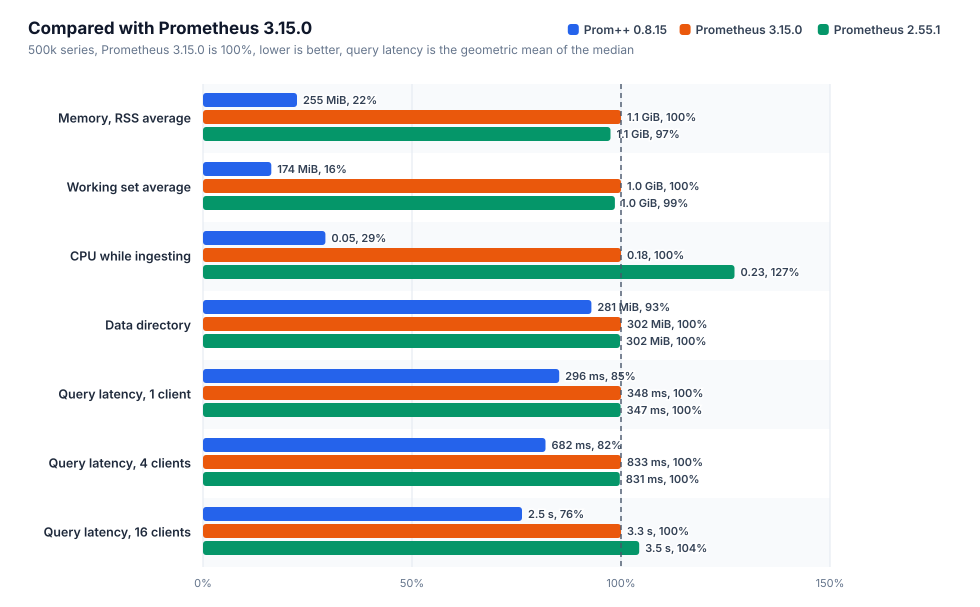
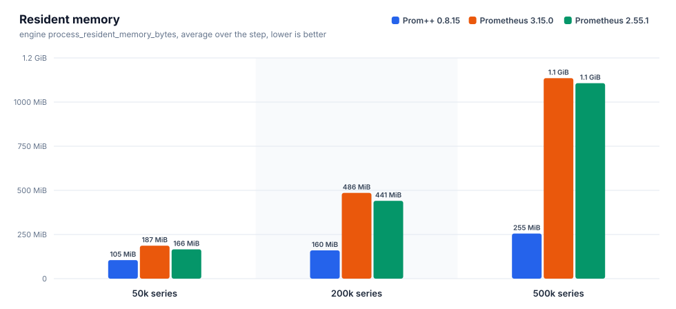
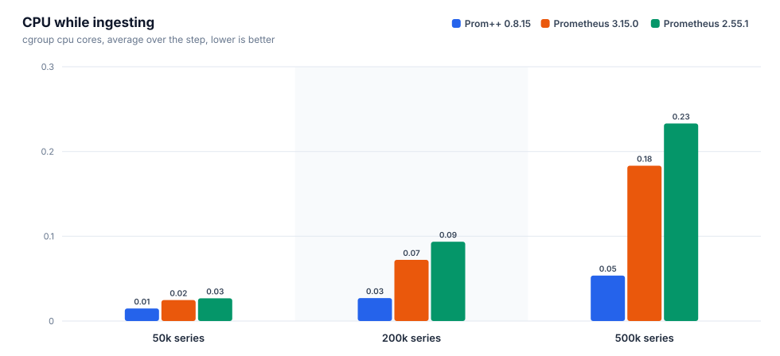
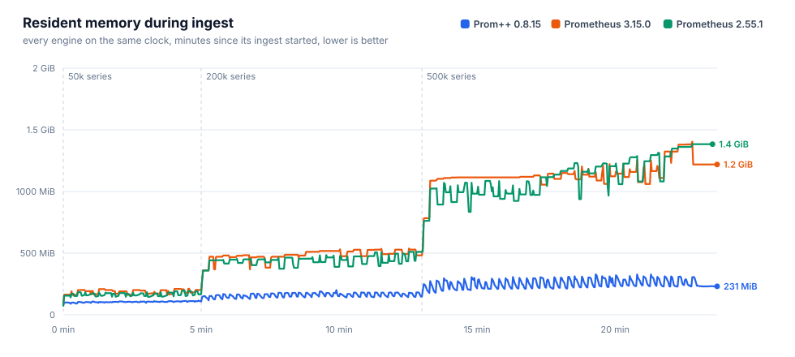
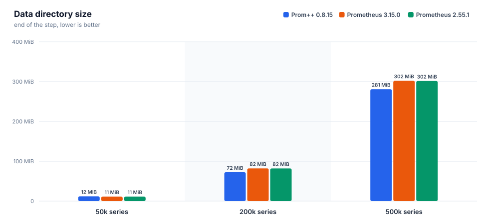
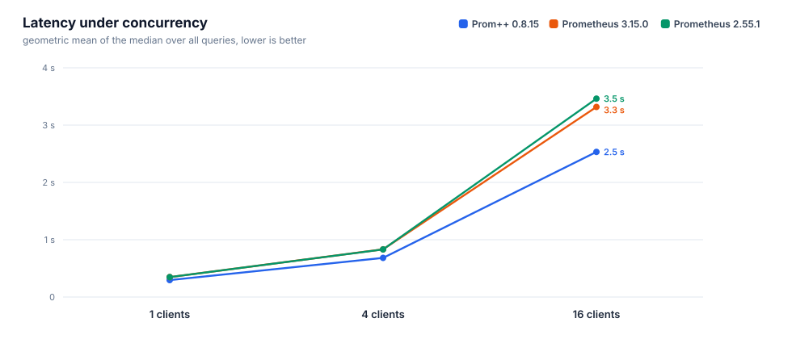
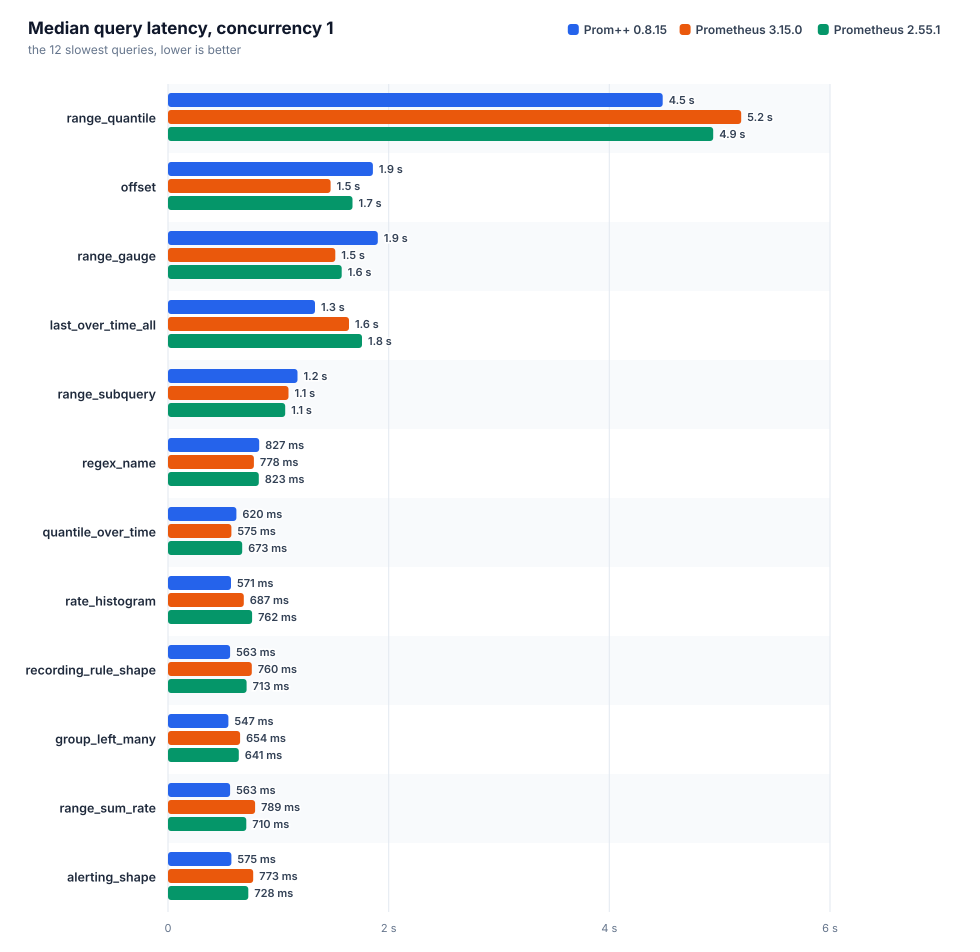
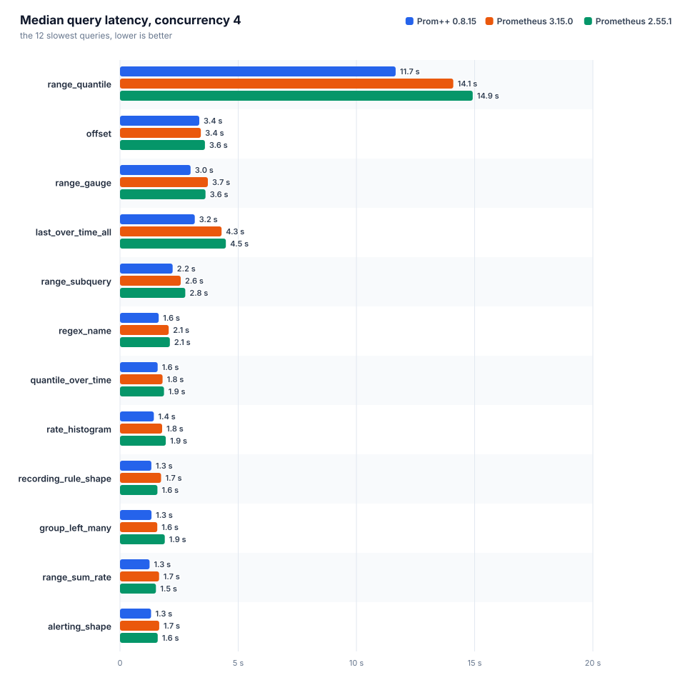
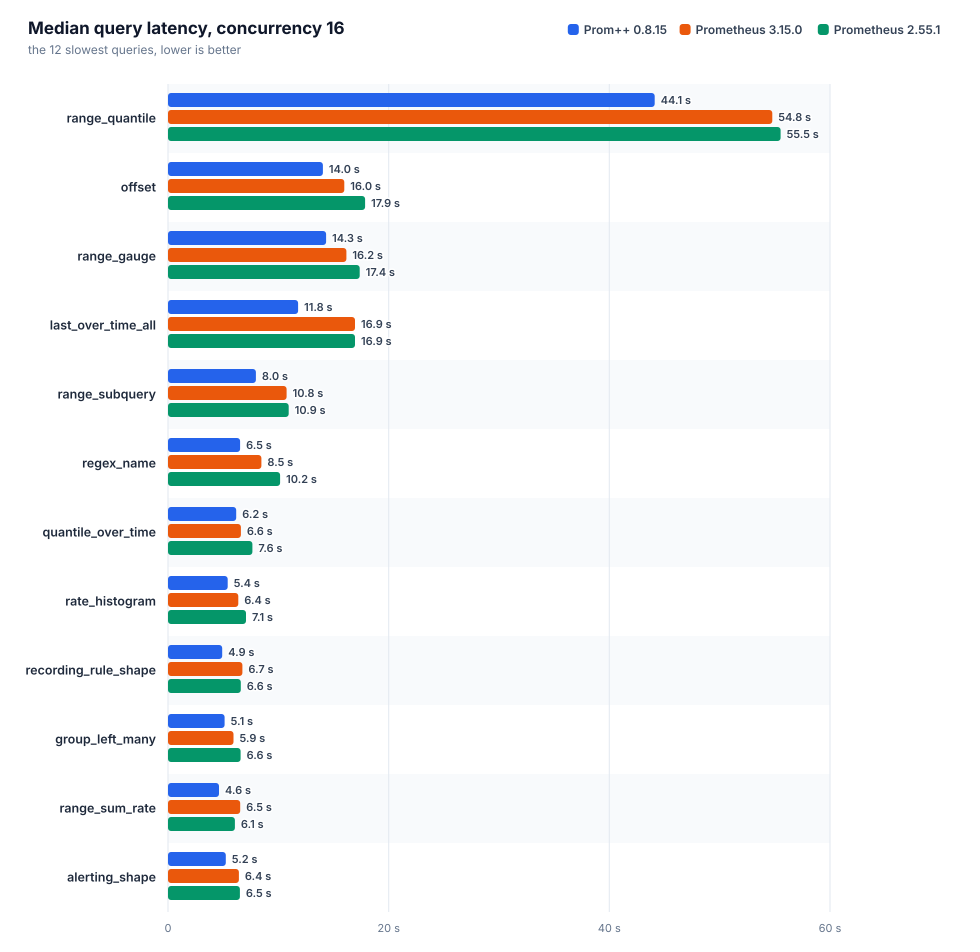

# Prom++ versus Prometheus

Generated from the raw artifacts in this directory. Every number below comes from a file in the run directory, nothing is typed in by hand.

Run id: `20261008T050616Z`

## Environment

| item | value |
|---|---|
| node | bench-node |
| cpu | AMD EPYC 7713 64-Core Processor |
| cores | 8 |
| memory | 15.6 GiB |
| kernel | 6.8.0-142-generic |
| os | Ubuntu 24.04.4 LTS |
| arch | amd64 |
| data filesystem | 151.5 GiB free of 177.1 GiB |
| container_runtime | containerd://2.3.4-k3s1.36 |
| instance_type | k3s |
| kubelet_version | v1.36.4+k3s1 |
| operating_system | linux |
| harness | harness/b3000ef-7f49340 |

## Engines

Declared settings come from the manifests, observed ones from the engine's own runtimeinfo and flags endpoints during the run.

| engine | image | cpu limit | memory limit | env | observed GOMEMLIMIT | observed GOMAXPROCS | WAL compression | args | notes |
|---|---|---|---|---|---|---|---|---|---|
| `prompp-0815` | `mirror.gcr.io/prompp/prompp:0.8.15` | 2.00 cores | 6.0 GiB | `GOMEMLIMIT=5529MiB GOMAXPROCS=2` | 5.4 GiB | 2 | true | `--config.file=... --storage.tsdb.path=... --web.enable-remote-write-receiver --web.enable-lifecycle` | C++ head and WAL |
| `prom-3150` | `quay.io/prometheus/prometheus:v3.15.0` | 2.00 cores | 6.0 GiB | `GOMEMLIMIT=5529MiB GOMAXPROCS=2` | 5.4 GiB | 2 | true | `--config.file=... --storage.tsdb.path=... --web.enable-remote-write-receiver --web.enable-lifecycle` | upstream latest |
| `prom-2551` | `quay.io/prometheus/prometheus:v2.55.1` | 2.00 cores | 6.0 GiB | `GOMEMLIMIT=5529MiB GOMAXPROCS=2` | 5.4 GiB | 2 | true | `--config.file=... --storage.tsdb.path=... --web.enable-remote-write-receiver --web.enable-lifecycle` | closed range selectors, the semantics before 3.0 |

## Ingest and head memory











### prom-2551

Interval 15s, batch 5000 series, 4 workers, 27400000 samples sent, 0 failed.

| active series | samples/s | head series | head chunks | RSS avg | RSS p95 | RSS max | working set max | cpu cores avg | cpu cores max | data dir | WAL | rss/series | disk/series |
|---|---|---|---|---|---|---|---|---|---|---|---|---|---|
| 50000 | 3333 | 50000 | 50000 | 166.1 MiB | 191.3 MiB | 195.8 MiB | 144.1 MiB | 0.03 | 0.35 | 11.3 MiB | 11.3 MiB | 3.4 KiB | 237 B |
| 200000 | 13333 | 200000 | 200000 | 440.5 MiB | 510.5 MiB | 510.6 MiB | 460.9 MiB | 0.09 | 1.47 | 82.0 MiB | 82.0 MiB | 2.6 KiB | 429 B |
| 500000 | 33333 | 500000 | 500000 | 1.1 GiB | 1.3 GiB | 1.4 GiB | 1.3 GiB | 0.23 | 3.66 | 301.6 MiB | 301.6 MiB | 2.8 KiB | 632 B |

| active series | elapsed / planned | write request p50 | p99 | 2xx | 4xx | 5xx | client errors |
|---|---|---|---|---|---|---|---|
| 50000 | 300 s / 300 s | 52 ms | 128 ms | 200 | 0 | 0 | 0 |
| 200000 | 480 s / 480 s | 30 ms | 195 ms | 1280 | 0 | 0 | 0 |
| 500000 | 600 s / 600 s | 28 ms | 247 ms | 4000 | 0 | 0 | 0 |

### prom-3150

Interval 15s, batch 5000 series, 4 workers, 27400000 samples sent, 0 failed.

| active series | samples/s | head series | head chunks | RSS avg | RSS p95 | RSS max | working set max | cpu cores avg | cpu cores max | data dir | WAL | rss/series | disk/series |
|---|---|---|---|---|---|---|---|---|---|---|---|---|---|
| 50000 | 3333 | 50000 | 50000 | 186.8 MiB | 209.8 MiB | 211.5 MiB | 151.8 MiB | 0.02 | 0.37 | 11.4 MiB | 11.4 MiB | 4.1 KiB | 239 B |
| 200000 | 13333 | 200000 | 200000 | 485.6 MiB | 528.6 MiB | 537.4 MiB | 473.2 MiB | 0.07 | 1.00 | 82.2 MiB | 82.1 MiB | 2.5 KiB | 430 B |
| 500000 | 33333 | 500000 | 500000 | 1.1 GiB | 1.3 GiB | 1.4 GiB | 1.3 GiB | 0.18 | 2.64 | 302.3 MiB | 302.3 MiB | 2.5 KiB | 633 B |

| active series | elapsed / planned | write request p50 | p99 | 2xx | 4xx | 5xx | client errors |
|---|---|---|---|---|---|---|---|
| 50000 | 300 s / 300 s | 43 ms | 98 ms | 200 | 0 | 0 | 0 |
| 200000 | 480 s / 480 s | 34 ms | 127 ms | 1280 | 0 | 0 | 0 |
| 500000 | 600 s / 600 s | 32 ms | 185 ms | 4000 | 0 | 0 | 0 |

### prompp-0815

Interval 15s, batch 5000 series, 4 workers, 27400000 samples sent, 0 failed.

| active series | samples/s | head series | head chunks | RSS avg | RSS p95 | RSS max | working set max | cpu cores avg | cpu cores max | data dir | WAL | rss/series | disk/series |
|---|---|---|---|---|---|---|---|---|---|---|---|---|---|
| 50000 | 3333 | 50000 | 50000 | 104.9 MiB | 111.4 MiB | 115.8 MiB | 47.5 MiB | 0.01 | 0.16 | 12.0 MiB | 4.0 KiB | 2.2 KiB | 252 B |
| 200000 | 13333 | 200000 | 200000 | 160.2 MiB | 180.6 MiB | 200.7 MiB | 115.6 MiB | 0.03 | 0.43 | 72.5 MiB | 4.0 KiB | 776 B | 380 B |
| 500000 | 33333 | 500000 | 500000 | 255.4 MiB | 309.4 MiB | 327.7 MiB | 242.6 MiB | 0.05 | 0.88 | 280.9 MiB | 4.0 KiB | 496 B | 589 B |

| active series | elapsed / planned | write request p50 | p99 | 2xx | 4xx | 5xx | client errors |
|---|---|---|---|---|---|---|---|
| 50000 | 300 s / 300 s | 12 ms | 52 ms | 200 | 0 | 0 | 0 |
| 200000 | 480 s / 480 s | 11 ms | 65 ms | 1280 | 0 | 0 | 0 |
| 500000 | 600 s / 600 s | 12 ms | 53 ms | 4000 | 0 | 0 | 0 |

### Comparison

Lower is better for every memory and cpu column. RSS is the engine's own process_resident_memory_bytes, working set is the cgroup figure the kubelet evicts and OOM kills on.

| active series | engine | RSS avg | bytes/series | working set max | cpu cores avg | data dir | samples/s |
|---|---|---|---|---|---|---|---|
| 50000 | `prom-2551` | 166.1 MiB | 3.4 KiB | 144.1 MiB | 0.03 | 11.3 MiB | 3333 |
| 50000 | `prom-3150` | 186.8 MiB | 4.1 KiB | 151.8 MiB | 0.02 | 11.4 MiB | 3333 |
| 50000 | `prompp-0815` | 104.9 MiB | 2.2 KiB | 47.5 MiB | 0.01 | 12.0 MiB | 3333 |
| 200000 | `prom-2551` | 440.5 MiB | 2.6 KiB | 460.9 MiB | 0.09 | 82.0 MiB | 13333 |
| 200000 | `prom-3150` | 485.6 MiB | 2.5 KiB | 473.2 MiB | 0.07 | 82.2 MiB | 13333 |
| 200000 | `prompp-0815` | 160.2 MiB | 776 B | 115.6 MiB | 0.03 | 72.5 MiB | 13333 |
| 500000 | `prom-2551` | 1.1 GiB | 2.8 KiB | 1.3 GiB | 0.23 | 301.6 MiB | 33333 |
| 500000 | `prom-3150` | 1.1 GiB | 2.5 KiB | 1.3 GiB | 0.18 | 302.3 MiB | 33333 |
| 500000 | `prompp-0815` | 255.4 MiB | 496 B | 242.6 MiB | 0.05 | 280.9 MiB | 33333 |

At the largest step, `prompp-0815` needs the least resident memory per series: 496 B of resident memory per active series, the lowest of the compared engines.

## Query latency

Each query runs on its own: one unmeasured warmup request, then the given number of workers repeat it until the time budget is spent and a minimum number of requests finished. `n` is the number of measured requests. With a small `n` the p99 is close to the maximum, so the median is the figure to compare. The geometric mean weighs every query equally, so a few multi second range queries do not drown the rest.



### Concurrency 1



| engine | suite | queries | requests | errors | geomean p50 | geomean p99 | slowest query p50 | cpu cores avg | working set max |
|---|---|---|---|---|---|---|---|---|---|
| `prom-2551` | heavy | 38 | 10942 | 0 | 347 ms | 578 ms | `range_quantile` 4.94 s | 1.22 | 1.8 GiB |
| `prom-3150` | heavy | 38 | 14898 | 0 | 348 ms | 528 ms | `range_quantile` 5.19 s | 1.16 | 1.7 GiB |
| `prompp-0815` | heavy | 38 | 10676 | 0 | 296 ms | 345 ms | `range_quantile` 4.48 s | 1.33 | 638.0 MiB |

| query | type | `prom-2551` p50 / p99 (n) | `prom-3150` p50 / p99 (n) | `prompp-0815` p50 / p99 (n) | fastest p50 |
|---|---|---|---|---|---|
| `absent` | instant | 0.4 ms / 11 ms (9475) | 0.4 ms / 8.3 ms (13399) | 0.9 ms / 2.9 ms (8704) | `prom-2551` |
| `alerting_shape` | range | 728 ms / 1.02 s (14) | 773 ms / 1.01 s (13) | 575 ms / 623 ms (18) | `prompp-0815` |
| `avg_over_pods` | instant | 216 ms / 396 ms (43) | 220 ms / 323 ms (44) | 133 ms / 163 ms (76) | `prompp-0815` |
| `avg_over_time` | instant | 377 ms / 610 ms (26) | 384 ms / 537 ms (25) | 376 ms / 398 ms (27) | `prompp-0815` |
| `binary_scalar` | instant | 417 ms / 618 ms (23) | 428 ms / 603 ms (23) | 268 ms / 320 ms (38) | `prompp-0815` |
| `bottomk` | instant | 209 ms / 367 ms (45) | 210 ms / 347 ms (45) | 138 ms / 161 ms (73) | `prompp-0815` |
| `clamp` | instant | 351 ms / 515 ms (26) | 343 ms / 534 ms (27) | 381 ms / 418 ms (27) | `prom-3150` |
| `count_by_job` | instant | 214 ms / 370 ms (45) | 221 ms / 377 ms (44) | 137 ms / 168 ms (73) | `prompp-0815` |
| `count_values` | instant | 344 ms / 597 ms (26) | 335 ms / 529 ms (28) | 318 ms / 335 ms (32) | `prompp-0815` |
| `double_subquery` | range | 504 ms / 685 ms (20) | 529 ms / 686 ms (19) | 422 ms / 446 ms (24) | `prompp-0815` |
| `group_left_many` | instant | 641 ms / 970 ms (15) | 654 ms / 776 ms (16) | 547 ms / 593 ms (19) | `prompp-0815` |
| `increase` | instant | 359 ms / 621 ms (26) | 378 ms / 521 ms (26) | 353 ms / 385 ms (29) | `prompp-0815` |
| `irate` | instant | 266 ms / 495 ms (34) | 259 ms / 395 ms (37) | 263 ms / 286 ms (38) | `prom-3150` |
| `join` | instant | 415 ms / 577 ms (23) | 411 ms / 525 ms (24) | 252 ms / 311 ms (40) | `prompp-0815` |
| `label_replace` | instant | 318 ms / 497 ms (30) | 317 ms / 444 ms (31) | 308 ms / 350 ms (33) | `prompp-0815` |
| `last_over_time_all` | instant | 1.76 s / 2.13 s (6) | 1.64 s / 1.94 s (6) | 1.33 s / 1.47 s (8) | `prompp-0815` |
| `matchers_numeric` | instant | 277 ms / 462 ms (33) | 279 ms / 407 ms (34) | 249 ms / 300 ms (40) | `prompp-0815` |
| `max_over_time` | instant | 397 ms / 646 ms (25) | 400 ms / 598 ms (24) | 383 ms / 409 ms (27) | `prompp-0815` |
| `nested_aggregate` | instant | 206 ms / 381 ms (45) | 218 ms / 365 ms (44) | 145 ms / 171 ms (69) | `prompp-0815` |
| `offset` | range | 1.67 s / 1.91 s (7) | 1.47 s / 1.79 s (7) | 1.86 s / 1.94 s (6) | `prom-3150` |
| `or_fallback` | instant | 326 ms / 567 ms (28) | 337 ms / 506 ms (28) | 350 ms / 391 ms (29) | `prom-2551` |
| `quantile_over_time` | instant | 673 ms / 930 ms (15) | 575 ms / 779 ms (16) | 620 ms / 666 ms (17) | `prom-3150` |
| `range_gauge` | range | 1.57 s / 2.07 s (6) | 1.52 s / 1.95 s (7) | 1.90 s / 2.02 s (6) | `prom-3150` |
| `range_quantile` | range | 4.94 s / 5.11 s (5) | 5.19 s / 5.24 s (5) | 4.48 s / 4.57 s (5) | `prompp-0815` |
| `range_subquery` | range | 1.06 s / 1.21 s (10) | 1.09 s / 1.25 s (9) | 1.17 s / 1.25 s (9) | `prom-2551` |
| `range_sum_rate` | range | 710 ms / 940 ms (14) | 789 ms / 906 ms (13) | 563 ms / 598 ms (18) | `prompp-0815` |
| `rate` | instant | 307 ms / 524 ms (31) | 298 ms / 447 ms (32) | 292 ms / 318 ms (35) | `prompp-0815` |
| `rate_histogram` | instant | 762 ms / 1.08 s (13) | 687 ms / 791 ms (15) | 571 ms / 625 ms (18) | `prompp-0815` |
| `recording_rule_shape` | range | 713 ms / 951 ms (14) | 760 ms / 979 ms (13) | 563 ms / 617 ms (18) | `prompp-0815` |
| `regex_name` | instant | 823 ms / 1.08 s (12) | 778 ms / 1.11 s (12) | 827 ms / 909 ms (12) | `prom-3150` |
| `selector` | instant | 294 ms / 491 ms (32) | 300 ms / 407 ms (32) | 313 ms / 333 ms (33) | `prom-2551` |
| `selector_labels` | instant | 17 ms / 44 ms (536) | 17 ms / 38 ms (561) | 14 ms / 22 ms (687) | `prompp-0815` |
| `sort_desc` | instant | 215 ms / 348 ms (43) | 224 ms / 385 ms (43) | 137 ms / 153 ms (74) | `prompp-0815` |
| `stddev` | instant | 218 ms / 387 ms (44) | 218 ms / 348 ms (44) | 133 ms / 167 ms (75) | `prompp-0815` |
| `sum` | instant | 202 ms / 372 ms (47) | 207 ms / 350 ms (47) | 135 ms / 179 ms (74) | `prompp-0815` |
| `sum_by_namespace` | instant | 214 ms / 390 ms (44) | 222 ms / 349 ms (43) | 137 ms / 170 ms (72) | `prompp-0815` |
| `topk` | instant | 207 ms / 366 ms (45) | 213 ms / 359 ms (45) | 137 ms / 155 ms (73) | `prompp-0815` |
| `vector_matching` | instant | 644 ms / 856 ms (16) | 598 ms / 718 ms (17) | 516 ms / 556 ms (20) | `prompp-0815` |

### Concurrency 4



| engine | suite | queries | requests | errors | geomean p50 | geomean p99 | slowest query p50 | cpu cores avg | working set max |
|---|---|---|---|---|---|---|---|---|---|
| `prom-2551` | heavy | 38 | 14909 | 0 | 831 ms | 1.49 s | `range_quantile` 14.92 s | 1.90 | 2.9 GiB |
| `prom-3150` | heavy | 38 | 20900 | 0 | 833 ms | 1.32 s | `range_quantile` 14.10 s | 1.93 | 2.8 GiB |
| `prompp-0815` | heavy | 38 | 16858 | 0 | 682 ms | 940 ms | `range_quantile` 11.66 s | 1.90 | 1.2 GiB |

| query | type | `prom-2551` p50 / p99 (n) | `prom-3150` p50 / p99 (n) | `prompp-0815` p50 / p99 (n) | fastest p50 |
|---|---|---|---|---|---|
| `absent` | instant | 0.7 ms / 32 ms (12389) | 0.8 ms / 19 ms (18278) | 2.7 ms / 8.8 ms (13631) | `prom-2551` |
| `alerting_shape` | range | 1.59 s / 2.31 s (24) | 1.66 s / 2.18 s (24) | 1.31 s / 1.51 s (32) | `prompp-0815` |
| `avg_over_pods` | instant | 481 ms / 1.05 s (73) | 527 ms / 897 ms (73) | 359 ms / 525 ms (113) | `prompp-0815` |
| `avg_over_time` | instant | 816 ms / 1.75 s (44) | 903 ms / 1.42 s (44) | 773 ms / 960 ms (53) | `prompp-0815` |
| `binary_scalar` | instant | 1.11 s / 1.67 s (36) | 1.02 s / 1.51 s (39) | 655 ms / 837 ms (62) | `prompp-0815` |
| `bottomk` | instant | 538 ms / 1.10 s (68) | 517 ms / 889 ms (73) | 386 ms / 529 ms (107) | `prompp-0815` |
| `clamp` | instant | 983 ms / 1.28 s (44) | 917 ms / 1.11 s (45) | 749 ms / 931 ms (55) | `prompp-0815` |
| `count_by_job` | instant | 493 ms / 943 ms (77) | 521 ms / 869 ms (74) | 359 ms / 504 ms (112) | `prompp-0815` |
| `count_values` | instant | 982 ms / 1.47 s (42) | 943 ms / 1.22 s (45) | 761 ms / 1.05 s (54) | `prompp-0815` |
| `double_subquery` | range | 1.10 s / 2.05 s (32) | 1.17 s / 1.70 s (35) | 935 ms / 1.49 s (44) | `prompp-0815` |
| `group_left_many` | instant | 1.89 s / 2.31 s (24) | 1.58 s / 2.01 s (27) | 1.33 s / 1.76 s (32) | `prompp-0815` |
| `increase` | instant | 816 ms / 1.47 s (44) | 839 ms / 1.37 s (44) | 762 ms / 974 ms (55) | `prompp-0815` |
| `irate` | instant | 646 ms / 1.16 s (57) | 638 ms / 1.05 s (60) | 550 ms / 868 ms (74) | `prompp-0815` |
| `join` | instant | 1.10 s / 1.58 s (37) | 954 ms / 1.51 s (40) | 664 ms / 879 ms (61) | `prompp-0815` |
| `label_replace` | instant | 744 ms / 1.50 s (50) | 699 ms / 1.09 s (54) | 599 ms / 845 ms (67) | `prompp-0815` |
| `last_over_time_all` | instant | 4.48 s / 4.80 s (12) | 4.30 s / 5.24 s (12) | 3.16 s / 3.70 s (16) | `prompp-0815` |
| `matchers_numeric` | instant | 715 ms / 1.29 s (53) | 721 ms / 1.03 s (56) | 599 ms / 831 ms (67) | `prompp-0815` |
| `max_over_time` | instant | 928 ms / 1.50 s (41) | 965 ms / 1.43 s (41) | 784 ms / 989 ms (53) | `prompp-0815` |
| `nested_aggregate` | instant | 469 ms / 1.01 s (74) | 499 ms / 876 ms (76) | 365 ms / 552 ms (109) | `prompp-0815` |
| `offset` | range | 3.59 s / 4.91 s (12) | 3.42 s / 4.50 s (12) | 3.35 s / 3.90 s (12) | `prompp-0815` |
| `or_fallback` | instant | 814 ms / 1.34 s (48) | 887 ms / 1.18 s (48) | 712 ms / 971 ms (58) | `prompp-0815` |
| `quantile_over_time` | instant | 1.86 s / 2.22 s (24) | 1.80 s / 2.20 s (24) | 1.59 s / 1.80 s (28) | `prompp-0815` |
| `range_gauge` | range | 3.62 s / 4.89 s (12) | 3.72 s / 4.47 s (12) | 2.99 s / 4.12 s (14) | `prompp-0815` |
| `range_quantile` | range | 14.92 s / 15.07 s (5) | 14.10 s / 14.25 s (5) | 11.66 s / 11.84 s (5) | `prompp-0815` |
| `range_subquery` | range | 2.76 s / 3.06 s (16) | 2.57 s / 2.99 s (16) | 2.23 s / 2.55 s (20) | `prompp-0815` |
| `range_sum_rate` | range | 1.52 s / 2.54 s (27) | 1.65 s / 2.16 s (24) | 1.25 s / 1.55 s (32) | `prompp-0815` |
| `rate` | instant | 704 ms / 1.24 s (53) | 704 ms / 1.18 s (55) | 615 ms / 823 ms (67) | `prompp-0815` |
| `rate_histogram` | instant | 1.94 s / 2.16 s (23) | 1.78 s / 2.16 s (24) | 1.43 s / 1.63 s (29) | `prompp-0815` |
| `recording_rule_shape` | range | 1.58 s / 2.42 s (24) | 1.74 s / 2.13 s (24) | 1.33 s / 1.51 s (32) | `prompp-0815` |
| `regex_name` | instant | 2.11 s / 3.14 s (20) | 2.06 s / 3.29 s (20) | 1.64 s / 2.23 s (24) | `prompp-0815` |
| `selector` | instant | 687 ms / 1.25 s (54) | 654 ms / 1.06 s (56) | 596 ms / 895 ms (68) | `prompp-0815` |
| `selector_labels` | instant | 33 ms / 131 ms (972) | 34 ms / 111 ms (1040) | 36 ms / 82 ms (1058) | `prom-2551` |
| `sort_desc` | instant | 471 ms / 983 ms (75) | 484 ms / 820 ms (76) | 343 ms / 533 ms (118) | `prompp-0815` |
| `stddev` | instant | 457 ms / 924 ms (77) | 529 ms / 824 ms (74) | 337 ms / 502 ms (118) | `prompp-0815` |
| `sum` | instant | 523 ms / 922 ms (73) | 473 ms / 872 ms (79) | 327 ms / 451 ms (122) | `prompp-0815` |
| `sum_by_namespace` | instant | 466 ms / 934 ms (78) | 516 ms / 897 ms (72) | 370 ms / 550 ms (109) | `prompp-0815` |
| `topk` | instant | 501 ms / 1.17 s (68) | 536 ms / 919 ms (71) | 355 ms / 529 ms (112) | `prompp-0815` |
| `vector_matching` | instant | 1.62 s / 1.89 s (27) | 1.58 s / 1.83 s (28) | 1.19 s / 1.55 s (35) | `prompp-0815` |

### Concurrency 16



| engine | suite | queries | requests | errors | geomean p50 | geomean p99 | slowest query p50 | cpu cores avg | working set max |
|---|---|---|---|---|---|---|---|---|---|
| `prom-2551` | heavy | 38 | 20970 | 0 | 3.46 s | 4.90 s | `range_quantile` 55.52 s | 1.91 | 5.4 GiB |
| `prom-3150` | heavy | 38 | 22456 | 0 | 3.32 s | 4.60 s | `range_quantile` 54.77 s | 1.93 | 5.4 GiB |
| `prompp-0815` | heavy | 38 | 16906 | 0 | 2.53 s | 3.46 s | `range_quantile` 44.11 s | 1.95 | 4.1 GiB |

| query | type | `prom-2551` p50 / p99 (n) | `prom-3150` p50 / p99 (n) | `prompp-0815` p50 / p99 (n) | fastest p50 |
|---|---|---|---|---|---|
| `absent` | instant | 2.5 ms / 109 ms (18166) | 3.2 ms / 61 ms (19556) | 11 ms / 37 ms (13132) | `prom-2551` |
| `alerting_shape` | range | 6.51 s / 7.42 s (32) | 6.43 s / 7.42 s (32) | 5.23 s / 5.73 s (35) | `prompp-0815` |
| `avg_over_pods` | instant | 2.20 s / 2.96 s (82) | 2.22 s / 3.04 s (81) | 1.25 s / 1.75 s (131) | `prompp-0815` |
| `avg_over_time` | instant | 3.57 s / 5.32 s (48) | 3.63 s / 4.66 s (48) | 2.83 s / 3.67 s (64) | `prompp-0815` |
| `binary_scalar` | instant | 4.27 s / 5.52 s (48) | 3.80 s / 5.35 s (46) | 2.41 s / 3.07 s (73) | `prompp-0815` |
| `bottomk` | instant | 2.28 s / 3.39 s (80) | 2.27 s / 2.95 s (80) | 1.35 s / 2.01 s (122) | `prompp-0815` |
| `clamp` | instant | 3.61 s / 5.05 s (51) | 3.54 s / 4.76 s (50) | 2.71 s / 3.75 s (65) | `prompp-0815` |
| `count_by_job` | instant | 2.07 s / 3.24 s (81) | 2.19 s / 2.84 s (83) | 1.28 s / 2.07 s (129) | `prompp-0815` |
| `count_values` | instant | 3.63 s / 4.54 s (49) | 3.46 s / 4.61 s (53) | 2.92 s / 3.69 s (63) | `prompp-0815` |
| `double_subquery` | range | 5.24 s / 6.04 s (37) | 4.56 s / 5.54 s (45) | 3.60 s / 4.49 s (48) | `prompp-0815` |
| `group_left_many` | instant | 6.58 s / 7.78 s (32) | 5.94 s / 7.53 s (32) | 5.13 s / 6.36 s (34) | `prompp-0815` |
| `increase` | instant | 3.69 s / 4.56 s (49) | 3.54 s / 4.70 s (50) | 2.81 s / 3.50 s (64) | `prompp-0815` |
| `irate` | instant | 2.71 s / 3.38 s (64) | 2.46 s / 3.46 s (70) | 1.93 s / 2.74 s (89) | `prompp-0815` |
| `join` | instant | 4.12 s / 4.98 s (48) | 3.73 s / 4.86 s (49) | 2.31 s / 3.26 s (76) | `prompp-0815` |
| `label_replace` | instant | 3.37 s / 3.85 s (55) | 2.99 s / 3.62 s (62) | 2.18 s / 2.93 s (79) | `prompp-0815` |
| `last_over_time_all` | instant | 16.95 s / 17.39 s (16) | 16.95 s / 17.44 s (16) | 11.79 s / 12.09 s (16) | `prompp-0815` |
| `matchers_numeric` | instant | 2.77 s / 3.89 s (64) | 2.74 s / 3.82 s (63) | 2.08 s / 3.16 s (82) | `prompp-0815` |
| `max_over_time` | instant | 3.67 s / 4.11 s (49) | 3.64 s / 4.56 s (49) | 2.87 s / 3.71 s (64) | `prompp-0815` |
| `nested_aggregate` | instant | 2.23 s / 3.06 s (79) | 2.10 s / 3.07 s (81) | 1.29 s / 2.09 s (129) | `prompp-0815` |
| `offset` | range | 17.87 s / 18.02 s (16) | 15.97 s / 16.16 s (16) | 14.04 s / 14.23 s (16) | `prompp-0815` |
| `or_fallback` | instant | 3.20 s / 4.74 s (54) | 3.47 s / 4.31 s (51) | 2.37 s / 3.63 s (73) | `prompp-0815` |
| `quantile_over_time` | instant | 7.65 s / 9.35 s (32) | 6.61 s / 7.40 s (32) | 6.18 s / 6.97 s (32) | `prompp-0815` |
| `range_gauge` | range | 17.37 s / 17.57 s (16) | 16.17 s / 16.39 s (16) | 14.33 s / 14.47 s (16) | `prompp-0815` |
| `range_quantile` | range | 55.52 s / 55.76 s (16) | 54.77 s / 55.13 s (16) | 44.11 s / 44.48 s (16) | `prompp-0815` |
| `range_subquery` | range | 10.94 s / 11.40 s (18) | 10.75 s / 11.08 s (17) | 7.97 s / 9.16 s (32) | `prompp-0815` |
| `range_sum_rate` | range | 6.06 s / 7.29 s (32) | 6.55 s / 7.65 s (32) | 4.62 s / 5.69 s (45) | `prompp-0815` |
| `rate` | instant | 3.00 s / 4.43 s (61) | 2.73 s / 3.88 s (64) | 2.26 s / 3.01 s (79) | `prompp-0815` |
| `rate_histogram` | instant | 7.07 s / 9.35 s (32) | 6.37 s / 7.63 s (32) | 5.42 s / 6.85 s (33) | `prompp-0815` |
| `recording_rule_shape` | range | 6.59 s / 7.57 s (32) | 6.74 s / 7.73 s (32) | 4.91 s / 5.28 s (42) | `prompp-0815` |
| `regex_name` | instant | 10.16 s / 11.18 s (21) | 8.47 s / 10.46 s (27) | 6.54 s / 8.61 s (32) | `prompp-0815` |
| `selector` | instant | 2.98 s / 4.27 s (62) | 2.76 s / 4.18 s (65) | 2.15 s / 3.08 s (81) | `prompp-0815` |
| `selector_labels` | instant | 143 ms / 449 ms (1004) | 140 ms / 422 ms (1053) | 128 ms / 328 ms (1204) | `prompp-0815` |
| `sort_desc` | instant | 2.20 s / 2.92 s (83) | 2.12 s / 2.66 s (85) | 1.20 s / 1.78 s (140) | `prompp-0815` |
| `stddev` | instant | 2.19 s / 3.16 s (80) | 2.10 s / 2.75 s (81) | 1.23 s / 1.76 s (136) | `prompp-0815` |
| `sum` | instant | 2.04 s / 3.00 s (86) | 1.85 s / 2.95 s (91) | 1.14 s / 2.01 s (141) | `prompp-0815` |
| `sum_by_namespace` | instant | 2.31 s / 2.97 s (81) | 2.09 s / 2.84 s (83) | 1.28 s / 2.06 s (129) | `prompp-0815` |
| `topk` | instant | 2.10 s / 2.78 s (82) | 2.07 s / 2.95 s (84) | 1.35 s / 1.92 s (122) | `prompp-0815` |
| `vector_matching` | instant | 6.14 s / 7.77 s (32) | 5.59 s / 7.22 s (33) | 4.73 s / 5.86 s (42) | `prompp-0815` |

## Result equality

Every engine received the same samples and every query is evaluated at the same pinned timestamp, so a result that differs points at a semantic difference between engines or at lost data. Each cell is the sha256 of the canonicalised result.

A differing row means the engines disagree on the same data at the same timestamp. All of them are rate or `_over_time` range queries. Prometheus 3.0 made range selectors left-open, a sample exactly on the window start is no longer included, and the Prom++ 0.8.15 PromQL engine already drops it (`promql/engine.go`, `floats[drop].T <= mint`), unlike 2.55.1 (`< mint`). The synthetic samples sit on the window edge, so 2.55.1 sees one extra sample.

| query | `prom-2551` | `prom-3150` | `prompp-0815` | identical |
|---|---|---|---|---|
| `absent` | ca3d163bab05 (1 series) | ca3d163bab05 (1 series) | ca3d163bab05 (1 series) | yes |
| `alerting_shape` | 433e69a3597b (100 series) | e10ba8156cd2 (100 series) | e10ba8156cd2 (100 series) | no |
| `avg_over_pods` | 4f6b6c188f7f (100 series) | 4f6b6c188f7f (100 series) | 4f6b6c188f7f (100 series) | yes |
| `avg_over_time` | f1f392b0c78d (62500 series) | f1f392b0c78d (62500 series) | f1f392b0c78d (62500 series) | yes |
| `binary_scalar` | ca3d163bab05 (1 series) | ca3d163bab05 (1 series) | ca3d163bab05 (1 series) | yes |
| `bottomk` | 75dc8cd99593 (5 series) | 75dc8cd99593 (5 series) | 75dc8cd99593 (5 series) | yes |
| `clamp` | f1f392b0c78d (62500 series) | f1f392b0c78d (62500 series) | f1f392b0c78d (62500 series) | yes |
| `count_by_job` | 07c02c1348ea (1 series) | 07c02c1348ea (1 series) | 07c02c1348ea (1 series) | yes |
| `count_values` | e792d90cc0a2 (62500 series) | e792d90cc0a2 (62500 series) | e792d90cc0a2 (62500 series) | yes |
| `double_subquery` | 83f99d686699 (100 series) | 55416fa4082f (100 series) | 55416fa4082f (100 series) | no |
| `group_left_many` | f1f392b0c78d (62500 series) | f1f392b0c78d (62500 series) | f1f392b0c78d (62500 series) | yes |
| `increase` | 559e24dc9a48 (62500 series) | 559e24dc9a48 (62500 series) | 559e24dc9a48 (62500 series) | yes |
| `irate` | 559e24dc9a48 (62500 series) | 559e24dc9a48 (62500 series) | 559e24dc9a48 (62500 series) | yes |
| `join` | 4f6b6c188f7f (100 series) | 4f6b6c188f7f (100 series) | 4f6b6c188f7f (100 series) | yes |
| `label_replace` | d3ae67deabaa (62500 series) | d3ae67deabaa (62500 series) | d3ae67deabaa (62500 series) | yes |
| `last_over_time_all` | ca3d163bab05 (1 series) | ca3d163bab05 (1 series) | ca3d163bab05 (1 series) | yes |
| `matchers_numeric` | bf8394774b5f (38487 series) | bf8394774b5f (38487 series) | bf8394774b5f (38487 series) | yes |
| `max_over_time` | f1f392b0c78d (62500 series) | f1f392b0c78d (62500 series) | f1f392b0c78d (62500 series) | yes |
| `nested_aggregate` | ca3d163bab05 (1 series) | ca3d163bab05 (1 series) | ca3d163bab05 (1 series) | yes |
| `offset` | d5542cb672bf (62500 series) | d5542cb672bf (62500 series) | d5542cb672bf (62500 series) | yes |
| `or_fallback` | a712401a23e5 (62500 series) | a712401a23e5 (62500 series) | a712401a23e5 (62500 series) | yes |
| `quantile_over_time` | f1f392b0c78d (62500 series) | f1f392b0c78d (62500 series) | f1f392b0c78d (62500 series) | yes |
| `range_gauge` | d5542cb672bf (62500 series) | d5542cb672bf (62500 series) | d5542cb672bf (62500 series) | yes |
| `range_quantile` | 8e52194734df (62500 series) | 4f0d1e3a91e8 (62500 series) | 4f0d1e3a91e8 (62500 series) | no |
| `range_subquery` | 82623d225556 (62500 series) | 82623d225556 (62500 series) | 82623d225556 (62500 series) | yes |
| `range_sum_rate` | 8dcd40399f41 (100 series) | d73a595a3678 (100 series) | d73a595a3678 (100 series) | no |
| `rate` | 559e24dc9a48 (62500 series) | 559e24dc9a48 (62500 series) | 559e24dc9a48 (62500 series) | yes |
| `rate_histogram` | 559e24dc9a48 (62500 series) | 559e24dc9a48 (62500 series) | 559e24dc9a48 (62500 series) | yes |
| `recording_rule_shape` | eb8b58afb326 (1 series) | 8476e35ab60f (1 series) | 8476e35ab60f (1 series) | no |
| `regex_name` | fd6cd5bf0d07 (187500 series) | fd6cd5bf0d07 (187500 series) | fd6cd5bf0d07 (187500 series) | yes |
| `selector` | a712401a23e5 (62500 series) | a712401a23e5 (62500 series) | a712401a23e5 (62500 series) | yes |
| `selector_labels` | b5f636cb8557 (3125 series) | b5f636cb8557 (3125 series) | b5f636cb8557 (3125 series) | yes |
| `sort_desc` | 4f6b6c188f7f (100 series) | 4f6b6c188f7f (100 series) | 4f6b6c188f7f (100 series) | yes |
| `stddev` | 4f6b6c188f7f (100 series) | 4f6b6c188f7f (100 series) | 4f6b6c188f7f (100 series) | yes |
| `sum` | ca3d163bab05 (1 series) | ca3d163bab05 (1 series) | ca3d163bab05 (1 series) | yes |
| `sum_by_namespace` | 4f6b6c188f7f (100 series) | 4f6b6c188f7f (100 series) | 4f6b6c188f7f (100 series) | yes |
| `topk` | 77b447784c27 (20 series) | 77b447784c27 (20 series) | 77b447784c27 (20 series) | yes |
| `vector_matching` | f1f392b0c78d (62500 series) | f1f392b0c78d (62500 series) | f1f392b0c78d (62500 series) | yes |

33 queries identical, 5 differ.

## Reproduce

```sh
export BENCH_NODE=<node>
RUN_ID=20261008T050616Z scripts/node-overlay.sh
scripts/harness.sh
RUN_ID=20261008T050616Z scripts/run.sh
go run ./cmd/report -root results -run 20261008T050616Z
scripts/teardown.sh --yes
```

See METHODOLOGY.md for the fairness rules and the known threats to validity.
