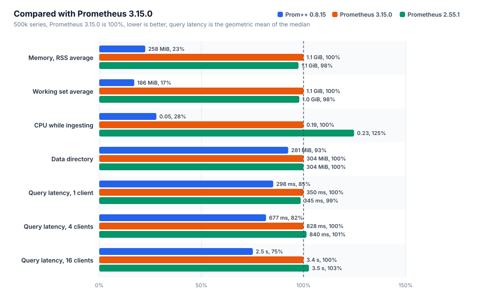
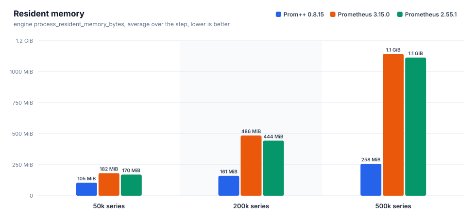
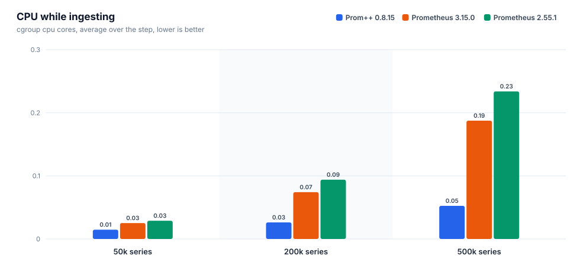
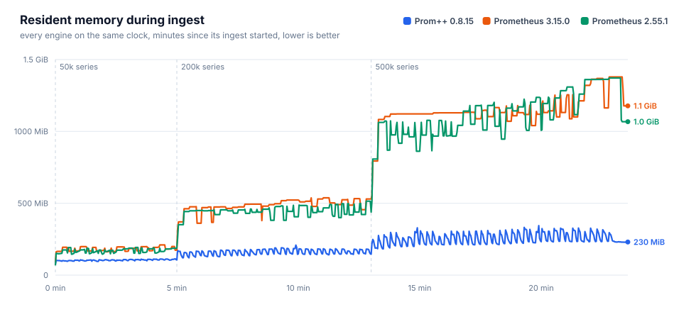
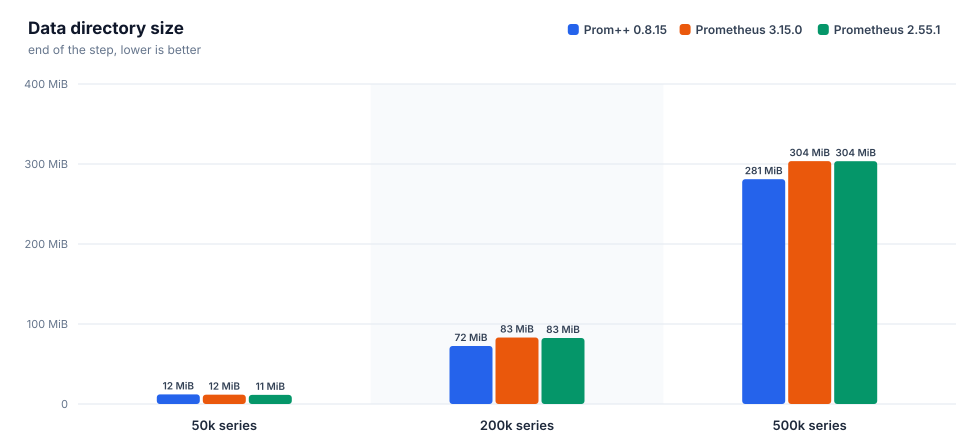
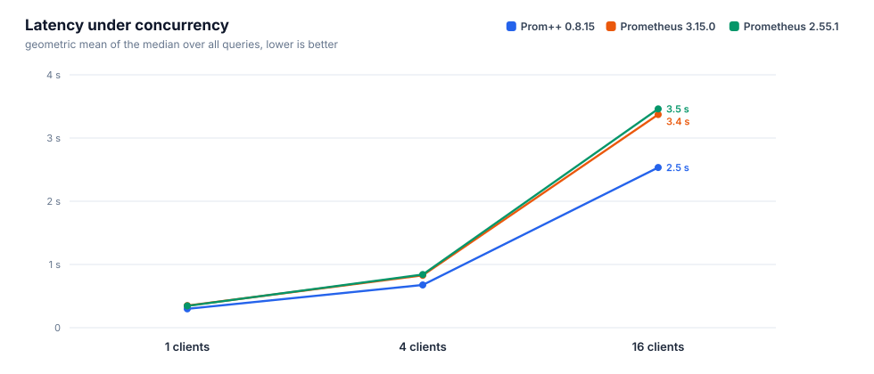
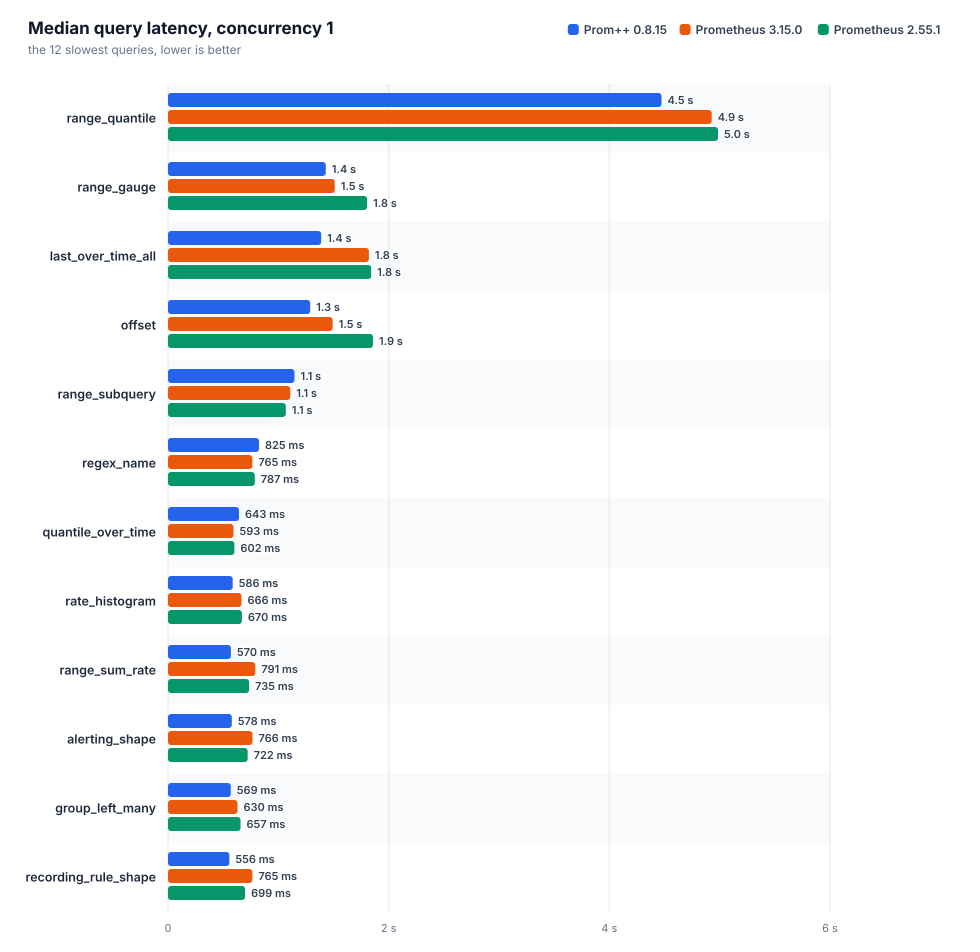
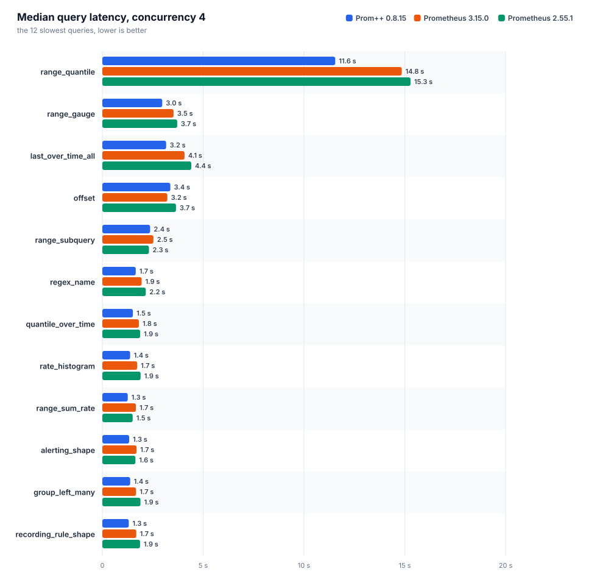
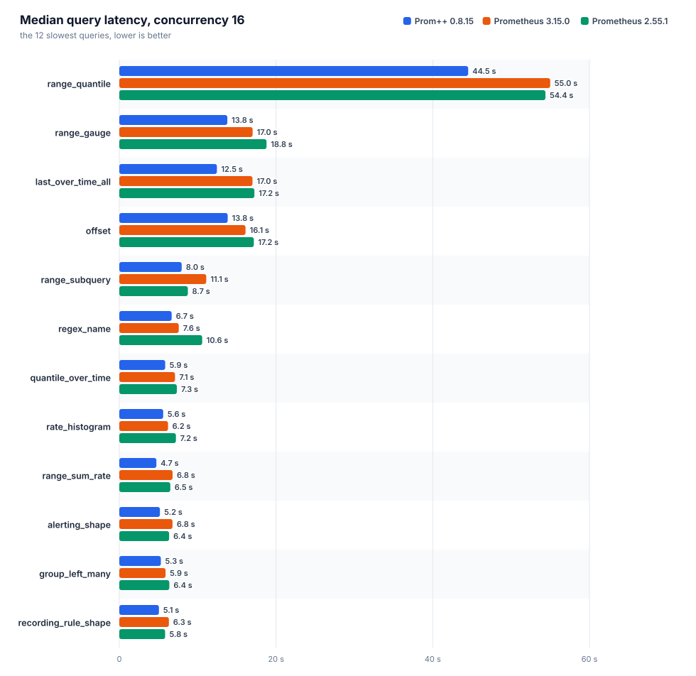

[English](REPORT.md) · **Русский**

# Prom++ против Prometheus

Создано из исходных файлов этой папки. Каждое число ниже взято из файла прогона, вручную ничего не вписано.

Номер прогона: `20261008T090616Z`

## Окружение

| параметр | значение |
|---|---|
| узел | bench-node |
| процессор | AMD EPYC 7713 64-Core Processor |
| ядер | 8 |
| память | 15.6 GiB |
| ядро | 6.8.0-142-generic |
| ОС | Ubuntu 24.04.4 LTS |
| архитектура | amd64 |
| файловая система данных | свободно 151.5 GiB из 177.1 GiB |
| container_runtime | containerd://2.3.4-k3s1.36 |
| instance_type | k3s |
| kubelet_version | v1.36.4+k3s1 |
| operating_system | linux |
| нагрузочный код | harness/b3000ef-7f49340 |

## Движки

Заданные настройки взяты из манифестов, наблюдаемые из runtimeinfo и списка флагов самого движка во время прогона.

| движок | образ | лимит процессора | лимит памяти | окружение | GOMEMLIMIT (факт) | GOMAXPROCS (факт) | сжатие WAL | аргументы | заметки |
|---|---|---|---|---|---|---|---|---|---|
| `prompp-0815` | `mirror.gcr.io/prompp/prompp:0.8.15` | 2.00 cores | 6.0 GiB | `GOMEMLIMIT=5529MiB GOMAXPROCS=2` | 5.4 GiB | 2 | true | `--config.file=... --storage.tsdb.path=... --web.enable-remote-write-receiver --web.enable-lifecycle` | C++ head and WAL |
| `prom-3150` | `quay.io/prometheus/prometheus:v3.15.0` | 2.00 cores | 6.0 GiB | `GOMEMLIMIT=5529MiB GOMAXPROCS=2` | 5.4 GiB | 2 | true | `--config.file=... --storage.tsdb.path=... --web.enable-remote-write-receiver --web.enable-lifecycle` | upstream latest |
| `prom-2551` | `quay.io/prometheus/prometheus:v2.55.1` | 2.00 cores | 6.0 GiB | `GOMEMLIMIT=5529MiB GOMAXPROCS=2` | 5.4 GiB | 2 | true | `--config.file=... --storage.tsdb.path=... --web.enable-remote-write-receiver --web.enable-lifecycle` | closed range selectors, the semantics before 3.0 |

## Запись и память head











### prom-2551

Интервал 15 с, пачка 5000 серий, потоков 4, отправлено точек 27400000, из них потеряно 0.

| активных серий | точек/с | серий в head | чанков | RSS ср. | RSS p95 | RSS макс. | рабочий набор макс. | ядер ср. | ядер макс. | каталог данных | WAL | RSS/серия | диск/серия |
|---|---|---|---|---|---|---|---|---|---|---|---|---|---|
| 50000 | 3333 | 50000 | 50000 | 170.4 MiB | 191.7 MiB | 192.6 MiB | 139.2 MiB | 0.03 | 0.38 | 11.4 MiB | 11.4 MiB | 3.8 KiB | 238 B |
| 200000 | 13333 | 200000 | 200000 | 443.7 MiB | 496.3 MiB | 514.8 MiB | 464.7 MiB | 0.09 | 1.03 | 82.5 MiB | 82.5 MiB | 2.2 KiB | 432 B |
| 500000 | 33333 | 500000 | 500000 | 1.1 GiB | 1.3 GiB | 1.3 GiB | 1.3 GiB | 0.23 | 3.44 | 303.5 MiB | 303.5 MiB | 2.8 KiB | 636 B |

| активных серий | прошло / план | запрос записи p50 | p99 | 2xx | 4xx | 5xx | ошибки клиента |
|---|---|---|---|---|---|---|---|
| 50000 | 300 s / 300 s | 56 ms | 123 ms | 200 | 0 | 0 | 0 |
| 200000 | 480 s / 480 s | 29 ms | 193 ms | 1280 | 0 | 0 | 0 |
| 500000 | 600 s / 600 s | 28 ms | 251 ms | 4000 | 0 | 0 | 0 |

### prom-3150

Интервал 15 с, пачка 5000 серий, потоков 4, отправлено точек 27400000, из них потеряно 0.

| активных серий | точек/с | серий в head | чанков | RSS ср. | RSS p95 | RSS макс. | рабочий набор макс. | ядер ср. | ядер макс. | каталог данных | WAL | RSS/серия | диск/серия |
|---|---|---|---|---|---|---|---|---|---|---|---|---|---|
| 50000 | 3333 | 50000 | 50000 | 181.8 MiB | 199.4 MiB | 210.3 MiB | 152.4 MiB | 0.03 | 0.42 | 11.6 MiB | 11.6 MiB | 3.6 KiB | 242 B |
| 200000 | 13333 | 200000 | 200000 | 485.6 MiB | 532.5 MiB | 537.6 MiB | 481.8 MiB | 0.07 | 1.06 | 83.1 MiB | 83.1 MiB | 2.7 KiB | 435 B |
| 500000 | 33333 | 500000 | 500000 | 1.1 GiB | 1.3 GiB | 1.3 GiB | 1.3 GiB | 0.19 | 2.77 | 303.7 MiB | 303.6 MiB | 2.8 KiB | 636 B |

| активных серий | прошло / план | запрос записи p50 | p99 | 2xx | 4xx | 5xx | ошибки клиента |
|---|---|---|---|---|---|---|---|
| 50000 | 300 s / 300 s | 42 ms | 115 ms | 200 | 0 | 0 | 0 |
| 200000 | 480 s / 480 s | 35 ms | 134 ms | 1280 | 0 | 0 | 0 |
| 500000 | 600 s / 600 s | 31 ms | 179 ms | 4000 | 0 | 0 | 0 |

### prompp-0815

Интервал 15 с, пачка 5000 серий, потоков 4, отправлено точек 27400000, из них потеряно 0.

| активных серий | точек/с | серий в head | чанков | RSS ср. | RSS p95 | RSS макс. | рабочий набор макс. | ядер ср. | ядер макс. | каталог данных | WAL | RSS/серия | диск/серия |
|---|---|---|---|---|---|---|---|---|---|---|---|---|---|
| 50000 | 3333 | 50000 | 50000 | 104.5 MiB | 111.1 MiB | 113.5 MiB | 50.1 MiB | 0.01 | 0.21 | 12.0 MiB | 4.0 KiB | 2.2 KiB | 252 B |
| 200000 | 13333 | 200000 | 200000 | 160.6 MiB | 184.2 MiB | 208.7 MiB | 118.3 MiB | 0.03 | 0.38 | 72.5 MiB | 4.0 KiB | 765 B | 380 B |
| 500000 | 33333 | 500000 | 500000 | 257.5 MiB | 318.3 MiB | 344.4 MiB | 256.3 MiB | 0.05 | 0.88 | 280.9 MiB | 4.0 KiB | 494 B | 589 B |

| активных серий | прошло / план | запрос записи p50 | p99 | 2xx | 4xx | 5xx | ошибки клиента |
|---|---|---|---|---|---|---|---|
| 50000 | 300 s / 300 s | 12 ms | 80 ms | 200 | 0 | 0 | 0 |
| 200000 | 480 s / 480 s | 11 ms | 67 ms | 1280 | 0 | 0 | 0 |
| 500000 | 600 s / 600 s | 11 ms | 54 ms | 4000 | 0 | 0 | 0 |

### Сравнение

Для всех столбцов с памятью и процессором меньше значит лучше. RSS это `process_resident_memory_bytes` самого движка, рабочий набор это значение cgroup, по которому kubelet выселяет поды и срабатывает OOM.

| активных серий | движок | RSS ср. | байт на серию | рабочий набор макс. | ядер ср. | каталог данных | точек/с |
|---|---|---|---|---|---|---|---|
| 50000 | `prom-2551` | 170.4 MiB | 3.8 KiB | 139.2 MiB | 0.03 | 11.4 MiB | 3333 |
| 50000 | `prom-3150` | 181.8 MiB | 3.6 KiB | 152.4 MiB | 0.03 | 11.6 MiB | 3333 |
| 50000 | `prompp-0815` | 104.5 MiB | 2.2 KiB | 50.1 MiB | 0.01 | 12.0 MiB | 3333 |
| 200000 | `prom-2551` | 443.7 MiB | 2.2 KiB | 464.7 MiB | 0.09 | 82.5 MiB | 13333 |
| 200000 | `prom-3150` | 485.6 MiB | 2.7 KiB | 481.8 MiB | 0.07 | 83.1 MiB | 13333 |
| 200000 | `prompp-0815` | 160.6 MiB | 765 B | 118.3 MiB | 0.03 | 72.5 MiB | 13333 |
| 500000 | `prom-2551` | 1.1 GiB | 2.8 KiB | 1.3 GiB | 0.23 | 303.5 MiB | 33333 |
| 500000 | `prom-3150` | 1.1 GiB | 2.8 KiB | 1.3 GiB | 0.19 | 303.7 MiB | 33333 |
| 500000 | `prompp-0815` | 257.5 MiB | 494 B | 256.3 MiB | 0.05 | 280.9 MiB | 33333 |

На самой большой ступени меньше всего памяти на серию нужно `prompp-0815`: 494 B of resident memory per active series, the lowest of the compared engines.

## Время запросов

Каждый запрос идёт отдельно: один пробный запрос без учёта, затем заданное число потоков повторяет его, пока не истечёт отведённое время и не наберётся минимальное число запросов. `n` это число учтённых запросов. При малом `n` значение p99 близко к максимуму, поэтому сравнивать лучше медиану. Геометрическое среднее учитывает все запросы поровну, поэтому несколько запросов, которые идут секундами, не заглушают остальные.



### Параллельность 1



| движок | набор | запросов | замеров | ошибок | p50 (геом.) | p99 (геом.) | p50 самого медленного | ядер ср. | рабочий набор макс. |
|---|---|---|---|---|---|---|---|---|---|
| `prom-2551` | heavy | 38 | 10840 | 0 | 345 ms | 577 ms | `range_quantile` 4.99 s | 1.22 | 1.9 GiB |
| `prom-3150` | heavy | 38 | 15519 | 0 | 350 ms | 529 ms | `range_quantile` 4.93 s | 1.17 | 1.8 GiB |
| `prompp-0815` | heavy | 38 | 10429 | 0 | 298 ms | 349 ms | `range_quantile` 4.47 s | 1.34 | 635.8 MiB |

| query | type | `prom-2551` p50 / p99 (n) | `prom-3150` p50 / p99 (n) | `prompp-0815` p50 / p99 (n) | fastest p50 |
|---|---|---|---|---|---|
| `absent` | instant | 0.4 ms / 11 ms (9322) | 0.4 ms / 8.0 ms (14036) | 0.8 ms / 3.1 ms (8541) | `prom-3150` |
| `alerting_shape` | range | 722 ms / 903 ms (14) | 766 ms / 899 ms (13) | 578 ms / 624 ms (18) | `prompp-0815` |
| `avg_over_pods` | instant | 216 ms / 361 ms (44) | 224 ms / 381 ms (43) | 143 ms / 166 ms (71) | `prompp-0815` |
| `avg_over_time` | instant | 376 ms / 620 ms (25) | 391 ms / 532 ms (25) | 390 ms / 413 ms (26) | `prom-2551` |
| `binary_scalar` | instant | 411 ms / 571 ms (23) | 422 ms / 586 ms (23) | 272 ms / 316 ms (37) | `prompp-0815` |
| `bottomk` | instant | 201 ms / 325 ms (46) | 216 ms / 359 ms (45) | 143 ms / 176 ms (70) | `prompp-0815` |
| `clamp` | instant | 341 ms / 578 ms (26) | 342 ms / 503 ms (28) | 386 ms / 455 ms (26) | `prom-2551` |
| `count_by_job` | instant | 215 ms / 387 ms (44) | 222 ms / 362 ms (44) | 143 ms / 181 ms (70) | `prompp-0815` |
| `count_values` | instant | 349 ms / 501 ms (26) | 345 ms / 476 ms (28) | 316 ms / 354 ms (32) | `prompp-0815` |
| `double_subquery` | range | 505 ms / 858 ms (20) | 560 ms / 696 ms (18) | 423 ms / 467 ms (24) | `prompp-0815` |
| `group_left_many` | instant | 657 ms / 973 ms (15) | 630 ms / 765 ms (16) | 569 ms / 589 ms (18) | `prompp-0815` |
| `increase` | instant | 359 ms / 630 ms (27) | 376 ms / 503 ms (26) | 361 ms / 375 ms (28) | `prom-2551` |
| `irate` | instant | 268 ms / 454 ms (34) | 263 ms / 409 ms (36) | 272 ms / 295 ms (37) | `prom-3150` |
| `join` | instant | 406 ms / 612 ms (24) | 420 ms / 562 ms (23) | 270 ms / 328 ms (37) | `prompp-0815` |
| `label_replace` | instant | 318 ms / 530 ms (30) | 313 ms / 449 ms (30) | 348 ms / 402 ms (29) | `prom-3150` |
| `last_over_time_all` | instant | 1.84 s / 1.92 s (6) | 1.82 s / 1.85 s (6) | 1.39 s / 1.47 s (8) | `prompp-0815` |
| `matchers_numeric` | instant | 276 ms / 518 ms (33) | 275 ms / 434 ms (34) | 259 ms / 288 ms (39) | `prompp-0815` |
| `max_over_time` | instant | 382 ms / 639 ms (25) | 404 ms / 505 ms (25) | 399 ms / 421 ms (26) | `prom-2551` |
| `nested_aggregate` | instant | 206 ms / 394 ms (44) | 213 ms / 387 ms (44) | 147 ms / 173 ms (69) | `prompp-0815` |
| `offset` | range | 1.86 s / 2.08 s (6) | 1.49 s / 1.80 s (7) | 1.29 s / 1.93 s (8) | `prompp-0815` |
| `or_fallback` | instant | 322 ms / 587 ms (28) | 342 ms / 472 ms (28) | 350 ms / 399 ms (29) | `prom-2551` |
| `quantile_over_time` | instant | 602 ms / 928 ms (15) | 593 ms / 820 ms (16) | 643 ms / 684 ms (16) | `prom-3150` |
| `range_gauge` | range | 1.80 s / 2.15 s (6) | 1.51 s / 1.98 s (7) | 1.43 s / 1.95 s (7) | `prompp-0815` |
| `range_quantile` | range | 4.99 s / 5.21 s (5) | 4.93 s / 5.16 s (5) | 4.47 s / 4.56 s (5) | `prompp-0815` |
| `range_subquery` | range | 1.07 s / 1.35 s (10) | 1.11 s / 1.29 s (9) | 1.15 s / 1.24 s (9) | `prom-2551` |
| `range_sum_rate` | range | 735 ms / 980 ms (14) | 791 ms / 900 ms (13) | 570 ms / 622 ms (18) | `prompp-0815` |
| `rate` | instant | 305 ms / 537 ms (32) | 303 ms / 497 ms (31) | 295 ms / 316 ms (34) | `prompp-0815` |
| `rate_histogram` | instant | 670 ms / 977 ms (14) | 666 ms / 809 ms (15) | 586 ms / 627 ms (18) | `prompp-0815` |
| `recording_rule_shape` | range | 699 ms / 1.03 s (14) | 765 ms / 933 ms (13) | 556 ms / 626 ms (18) | `prompp-0815` |
| `regex_name` | instant | 787 ms / 1.10 s (12) | 765 ms / 1.05 s (13) | 825 ms / 900 ms (13) | `prom-3150` |
| `selector` | instant | 300 ms / 504 ms (31) | 299 ms / 408 ms (33) | 302 ms / 336 ms (33) | `prom-3150` |
| `selector_labels` | instant | 15 ms / 35 ms (587) | 17 ms / 38 ms (552) | 15 ms / 22 ms (638) | `prompp-0815` |
| `sort_desc` | instant | 215 ms / 368 ms (44) | 227 ms / 356 ms (43) | 139 ms / 164 ms (73) | `prompp-0815` |
| `stddev` | instant | 216 ms / 377 ms (43) | 227 ms / 382 ms (42) | 135 ms / 163 ms (74) | `prompp-0815` |
| `sum` | instant | 203 ms / 340 ms (46) | 212 ms / 354 ms (45) | 137 ms / 148 ms (74) | `prompp-0815` |
| `sum_by_namespace` | instant | 217 ms / 391 ms (43) | 224 ms / 370 ms (43) | 145 ms / 157 ms (69) | `prompp-0815` |
| `topk` | instant | 202 ms / 369 ms (46) | 215 ms / 394 ms (44) | 148 ms / 159 ms (68) | `prompp-0815` |
| `vector_matching` | instant | 584 ms / 779 ms (16) | 578 ms / 754 ms (17) | 532 ms / 562 ms (19) | `prompp-0815` |

### Параллельность 4



| движок | набор | запросов | замеров | ошибок | p50 (геом.) | p99 (геом.) | p50 самого медленного | ядер ср. | рабочий набор макс. |
|---|---|---|---|---|---|---|---|---|---|
| `prom-2551` | heavy | 38 | 15554 | 0 | 840 ms | 1.50 s | `range_quantile` 15.28 s | 1.90 | 2.8 GiB |
| `prom-3150` | heavy | 38 | 21330 | 0 | 828 ms | 1.31 s | `range_quantile` 14.85 s | 1.92 | 3.2 GiB |
| `prompp-0815` | heavy | 38 | 19083 | 0 | 677 ms | 926 ms | `range_quantile` 11.55 s | 1.89 | 1.3 GiB |

| query | type | `prom-2551` p50 / p99 (n) | `prom-3150` p50 / p99 (n) | `prompp-0815` p50 / p99 (n) | fastest p50 |
|---|---|---|---|---|---|
| `absent` | instant | 0.6 ms / 31 ms (13040) | 0.7 ms / 18 ms (18730) | 2.2 ms / 8.2 ms (15789) | `prom-2551` |
| `alerting_shape` | range | 1.64 s / 2.31 s (24) | 1.70 s / 2.28 s (24) | 1.33 s / 1.58 s (32) | `prompp-0815` |
| `avg_over_pods` | instant | 504 ms / 1.03 s (73) | 496 ms / 936 ms (72) | 344 ms / 470 ms (119) | `prompp-0815` |
| `avg_over_time` | instant | 892 ms / 1.45 s (43) | 889 ms / 1.40 s (44) | 786 ms / 977 ms (54) | `prompp-0815` |
| `binary_scalar` | instant | 963 ms / 1.42 s (41) | 1.03 s / 1.47 s (39) | 706 ms / 925 ms (59) | `prompp-0815` |
| `bottomk` | instant | 502 ms / 1.05 s (70) | 536 ms / 898 ms (72) | 361 ms / 500 ms (115) | `prompp-0815` |
| `clamp` | instant | 1.10 s / 1.38 s (41) | 913 ms / 1.19 s (47) | 793 ms / 991 ms (53) | `prompp-0815` |
| `count_by_job` | instant | 501 ms / 1.11 s (72) | 499 ms / 852 ms (76) | 355 ms / 512 ms (112) | `prompp-0815` |
| `count_values` | instant | 1.05 s / 1.52 s (40) | 949 ms / 1.39 s (45) | 781 ms / 962 ms (53) | `prompp-0815` |
| `double_subquery` | range | 1.12 s / 1.98 s (32) | 1.21 s / 1.61 s (33) | 945 ms / 1.14 s (44) | `prompp-0815` |
| `group_left_many` | instant | 1.89 s / 2.29 s (23) | 1.67 s / 2.70 s (26) | 1.38 s / 1.67 s (31) | `prompp-0815` |
| `increase` | instant | 851 ms / 1.42 s (45) | 885 ms / 1.29 s (44) | 750 ms / 1.07 s (54) | `prompp-0815` |
| `irate` | instant | 619 ms / 1.19 s (57) | 596 ms / 958 ms (63) | 548 ms / 755 ms (74) | `prompp-0815` |
| `join` | instant | 987 ms / 1.53 s (38) | 993 ms / 1.44 s (39) | 666 ms / 890 ms (61) | `prompp-0815` |
| `label_replace` | instant | 713 ms / 1.34 s (52) | 737 ms / 1.11 s (53) | 608 ms / 832 ms (68) | `prompp-0815` |
| `last_over_time_all` | instant | 4.41 s / 4.95 s (12) | 4.08 s / 4.29 s (12) | 3.16 s / 3.75 s (16) | `prompp-0815` |
| `matchers_numeric` | instant | 833 ms / 1.27 s (51) | 688 ms / 991 ms (58) | 568 ms / 818 ms (70) | `prompp-0815` |
| `max_over_time` | instant | 942 ms / 1.79 s (41) | 949 ms / 1.43 s (41) | 775 ms / 1.03 s (52) | `prompp-0815` |
| `nested_aggregate` | instant | 474 ms / 1.03 s (72) | 493 ms / 851 ms (77) | 355 ms / 499 ms (112) | `prompp-0815` |
| `offset` | range | 3.65 s / 5.27 s (12) | 3.22 s / 4.22 s (13) | 3.37 s / 3.91 s (13) | `prom-3150` |
| `or_fallback` | instant | 883 ms / 1.35 s (46) | 847 ms / 1.21 s (48) | 696 ms / 1.01 s (58) | `prompp-0815` |
| `quantile_over_time` | instant | 1.88 s / 2.33 s (24) | 1.81 s / 2.06 s (24) | 1.51 s / 1.76 s (28) | `prompp-0815` |
| `range_gauge` | range | 3.71 s / 5.58 s (12) | 3.53 s / 4.82 s (12) | 2.97 s / 3.97 s (16) | `prompp-0815` |
| `range_quantile` | range | 15.28 s / 15.31 s (5) | 14.85 s / 15.31 s (5) | 11.55 s / 11.69 s (5) | `prompp-0815` |
| `range_subquery` | range | 2.31 s / 3.16 s (16) | 2.53 s / 3.40 s (16) | 2.37 s / 2.56 s (20) | `prom-2551` |
| `range_sum_rate` | range | 1.51 s / 2.44 s (26) | 1.66 s / 2.09 s (24) | 1.26 s / 1.42 s (33) | `prompp-0815` |
| `rate` | instant | 674 ms / 1.25 s (53) | 713 ms / 1.09 s (54) | 612 ms / 783 ms (68) | `prompp-0815` |
| `rate_histogram` | instant | 1.90 s / 2.17 s (24) | 1.73 s / 2.08 s (24) | 1.38 s / 1.76 s (30) | `prompp-0815` |
| `recording_rule_shape` | range | 1.87 s / 2.50 s (24) | 1.68 s / 2.19 s (24) | 1.31 s / 1.60 s (32) | `prompp-0815` |
| `regex_name` | instant | 2.16 s / 2.85 s (20) | 1.95 s / 2.29 s (24) | 1.66 s / 2.60 s (25) | `prompp-0815` |
| `selector` | instant | 683 ms / 1.26 s (53) | 643 ms / 1.09 s (58) | 579 ms / 845 ms (70) | `prompp-0815` |
| `selector_labels` | instant | 32 ms / 125 ms (984) | 35 ms / 102 ms (1014) | 34 ms / 75 ms (1100) | `prom-2551` |
| `sort_desc` | instant | 496 ms / 1.03 s (73) | 519 ms / 908 ms (71) | 342 ms / 543 ms (118) | `prompp-0815` |
| `stddev` | instant | 545 ms / 998 ms (69) | 524 ms / 867 ms (73) | 333 ms / 493 ms (118) | `prompp-0815` |
| `sum` | instant | 465 ms / 844 ms (80) | 498 ms / 881 ms (77) | 329 ms / 499 ms (121) | `prompp-0815` |
| `sum_by_namespace` | instant | 504 ms / 1.04 s (73) | 511 ms / 850 ms (74) | 347 ms / 468 ms (116) | `prompp-0815` |
| `topk` | instant | 532 ms / 1.09 s (69) | 538 ms / 867 ms (72) | 363 ms / 554 ms (108) | `prompp-0815` |
| `vector_matching` | instant | 1.74 s / 2.04 s (24) | 1.57 s / 1.89 s (28) | 1.21 s / 1.50 s (36) | `prompp-0815` |

### Параллельность 16



| движок | набор | запросов | замеров | ошибок | p50 (геом.) | p99 (геом.) | p50 самого медленного | ядер ср. | рабочий набор макс. |
|---|---|---|---|---|---|---|---|---|---|
| `prom-2551` | heavy | 38 | 19997 | 0 | 3.46 s | 4.96 s | `range_quantile` 54.38 s | 1.93 | 5.4 GiB |
| `prom-3150` | heavy | 38 | 22046 | 0 | 3.37 s | 4.66 s | `range_quantile` 54.99 s | 1.95 | 5.4 GiB |
| `prompp-0815` | heavy | 38 | 17970 | 0 | 2.53 s | 3.50 s | `range_quantile` 44.52 s | 1.93 | 4.2 GiB |

| query | type | `prom-2551` p50 / p99 (n) | `prom-3150` p50 / p99 (n) | `prompp-0815` p50 / p99 (n) | fastest p50 |
|---|---|---|---|---|---|
| `absent` | instant | 2.6 ms / 125 ms (17256) | 3.2 ms / 64 ms (19201) | 10 ms / 34 ms (14200) | `prom-2551` |
| `alerting_shape` | range | 6.36 s / 6.99 s (32) | 6.79 s / 7.36 s (32) | 5.18 s / 5.75 s (34) | `prompp-0815` |
| `avg_over_pods` | instant | 2.24 s / 3.06 s (79) | 2.22 s / 3.20 s (79) | 1.27 s / 1.93 s (132) | `prompp-0815` |
| `avg_over_time` | instant | 3.51 s / 4.54 s (50) | 3.62 s / 4.66 s (48) | 2.76 s / 3.79 s (64) | `prompp-0815` |
| `binary_scalar` | instant | 4.19 s / 4.84 s (48) | 4.14 s / 4.87 s (48) | 2.41 s / 3.18 s (69) | `prompp-0815` |
| `bottomk` | instant | 2.23 s / 2.98 s (79) | 2.06 s / 3.21 s (83) | 1.35 s / 1.99 s (124) | `prompp-0815` |
| `clamp` | instant | 3.86 s / 4.78 s (49) | 3.50 s / 4.61 s (51) | 2.85 s / 3.59 s (67) | `prompp-0815` |
| `count_by_job` | instant | 2.08 s / 2.95 s (81) | 2.12 s / 2.84 s (80) | 1.28 s / 1.78 s (132) | `prompp-0815` |
| `count_values` | instant | 4.02 s / 5.80 s (48) | 3.67 s / 4.30 s (48) | 2.89 s / 3.64 s (64) | `prompp-0815` |
| `double_subquery` | range | 5.08 s / 6.33 s (35) | 5.16 s / 6.22 s (37) | 3.43 s / 4.41 s (48) | `prompp-0815` |
| `group_left_many` | instant | 6.39 s / 7.99 s (32) | 5.90 s / 7.42 s (32) | 5.30 s / 6.94 s (32) | `prompp-0815` |
| `increase` | instant | 3.36 s / 4.18 s (54) | 3.56 s / 4.30 s (49) | 2.81 s / 3.45 s (65) | `prompp-0815` |
| `irate` | instant | 2.86 s / 3.83 s (65) | 2.61 s / 3.45 s (65) | 1.84 s / 2.65 s (91) | `prompp-0815` |
| `join` | instant | 3.90 s / 4.80 s (48) | 4.08 s / 4.72 s (48) | 2.34 s / 3.32 s (74) | `prompp-0815` |
| `label_replace` | instant | 3.21 s / 4.54 s (55) | 2.96 s / 3.75 s (61) | 2.24 s / 3.23 s (81) | `prompp-0815` |
| `last_over_time_all` | instant | 17.23 s / 17.58 s (16) | 16.99 s / 17.47 s (16) | 12.46 s / 12.73 s (16) | `prompp-0815` |
| `matchers_numeric` | instant | 2.96 s / 4.17 s (56) | 2.70 s / 3.76 s (65) | 2.08 s / 3.31 s (80) | `prompp-0815` |
| `max_over_time` | instant | 3.85 s / 5.13 s (48) | 3.81 s / 4.85 s (48) | 2.85 s / 3.81 s (64) | `prompp-0815` |
| `nested_aggregate` | instant | 2.19 s / 3.40 s (78) | 2.12 s / 3.12 s (83) | 1.28 s / 1.94 s (128) | `prompp-0815` |
| `offset` | range | 17.17 s / 17.52 s (16) | 16.10 s / 16.37 s (16) | 13.83 s / 13.95 s (16) | `prompp-0815` |
| `or_fallback` | instant | 3.72 s / 4.60 s (51) | 3.34 s / 4.36 s (53) | 2.39 s / 3.99 s (71) | `prompp-0815` |
| `quantile_over_time` | instant | 7.34 s / 8.81 s (32) | 7.11 s / 8.33 s (32) | 5.85 s / 7.24 s (32) | `prompp-0815` |
| `range_gauge` | range | 18.79 s / 19.26 s (16) | 17.01 s / 17.28 s (16) | 13.79 s / 13.89 s (16) | `prompp-0815` |
| `range_quantile` | range | 54.38 s / 54.69 s (16) | 54.99 s / 55.22 s (16) | 44.52 s / 45.02 s (16) | `prompp-0815` |
| `range_subquery` | range | 8.75 s / 10.65 s (28) | 11.10 s / 11.43 s (19) | 7.95 s / 8.97 s (32) | `prompp-0815` |
| `range_sum_rate` | range | 6.51 s / 7.22 s (32) | 6.80 s / 7.35 s (32) | 4.73 s / 5.73 s (46) | `prompp-0815` |
| `rate` | instant | 2.99 s / 3.89 s (59) | 3.01 s / 3.70 s (62) | 2.27 s / 2.97 s (78) | `prompp-0815` |
| `rate_histogram` | instant | 7.22 s / 9.04 s (32) | 6.22 s / 8.21 s (32) | 5.60 s / 6.92 s (32) | `prompp-0815` |
| `recording_rule_shape` | range | 5.84 s / 7.77 s (32) | 6.33 s / 7.65 s (32) | 5.06 s / 6.08 s (39) | `prompp-0815` |
| `regex_name` | instant | 10.58 s / 10.98 s (20) | 7.59 s / 10.08 s (31) | 6.68 s / 8.31 s (32) | `prompp-0815` |
| `selector` | instant | 3.25 s / 4.35 s (55) | 2.74 s / 3.98 s (63) | 2.16 s / 3.35 s (81) | `prompp-0815` |
| `selector_labels` | instant | 141 ms / 496 ms (964) | 139 ms / 446 ms (1027) | 127 ms / 314 ms (1203) | `prompp-0815` |
| `sort_desc` | instant | 2.18 s / 2.96 s (82) | 2.03 s / 2.84 s (85) | 1.23 s / 1.88 s (138) | `prompp-0815` |
| `stddev` | instant | 2.22 s / 2.97 s (79) | 2.21 s / 2.94 s (81) | 1.22 s / 1.94 s (134) | `prompp-0815` |
| `sum` | instant | 1.93 s / 2.94 s (86) | 2.10 s / 3.48 s (81) | 1.15 s / 2.03 s (142) | `prompp-0815` |
| `sum_by_namespace` | instant | 2.25 s / 3.25 s (79) | 2.13 s / 2.76 s (81) | 1.26 s / 1.83 s (133) | `prompp-0815` |
| `topk` | instant | 2.21 s / 3.34 s (77) | 2.08 s / 2.94 s (81) | 1.35 s / 2.12 s (124) | `prompp-0815` |
| `vector_matching` | instant | 6.07 s / 7.99 s (32) | 5.73 s / 7.41 s (32) | 4.76 s / 5.78 s (40) | `prompp-0815` |

## Совпадение результатов

Все движки получили одни и те же точки, а каждый запрос вычисляется в один и тот же закреплённый момент, так что отличающийся результат указывает на смысловое различие между движками или на потерянные данные. В каждой ячейке sha256 результата, приведённого к единому виду.

Строка с различием значит, что движки по-разному отвечают на одни и те же данные в один и тот же момент. Все такие запросы это `rate` или `_over_time` по диапазону. В Prometheus 3.0 диапазон стал открытым слева: точка ровно на левой границе окна больше не входит в расчёт. PromQL-движок Prom++ 0.8.15 её уже отбрасывает (`promql/engine.go`, `floats[drop].T <= mint`), а 2.55.1 нет (`< mint`). Искусственные точки лежат ровно на границе окна, поэтому 2.55.1 видит на одну точку больше.

| запрос | `prom-2551` | `prom-3150` | `prompp-0815` | совпадает |
|---|---|---|---|---|
| `absent` | ca3d163bab05 (1 series) | ca3d163bab05 (1 series) | ca3d163bab05 (1 series) | да |
| `alerting_shape` | 433e69a3597b (100 series) | e10ba8156cd2 (100 series) | e10ba8156cd2 (100 series) | нет |
| `avg_over_pods` | 4f6b6c188f7f (100 series) | 4f6b6c188f7f (100 series) | 4f6b6c188f7f (100 series) | да |
| `avg_over_time` | f1f392b0c78d (62500 series) | f1f392b0c78d (62500 series) | f1f392b0c78d (62500 series) | да |
| `binary_scalar` | ca3d163bab05 (1 series) | ca3d163bab05 (1 series) | ca3d163bab05 (1 series) | да |
| `bottomk` | 75dc8cd99593 (5 series) | 75dc8cd99593 (5 series) | 75dc8cd99593 (5 series) | да |
| `clamp` | f1f392b0c78d (62500 series) | f1f392b0c78d (62500 series) | f1f392b0c78d (62500 series) | да |
| `count_by_job` | 07c02c1348ea (1 series) | 07c02c1348ea (1 series) | 07c02c1348ea (1 series) | да |
| `count_values` | e792d90cc0a2 (62500 series) | e792d90cc0a2 (62500 series) | e792d90cc0a2 (62500 series) | да |
| `double_subquery` | 83f99d686699 (100 series) | 55416fa4082f (100 series) | 55416fa4082f (100 series) | нет |
| `group_left_many` | f1f392b0c78d (62500 series) | f1f392b0c78d (62500 series) | f1f392b0c78d (62500 series) | да |
| `increase` | 559e24dc9a48 (62500 series) | 559e24dc9a48 (62500 series) | 559e24dc9a48 (62500 series) | да |
| `irate` | 559e24dc9a48 (62500 series) | 559e24dc9a48 (62500 series) | 559e24dc9a48 (62500 series) | да |
| `join` | 4f6b6c188f7f (100 series) | 4f6b6c188f7f (100 series) | 4f6b6c188f7f (100 series) | да |
| `label_replace` | d3ae67deabaa (62500 series) | d3ae67deabaa (62500 series) | d3ae67deabaa (62500 series) | да |
| `last_over_time_all` | ca3d163bab05 (1 series) | ca3d163bab05 (1 series) | ca3d163bab05 (1 series) | да |
| `matchers_numeric` | bf8394774b5f (38487 series) | bf8394774b5f (38487 series) | bf8394774b5f (38487 series) | да |
| `max_over_time` | f1f392b0c78d (62500 series) | f1f392b0c78d (62500 series) | f1f392b0c78d (62500 series) | да |
| `nested_aggregate` | ca3d163bab05 (1 series) | ca3d163bab05 (1 series) | ca3d163bab05 (1 series) | да |
| `offset` | d5542cb672bf (62500 series) | d5542cb672bf (62500 series) | d5542cb672bf (62500 series) | да |
| `or_fallback` | a712401a23e5 (62500 series) | a712401a23e5 (62500 series) | a712401a23e5 (62500 series) | да |
| `quantile_over_time` | f1f392b0c78d (62500 series) | f1f392b0c78d (62500 series) | f1f392b0c78d (62500 series) | да |
| `range_gauge` | d5542cb672bf (62500 series) | d5542cb672bf (62500 series) | d5542cb672bf (62500 series) | да |
| `range_quantile` | 8e52194734df (62500 series) | 4f0d1e3a91e8 (62500 series) | 4f0d1e3a91e8 (62500 series) | нет |
| `range_subquery` | 82623d225556 (62500 series) | 82623d225556 (62500 series) | 82623d225556 (62500 series) | да |
| `range_sum_rate` | 8dcd40399f41 (100 series) | d73a595a3678 (100 series) | d73a595a3678 (100 series) | нет |
| `rate` | 559e24dc9a48 (62500 series) | 559e24dc9a48 (62500 series) | 559e24dc9a48 (62500 series) | да |
| `rate_histogram` | 559e24dc9a48 (62500 series) | 559e24dc9a48 (62500 series) | 559e24dc9a48 (62500 series) | да |
| `recording_rule_shape` | eb8b58afb326 (1 series) | 8476e35ab60f (1 series) | 8476e35ab60f (1 series) | нет |
| `regex_name` | fd6cd5bf0d07 (187500 series) | fd6cd5bf0d07 (187500 series) | fd6cd5bf0d07 (187500 series) | да |
| `selector` | a712401a23e5 (62500 series) | a712401a23e5 (62500 series) | a712401a23e5 (62500 series) | да |
| `selector_labels` | b5f636cb8557 (3125 series) | b5f636cb8557 (3125 series) | b5f636cb8557 (3125 series) | да |
| `sort_desc` | 4f6b6c188f7f (100 series) | 4f6b6c188f7f (100 series) | 4f6b6c188f7f (100 series) | да |
| `stddev` | 4f6b6c188f7f (100 series) | 4f6b6c188f7f (100 series) | 4f6b6c188f7f (100 series) | да |
| `sum` | ca3d163bab05 (1 series) | ca3d163bab05 (1 series) | ca3d163bab05 (1 series) | да |
| `sum_by_namespace` | 4f6b6c188f7f (100 series) | 4f6b6c188f7f (100 series) | 4f6b6c188f7f (100 series) | да |
| `topk` | 77b447784c27 (20 series) | 77b447784c27 (20 series) | 77b447784c27 (20 series) | да |
| `vector_matching` | f1f392b0c78d (62500 series) | f1f392b0c78d (62500 series) | f1f392b0c78d (62500 series) | да |

Совпадают 33 запросов, различаются 5.

## Как воспроизвести

```sh
export BENCH_NODE=<узел>
RUN_ID=20261008T090616Z scripts/node-overlay.sh
scripts/harness.sh
RUN_ID=20261008T090616Z scripts/run.sh
go run ./cmd/report -root results -run 20261008T090616Z
scripts/teardown.sh --yes
```

Правила честного сравнения и то, что может исказить результат, описаны в METHODOLOGY.ru.md.
