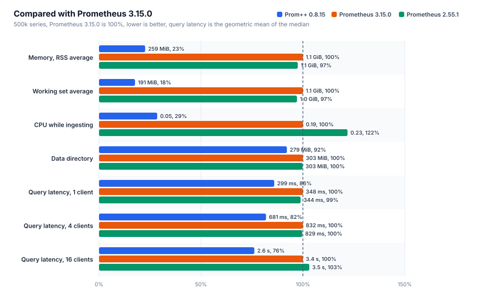
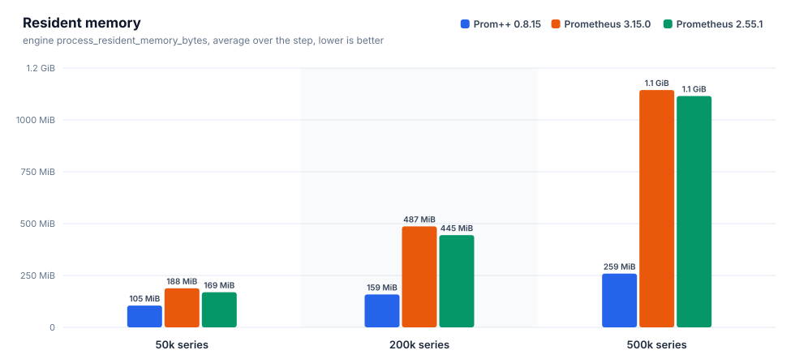
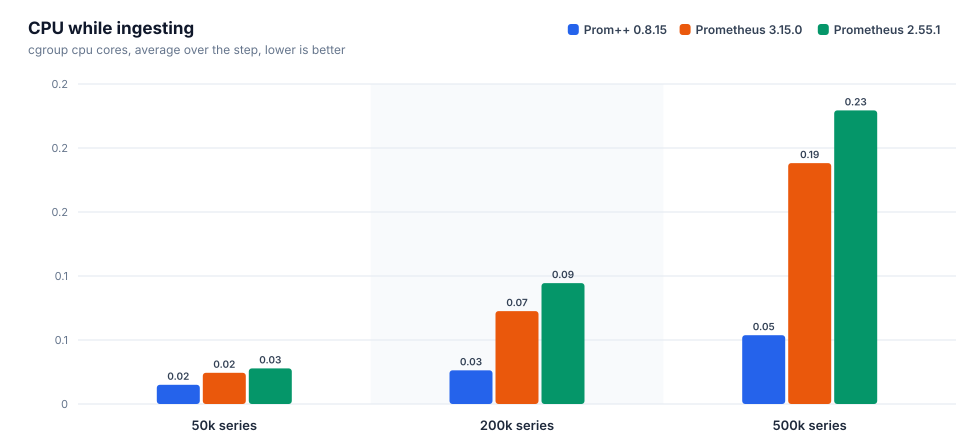
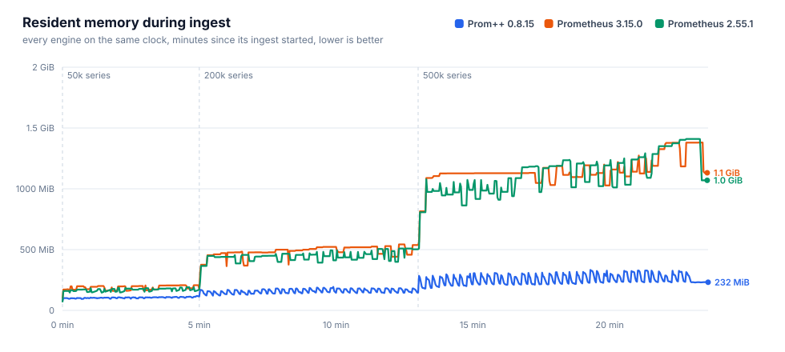
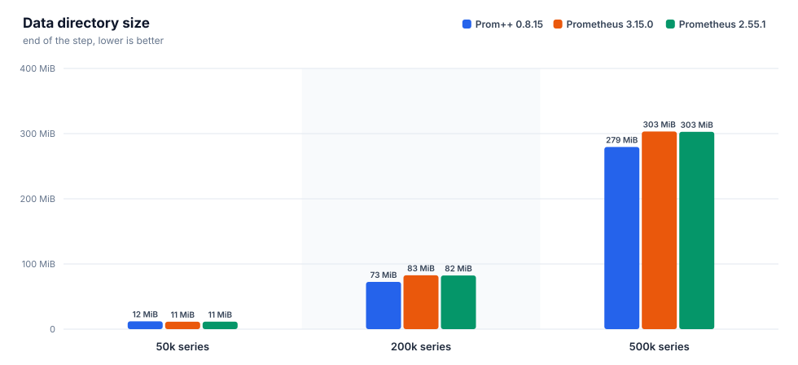
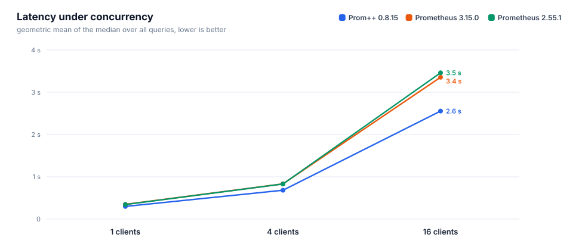
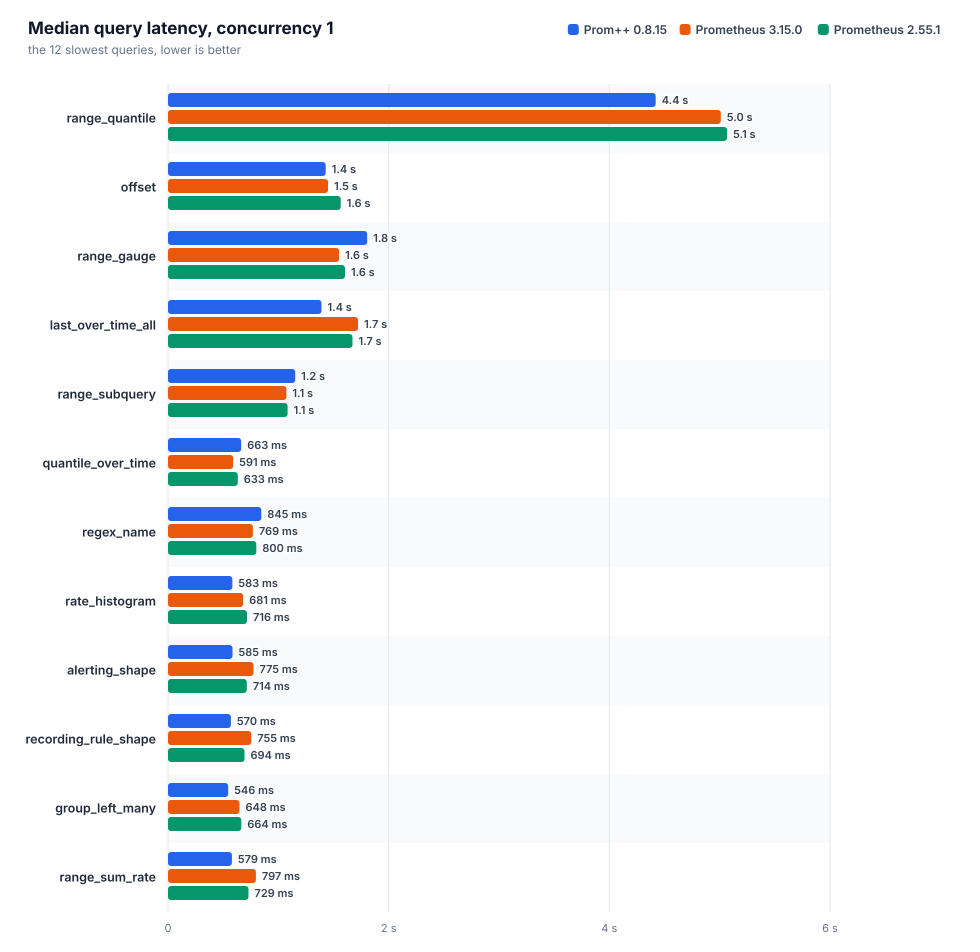
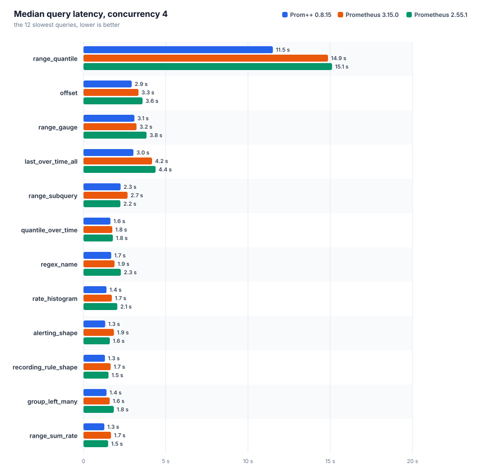
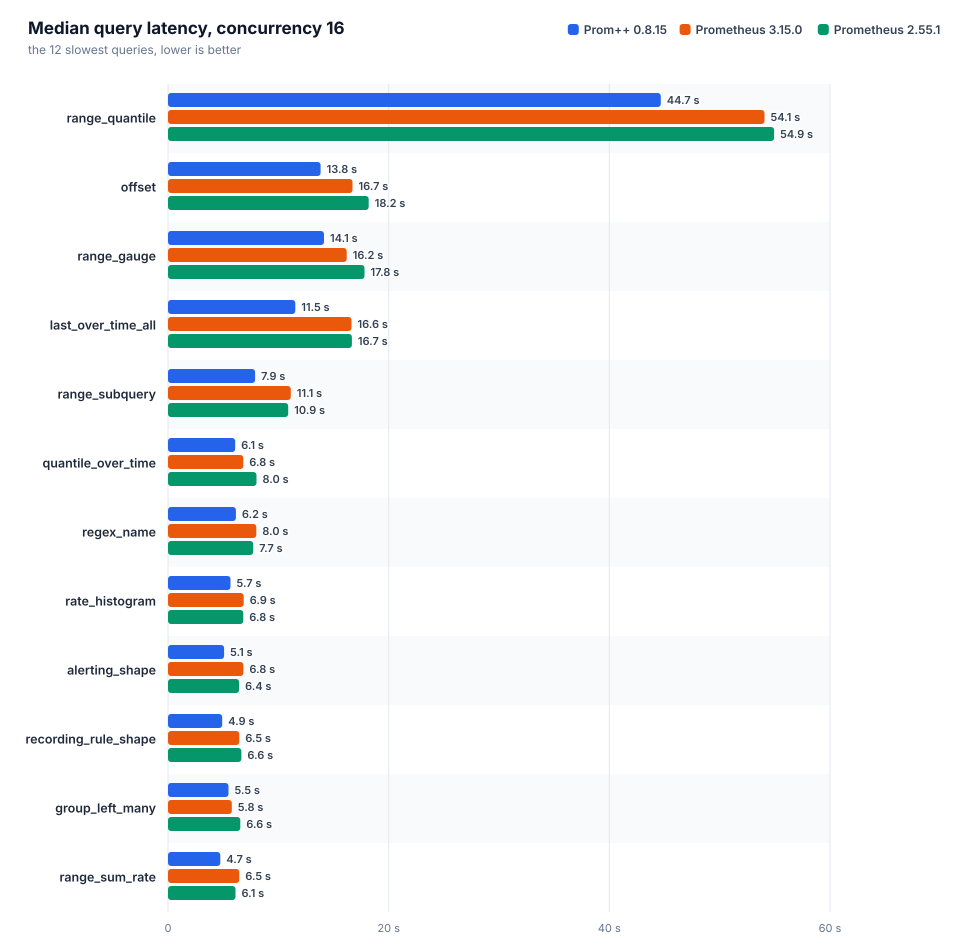

[English](REPORT.md) · **Русский**

# Prom++ против Prometheus

Создано из исходных файлов этой папки. Каждое число ниже взято из файла прогона, вручную ничего не вписано.

Номер прогона: `20261008T130616Z`

## Окружение

| параметр | значение |
|---|---|
| узел | bench-node |
| процессор | AMD EPYC 7713 64-Core Processor |
| ядер | 8 |
| память | 15.6 GiB |
| ядро | 6.8.0-142-generic |
| ОС | Ubuntu 24.04.4 LTS |
| архитектура | amd64 |
| файловая система данных | свободно 151.5 GiB из 177.1 GiB |
| container_runtime | containerd://2.3.4-k3s1.36 |
| instance_type | k3s |
| kubelet_version | v1.36.4+k3s1 |
| operating_system | linux |
| нагрузочный код | harness/b3000ef-7f49340 |

## Движки

Заданные настройки взяты из манифестов, наблюдаемые из runtimeinfo и списка флагов самого движка во время прогона.

| движок | образ | лимит процессора | лимит памяти | окружение | GOMEMLIMIT (факт) | GOMAXPROCS (факт) | сжатие WAL | аргументы | заметки |
|---|---|---|---|---|---|---|---|---|---|
| `prompp-0815` | `mirror.gcr.io/prompp/prompp:0.8.15` | 2.00 cores | 6.0 GiB | `GOMEMLIMIT=5529MiB GOMAXPROCS=2` | 5.4 GiB | 2 | true | `--config.file=... --storage.tsdb.path=... --web.enable-remote-write-receiver --web.enable-lifecycle` | C++ head and WAL |
| `prom-3150` | `quay.io/prometheus/prometheus:v3.15.0` | 2.00 cores | 6.0 GiB | `GOMEMLIMIT=5529MiB GOMAXPROCS=2` | 5.4 GiB | 2 | true | `--config.file=... --storage.tsdb.path=... --web.enable-remote-write-receiver --web.enable-lifecycle` | upstream latest |
| `prom-2551` | `quay.io/prometheus/prometheus:v2.55.1` | 2.00 cores | 6.0 GiB | `GOMEMLIMIT=5529MiB GOMAXPROCS=2` | 5.4 GiB | 2 | true | `--config.file=... --storage.tsdb.path=... --web.enable-remote-write-receiver --web.enable-lifecycle` | closed range selectors, the semantics before 3.0 |

## Запись и память head











### prom-2551

Интервал 15 с, пачка 5000 серий, потоков 4, отправлено точек 27400000, из них потеряно 0.

| активных серий | точек/с | серий в head | чанков | RSS ср. | RSS p95 | RSS макс. | рабочий набор макс. | ядер ср. | ядер макс. | каталог данных | WAL | RSS/серия | диск/серия |
|---|---|---|---|---|---|---|---|---|---|---|---|---|---|
| 50000 | 3333 | 50000 | 50000 | 169.0 MiB | 186.9 MiB | 191.3 MiB | 139.2 MiB | 0.03 | 0.35 | 11.4 MiB | 11.4 MiB | 3.5 KiB | 239 B |
| 200000 | 13333 | 200000 | 200000 | 444.7 MiB | 508.8 MiB | 509.2 MiB | 459.3 MiB | 0.09 | 1.42 | 82.4 MiB | 82.4 MiB | 2.6 KiB | 432 B |
| 500000 | 33333 | 500000 | 500000 | 1.1 GiB | 1.3 GiB | 1.4 GiB | 1.3 GiB | 0.23 | 3.89 | 302.8 MiB | 302.8 MiB | 2.9 KiB | 635 B |

| активных серий | прошло / план | запрос записи p50 | p99 | 2xx | 4xx | 5xx | ошибки клиента |
|---|---|---|---|---|---|---|---|
| 50000 | 300 s / 300 s | 53 ms | 136 ms | 200 | 0 | 0 | 0 |
| 200000 | 480 s / 480 s | 31 ms | 195 ms | 1280 | 0 | 0 | 0 |
| 500000 | 600 s / 600 s | 28 ms | 250 ms | 4000 | 0 | 0 | 0 |

### prom-3150

Интервал 15 с, пачка 5000 серий, потоков 4, отправлено точек 27400000, из них потеряно 0.

| активных серий | точек/с | серий в head | чанков | RSS ср. | RSS p95 | RSS макс. | рабочий набор макс. | ядер ср. | ядер макс. | каталог данных | WAL | RSS/серия | диск/серия |
|---|---|---|---|---|---|---|---|---|---|---|---|---|---|
| 50000 | 3333 | 50000 | 50000 | 188.3 MiB | 207.3 MiB | 207.4 MiB | 149.1 MiB | 0.02 | 0.38 | 11.4 MiB | 11.4 MiB | 3.6 KiB | 239 B |
| 200000 | 13333 | 200000 | 200000 | 486.6 MiB | 537.6 MiB | 542.6 MiB | 486.3 MiB | 0.07 | 1.00 | 82.6 MiB | 82.6 MiB | 2.8 KiB | 432 B |
| 500000 | 33333 | 500000 | 500000 | 1.1 GiB | 1.3 GiB | 1.3 GiB | 1.3 GiB | 0.19 | 2.93 | 303.3 MiB | 303.3 MiB | 2.8 KiB | 636 B |

| активных серий | прошло / план | запрос записи p50 | p99 | 2xx | 4xx | 5xx | ошибки клиента |
|---|---|---|---|---|---|---|---|
| 50000 | 300 s / 300 s | 42 ms | 96 ms | 200 | 0 | 0 | 0 |
| 200000 | 480 s / 480 s | 34 ms | 133 ms | 1280 | 0 | 0 | 0 |
| 500000 | 600 s / 600 s | 32 ms | 176 ms | 4000 | 0 | 0 | 0 |

### prompp-0815

Интервал 15 с, пачка 5000 серий, потоков 4, отправлено точек 27400000, из них потеряно 0.

| активных серий | точек/с | серий в head | чанков | RSS ср. | RSS p95 | RSS макс. | рабочий набор макс. | ядер ср. | ядер макс. | каталог данных | WAL | RSS/серия | диск/серия |
|---|---|---|---|---|---|---|---|---|---|---|---|---|---|
| 50000 | 3333 | 50000 | 50000 | 104.9 MiB | 112.2 MiB | 118.4 MiB | 47.5 MiB | 0.02 | 0.18 | 12.0 MiB | 4.0 KiB | 2.3 KiB | 252 B |
| 200000 | 13333 | 200000 | 200000 | 158.8 MiB | 181.7 MiB | 193.3 MiB | 118.8 MiB | 0.03 | 0.42 | 72.5 MiB | 4.0 KiB | 770 B | 380 B |
| 500000 | 33333 | 500000 | 500000 | 258.9 MiB | 321.2 MiB | 332.7 MiB | 266.0 MiB | 0.05 | 0.85 | 279.5 MiB | 4.0 KiB | 484 B | 586 B |

| активных серий | прошло / план | запрос записи p50 | p99 | 2xx | 4xx | 5xx | ошибки клиента |
|---|---|---|---|---|---|---|---|
| 50000 | 300 s / 300 s | 12 ms | 66 ms | 200 | 0 | 0 | 0 |
| 200000 | 480 s / 480 s | 11 ms | 63 ms | 1280 | 0 | 0 | 0 |
| 500000 | 600 s / 600 s | 12 ms | 48 ms | 4000 | 0 | 0 | 0 |

### Сравнение

Для всех столбцов с памятью и процессором меньше значит лучше. RSS это `process_resident_memory_bytes` самого движка, рабочий набор это значение cgroup, по которому kubelet выселяет поды и срабатывает OOM.

| активных серий | движок | RSS ср. | байт на серию | рабочий набор макс. | ядер ср. | каталог данных | точек/с |
|---|---|---|---|---|---|---|---|
| 50000 | `prom-2551` | 169.0 MiB | 3.5 KiB | 139.2 MiB | 0.03 | 11.4 MiB | 3333 |
| 50000 | `prom-3150` | 188.3 MiB | 3.6 KiB | 149.1 MiB | 0.02 | 11.4 MiB | 3333 |
| 50000 | `prompp-0815` | 104.9 MiB | 2.3 KiB | 47.5 MiB | 0.02 | 12.0 MiB | 3333 |
| 200000 | `prom-2551` | 444.7 MiB | 2.6 KiB | 459.3 MiB | 0.09 | 82.4 MiB | 13333 |
| 200000 | `prom-3150` | 486.6 MiB | 2.8 KiB | 486.3 MiB | 0.07 | 82.6 MiB | 13333 |
| 200000 | `prompp-0815` | 158.8 MiB | 770 B | 118.8 MiB | 0.03 | 72.5 MiB | 13333 |
| 500000 | `prom-2551` | 1.1 GiB | 2.9 KiB | 1.3 GiB | 0.23 | 302.8 MiB | 33333 |
| 500000 | `prom-3150` | 1.1 GiB | 2.8 KiB | 1.3 GiB | 0.19 | 303.3 MiB | 33333 |
| 500000 | `prompp-0815` | 258.9 MiB | 484 B | 266.0 MiB | 0.05 | 279.5 MiB | 33333 |

На самой большой ступени меньше всего памяти на серию нужно `prompp-0815`: 484 B of resident memory per active series, the lowest of the compared engines.

## Время запросов

Каждый запрос идёт отдельно: один пробный запрос без учёта, затем заданное число потоков повторяет его, пока не истечёт отведённое время и не наберётся минимальное число запросов. `n` это число учтённых запросов. При малом `n` значение p99 близко к максимуму, поэтому сравнивать лучше медиану. Геометрическое среднее учитывает все запросы поровну, поэтому несколько запросов, которые идут секундами, не заглушают остальные.



### Параллельность 1



| движок | набор | запросов | замеров | ошибок | p50 (геом.) | p99 (геом.) | p50 самого медленного | ядер ср. | рабочий набор макс. |
|---|---|---|---|---|---|---|---|---|---|
| `prom-2551` | heavy | 38 | 10538 | 0 | 344 ms | 582 ms | `range_quantile` 5.07 s | 1.24 | 1.8 GiB |
| `prom-3150` | heavy | 38 | 14536 | 0 | 348 ms | 523 ms | `range_quantile` 5.01 s | 1.15 | 1.8 GiB |
| `prompp-0815` | heavy | 38 | 10613 | 0 | 299 ms | 349 ms | `range_quantile` 4.42 s | 1.35 | 659.0 MiB |

| query | type | `prom-2551` p50 / p99 (n) | `prom-3150` p50 / p99 (n) | `prompp-0815` p50 / p99 (n) | fastest p50 |
|---|---|---|---|---|---|
| `absent` | instant | 0.4 ms / 12 ms (9069) | 0.4 ms / 8.9 ms (13023) | 0.7 ms / 3.1 ms (8683) | `prom-3150` |
| `alerting_shape` | range | 714 ms / 893 ms (14) | 775 ms / 952 ms (13) | 585 ms / 644 ms (18) | `prompp-0815` |
| `avg_over_pods` | instant | 215 ms / 369 ms (44) | 222 ms / 376 ms (43) | 136 ms / 151 ms (74) | `prompp-0815` |
| `avg_over_time` | instant | 379 ms / 564 ms (25) | 384 ms / 498 ms (26) | 379 ms / 417 ms (27) | `prom-2551` |
| `binary_scalar` | instant | 421 ms / 614 ms (23) | 434 ms / 613 ms (23) | 273 ms / 297 ms (37) | `prompp-0815` |
| `bottomk` | instant | 198 ms / 366 ms (47) | 207 ms / 324 ms (46) | 148 ms / 177 ms (68) | `prompp-0815` |
| `clamp` | instant | 335 ms / 621 ms (26) | 334 ms / 510 ms (28) | 391 ms / 420 ms (26) | `prom-3150` |
| `count_by_job` | instant | 210 ms / 360 ms (45) | 219 ms / 332 ms (45) | 144 ms / 179 ms (69) | `prompp-0815` |
| `count_values` | instant | 349 ms / 560 ms (26) | 345 ms / 490 ms (28) | 322 ms / 344 ms (31) | `prompp-0815` |
| `double_subquery` | range | 505 ms / 744 ms (19) | 530 ms / 667 ms (19) | 418 ms / 477 ms (24) | `prompp-0815` |
| `group_left_many` | instant | 664 ms / 933 ms (15) | 648 ms / 768 ms (16) | 546 ms / 605 ms (19) | `prompp-0815` |
| `increase` | instant | 358 ms / 613 ms (27) | 377 ms / 522 ms (26) | 357 ms / 382 ms (28) | `prompp-0815` |
| `irate` | instant | 265 ms / 451 ms (35) | 260 ms / 394 ms (37) | 275 ms / 291 ms (37) | `prom-3150` |
| `join` | instant | 409 ms / 691 ms (23) | 431 ms / 594 ms (23) | 255 ms / 303 ms (39) | `prompp-0815` |
| `label_replace` | instant | 318 ms / 539 ms (29) | 314 ms / 446 ms (31) | 331 ms / 362 ms (31) | `prom-3150` |
| `last_over_time_all` | instant | 1.67 s / 2.35 s (6) | 1.72 s / 1.92 s (6) | 1.39 s / 1.50 s (8) | `prompp-0815` |
| `matchers_numeric` | instant | 287 ms / 530 ms (33) | 275 ms / 439 ms (34) | 251 ms / 274 ms (40) | `prompp-0815` |
| `max_over_time` | instant | 378 ms / 661 ms (25) | 406 ms / 505 ms (25) | 387 ms / 414 ms (26) | `prom-2551` |
| `nested_aggregate` | instant | 204 ms / 298 ms (47) | 212 ms / 371 ms (44) | 148 ms / 168 ms (68) | `prompp-0815` |
| `offset` | range | 1.57 s / 2.10 s (6) | 1.45 s / 1.94 s (7) | 1.43 s / 1.88 s (7) | `prompp-0815` |
| `or_fallback` | instant | 325 ms / 533 ms (29) | 349 ms / 483 ms (27) | 360 ms / 411 ms (28) | `prom-2551` |
| `quantile_over_time` | instant | 633 ms / 893 ms (15) | 591 ms / 821 ms (16) | 663 ms / 729 ms (16) | `prom-3150` |
| `range_gauge` | range | 1.60 s / 1.92 s (6) | 1.55 s / 1.81 s (7) | 1.80 s / 1.93 s (6) | `prom-3150` |
| `range_quantile` | range | 5.07 s / 5.11 s (5) | 5.01 s / 5.08 s (5) | 4.42 s / 4.49 s (5) | `prompp-0815` |
| `range_subquery` | range | 1.08 s / 1.39 s (9) | 1.07 s / 1.23 s (10) | 1.15 s / 1.18 s (9) | `prom-3150` |
| `range_sum_rate` | range | 729 ms / 1.01 s (14) | 797 ms / 933 ms (13) | 579 ms / 623 ms (18) | `prompp-0815` |
| `rate` | instant | 304 ms / 536 ms (31) | 299 ms / 423 ms (32) | 310 ms / 330 ms (33) | `prom-3150` |
| `rate_histogram` | instant | 716 ms / 988 ms (13) | 681 ms / 835 ms (15) | 583 ms / 609 ms (18) | `prompp-0815` |
| `recording_rule_shape` | range | 694 ms / 988 ms (14) | 755 ms / 989 ms (13) | 570 ms / 636 ms (18) | `prompp-0815` |
| `regex_name` | instant | 800 ms / 1.16 s (12) | 769 ms / 940 ms (13) | 845 ms / 968 ms (12) | `prom-3150` |
| `selector` | instant | 305 ms / 547 ms (31) | 299 ms / 443 ms (32) | 306 ms / 342 ms (33) | `prom-3150` |
| `selector_labels` | instant | 17 ms / 42 ms (535) | 16 ms / 35 ms (571) | 15 ms / 21 ms (674) | `prompp-0815` |
| `sort_desc` | instant | 212 ms / 330 ms (45) | 223 ms / 392 ms (43) | 132 ms / 167 ms (76) | `prompp-0815` |
| `stddev` | instant | 215 ms / 381 ms (44) | 217 ms / 314 ms (45) | 139 ms / 175 ms (72) | `prompp-0815` |
| `sum` | instant | 202 ms / 328 ms (46) | 214 ms / 356 ms (45) | 135 ms / 178 ms (74) | `prompp-0815` |
| `sum_by_namespace` | instant | 215 ms / 395 ms (43) | 218 ms / 339 ms (44) | 138 ms / 154 ms (73) | `prompp-0815` |
| `topk` | instant | 204 ms / 375 ms (46) | 213 ms / 372 ms (45) | 149 ms / 177 ms (68) | `prompp-0815` |
| `vector_matching` | instant | 582 ms / 847 ms (16) | 577 ms / 732 ms (17) | 521 ms / 553 ms (20) | `prompp-0815` |

### Параллельность 4



| движок | набор | запросов | замеров | ошибок | p50 (геом.) | p99 (геом.) | p50 самого медленного | ядер ср. | рабочий набор макс. |
|---|---|---|---|---|---|---|---|---|---|
| `prom-2551` | heavy | 38 | 15159 | 0 | 829 ms | 1.52 s | `range_quantile` 15.11 s | 1.90 | 3.0 GiB |
| `prom-3150` | heavy | 38 | 19908 | 0 | 832 ms | 1.33 s | `range_quantile` 14.87 s | 1.88 | 3.2 GiB |
| `prompp-0815` | heavy | 38 | 17651 | 0 | 681 ms | 931 ms | `range_quantile` 11.51 s | 1.90 | 1.2 GiB |

| query | type | `prom-2551` p50 / p99 (n) | `prom-3150` p50 / p99 (n) | `prompp-0815` p50 / p99 (n) | fastest p50 |
|---|---|---|---|---|---|
| `absent` | instant | 0.7 ms / 31 ms (12697) | 0.7 ms / 21 ms (17340) | 2.6 ms / 8.4 ms (14401) | `prom-2551` |
| `alerting_shape` | range | 1.60 s / 2.62 s (24) | 1.85 s / 2.16 s (24) | 1.32 s / 1.50 s (32) | `prompp-0815` |
| `avg_over_pods` | instant | 513 ms / 1.03 s (70) | 514 ms / 876 ms (73) | 343 ms / 526 ms (115) | `prompp-0815` |
| `avg_over_time` | instant | 900 ms / 1.66 s (41) | 915 ms / 1.38 s (44) | 802 ms / 1.07 s (52) | `prompp-0815` |
| `binary_scalar` | instant | 965 ms / 1.45 s (40) | 1.07 s / 1.42 s (40) | 695 ms / 857 ms (60) | `prompp-0815` |
| `bottomk` | instant | 513 ms / 1.01 s (69) | 511 ms / 903 ms (74) | 355 ms / 556 ms (110) | `prompp-0815` |
| `clamp` | instant | 985 ms / 1.30 s (42) | 859 ms / 1.21 s (46) | 790 ms / 944 ms (52) | `prompp-0815` |
| `count_by_job` | instant | 512 ms / 935 ms (69) | 502 ms / 836 ms (79) | 359 ms / 533 ms (111) | `prompp-0815` |
| `count_values` | instant | 995 ms / 1.39 s (40) | 910 ms / 1.22 s (45) | 762 ms / 1.05 s (52) | `prompp-0815` |
| `double_subquery` | range | 1.03 s / 1.96 s (35) | 1.17 s / 1.69 s (34) | 964 ms / 1.15 s (44) | `prompp-0815` |
| `group_left_many` | instant | 1.84 s / 2.11 s (24) | 1.59 s / 1.85 s (27) | 1.40 s / 1.58 s (29) | `prompp-0815` |
| `increase` | instant | 836 ms / 1.53 s (45) | 834 ms / 1.34 s (46) | 761 ms / 1.00 s (54) | `prompp-0815` |
| `irate` | instant | 593 ms / 1.19 s (59) | 601 ms / 962 ms (64) | 531 ms / 829 ms (76) | `prompp-0815` |
| `join` | instant | 1.05 s / 1.83 s (37) | 1.04 s / 1.44 s (39) | 673 ms / 839 ms (62) | `prompp-0815` |
| `label_replace` | instant | 719 ms / 1.23 s (51) | 744 ms / 1.14 s (53) | 607 ms / 855 ms (67) | `prompp-0815` |
| `last_over_time_all` | instant | 4.38 s / 5.20 s (12) | 4.17 s / 4.38 s (12) | 3.04 s / 4.10 s (16) | `prompp-0815` |
| `matchers_numeric` | instant | 733 ms / 1.11 s (56) | 739 ms / 1.09 s (57) | 564 ms / 861 ms (71) | `prompp-0815` |
| `max_over_time` | instant | 854 ms / 1.48 s (44) | 971 ms / 1.41 s (40) | 792 ms / 987 ms (52) | `prompp-0815` |
| `nested_aggregate` | instant | 473 ms / 1.06 s (73) | 510 ms / 924 ms (72) | 353 ms / 495 ms (114) | `prompp-0815` |
| `offset` | range | 3.59 s / 5.82 s (12) | 3.34 s / 4.84 s (12) | 2.93 s / 3.86 s (16) | `prompp-0815` |
| `or_fallback` | instant | 817 ms / 1.50 s (45) | 877 ms / 1.35 s (45) | 706 ms / 1.01 s (58) | `prompp-0815` |
| `quantile_over_time` | instant | 1.79 s / 2.46 s (23) | 1.75 s / 2.11 s (24) | 1.64 s / 1.84 s (27) | `prompp-0815` |
| `range_gauge` | range | 3.83 s / 5.08 s (12) | 3.22 s / 4.68 s (12) | 3.10 s / 4.27 s (12) | `prompp-0815` |
| `range_quantile` | range | 15.11 s / 15.29 s (5) | 14.87 s / 15.19 s (5) | 11.51 s / 11.55 s (5) | `prompp-0815` |
| `range_subquery` | range | 2.25 s / 3.29 s (16) | 2.68 s / 3.00 s (16) | 2.26 s / 2.47 s (20) | `prom-2551` |
| `range_sum_rate` | range | 1.50 s / 2.64 s (28) | 1.67 s / 2.09 s (24) | 1.27 s / 1.42 s (33) | `prompp-0815` |
| `rate` | instant | 692 ms / 1.24 s (50) | 698 ms / 1.11 s (55) | 605 ms / 802 ms (66) | `prompp-0815` |
| `rate_histogram` | instant | 2.06 s / 2.39 s (21) | 1.73 s / 1.92 s (25) | 1.40 s / 1.74 s (29) | `prompp-0815` |
| `recording_rule_shape` | range | 1.52 s / 2.36 s (24) | 1.65 s / 2.33 s (24) | 1.31 s / 1.60 s (32) | `prompp-0815` |
| `regex_name` | instant | 2.27 s / 3.00 s (20) | 1.89 s / 2.65 s (22) | 1.69 s / 2.25 s (25) | `prompp-0815` |
| `selector` | instant | 687 ms / 1.19 s (57) | 716 ms / 1.14 s (54) | 597 ms / 860 ms (66) | `prompp-0815` |
| `selector_labels` | instant | 34 ms / 132 ms (938) | 36 ms / 112 ms (985) | 35 ms / 77 ms (1084) | `prom-2551` |
| `sort_desc` | instant | 507 ms / 956 ms (71) | 556 ms / 864 ms (70) | 333 ms / 489 ms (120) | `prompp-0815` |
| `stddev` | instant | 530 ms / 1.18 s (72) | 531 ms / 930 ms (73) | 335 ms / 513 ms (120) | `prompp-0815` |
| `sum` | instant | 491 ms / 1.06 s (74) | 494 ms / 861 ms (76) | 347 ms / 491 ms (115) | `prompp-0815` |
| `sum_by_namespace` | instant | 493 ms / 1.05 s (70) | 508 ms / 961 ms (75) | 371 ms / 487 ms (111) | `prompp-0815` |
| `topk` | instant | 505 ms / 1.14 s (68) | 485 ms / 903 ms (75) | 370 ms / 535 ms (109) | `prompp-0815` |
| `vector_matching` | instant | 1.79 s / 2.05 s (25) | 1.56 s / 2.08 s (27) | 1.23 s / 1.45 s (33) | `prompp-0815` |

### Параллельность 16



| движок | набор | запросов | замеров | ошибок | p50 (геом.) | p99 (геом.) | p50 самого медленного | ядер ср. | рабочий набор макс. |
|---|---|---|---|---|---|---|---|---|---|
| `prom-2551` | heavy | 38 | 19281 | 0 | 3.46 s | 4.91 s | `range_quantile` 54.93 s | 1.95 | 5.4 GiB |
| `prom-3150` | heavy | 38 | 21712 | 0 | 3.35 s | 4.64 s | `range_quantile` 54.07 s | 1.95 | 5.4 GiB |
| `prompp-0815` | heavy | 38 | 16958 | 0 | 2.56 s | 3.53 s | `range_quantile` 44.67 s | 1.94 | 4.0 GiB |

| query | type | `prom-2551` p50 / p99 (n) | `prom-3150` p50 / p99 (n) | `prompp-0815` p50 / p99 (n) | fastest p50 |
|---|---|---|---|---|---|
| `absent` | instant | 2.7 ms / 113 ms (16530) | 3.3 ms / 62 ms (18867) | 11 ms / 36 ms (13243) | `prom-2551` |
| `alerting_shape` | range | 6.44 s / 7.23 s (32) | 6.83 s / 7.70 s (32) | 5.09 s / 5.74 s (34) | `prompp-0815` |
| `avg_over_pods` | instant | 2.21 s / 3.26 s (76) | 2.22 s / 2.95 s (79) | 1.31 s / 1.89 s (129) | `prompp-0815` |
| `avg_over_time` | instant | 3.67 s / 4.65 s (49) | 3.59 s / 4.50 s (48) | 2.85 s / 3.70 s (63) | `prompp-0815` |
| `binary_scalar` | instant | 4.23 s / 5.58 s (47) | 3.97 s / 5.16 s (47) | 2.43 s / 3.14 s (73) | `prompp-0815` |
| `bottomk` | instant | 2.00 s / 3.05 s (83) | 2.21 s / 3.19 s (79) | 1.43 s / 2.09 s (118) | `prompp-0815` |
| `clamp` | instant | 3.87 s / 4.94 s (48) | 3.36 s / 4.34 s (54) | 2.76 s / 3.91 s (66) | `prompp-0815` |
| `count_by_job` | instant | 2.19 s / 2.88 s (79) | 2.21 s / 3.48 s (81) | 1.32 s / 1.91 s (127) | `prompp-0815` |
| `count_values` | instant | 3.81 s / 4.58 s (48) | 3.55 s / 4.63 s (51) | 2.99 s / 4.07 s (63) | `prompp-0815` |
| `double_subquery` | range | 4.29 s / 6.09 s (42) | 4.85 s / 5.46 s (40) | 3.60 s / 4.57 s (48) | `prompp-0815` |
| `group_left_many` | instant | 6.55 s / 7.83 s (32) | 5.78 s / 7.59 s (32) | 5.48 s / 6.35 s (33) | `prompp-0815` |
| `increase` | instant | 3.57 s / 4.84 s (48) | 3.46 s / 4.13 s (50) | 2.84 s / 3.48 s (65) | `prompp-0815` |
| `irate` | instant | 2.66 s / 3.69 s (66) | 2.53 s / 3.46 s (66) | 1.97 s / 2.69 s (87) | `prompp-0815` |
| `join` | instant | 3.97 s / 5.26 s (47) | 4.01 s / 5.15 s (49) | 2.30 s / 3.10 s (76) | `prompp-0815` |
| `label_replace` | instant | 3.08 s / 3.83 s (61) | 2.98 s / 3.95 s (61) | 2.17 s / 3.39 s (78) | `prompp-0815` |
| `last_over_time_all` | instant | 16.67 s / 17.17 s (16) | 16.64 s / 17.44 s (16) | 11.54 s / 11.97 s (16) | `prompp-0815` |
| `matchers_numeric` | instant | 3.14 s / 3.69 s (62) | 2.82 s / 3.92 s (62) | 2.07 s / 3.27 s (81) | `prompp-0815` |
| `max_over_time` | instant | 3.82 s / 5.03 s (48) | 3.71 s / 4.74 s (48) | 2.85 s / 3.73 s (64) | `prompp-0815` |
| `nested_aggregate` | instant | 2.28 s / 3.33 s (78) | 2.07 s / 2.83 s (82) | 1.25 s / 2.01 s (128) | `prompp-0815` |
| `offset` | range | 18.19 s / 18.67 s (16) | 16.72 s / 17.09 s (16) | 13.83 s / 13.98 s (16) | `prompp-0815` |
| `or_fallback` | instant | 3.57 s / 4.58 s (50) | 3.21 s / 4.19 s (58) | 2.38 s / 3.57 s (72) | `prompp-0815` |
| `quantile_over_time` | instant | 8.02 s / 9.08 s (32) | 6.82 s / 8.10 s (32) | 6.09 s / 7.00 s (32) | `prompp-0815` |
| `range_gauge` | range | 17.81 s / 18.15 s (16) | 16.20 s / 16.43 s (16) | 14.14 s / 14.35 s (16) | `prompp-0815` |
| `range_quantile` | range | 54.93 s / 55.07 s (16) | 54.07 s / 54.28 s (16) | 44.67 s / 45.21 s (16) | `prompp-0815` |
| `range_subquery` | range | 10.90 s / 11.25 s (17) | 11.13 s / 11.56 s (19) | 7.89 s / 9.38 s (32) | `prompp-0815` |
| `range_sum_rate` | range | 6.12 s / 7.93 s (32) | 6.46 s / 7.61 s (32) | 4.74 s / 8.21 s (46) | `prompp-0815` |
| `rate` | instant | 3.13 s / 3.73 s (64) | 2.86 s / 3.66 s (63) | 2.25 s / 3.30 s (77) | `prompp-0815` |
| `rate_histogram` | instant | 6.82 s / 8.86 s (32) | 6.86 s / 7.78 s (32) | 5.66 s / 7.03 s (32) | `prompp-0815` |
| `recording_rule_shape` | range | 6.65 s / 7.53 s (32) | 6.46 s / 7.96 s (32) | 4.92 s / 5.82 s (38) | `prompp-0815` |
| `regex_name` | instant | 7.72 s / 10.92 s (25) | 8.01 s / 9.92 s (32) | 6.15 s / 8.59 s (32) | `prompp-0815` |
| `selector` | instant | 3.13 s / 4.32 s (55) | 2.80 s / 3.90 s (64) | 2.12 s / 2.85 s (80) | `prompp-0815` |
| `selector_labels` | instant | 146 ms / 545 ms (959) | 142 ms / 496 ms (1002) | 127 ms / 336 ms (1190) | `prompp-0815` |
| `sort_desc` | instant | 2.27 s / 3.12 s (81) | 2.22 s / 2.91 s (79) | 1.21 s / 1.76 s (136) | `prompp-0815` |
| `stddev` | instant | 2.09 s / 2.68 s (89) | 2.15 s / 2.88 s (81) | 1.26 s / 1.81 s (136) | `prompp-0815` |
| `sum` | instant | 2.12 s / 2.91 s (83) | 1.80 s / 2.70 s (94) | 1.24 s / 1.79 s (134) | `prompp-0815` |
| `sum_by_namespace` | instant | 2.25 s / 3.06 s (80) | 2.12 s / 2.71 s (87) | 1.32 s / 1.93 s (124) | `prompp-0815` |
| `topk` | instant | 2.28 s / 3.02 s (78) | 2.21 s / 3.18 s (80) | 1.39 s / 2.04 s (120) | `prompp-0815` |
| `vector_matching` | instant | 6.15 s / 7.19 s (32) | 5.65 s / 7.08 s (33) | 4.88 s / 5.99 s (37) | `prompp-0815` |

## Совпадение результатов

Все движки получили одни и те же точки, а каждый запрос вычисляется в один и тот же закреплённый момент, так что отличающийся результат указывает на смысловое различие между движками или на потерянные данные. В каждой ячейке sha256 результата, приведённого к единому виду.

Строка с различием значит, что движки по-разному отвечают на одни и те же данные в один и тот же момент. Все такие запросы это `rate` или `_over_time` по диапазону. В Prometheus 3.0 диапазон стал открытым слева: точка ровно на левой границе окна больше не входит в расчёт. PromQL-движок Prom++ 0.8.15 её уже отбрасывает (`promql/engine.go`, `floats[drop].T <= mint`), а 2.55.1 нет (`< mint`). Искусственные точки лежат ровно на границе окна, поэтому 2.55.1 видит на одну точку больше.

| запрос | `prom-2551` | `prom-3150` | `prompp-0815` | совпадает |
|---|---|---|---|---|
| `absent` | ca3d163bab05 (1 series) | ca3d163bab05 (1 series) | ca3d163bab05 (1 series) | да |
| `alerting_shape` | 433e69a3597b (100 series) | e10ba8156cd2 (100 series) | e10ba8156cd2 (100 series) | нет |
| `avg_over_pods` | 4f6b6c188f7f (100 series) | 4f6b6c188f7f (100 series) | 4f6b6c188f7f (100 series) | да |
| `avg_over_time` | f1f392b0c78d (62500 series) | f1f392b0c78d (62500 series) | f1f392b0c78d (62500 series) | да |
| `binary_scalar` | ca3d163bab05 (1 series) | ca3d163bab05 (1 series) | ca3d163bab05 (1 series) | да |
| `bottomk` | 75dc8cd99593 (5 series) | 75dc8cd99593 (5 series) | 75dc8cd99593 (5 series) | да |
| `clamp` | f1f392b0c78d (62500 series) | f1f392b0c78d (62500 series) | f1f392b0c78d (62500 series) | да |
| `count_by_job` | 07c02c1348ea (1 series) | 07c02c1348ea (1 series) | 07c02c1348ea (1 series) | да |
| `count_values` | e792d90cc0a2 (62500 series) | e792d90cc0a2 (62500 series) | e792d90cc0a2 (62500 series) | да |
| `double_subquery` | 83f99d686699 (100 series) | 55416fa4082f (100 series) | 55416fa4082f (100 series) | нет |
| `group_left_many` | f1f392b0c78d (62500 series) | f1f392b0c78d (62500 series) | f1f392b0c78d (62500 series) | да |
| `increase` | 559e24dc9a48 (62500 series) | 559e24dc9a48 (62500 series) | 559e24dc9a48 (62500 series) | да |
| `irate` | 559e24dc9a48 (62500 series) | 559e24dc9a48 (62500 series) | 559e24dc9a48 (62500 series) | да |
| `join` | 4f6b6c188f7f (100 series) | 4f6b6c188f7f (100 series) | 4f6b6c188f7f (100 series) | да |
| `label_replace` | d3ae67deabaa (62500 series) | d3ae67deabaa (62500 series) | d3ae67deabaa (62500 series) | да |
| `last_over_time_all` | ca3d163bab05 (1 series) | ca3d163bab05 (1 series) | ca3d163bab05 (1 series) | да |
| `matchers_numeric` | bf8394774b5f (38487 series) | bf8394774b5f (38487 series) | bf8394774b5f (38487 series) | да |
| `max_over_time` | f1f392b0c78d (62500 series) | f1f392b0c78d (62500 series) | f1f392b0c78d (62500 series) | да |
| `nested_aggregate` | ca3d163bab05 (1 series) | ca3d163bab05 (1 series) | ca3d163bab05 (1 series) | да |
| `offset` | d5542cb672bf (62500 series) | d5542cb672bf (62500 series) | d5542cb672bf (62500 series) | да |
| `or_fallback` | a712401a23e5 (62500 series) | a712401a23e5 (62500 series) | a712401a23e5 (62500 series) | да |
| `quantile_over_time` | f1f392b0c78d (62500 series) | f1f392b0c78d (62500 series) | f1f392b0c78d (62500 series) | да |
| `range_gauge` | d5542cb672bf (62500 series) | d5542cb672bf (62500 series) | d5542cb672bf (62500 series) | да |
| `range_quantile` | 8e52194734df (62500 series) | 4f0d1e3a91e8 (62500 series) | 4f0d1e3a91e8 (62500 series) | нет |
| `range_subquery` | 82623d225556 (62500 series) | 82623d225556 (62500 series) | 82623d225556 (62500 series) | да |
| `range_sum_rate` | 8dcd40399f41 (100 series) | d73a595a3678 (100 series) | d73a595a3678 (100 series) | нет |
| `rate` | 559e24dc9a48 (62500 series) | 559e24dc9a48 (62500 series) | 559e24dc9a48 (62500 series) | да |
| `rate_histogram` | 559e24dc9a48 (62500 series) | 559e24dc9a48 (62500 series) | 559e24dc9a48 (62500 series) | да |
| `recording_rule_shape` | eb8b58afb326 (1 series) | 8476e35ab60f (1 series) | 8476e35ab60f (1 series) | нет |
| `regex_name` | fd6cd5bf0d07 (187500 series) | fd6cd5bf0d07 (187500 series) | fd6cd5bf0d07 (187500 series) | да |
| `selector` | a712401a23e5 (62500 series) | a712401a23e5 (62500 series) | a712401a23e5 (62500 series) | да |
| `selector_labels` | b5f636cb8557 (3125 series) | b5f636cb8557 (3125 series) | b5f636cb8557 (3125 series) | да |
| `sort_desc` | 4f6b6c188f7f (100 series) | 4f6b6c188f7f (100 series) | 4f6b6c188f7f (100 series) | да |
| `stddev` | 4f6b6c188f7f (100 series) | 4f6b6c188f7f (100 series) | 4f6b6c188f7f (100 series) | да |
| `sum` | ca3d163bab05 (1 series) | ca3d163bab05 (1 series) | ca3d163bab05 (1 series) | да |
| `sum_by_namespace` | 4f6b6c188f7f (100 series) | 4f6b6c188f7f (100 series) | 4f6b6c188f7f (100 series) | да |
| `topk` | 77b447784c27 (20 series) | 77b447784c27 (20 series) | 77b447784c27 (20 series) | да |
| `vector_matching` | f1f392b0c78d (62500 series) | f1f392b0c78d (62500 series) | f1f392b0c78d (62500 series) | да |

Совпадают 33 запросов, различаются 5.

## Как воспроизвести

```sh
export BENCH_NODE=<узел>
RUN_ID=20261008T130616Z scripts/node-overlay.sh
scripts/harness.sh
RUN_ID=20261008T130616Z scripts/run.sh
go run ./cmd/report -root results -run 20261008T130616Z
scripts/teardown.sh --yes
```

Правила честного сравнения и то, что может исказить результат, описаны в METHODOLOGY.ru.md.
