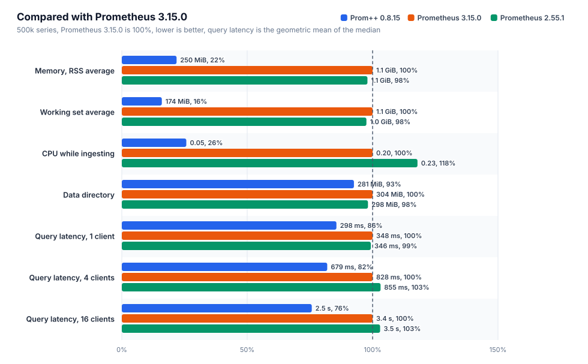
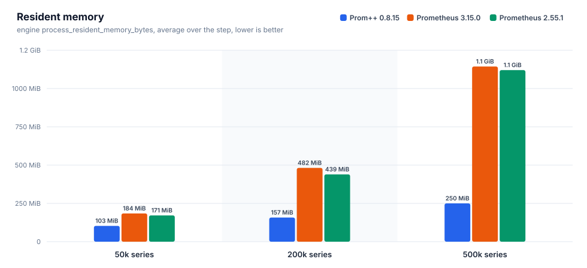
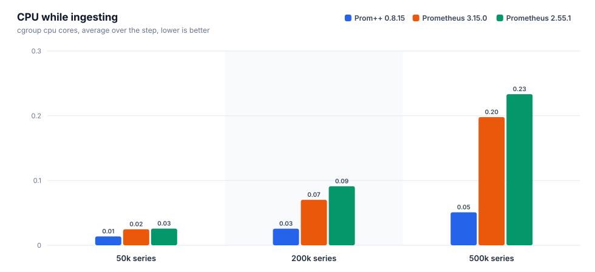
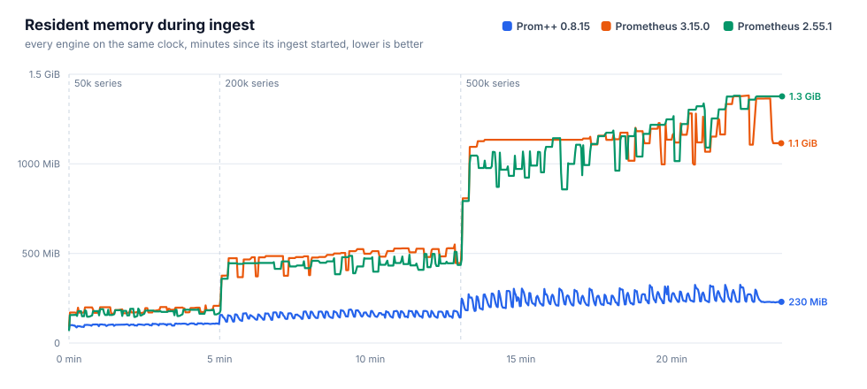
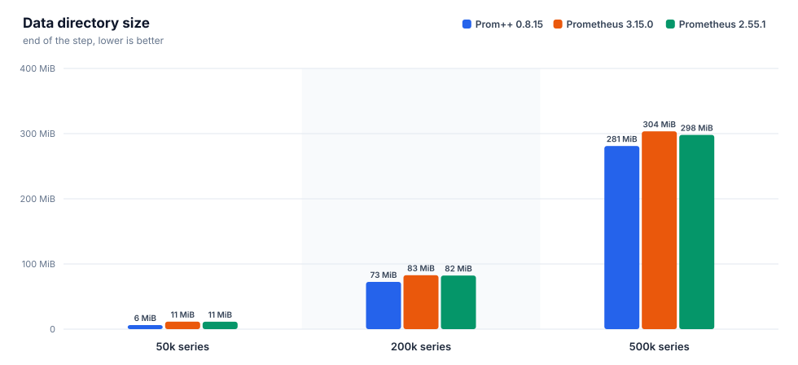
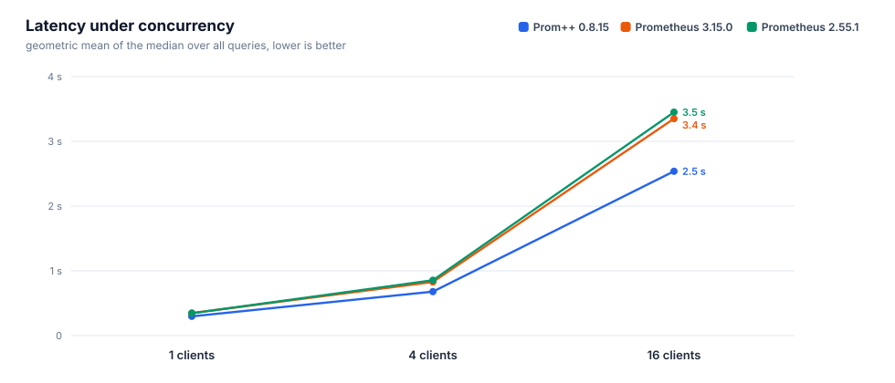
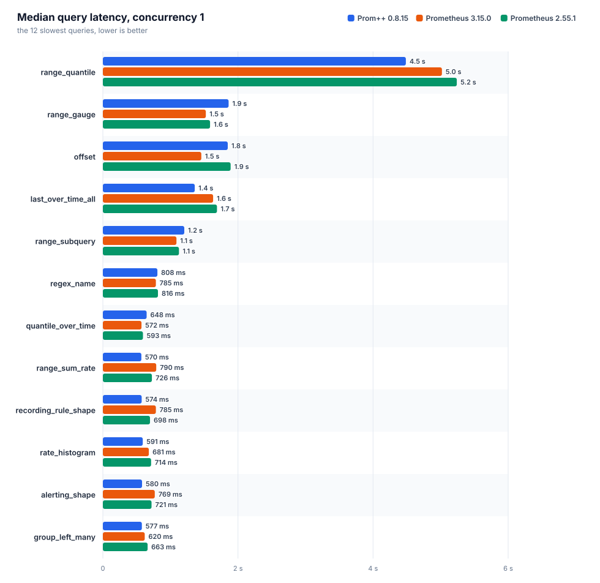
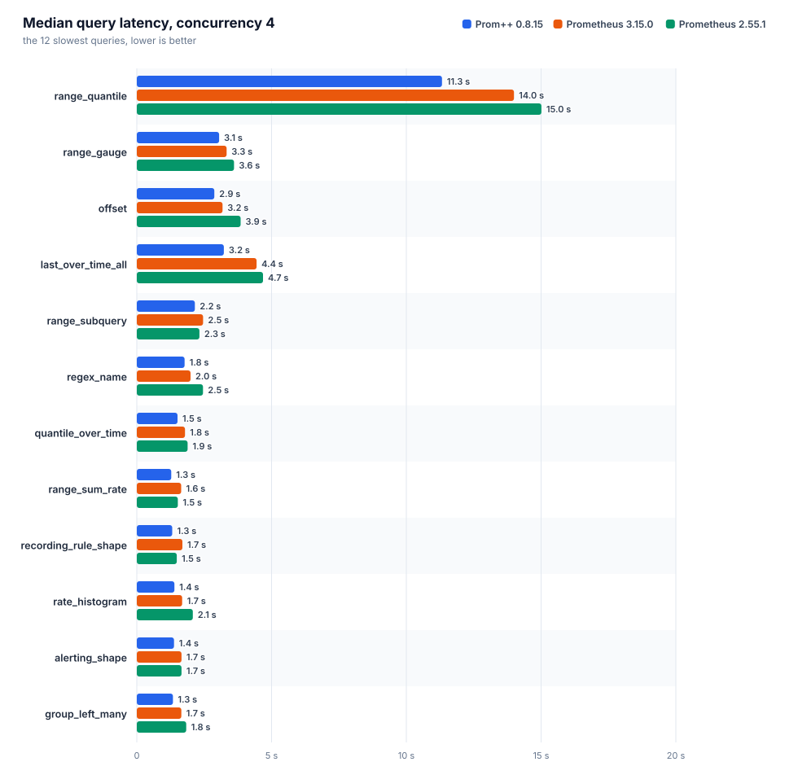
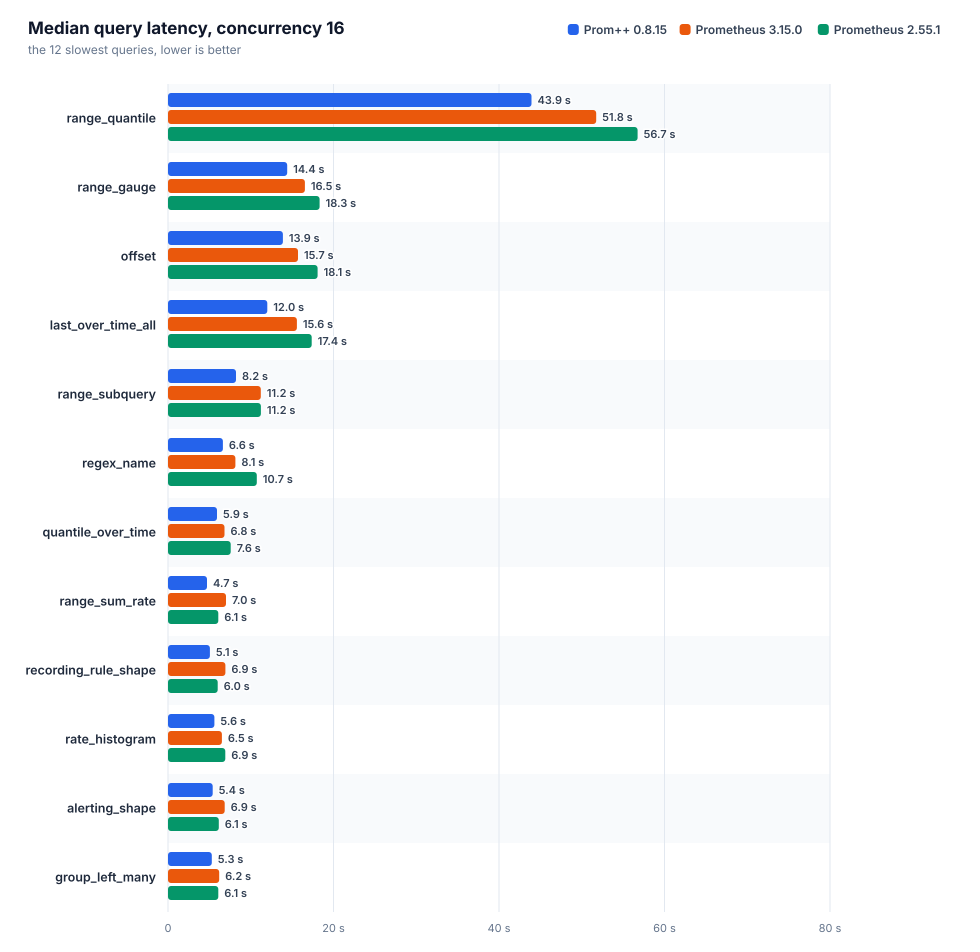

[English](REPORT.md) · **Русский**

# Prom++ против Prometheus

Создано из исходных файлов этой папки. Каждое число ниже взято из файла прогона, вручную ничего не вписано.

Номер прогона: `20261008T170616Z`

## Окружение

| параметр | значение |
|---|---|
| узел | bench-node |
| процессор | AMD EPYC 7713 64-Core Processor |
| ядер | 8 |
| память | 15.6 GiB |
| ядро | 6.8.0-142-generic |
| ОС | Ubuntu 24.04.4 LTS |
| архитектура | amd64 |
| файловая система данных | свободно 151.5 GiB из 177.1 GiB |
| container_runtime | containerd://2.3.4-k3s1.36 |
| instance_type | k3s |
| kubelet_version | v1.36.4+k3s1 |
| operating_system | linux |
| нагрузочный код | harness/b3000ef-7f49340 |

## Движки

Заданные настройки взяты из манифестов, наблюдаемые из runtimeinfo и списка флагов самого движка во время прогона.

| движок | образ | лимит процессора | лимит памяти | окружение | GOMEMLIMIT (факт) | GOMAXPROCS (факт) | сжатие WAL | аргументы | заметки |
|---|---|---|---|---|---|---|---|---|---|
| `prompp-0815` | `mirror.gcr.io/prompp/prompp:0.8.15` | 2.00 cores | 6.0 GiB | `GOMEMLIMIT=5529MiB GOMAXPROCS=2` | 5.4 GiB | 2 | true | `--config.file=... --storage.tsdb.path=... --web.enable-remote-write-receiver --web.enable-lifecycle` | C++ head and WAL |
| `prom-3150` | `quay.io/prometheus/prometheus:v3.15.0` | 2.00 cores | 6.0 GiB | `GOMEMLIMIT=5529MiB GOMAXPROCS=2` | 5.4 GiB | 2 | true | `--config.file=... --storage.tsdb.path=... --web.enable-remote-write-receiver --web.enable-lifecycle` | upstream latest |
| `prom-2551` | `quay.io/prometheus/prometheus:v2.55.1` | 2.00 cores | 6.0 GiB | `GOMEMLIMIT=5529MiB GOMAXPROCS=2` | 5.4 GiB | 2 | true | `--config.file=... --storage.tsdb.path=... --web.enable-remote-write-receiver --web.enable-lifecycle` | closed range selectors, the semantics before 3.0 |

## Запись и память head











### prom-2551

Интервал 15 с, пачка 5000 серий, потоков 4, отправлено точек 27400000, из них потеряно 0.

| активных серий | точек/с | серий в head | чанков | RSS ср. | RSS p95 | RSS макс. | рабочий набор макс. | ядер ср. | ядер макс. | каталог данных | WAL | RSS/серия | диск/серия |
|---|---|---|---|---|---|---|---|---|---|---|---|---|---|
| 50000 | 3333 | 50000 | 50000 | 171.4 MiB | 189.1 MiB | 192.7 MiB | 135.8 MiB | 0.03 | 0.38 | 11.4 MiB | 11.4 MiB | 3.4 KiB | 239 B |
| 200000 | 13333 | 200000 | 200000 | 439.4 MiB | 486.6 MiB | 509.0 MiB | 432.7 MiB | 0.09 | 1.35 | 82.3 MiB | 82.3 MiB | 2.2 KiB | 431 B |
| 500000 | 33333 | 500000 | 500000 | 1.1 GiB | 1.3 GiB | 1.3 GiB | 1.3 GiB | 0.23 | 3.27 | 298.0 MiB | 298.0 MiB | 2.8 KiB | 624 B |

| активных серий | прошло / план | запрос записи p50 | p99 | 2xx | 4xx | 5xx | ошибки клиента |
|---|---|---|---|---|---|---|---|
| 50000 | 300 s / 300 s | 52 ms | 117 ms | 200 | 0 | 0 | 0 |
| 200000 | 480 s / 480 s | 30 ms | 204 ms | 1280 | 0 | 0 | 0 |
| 500000 | 600 s / 600 s | 28 ms | 256 ms | 4000 | 0 | 0 | 0 |

### prom-3150

Интервал 15 с, пачка 5000 серий, потоков 4, отправлено точек 27400000, из них потеряно 0.

| активных серий | точек/с | серий в head | чанков | RSS ср. | RSS p95 | RSS макс. | рабочий набор макс. | ядер ср. | ядер макс. | каталог данных | WAL | RSS/серия | диск/серия |
|---|---|---|---|---|---|---|---|---|---|---|---|---|---|
| 50000 | 3333 | 50000 | 50000 | 184.4 MiB | 207.7 MiB | 210.1 MiB | 149.6 MiB | 0.02 | 0.37 | 11.5 MiB | 11.5 MiB | 4.3 KiB | 241 B |
| 200000 | 13333 | 200000 | 200000 | 481.8 MiB | 528.3 MiB | 550.2 MiB | 473.4 MiB | 0.07 | 1.11 | 82.8 MiB | 82.7 MiB | 2.3 KiB | 433 B |
| 500000 | 33333 | 500000 | 500000 | 1.1 GiB | 1.3 GiB | 1.3 GiB | 1.3 GiB | 0.20 | 2.75 | 303.5 MiB | 303.5 MiB | 2.8 KiB | 636 B |

| активных серий | прошло / план | запрос записи p50 | p99 | 2xx | 4xx | 5xx | ошибки клиента |
|---|---|---|---|---|---|---|---|
| 50000 | 300 s / 300 s | 41 ms | 113 ms | 200 | 0 | 0 | 0 |
| 200000 | 480 s / 480 s | 35 ms | 124 ms | 1280 | 0 | 0 | 0 |
| 500000 | 600 s / 600 s | 32 ms | 180 ms | 4000 | 0 | 0 | 0 |

### prompp-0815

Интервал 15 с, пачка 5000 серий, потоков 4, отправлено точек 27400000, из них потеряно 0.

| активных серий | точек/с | серий в head | чанков | RSS ср. | RSS p95 | RSS макс. | рабочий набор макс. | ядер ср. | ядер макс. | каталог данных | WAL | RSS/серия | диск/серия |
|---|---|---|---|---|---|---|---|---|---|---|---|---|---|
| 50000 | 3333 | 50000 | 50000 | 103.2 MiB | 109.4 MiB | 110.3 MiB | 48.4 MiB | 0.01 | 0.20 | 6.2 MiB | 4.0 KiB | 2.2 KiB | 130 B |
| 200000 | 13333 | 200000 | 200000 | 157.2 MiB | 180.1 MiB | 187.4 MiB | 118.0 MiB | 0.03 | 0.44 | 72.5 MiB | 4.0 KiB | 748 B | 380 B |
| 500000 | 33333 | 500000 | 500000 | 249.9 MiB | 309.9 MiB | 325.3 MiB | 239.1 MiB | 0.05 | 0.73 | 281.0 MiB | 4.0 KiB | 482 B | 589 B |

| активных серий | прошло / план | запрос записи p50 | p99 | 2xx | 4xx | 5xx | ошибки клиента |
|---|---|---|---|---|---|---|---|
| 50000 | 300 s / 300 s | 11 ms | 70 ms | 200 | 0 | 0 | 0 |
| 200000 | 480 s / 480 s | 11 ms | 82 ms | 1280 | 0 | 0 | 0 |
| 500000 | 600 s / 600 s | 12 ms | 59 ms | 4000 | 0 | 0 | 0 |

### Сравнение

Для всех столбцов с памятью и процессором меньше значит лучше. RSS это `process_resident_memory_bytes` самого движка, рабочий набор это значение cgroup, по которому kubelet выселяет поды и срабатывает OOM.

| активных серий | движок | RSS ср. | байт на серию | рабочий набор макс. | ядер ср. | каталог данных | точек/с |
|---|---|---|---|---|---|---|---|
| 50000 | `prom-2551` | 171.4 MiB | 3.4 KiB | 135.8 MiB | 0.03 | 11.4 MiB | 3333 |
| 50000 | `prom-3150` | 184.4 MiB | 4.3 KiB | 149.6 MiB | 0.02 | 11.5 MiB | 3333 |
| 50000 | `prompp-0815` | 103.2 MiB | 2.2 KiB | 48.4 MiB | 0.01 | 6.2 MiB | 3333 |
| 200000 | `prom-2551` | 439.4 MiB | 2.2 KiB | 432.7 MiB | 0.09 | 82.3 MiB | 13333 |
| 200000 | `prom-3150` | 481.8 MiB | 2.3 KiB | 473.4 MiB | 0.07 | 82.8 MiB | 13333 |
| 200000 | `prompp-0815` | 157.2 MiB | 748 B | 118.0 MiB | 0.03 | 72.5 MiB | 13333 |
| 500000 | `prom-2551` | 1.1 GiB | 2.8 KiB | 1.3 GiB | 0.23 | 298.0 MiB | 33333 |
| 500000 | `prom-3150` | 1.1 GiB | 2.8 KiB | 1.3 GiB | 0.20 | 303.5 MiB | 33333 |
| 500000 | `prompp-0815` | 249.9 MiB | 482 B | 239.1 MiB | 0.05 | 281.0 MiB | 33333 |

На самой большой ступени меньше всего памяти на серию нужно `prompp-0815`: 482 B of resident memory per active series, the lowest of the compared engines.

## Время запросов

Каждый запрос идёт отдельно: один пробный запрос без учёта, затем заданное число потоков повторяет его, пока не истечёт отведённое время и не наберётся минимальное число запросов. `n` это число учтённых запросов. При малом `n` значение p99 близко к максимуму, поэтому сравнивать лучше медиану. Геометрическое среднее учитывает все запросы поровну, поэтому несколько запросов, которые идут секундами, не заглушают остальные.



### Параллельность 1



| движок | набор | запросов | замеров | ошибок | p50 (геом.) | p99 (геом.) | p50 самого медленного | ядер ср. | рабочий набор макс. |
|---|---|---|---|---|---|---|---|---|---|
| `prom-2551` | heavy | 38 | 10908 | 0 | 346 ms | 575 ms | `range_quantile` 5.24 s | 1.23 | 1.9 GiB |
| `prom-3150` | heavy | 38 | 14956 | 0 | 348 ms | 523 ms | `range_quantile` 5.02 s | 1.22 | 1.8 GiB |
| `prompp-0815` | heavy | 38 | 11199 | 0 | 298 ms | 347 ms | `range_quantile` 4.49 s | 1.35 | 638.9 MiB |

| query | type | `prom-2551` p50 / p99 (n) | `prom-3150` p50 / p99 (n) | `prompp-0815` p50 / p99 (n) | fastest p50 |
|---|---|---|---|---|---|
| `absent` | instant | 0.4 ms / 10 ms (9429) | 0.4 ms / 8.6 ms (13471) | 0.7 ms / 3.0 ms (9243) | `prom-3150` |
| `alerting_shape` | range | 721 ms / 979 ms (14) | 769 ms / 1.00 s (13) | 580 ms / 621 ms (18) | `prompp-0815` |
| `avg_over_pods` | instant | 211 ms / 379 ms (44) | 222 ms / 311 ms (44) | 132 ms / 160 ms (76) | `prompp-0815` |
| `avg_over_time` | instant | 376 ms / 565 ms (26) | 388 ms / 583 ms (25) | 378 ms / 413 ms (27) | `prom-2551` |
| `binary_scalar` | instant | 418 ms / 632 ms (23) | 433 ms / 608 ms (23) | 263 ms / 299 ms (38) | `prompp-0815` |
| `bottomk` | instant | 205 ms / 371 ms (45) | 215 ms / 338 ms (44) | 141 ms / 159 ms (71) | `prompp-0815` |
| `clamp` | instant | 346 ms / 564 ms (26) | 348 ms / 529 ms (27) | 374 ms / 422 ms (27) | `prom-2551` |
| `count_by_job` | instant | 213 ms / 410 ms (44) | 217 ms / 338 ms (45) | 134 ms / 148 ms (75) | `prompp-0815` |
| `count_values` | instant | 349 ms / 598 ms (26) | 343 ms / 455 ms (28) | 314 ms / 347 ms (32) | `prompp-0815` |
| `double_subquery` | range | 502 ms / 729 ms (19) | 526 ms / 662 ms (19) | 419 ms / 476 ms (24) | `prompp-0815` |
| `group_left_many` | instant | 663 ms / 889 ms (14) | 620 ms / 745 ms (16) | 577 ms / 630 ms (18) | `prompp-0815` |
| `increase` | instant | 367 ms / 596 ms (26) | 384 ms / 535 ms (26) | 353 ms / 384 ms (29) | `prompp-0815` |
| `irate` | instant | 267 ms / 449 ms (36) | 258 ms / 392 ms (37) | 264 ms / 296 ms (38) | `prom-3150` |
| `join` | instant | 414 ms / 613 ms (23) | 421 ms / 548 ms (23) | 270 ms / 305 ms (38) | `prompp-0815` |
| `label_replace` | instant | 317 ms / 494 ms (29) | 321 ms / 505 ms (30) | 315 ms / 346 ms (32) | `prompp-0815` |
| `last_over_time_all` | instant | 1.69 s / 2.01 s (6) | 1.63 s / 1.86 s (6) | 1.36 s / 1.40 s (8) | `prompp-0815` |
| `matchers_numeric` | instant | 281 ms / 470 ms (33) | 280 ms / 421 ms (34) | 251 ms / 272 ms (40) | `prompp-0815` |
| `max_over_time` | instant | 386 ms / 614 ms (25) | 400 ms / 523 ms (25) | 385 ms / 429 ms (26) | `prompp-0815` |
| `nested_aggregate` | instant | 201 ms / 348 ms (46) | 215 ms / 369 ms (44) | 142 ms / 182 ms (70) | `prompp-0815` |
| `offset` | range | 1.89 s / 2.07 s (6) | 1.46 s / 1.83 s (7) | 1.85 s / 1.96 s (6) | `prom-3150` |
| `or_fallback` | instant | 329 ms / 516 ms (28) | 338 ms / 441 ms (28) | 365 ms / 407 ms (28) | `prom-2551` |
| `quantile_over_time` | instant | 593 ms / 895 ms (15) | 572 ms / 827 ms (16) | 648 ms / 696 ms (16) | `prom-3150` |
| `range_gauge` | range | 1.59 s / 2.21 s (6) | 1.52 s / 2.03 s (6) | 1.86 s / 1.95 s (7) | `prom-3150` |
| `range_quantile` | range | 5.24 s / 5.37 s (5) | 5.02 s / 5.16 s (5) | 4.49 s / 4.80 s (5) | `prompp-0815` |
| `range_subquery` | range | 1.13 s / 1.37 s (9) | 1.09 s / 1.22 s (10) | 1.21 s / 1.27 s (9) | `prom-3150` |
| `range_sum_rate` | range | 726 ms / 1.05 s (14) | 790 ms / 926 ms (13) | 570 ms / 620 ms (18) | `prompp-0815` |
| `rate` | instant | 303 ms / 502 ms (31) | 306 ms / 416 ms (32) | 294 ms / 340 ms (34) | `prompp-0815` |
| `rate_histogram` | instant | 714 ms / 921 ms (14) | 681 ms / 807 ms (15) | 591 ms / 638 ms (18) | `prompp-0815` |
| `recording_rule_shape` | range | 698 ms / 1.01 s (14) | 785 ms / 1.00 s (13) | 574 ms / 626 ms (18) | `prompp-0815` |
| `regex_name` | instant | 816 ms / 1.30 s (12) | 785 ms / 1.02 s (12) | 808 ms / 897 ms (13) | `prom-3150` |
| `selector` | instant | 297 ms / 510 ms (32) | 300 ms / 423 ms (32) | 307 ms / 333 ms (33) | `prom-2551` |
| `selector_labels` | instant | 17 ms / 39 ms (546) | 17 ms / 38 ms (545) | 15 ms / 22 ms (676) | `prompp-0815` |
| `sort_desc` | instant | 212 ms / 317 ms (45) | 221 ms / 386 ms (44) | 134 ms / 160 ms (75) | `prompp-0815` |
| `stddev` | instant | 214 ms / 336 ms (45) | 222 ms / 329 ms (44) | 133 ms / 158 ms (76) | `prompp-0815` |
| `sum` | instant | 199 ms / 374 ms (46) | 208 ms / 338 ms (47) | 132 ms / 155 ms (76) | `prompp-0815` |
| `sum_by_namespace` | instant | 212 ms / 398 ms (44) | 217 ms / 342 ms (45) | 137 ms / 166 ms (72) | `prompp-0815` |
| `topk` | instant | 201 ms / 369 ms (46) | 210 ms / 359 ms (46) | 142 ms / 182 ms (70) | `prompp-0815` |
| `vector_matching` | instant | 592 ms / 854 ms (16) | 613 ms / 788 ms (16) | 547 ms / 564 ms (19) | `prompp-0815` |

### Параллельность 4



| движок | набор | запросов | замеров | ошибок | p50 (геом.) | p99 (геом.) | p50 самого медленного | ядер ср. | рабочий набор макс. |
|---|---|---|---|---|---|---|---|---|---|
| `prom-2551` | heavy | 38 | 14393 | 0 | 855 ms | 1.51 s | `range_quantile` 15.01 s | 1.92 | 2.9 GiB |
| `prom-3150` | heavy | 38 | 20850 | 0 | 828 ms | 1.33 s | `range_quantile` 13.99 s | 1.89 | 3.4 GiB |
| `prompp-0815` | heavy | 38 | 17599 | 0 | 679 ms | 927 ms | `range_quantile` 11.32 s | 1.91 | 1.2 GiB |

| query | type | `prom-2551` p50 / p99 (n) | `prom-3150` p50 / p99 (n) | `prompp-0815` p50 / p99 (n) | fastest p50 |
|---|---|---|---|---|---|
| `absent` | instant | 0.9 ms / 32 ms (11941) | 0.8 ms / 20 ms (18243) | 2.5 ms / 8.9 ms (14364) | `prom-3150` |
| `alerting_shape` | range | 1.66 s / 2.49 s (24) | 1.66 s / 2.19 s (24) | 1.38 s / 1.66 s (32) | `prompp-0815` |
| `avg_over_pods` | instant | 508 ms / 1.02 s (71) | 534 ms / 1.06 s (71) | 349 ms / 506 ms (113) | `prompp-0815` |
| `avg_over_time` | instant | 865 ms / 1.58 s (44) | 898 ms / 1.40 s (44) | 777 ms / 1.00 s (53) | `prompp-0815` |
| `binary_scalar` | instant | 1.02 s / 1.68 s (36) | 1.14 s / 1.48 s (36) | 660 ms / 813 ms (62) | `prompp-0815` |
| `bottomk` | instant | 477 ms / 1.11 s (72) | 500 ms / 903 ms (75) | 367 ms / 533 ms (110) | `prompp-0815` |
| `clamp` | instant | 1.02 s / 1.46 s (42) | 922 ms / 1.25 s (45) | 776 ms / 1.09 s (52) | `prompp-0815` |
| `count_by_job` | instant | 521 ms / 1.12 s (67) | 513 ms / 838 ms (77) | 354 ms / 491 ms (114) | `prompp-0815` |
| `count_values` | instant | 1.02 s / 1.42 s (42) | 908 ms / 1.29 s (45) | 768 ms / 960 ms (53) | `prompp-0815` |
| `double_subquery` | range | 1.16 s / 1.92 s (33) | 1.17 s / 1.54 s (34) | 922 ms / 1.08 s (45) | `prompp-0815` |
| `group_left_many` | instant | 1.83 s / 2.22 s (24) | 1.65 s / 1.97 s (26) | 1.34 s / 1.75 s (32) | `prompp-0815` |
| `increase` | instant | 819 ms / 1.41 s (48) | 816 ms / 1.26 s (47) | 764 ms / 952 ms (54) | `prompp-0815` |
| `irate` | instant | 628 ms / 1.12 s (61) | 606 ms / 1.02 s (64) | 538 ms / 789 ms (78) | `prompp-0815` |
| `join` | instant | 1.16 s / 1.57 s (36) | 1.11 s / 1.50 s (36) | 644 ms / 927 ms (62) | `prompp-0815` |
| `label_replace` | instant | 711 ms / 1.41 s (51) | 752 ms / 1.09 s (53) | 621 ms / 999 ms (65) | `prompp-0815` |
| `last_over_time_all` | instant | 4.68 s / 5.17 s (10) | 4.44 s / 5.08 s (12) | 3.23 s / 3.43 s (16) | `prompp-0815` |
| `matchers_numeric` | instant | 718 ms / 1.21 s (52) | 683 ms / 1.11 s (56) | 590 ms / 773 ms (68) | `prompp-0815` |
| `max_over_time` | instant | 888 ms / 1.57 s (42) | 929 ms / 1.29 s (43) | 792 ms / 1.02 s (53) | `prompp-0815` |
| `nested_aggregate` | instant | 504 ms / 1.06 s (68) | 532 ms / 886 ms (74) | 357 ms / 549 ms (111) | `prompp-0815` |
| `offset` | range | 3.85 s / 5.05 s (12) | 3.18 s / 4.48 s (12) | 2.88 s / 4.26 s (15) | `prompp-0815` |
| `or_fallback` | instant | 996 ms / 1.34 s (44) | 889 ms / 1.31 s (48) | 685 ms / 901 ms (61) | `prompp-0815` |
| `quantile_over_time` | instant | 1.89 s / 2.39 s (24) | 1.79 s / 2.02 s (24) | 1.51 s / 1.90 s (28) | `prompp-0815` |
| `range_gauge` | range | 3.61 s / 5.05 s (12) | 3.33 s / 4.66 s (12) | 3.06 s / 4.06 s (14) | `prompp-0815` |
| `range_quantile` | range | 15.01 s / 15.29 s (5) | 13.99 s / 14.21 s (5) | 11.32 s / 11.62 s (5) | `prompp-0815` |
| `range_subquery` | range | 2.32 s / 3.49 s (16) | 2.46 s / 3.65 s (16) | 2.15 s / 2.63 s (20) | `prompp-0815` |
| `range_sum_rate` | range | 1.52 s / 2.24 s (27) | 1.65 s / 2.14 s (24) | 1.28 s / 1.46 s (32) | `prompp-0815` |
| `rate` | instant | 747 ms / 1.23 s (53) | 717 ms / 1.12 s (55) | 601 ms / 830 ms (66) | `prompp-0815` |
| `rate_histogram` | instant | 2.08 s / 2.20 s (20) | 1.68 s / 2.03 s (25) | 1.40 s / 1.73 s (29) | `prompp-0815` |
| `recording_rule_shape` | range | 1.48 s / 2.47 s (24) | 1.69 s / 2.15 s (24) | 1.32 s / 1.53 s (33) | `prompp-0815` |
| `regex_name` | instant | 2.46 s / 2.82 s (20) | 1.99 s / 2.64 s (20) | 1.77 s / 1.96 s (24) | `prompp-0815` |
| `selector` | instant | 738 ms / 1.32 s (51) | 648 ms / 1.20 s (57) | 572 ms / 773 ms (71) | `prompp-0815` |
| `selector_labels` | instant | 33 ms / 131 ms (942) | 34 ms / 111 ms (1021) | 36 ms / 77 ms (1068) | `prom-2551` |
| `sort_desc` | instant | 491 ms / 978 ms (72) | 544 ms / 940 ms (71) | 341 ms / 504 ms (117) | `prompp-0815` |
| `stddev` | instant | 549 ms / 1.07 s (69) | 500 ms / 845 ms (75) | 346 ms / 488 ms (115) | `prompp-0815` |
| `sum` | instant | 453 ms / 983 ms (75) | 491 ms / 890 ms (77) | 353 ms / 512 ms (111) | `prompp-0815` |
| `sum_by_namespace` | instant | 483 ms / 973 ms (72) | 498 ms / 926 ms (74) | 380 ms / 512 ms (106) | `prompp-0815` |
| `topk` | instant | 591 ms / 1.11 s (66) | 497 ms / 819 ms (77) | 356 ms / 538 ms (111) | `prompp-0815` |
| `vector_matching` | instant | 1.70 s / 2.03 s (25) | 1.56 s / 1.83 s (28) | 1.19 s / 1.46 s (36) | `prompp-0815` |

### Параллельность 16



| движок | набор | запросов | замеров | ошибок | p50 (геом.) | p99 (геом.) | p50 самого медленного | ядер ср. | рабочий набор макс. |
|---|---|---|---|---|---|---|---|---|---|
| `prom-2551` | heavy | 38 | 19507 | 0 | 3.45 s | 4.96 s | `range_quantile` 56.75 s | 1.93 | 5.4 GiB |
| `prom-3150` | heavy | 38 | 22122 | 0 | 3.35 s | 4.60 s | `range_quantile` 51.75 s | 1.95 | 5.4 GiB |
| `prompp-0815` | heavy | 38 | 17405 | 0 | 2.54 s | 3.50 s | `range_quantile` 43.93 s | 1.93 | 3.9 GiB |

| query | type | `prom-2551` p50 / p99 (n) | `prom-3150` p50 / p99 (n) | `prompp-0815` p50 / p99 (n) | fastest p50 |
|---|---|---|---|---|---|
| `absent` | instant | 2.7 ms / 125 ms (16760) | 3.1 ms / 63 ms (19261) | 10 ms / 37 ms (13622) | `prom-2551` |
| `alerting_shape` | range | 6.14 s / 7.23 s (32) | 6.85 s / 7.61 s (32) | 5.40 s / 7.90 s (35) | `prompp-0815` |
| `avg_over_pods` | instant | 2.24 s / 2.97 s (77) | 2.12 s / 2.89 s (85) | 1.20 s / 2.00 s (136) | `prompp-0815` |
| `avg_over_time` | instant | 3.53 s / 5.00 s (48) | 3.68 s / 4.56 s (48) | 2.90 s / 3.64 s (64) | `prompp-0815` |
| `binary_scalar` | instant | 4.33 s / 5.46 s (48) | 4.07 s / 5.60 s (48) | 2.30 s / 3.18 s (74) | `prompp-0815` |
| `bottomk` | instant | 2.12 s / 3.03 s (85) | 2.05 s / 2.78 s (84) | 1.40 s / 1.98 s (122) | `prompp-0815` |
| `clamp` | instant | 3.63 s / 4.32 s (48) | 3.55 s / 4.80 s (52) | 2.71 s / 3.41 s (66) | `prompp-0815` |
| `count_by_job` | instant | 2.16 s / 3.07 s (79) | 2.07 s / 2.77 s (85) | 1.21 s / 1.87 s (137) | `prompp-0815` |
| `count_values` | instant | 3.82 s / 4.55 s (48) | 3.63 s / 4.53 s (51) | 2.82 s / 3.74 s (62) | `prompp-0815` |
| `double_subquery` | range | 4.83 s / 5.41 s (40) | 4.85 s / 5.69 s (39) | 3.55 s / 4.06 s (48) | `prompp-0815` |
| `group_left_many` | instant | 6.07 s / 7.96 s (32) | 6.19 s / 7.16 s (32) | 5.29 s / 6.50 s (33) | `prompp-0815` |
| `increase` | instant | 3.81 s / 4.40 s (48) | 3.56 s / 4.27 s (48) | 2.81 s / 3.62 s (65) | `prompp-0815` |
| `irate` | instant | 2.63 s / 3.46 s (67) | 2.58 s / 3.32 s (67) | 1.91 s / 2.81 s (89) | `prompp-0815` |
| `join` | instant | 4.17 s / 5.60 s (47) | 3.80 s / 5.21 s (48) | 2.43 s / 2.96 s (73) | `prompp-0815` |
| `label_replace` | instant | 3.13 s / 4.01 s (56) | 2.99 s / 3.89 s (64) | 2.27 s / 3.26 s (76) | `prompp-0815` |
| `last_over_time_all` | instant | 17.36 s / 18.46 s (16) | 15.58 s / 15.93 s (16) | 12.00 s / 12.42 s (16) | `prompp-0815` |
| `matchers_numeric` | instant | 2.77 s / 3.95 s (67) | 2.81 s / 3.82 s (65) | 2.02 s / 3.11 s (84) | `prompp-0815` |
| `max_over_time` | instant | 3.98 s / 4.65 s (48) | 3.65 s / 4.52 s (48) | 2.79 s / 3.72 s (64) | `prompp-0815` |
| `nested_aggregate` | instant | 2.28 s / 2.89 s (77) | 2.04 s / 2.89 s (84) | 1.28 s / 2.02 s (128) | `prompp-0815` |
| `offset` | range | 18.08 s / 18.49 s (16) | 15.72 s / 16.11 s (16) | 13.88 s / 14.17 s (16) | `prompp-0815` |
| `or_fallback` | instant | 3.29 s / 4.74 s (54) | 3.28 s / 4.02 s (55) | 2.42 s / 4.12 s (73) | `prompp-0815` |
| `quantile_over_time` | instant | 7.58 s / 8.94 s (32) | 6.83 s / 7.96 s (32) | 5.92 s / 7.06 s (32) | `prompp-0815` |
| `range_gauge` | range | 18.33 s / 18.56 s (16) | 16.55 s / 16.85 s (16) | 14.41 s / 14.54 s (16) | `prompp-0815` |
| `range_quantile` | range | 56.75 s / 56.94 s (16) | 51.75 s / 51.97 s (16) | 43.93 s / 44.26 s (16) | `prompp-0815` |
| `range_subquery` | range | 11.23 s / 11.29 s (17) | 11.22 s / 11.51 s (18) | 8.22 s / 9.24 s (32) | `prompp-0815` |
| `range_sum_rate` | range | 6.08 s / 7.59 s (32) | 7.01 s / 7.82 s (32) | 4.71 s / 5.65 s (43) | `prompp-0815` |
| `rate` | instant | 2.99 s / 4.74 s (59) | 2.94 s / 3.83 s (64) | 2.26 s / 3.03 s (76) | `prompp-0815` |
| `rate_histogram` | instant | 6.93 s / 8.41 s (32) | 6.51 s / 7.65 s (32) | 5.61 s / 6.62 s (32) | `prompp-0815` |
| `recording_rule_shape` | range | 6.01 s / 7.15 s (32) | 6.94 s / 8.46 s (32) | 5.06 s / 5.60 s (39) | `prompp-0815` |
| `regex_name` | instant | 10.73 s / 11.40 s (19) | 8.14 s / 10.22 s (30) | 6.64 s / 8.74 s (32) | `prompp-0815` |
| `selector` | instant | 2.99 s / 4.14 s (64) | 2.81 s / 3.92 s (64) | 2.20 s / 2.92 s (80) | `prompp-0815` |
| `selector_labels` | instant | 146 ms / 534 ms (955) | 139 ms / 498 ms (1006) | 124 ms / 311 ms (1217) | `prompp-0815` |
| `sort_desc` | instant | 2.14 s / 3.21 s (82) | 2.23 s / 2.75 s (81) | 1.27 s / 1.95 s (133) | `prompp-0815` |
| `stddev` | instant | 2.29 s / 3.11 s (80) | 2.19 s / 3.01 s (83) | 1.24 s / 1.82 s (135) | `prompp-0815` |
| `sum` | instant | 1.73 s / 3.35 s (91) | 2.00 s / 2.56 s (88) | 1.18 s / 1.96 s (140) | `prompp-0815` |
| `sum_by_namespace` | instant | 2.16 s / 3.03 s (76) | 2.07 s / 2.93 s (85) | 1.23 s / 1.78 s (135) | `prompp-0815` |
| `topk` | instant | 2.22 s / 3.40 s (79) | 2.07 s / 2.95 s (83) | 1.39 s / 2.41 s (121) | `prompp-0815` |
| `vector_matching` | instant | 6.11 s / 7.67 s (32) | 5.65 s / 7.60 s (32) | 4.68 s / 5.67 s (43) | `prompp-0815` |

## Совпадение результатов

Все движки получили одни и те же точки, а каждый запрос вычисляется в один и тот же закреплённый момент, так что отличающийся результат указывает на смысловое различие между движками или на потерянные данные. В каждой ячейке sha256 результата, приведённого к единому виду.

Строка с различием значит, что движки по-разному отвечают на одни и те же данные в один и тот же момент. Все такие запросы это `rate` или `_over_time` по диапазону. В Prometheus 3.0 диапазон стал открытым слева: точка ровно на левой границе окна больше не входит в расчёт. PromQL-движок Prom++ 0.8.15 её уже отбрасывает (`promql/engine.go`, `floats[drop].T <= mint`), а 2.55.1 нет (`< mint`). Искусственные точки лежат ровно на границе окна, поэтому 2.55.1 видит на одну точку больше.

| запрос | `prom-2551` | `prom-3150` | `prompp-0815` | совпадает |
|---|---|---|---|---|
| `absent` | ca3d163bab05 (1 series) | ca3d163bab05 (1 series) | ca3d163bab05 (1 series) | да |
| `alerting_shape` | 433e69a3597b (100 series) | e10ba8156cd2 (100 series) | e10ba8156cd2 (100 series) | нет |
| `avg_over_pods` | 4f6b6c188f7f (100 series) | 4f6b6c188f7f (100 series) | 4f6b6c188f7f (100 series) | да |
| `avg_over_time` | f1f392b0c78d (62500 series) | f1f392b0c78d (62500 series) | f1f392b0c78d (62500 series) | да |
| `binary_scalar` | ca3d163bab05 (1 series) | ca3d163bab05 (1 series) | ca3d163bab05 (1 series) | да |
| `bottomk` | 75dc8cd99593 (5 series) | 75dc8cd99593 (5 series) | 75dc8cd99593 (5 series) | да |
| `clamp` | f1f392b0c78d (62500 series) | f1f392b0c78d (62500 series) | f1f392b0c78d (62500 series) | да |
| `count_by_job` | 07c02c1348ea (1 series) | 07c02c1348ea (1 series) | 07c02c1348ea (1 series) | да |
| `count_values` | e792d90cc0a2 (62500 series) | e792d90cc0a2 (62500 series) | e792d90cc0a2 (62500 series) | да |
| `double_subquery` | 83f99d686699 (100 series) | 55416fa4082f (100 series) | 55416fa4082f (100 series) | нет |
| `group_left_many` | f1f392b0c78d (62500 series) | f1f392b0c78d (62500 series) | f1f392b0c78d (62500 series) | да |
| `increase` | 559e24dc9a48 (62500 series) | 559e24dc9a48 (62500 series) | 559e24dc9a48 (62500 series) | да |
| `irate` | 559e24dc9a48 (62500 series) | 559e24dc9a48 (62500 series) | 559e24dc9a48 (62500 series) | да |
| `join` | 4f6b6c188f7f (100 series) | 4f6b6c188f7f (100 series) | 4f6b6c188f7f (100 series) | да |
| `label_replace` | d3ae67deabaa (62500 series) | d3ae67deabaa (62500 series) | d3ae67deabaa (62500 series) | да |
| `last_over_time_all` | ca3d163bab05 (1 series) | ca3d163bab05 (1 series) | ca3d163bab05 (1 series) | да |
| `matchers_numeric` | bf8394774b5f (38487 series) | bf8394774b5f (38487 series) | bf8394774b5f (38487 series) | да |
| `max_over_time` | f1f392b0c78d (62500 series) | f1f392b0c78d (62500 series) | f1f392b0c78d (62500 series) | да |
| `nested_aggregate` | ca3d163bab05 (1 series) | ca3d163bab05 (1 series) | ca3d163bab05 (1 series) | да |
| `offset` | d5542cb672bf (62500 series) | d5542cb672bf (62500 series) | d5542cb672bf (62500 series) | да |
| `or_fallback` | a712401a23e5 (62500 series) | a712401a23e5 (62500 series) | a712401a23e5 (62500 series) | да |
| `quantile_over_time` | f1f392b0c78d (62500 series) | f1f392b0c78d (62500 series) | f1f392b0c78d (62500 series) | да |
| `range_gauge` | d5542cb672bf (62500 series) | d5542cb672bf (62500 series) | d5542cb672bf (62500 series) | да |
| `range_quantile` | 8e52194734df (62500 series) | 4f0d1e3a91e8 (62500 series) | 4f0d1e3a91e8 (62500 series) | нет |
| `range_subquery` | 82623d225556 (62500 series) | 82623d225556 (62500 series) | 82623d225556 (62500 series) | да |
| `range_sum_rate` | 8dcd40399f41 (100 series) | d73a595a3678 (100 series) | d73a595a3678 (100 series) | нет |
| `rate` | 559e24dc9a48 (62500 series) | 559e24dc9a48 (62500 series) | 559e24dc9a48 (62500 series) | да |
| `rate_histogram` | 559e24dc9a48 (62500 series) | 559e24dc9a48 (62500 series) | 559e24dc9a48 (62500 series) | да |
| `recording_rule_shape` | eb8b58afb326 (1 series) | 8476e35ab60f (1 series) | 8476e35ab60f (1 series) | нет |
| `regex_name` | fd6cd5bf0d07 (187500 series) | fd6cd5bf0d07 (187500 series) | fd6cd5bf0d07 (187500 series) | да |
| `selector` | a712401a23e5 (62500 series) | a712401a23e5 (62500 series) | a712401a23e5 (62500 series) | да |
| `selector_labels` | b5f636cb8557 (3125 series) | b5f636cb8557 (3125 series) | b5f636cb8557 (3125 series) | да |
| `sort_desc` | 4f6b6c188f7f (100 series) | 4f6b6c188f7f (100 series) | 4f6b6c188f7f (100 series) | да |
| `stddev` | 4f6b6c188f7f (100 series) | 4f6b6c188f7f (100 series) | 4f6b6c188f7f (100 series) | да |
| `sum` | ca3d163bab05 (1 series) | ca3d163bab05 (1 series) | ca3d163bab05 (1 series) | да |
| `sum_by_namespace` | 4f6b6c188f7f (100 series) | 4f6b6c188f7f (100 series) | 4f6b6c188f7f (100 series) | да |
| `topk` | 77b447784c27 (20 series) | 77b447784c27 (20 series) | 77b447784c27 (20 series) | да |
| `vector_matching` | f1f392b0c78d (62500 series) | f1f392b0c78d (62500 series) | f1f392b0c78d (62500 series) | да |

Совпадают 33 запросов, различаются 5.

## Как воспроизвести

```sh
export BENCH_NODE=<узел>
RUN_ID=20261008T170616Z scripts/node-overlay.sh
scripts/harness.sh
RUN_ID=20261008T170616Z scripts/run.sh
go run ./cmd/report -root results -run 20261008T170616Z
scripts/teardown.sh --yes
```

Правила честного сравнения и то, что может исказить результат, описаны в METHODOLOGY.ru.md.
